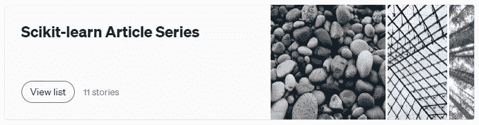
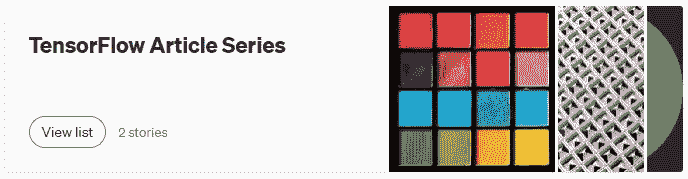

# 开始机器学习之旅的 8 个推荐 Python 库

> 原文：<https://towardsdatascience.com/8-recommended-python-libraries-to-start-your-machine-learning-journey-e3449ff2ecb3?source=collection_archive---------21----------------------->

## 没有正确地学习它们，你会中途放弃！


切坦·科尔特在 [Unsplash](https://unsplash.com/?utm_source=unsplash&utm_medium=referral&utm_content=creditCopyText) 上拍摄的照片

机器学习是这些天的热门话题之一。Python 是许多用户的首选编程语言。然而，Python 是一种通用编程语言，这意味着它被用于如此多的不同领域。要使用 Python 进行机器学习，除了*通用* Python 之外，还需要学习一些额外的 Python 库。

在这篇文章中，我将讨论最基本的 Python 库的概述，这些库将帮助您开始机器学习之旅。我强烈建议你尽可能地熟悉它们，因为它们是根本。如果没有正确地学习它们，你会在学习的中途放弃！

# 1.NumPy

NumPy 是构建在 NumPy 之上的许多其他库的母库。NumPy 代表**数字**百分比 **Py** thon。 **ndarray** (N 维数组)对象是 NumPy 中的主要数据结构。在机器学习中，我们经常使用向量(1D 阵列)和矩阵(2D 阵列)。NumPy 提供了创建这些数组的简单方法。当处理图像数据时，我们处理 NumPy 3D 数组。NumPy 还提供了大量的数学函数，尤其是线性代数函数。

## 资源

*   [官网](https://numpy.org/)
*   [文档](https://numpy.org/doc/stable/)
*   我自己的资源:我还为 NumPy 发表了一系列文章:

[](https://rukshanpramoditha.medium.com/list/numpy-article-series-e59c8bfa6946)

作者截图

## 装置

默认情况下，NumPy 附带了 Anaconda 安装程序。如果您已经通过 Anaconda 安装了 Python，那么您不需要再次安装 NumPy。但是，有两种方法可以安装 NumPy。

**康达安装**

```
conda install -c anaconda numpy
#OR
conda install -c conda-forge numpy
```

**pip 安装**

```
pip install numpy
```

## 进口惯例

共同体接受的 NumPy 进口惯例是:

```
import numpy as np
```

# 2.熊猫

Pandas 是 Python 数据操作和分析库。它建立在 NumPy 之上，这意味着它支持 NumPy N 维数组。熊猫是如此受欢迎，它的下载总数可以代表整个数据科学社区！Pandas 提供了数据加载、数据清理、变量编码、数据转换等方法。Pandas 还提供绘图功能，因为它集成了各种绘图库。**系列**和**数据帧**是熊猫中的两种主要数据结构。Pandas 系列可以用一维 NumPy 数组创建，而 Pandas 数据帧可以用二维 NumPy 数组创建，因为 Pandas 是在 NumPy 之上构建的。

## 资源

*   [官网](https://pandas.pydata.org/)
*   [文档](https://pandas.pydata.org/docs/)
*   我自己的资源:我还为熊猫发表了一系列文章:

[](https://rukshanpramoditha.medium.com/list/pandas-article-series-fcddc9e15013)

作者截图

## 装置

Pandas 默认带有 Anaconda 安装程序。如果您已经通过 Anaconda 安装了 Python，那么您不需要再次安装 Pandas。但是，有两种安装熊猫的方法。

**康达安装**

```
conda install -c anaconda pandas
#OR
conda install -c conda-forge pandas
```

**pip 安装**

```
pip install pandas
```

## 进口惯例

共同体接受的熊猫进口惯例是:

```
import pandas as pd
```

# 3.Matplotlib

Matplotlib 是 Python 中的一个*基本*绘图库。但是，它为您的地块提供了大量的自定义选项。它也是其他高级绘图库的母库。该库有两个不同的应用编程接口(API)——**py plot 接口**和**面向对象接口**。

## 资源

*   [官网](https://matplotlib.org/)
*   [文档](https://matplotlib.org/stable/contents.html)

## 装置

默认情况下，Matplotlib 附带了 Anaconda 安装程序。如果您已经通过 Anaconda 安装了 Python，那么您不需要再次安装 Matplotlib。但是，有两种方法可以安装 Matplotlib。

**康达安装**

```
conda install -c conda-forge matplotlib
```

**pip 安装**

```
pip install matplotlib
```

## 进口惯例

共同体接受的 Matplotlib 导入惯例是:

```
import matplotlib.pyplot as plt
```

# 4.海生的

Seaborn 是一个高级数据可视化库，这意味着它可以自动为我们做很多事情！也为你的剧情提供了很多审美。您可以使用 Matplotlib 自定义 seaborn。

## 资源

*   [官网](https://seaborn.pydata.org/)
*   [文档](https://seaborn.pydata.org/tutorial.html)

## 装置

Seaborn 默认带有 Anaconda 安装程序。如果您已经通过 Anaconda 安装了 Python，那么您不需要再次安装 Seaborn。但是，有两种方法可以安装 Seaborn。

**康达安装**

```
conda install -c anaconda seaborn
```

**pip 安装**

```
pip install seaborn
```

## 进口惯例

共同体接受的 Seaborn 进口公约是:

```
import seaborn as sns
```

# 5.sci kit-学习

Scikit-learn 是一个 Python 机器学习库。它的语法非常一致，即使是初学者，通过创建一两个模型也很容易熟悉整个库。它的官方文档提供了使用这个库所需的所有支持。它包括分类、回归、聚类、降维模型的算法。它还提供了数据预处理的高级方法。

## 资源

*   [官网](https://scikit-learn.org/stable/)
*   [文档](https://scikit-learn.org/stable/user_guide.html)
*   我自己的资源:我还为 Scikit-learn 发表了一系列文章:

[](https://rukshanpramoditha.medium.com/list/scikitlearn-article-series-0431320a10f4)

作者截图

## 装置

默认情况下，Scikit-learn 附带了 Anaconda 安装程序。如果您已经通过 Anaconda 安装了 Python，那么您不需要再安装 Scikit-learn。但是，有两种方法可以安装 Scikit-learn。

**康达安装**

```
conda install -c anaconda scikit-learn
#OR
conda install -c conda-forge scikit-learn
```

**pip 安装**

```
pip install scikit-learn
```

## 进口惯例

我们不会一次导入整个库。相反，我们在需要时导入类和函数。

# 6.黄砖

Yellowbrick 是一个机器学习可视化库。顾名思义，它适用于机器学习相关的可视化。语法非常类似于 Scikit-learn 库。使用 Yellowbrick，您只需一两行代码就可以创建高级的绘图！

## 资源

*   [官方网站和文档](https://www.scikit-yb.org/en/latest/)
*   我自己的资源:我还为 Yellowbrick 发表了一系列文章:

[](https://rukshanpramoditha.medium.com/list/yellowbrick-article-series-a2f8c59b7dff)

作者截图

## 装置

默认情况下，Yellowbrick *没有*附带 Anaconda 安装程序。因此，需要单独安装。有两种方法。

**康达安装**

```
conda install -c districtdatalabs yellowbrick
```

**pip 安装**

```
pip install yellowbrick
```

## 进口惯例

像 Scikit-learn 一样，我们不会一次导入整个库。相反，我们在需要时导入类和函数。

# 7.XGBoost

当我们考虑机器学习模型的性能时，XGBoost(极限梯度提升)是在数据科学家和机器学习工程师中最受青睐的机器学习算法。XGBoost(这次是库)可用于包括 Python 在内的许多编程语言。XGBoost 的 Scikit-learn 包装器(Scikit-learn 兼容 API)最近已经发布，这样我们就可以像 Scikit-learn 一样使用 XGBoost**T5。还有一个与 Scikit-learn 不兼容的用于 XGBoost 的 API。然而，与 XGBoost 的Scikit-learn 包装器相比，它很难使用。所以我推荐你先用 XGBoost 的Scikit-learn 的包装器，然后再去用非 Scikit-learn 的版本(如果你愿意的话)。**

## 资源

*   [官网和文档](https://xgboost.readthedocs.io/en/latest/)
*   我自己的资源:我还为 XGBoost 发表了一系列文章:

[](https://rukshanpramoditha.medium.com/list/xgboost-article-series-7d9298b2744b)

作者截图

## 装置

默认情况下，XGBoost *没有*附带 Anaconda 安装程序。因此，您需要使用以下代码单独安装它。

```
conda install -c anaconda py-xgboost #Windowsconda install -c conda-forge xgboost #MacOS or Linux
```

## 进口惯例

共同体接受的 XGBoost 进口惯例是:

```
import xgboost as xgb
```

# 8.张量流

TensorFlow 是为深度学习任务创建的深度学习库。深度学习是机器学习的一个子集。TensorFlow 也可以用于一般的机器学习。它有两个 API——**高级 API** 和**低级 API** 。它的主要数据结构是*张量*。

## 资源

*   [官方网站和文档](https://www.tensorflow.org/)
*   我自己的资源:我还为 TensorFlow 发表了一系列文章:

[](https://rukshanpramoditha.medium.com/list/tensorflow-article-series-26af51acea3a)

作者截图

## 装置

默认情况下，TensorFlow *没有*附带 Anaconda 安装程序。因此，需要单独安装。有两种方法。

**康达安装**

```
conda install -c conda-forge tensorflow #CPU-only
```

**pip 安装**

```
pip install tensorflow #Both CPU and GPU support
```

## 进口惯例

TensorFlow 的共同体公认进口惯例是:

```
import tensorflow as tf
```

# 我们应该按照什么顺序学习这些库？

按照上面的顺序！从 NumPy 基础知识和数组创建方法开始。然后执行 NumPy 数组索引和切片。熟悉它们之后，请转到熊猫基础——创建系列和数据框。现在，你可以进行并行学习 NumPy 和 Pandas 都可以。在这个阶段，熟悉 NumPy 算法和线性代数运算，并掌握高级理论—子集化、数据清洗、变量编码、数据转换等。然后，搬进马特普罗提卜和希博恩。就从 Matplotlib 开始吧。我建议您使用 Pandas 绘图功能进行基本的可视化。如果您需要更多的定制，请使用 Matplotlib。对于高级可视化，请使用 seaborn。现在，是时候学习 Scikit-learn 了。现在，这将是容易的，因为你熟悉熊猫和熊猫。当你熟悉 Scikit-learn 时，你可以使用 Yellowbrick 进行机器学习可视化。然后是 TensorFlow 和深度学习部分。通过这样做，你将永远不会在学习的中途放弃！

**这些方法对你有用吗？**在评论区告诉我。

感谢阅读！

下次见，祝大家学习愉快！

特别感谢 Unsplash 网站上的**切坦·科尔特**，为我提供了这篇文章的封面图片。

[鲁克山普拉莫迪塔](https://medium.com/u/f90a3bb1d400?source=post_page-----e3449ff2ecb3--------------------------------)
**2021–08–04**