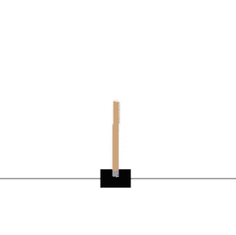
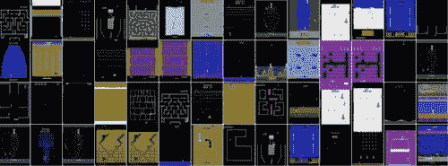
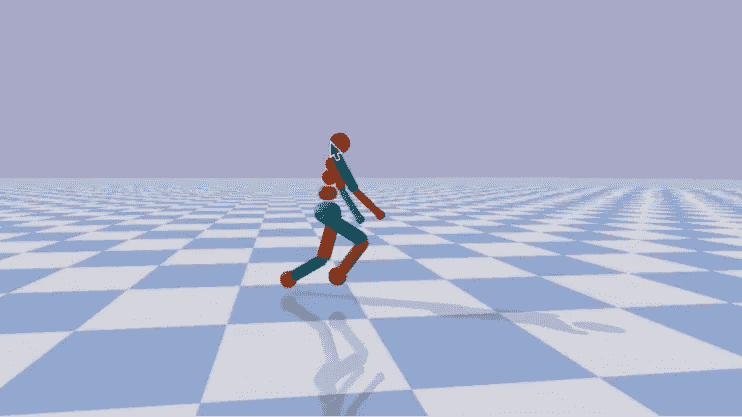
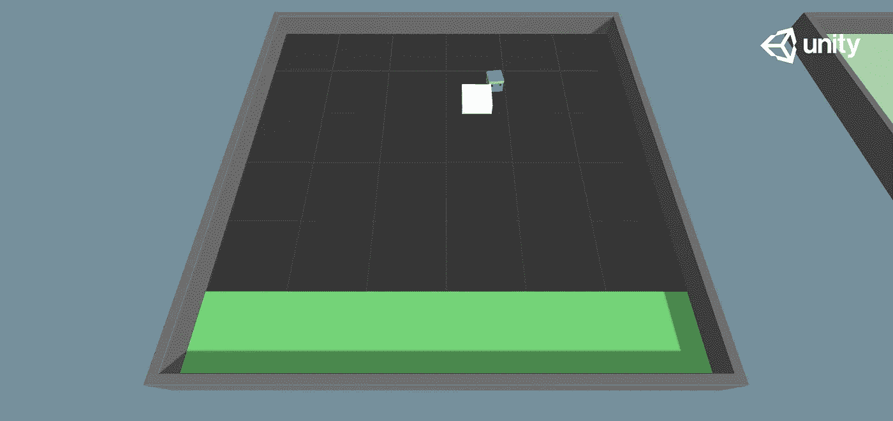
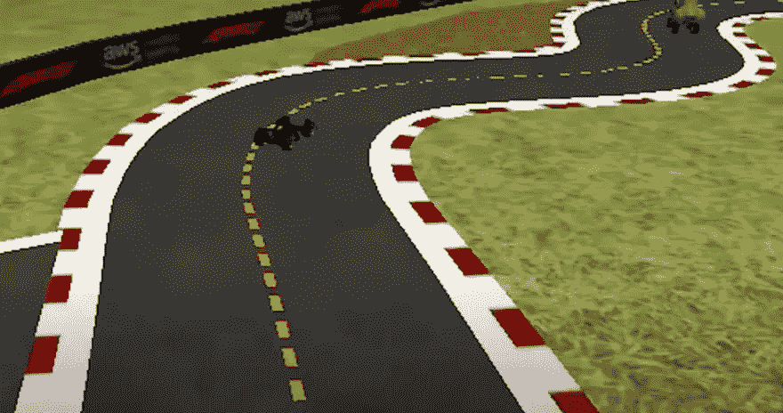

# 8+强化学习项目创意

> 原文：<https://towardsdatascience.com/8-reinforcement-learning-project-ideas-3521e0ccd313?source=collection_archive---------12----------------------->

## 想通过强化学习获得实用的实践经验吗？这里有一些启发你的项目想法。

这篇文章是强化学习(RL)项目想法的汇编。我尝试选择涵盖 RL 中一系列不同困难、概念和算法的项目。

# 1.用 [OpenAI Gym](https://gym.openai.com/) 解决玩具问题(适合初学者)

[来自 OpenAI 健身房的翻筋斗环境](https://gym.openai.com/envs/CartPole-v1/)(作者截图)

[OpenAI Gym](https://gym.openai.com/) 已经成为研究人员和实践者之间强化学习框架的事实标准。从健身房图书馆解决玩具问题将有助于你熟悉这个流行的框架和简单的 Q 学习算法。好的起点包括[侧手翻](https://gym.openai.com/envs/CartPole-v1/)、[月球着陆器](https://gym.openai.com/envs/LunarLander-v2/)和[滑行](https://gym.openai.com/envs/Taxi-v3/)。

如果你对一步一步的演练感兴趣，可以看看我的[关于 Taxi 的入门 Q-learning 教程](https://www.gocoder.one/blog/rl-tutorial-with-openai-gym)。

# 2.使用 [OpenAI Gym](https://gym.openai.com/envs/#atari) 从 pixel input 玩雅达利游戏

[雅达利环境](https://gym.openai.com/envs/#atari)编译(图片由作者提供)

OpenAI Gym 还包含一套 [Atari 游戏环境](https://gym.openai.com/envs/#atari)作为其街机学习环境(ALE)框架的一部分。例子包括[越狱](https://gym.openai.com/envs/Breakout-v0/)、[蒙特祖马复仇](https://gym.openai.com/envs/MontezumaRevenge-v0/)和[太空入侵者](https://gym.openai.com/envs/SpaceInvaders-v0/)。

环境观察以屏幕输入或 RAM 的形式提供(直接观察 Atari 2600 的 1024 位内存)。解决 Atari 环境将需要使用更复杂的 RL 算法和深度学习库，如 TensorFlow 或 PyTorch。

*其他资源:*

*   推荐阅读: [DeepMind 原创雅达利 DQN 论文](https://deepmind.com/research/publications/2019/playing-atari-deep-reinforcement-learning)
*   托马斯·西蒙尼尼的《太空入侵者朱庇特笔记本教程》
*   [深度强化学习的偏差-方差:如何用 OpenAI Gym 为雅达利打造一个机器人](https://www.digitalocean.com/community/tutorials/how-to-build-atari-bot-with-openai-gym)

# 3.用 [PyBullet](https://github.com/bulletphysics/bullet3) 模拟控制任务

[PyBullet](https://github.com/bulletphysics/bullet3) 人形例子(作者截图)

如果强化学习应用于机器人是你感兴趣的领域，你可能已经见过 OpenAI Gym 的付费 MuJoCo environments。对于一个免费的开源替代方案，我推荐查看一下 [PyBullet](https://github.com/bulletphysics/bullet3) 。

MuJoCo/PyBullet 是物理引擎，提供类人机器人和其他生物的真实世界般的刚体模拟。它们可用于创建具有连续控制任务(如行走、跑步和游泳)的环境，使其可用于试验政策梯度方法，如 DPG、TRPO 和 PPO。

**10 月 19 日更新:** [MuJuCo 现已免费开源](https://deepmind.com/blog/announcements/mujoco)！

# 4.使用 [Unity ML-Agents](https://github.com/Unity-Technologies/ml-agents) 创建您自己的强化学习环境(适合初学者)

[Unity ML-Agents](https://github.com/Unity-Technologies/ml-agents) 推块环境(作者截图)

Unity ML-Agents 是 Unity 游戏引擎的一个相对较新的插件。它允许游戏开发者为游戏训练智能 NPC，并使研究人员能够创建图形和物理丰富的 RL 环境。要探索的项目创意包括:

*   尝试 PPO、SAC、GAIL 和 Self-Play 等算法，这些算法提供了现成的实现
*   在 Unity GUI 中的 18+环境库中训练代理，包括[躲避球](https://github.com/Unity-Technologies/ml-agents/tree/dodgeball-env)、足球和经典控制问题。
*   创建您自己的自定义图形和物理丰富的 3D RL 环境

*其他资源:*

*   [构建 3D 排球 RL 环境](https://www.gocoder.one/blog/hands-on-introduction-to-deep-reinforcement-learning)
*   [强化学习企鹅](https://www.immersivelimit.com/tutorials/reinforcement-learning-penguins-part-1-unity-ml-agents)
*   [团结蜂鸟课程](https://learn.unity.com/course/ml-agents-hummingbirds)

# 5.用 [AWS DeepRacer](https://aws.amazon.com/deepracer/) 比赛自动驾驶汽车(适合初学者)

AWS DeepRacer 联赛流(作者截图)

[AWS DeepRacer](https://aws.amazon.com/deepracer/) 是一款 3D 赛车模拟器，旨在帮助开发者使用亚马逊 SageMaker 开始使用 RL。你需要为在 AWS 上培训和评估你的模型付费。作为 AWS DeepRacer league 的一部分，它每月都会举办竞赛，颁发奖品并提供在 re:Invent 比赛的机会。

DeepRacer 的独特之处在于，你可以花 399 美元购买一辆 1/18 比例的赛车，这样你就可以在现实世界中部署你的模型。

其他一些与自动驾驶相关的开源项目:

*   [AirSim](https://github.com/microsoft/AirSim)
*   [卡拉](https://github.com/carla-simulator/carla)

# 6.用[密涅尔](https://minerl.io/)在《我的世界》开采钻石

MineRL 包含超过 6000 万帧记录的《我的世界》人类玩家数据的模仿学习数据集。目标是训练能够在开放世界中导航并克服固有挑战的代理，例如具有大量等级和稀疏回报的任务。

MineRL 提供了有用的入门教程以及一个有用的社区。作为额外的激励措施，作为 NeurIPS 2021 的一部分，MineRL 目前正在举办两项竞赛:

1.  [钻石](https://minerl.io/diamond/):获得一颗钻石，前提是给定原始像素样本数据和时间训练的限制。
2.  [玄武岩](https://minerl.io/basalt/):解决近乎逼真的任务，比如盖房子或者找山洞(更适合新手)。

# 7.加入 [AIArena](https://aiarena.net/) 星际争霸 2 建筑代理的社区

如果你想训练代理人玩高度复杂的主流游戏，你应该去看看 AIArena。他们为一个研究人员、从业者和爱好者的社区运行常规的流和梯，为星际争霸 2 构建脚本和深度学习代理。

除了星际争霸 2，这里还有一些你可能感兴趣的其他主流 RL 框架游戏:

*   [火箭联赛](https://rlgym.github.io/)
*   [英雄联盟](https://leaguesandbox.github.io/)
*   [Dota 2](https://games.mau.se/research/the-dota2-5v5-ai-competition/)

# 8.用 [OpenSpiel](https://github.com/deepmind/open_spiel) 建造一个象棋机器人

照片由 [Jani Kaasinen](https://unsplash.com/@neon845b?utm_source=unsplash&utm_medium=referral&utm_content=creditCopyText) 在 [Unsplash](https://unsplash.com/s/photos/chess?utm_source=unsplash&utm_medium=referral&utm_content=creditCopyText) 上拍摄

如果你受到了像 StockFish 或 AlphaGo 这样的程序的启发，DeepMind 的 OpenSpiel 值得一看。它包含一系列游戏环境，包括国际象棋、围棋、双陆棋等等。

如果你想尝试树形搜索/规划(例如 MCTS)，以及政策和价值网络，棋盘游戏中的 RL 是一个很好的探索空间。

# 额外的想法

以下是一些额外的项目想法，也值得一试:

*   用 [TensorTrade](https://github.com/tensortrade-org/tensortrade) 预测股票价格
*   用 [PettingZoo](https://www.pettingzoo.ml/) 训练合作代理
*   用 [RLCard](https://github.com/datamllab/rlcard) 建造一个扑克机器人
*   参加[人工智能编程竞赛](https://www.gocoder.one/blog/ai-game-competitions-list)或 [RL 竞赛](https://www.semrush.com/analytics/organic/overview?db=us&searchType=url&q=https%3A%2F%2Fwww.gocoder.one%2Fblog%2Freinforcement-learning-competitions&date=20211112)

# 结束语

在强化学习中有大量令人兴奋的项目可以探索。这个列表并不全面，但我希望它能给你自己的 RL 项目一些启发！