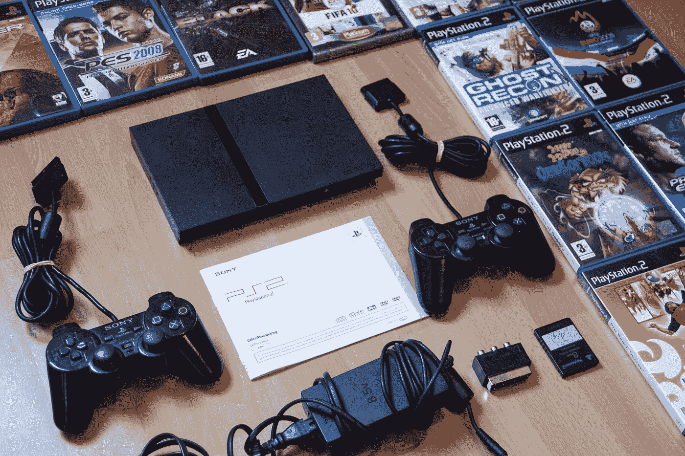

# 当今时代的 8 项革命性人工智能技术

> 原文：<https://towardsdatascience.com/8-revolutionary-artificial-intelligence-technologies-of-the-modern-era-f8f22a4127d0?source=collection_archive---------12----------------------->

## 探索和分析将会或已经对世界产生重大影响的 8 项人工智能技术

本·欧布罗在 [Unsplash](https://unsplash.com?utm_source=medium&utm_medium=referral) 上的照片

> **人工智能的兴起导致了快速改变世界的技术的产生，这些技术可以影响所有实体的未来，最好是为了人类的更好。**

世界的现代一代在技术上是先进的，进步和改进的步伐不断加快，没有减缓的迹象。我们生活的这个时代将被证明是有史以来最具影响力的时代。

人类进步的曲线总是倾向于指数曲线。火道的发现可以追溯到几千年前，车轮的发现，17 世纪和 18 世纪高质量发展的发明，最后是技术进步的现代，大多数发明都是在这个时代做出的。

过去二三十年的发明和发现几乎是过去所有年份产品总和的两倍。随着人类智力的日益提高，以及人工智能和地平线数据科学的兴起，人工智能的现代技术将前所未有地影响世界，并改变整个未来的格局。

那么，是什么让我们花了这么长的时间达到这种智能水平来创造开创性的发明，从而对科幻未来产生深远而有效的影响呢？

人工智能、机器学习和神经网络的概念已经存在了将近一个多世纪。然而，尽管他们最初取得了短暂的成功，但他们从未有过闪光的时候。失败的主要原因是技术进步尚未充分发挥潜力。此外，没有足够的数据可供深度学习模型和神经网络产生重大影响。

直到大约十年前，深度学习的流行才开始爆发。神经网络炒作的重新出现源于 2012 年的一个事件，其中乔治·e·达尔(George E. Dahl)领导的团队利用多任务深度神经网络预测一种药物的生物分子靶点，赢得了“默克分子活动挑战”。在这一事件之后，深度学习和神经网络被持续用于执行与图像分割、对象检测等相关的各种任务。

我强烈推荐通过下面提供的链接查阅下面这篇关于神经网络的有趣而复杂的历史的文章。它对现在导致深度学习和神经网络流行的历史事件提供了详细而简明的指导。

 [## 神经网络的完整有趣和复杂的历史！

### 重温人工神经网络发展背后的迷人历史

towardsdatascience.com](/the-complete-interesting-and-convoluted-history-of-neural-networks-2764a54e9e76) 

在这篇文章中，我们将讨论八种这样的革命性人工智能技术，这些技术已经或将肯定会影响我们都是其中一部分的领域的前景和观点。这篇文章旨在关注当代现有或即将到来的技术，以及人工智能如何与这些巨大的技术相结合，将如何发展和彻底改变我们的社会。

# 1.智能手机中的人工智能

亚当·亚当斯在 [Unsplash](https://unsplash.com?utm_source=medium&utm_medium=referral) 上的照片

从我们日常生活中经常使用的东西开始，一个非常明显但在现代社会中极具影响力的东西是**智能手机**。

智能手机在各个方面都是“革命性技术”的象征性代表。这些发明奠定了基础，是未来世界技术需要与之竞争的主要基准。

这些手机可以放在你的手掌中，能够执行多种任务，包括全球定位系统(GPS)定位、消息传递、电话呼叫、跟踪选择性设备、在线交易、激活蓝牙系统、访问社交媒体、网络浏览以及许多其他应用。

> 但是，到底是什么让这些智能手机比它们最初提供的更好呢？

人工智能与这些设备的集成将它们带到了一个完全不同的水平。这些设备的性能得到增强，从而为日常生活中需要解决的常见任务和问题提供更理想的结果和解决方案。

智能手机中的人工智能技术包括基于面部识别的面部锁定系统，可以防止任何未经授权的用户在未经你允许的情况下访问你的智能手机。只有注册用户的脸被识别和授权访问。它使用计算机视觉、深度学习和人工神经网络的概念来执行复杂的人脸识别锁定系统。

如果你有兴趣使用深度学习和计算机视觉从零开始建立一个类似的人脸识别模型，我会推荐你们所有人查看下面的文章。

 [## 智能面部锁定系统

### 建立高精度人脸识别模型

towardsdatascience.com](/smart-face-lock-system-6c5a77aa5d30) 

智能手机中的其他人工智能活动还包括一些自然语言处理和机器学习创新，如自动更正和自动完成功能。这两种技术都极大地有助于为使用这些设备的用户带来独特性、效率和舒适性。

“自动更正”和“自动完成”的功能基于深度学习主题和概念原则，如长短期记忆(LSMTs)、转换器、注意力的序列到序列模型，以及最重要的自然语言处理的核心方面。

最后，提到智能手机的另一个神话般的功能是集成虚拟人工智能攻击者，如谷歌人工智能和 Siri。我们将在本文的其他部分进一步讨论这个主题。

# 2.自动驾驶人工智能汽车

Vlad Tchompalov 在 [Unsplash](https://unsplash.com?utm_source=medium&utm_medium=referral) 上拍摄的照片

自动驾驶的人工智能汽车或自动驾驶汽车是快速发展的未来趋势。许多公司和科技巨头正在将他们宝贵的资源投入到现代化无人驾驶汽车的开发中。

顾名思义，这些汽车是完全自主的，在没有人类用户或任何额外帮助的情况下协调它们的运动。你可以把这些车放在自动驾驶仪上，并在你躺下来小睡一会儿或放松时设置各自的位置。

这些自动驾驶汽车将在交通中行驶，通过检查站，并覆盖全部距离，以完成预定和期望的目标。为了理解这些自动驾驶汽车如何工作的一些主要方法，他们利用了几个附加组件。

这些组件包括用于 360 度调节的光探测和测距(LIDAR)、多个摄像头、安全轮、高质量的先进系统等等。然而，我们将严格关注这些车辆的人工智能方面。

人工智能在这些先进汽车的开发中发挥了重要作用。自主车辆在训练阶段工作的一个主要概念是使用复杂的神经网络。深度卷积神经网络可以使用大量可训练参数，可以使用大量训练数据集来训练这些自动驾驶的人工智能汽车。

对于额外的培训，甚至图像分割和掩蔽的概念，以及数据处理技术，如特定的图像数据增强方法，都可以用于教授这些自动 AI 汽车。经过多次循环和多次训练后，这些模型将开始以相当好的比率运行，并成比例地提高它们的水平。它们能探测到障碍物，并以相当平稳的速度行驶。

现代自动驾驶汽车发展的一个很好的例子可以归功于特斯拉公司，这家由首席执行官埃隆·马斯克领导的公司旨在为电动汽车提供人工智能技术的安装。这些汽车非常有利于未来防止人类容易犯的多起事故。它们也有助于减少污染。

# 3.电子游戏中的人工智能

丹尼斯·简斯在 [Unsplash](https://unsplash.com?utm_source=medium&utm_medium=referral) 拍摄的照片

游戏是一种现象，在这种现象中，铁杆游戏玩家、休闲玩家和业余爱好者幻想游戏中的细节，探索虚拟世界，并享受玩视频游戏的乐趣。我从小就喜欢游戏。说到游戏，我是个书呆子，因为我是它的超级粉丝。就我个人而言，看到游戏世界的巨大变化让我兴奋不已。

随着 Playstation、Nintendo 和 Xbox 等各种游戏机的出现，游戏正在迅速崛起，并且没有任何放缓的迹象。NVIDIA 最近发布了 RTX 3080 显卡，它具有令人难以置信的性能提升，并为游戏增添了前所未有的情色之美。

哦，等等！谈论图形处理器(GPU)点燃了我对游戏和人工智能这两件我最喜欢的事情的兴趣。随着人工智能的进步，游戏的不断发展是非常重要的。

在游戏世界中开发的一些第一游戏使用特定的硬编码序列来执行特定的序列集合。此外，命中扫描技术被用来确定在一些第一人称射击游戏(FPS)中作为保证命中的射击着陆的效果。

随着人工智能的不断发展，为了使 NPC(不可玩的角色)和其他游戏角色对各种情况做出更真实的反应，不断进行更真实的改变。请注意，术语“现实的”在这个上下文中是一个相对的术语。

沿着记忆的小路走，让我想起了玩电子游戏的深刻。从 1993 年的《毁灭战士》到 2020 年的《永恒毁灭战士》,这款游戏的技术发展可谓突飞猛进。我从玩这个开始:

GIF 来自 [GIPHY](https://giphy.com/gifs/thumbs-up-doom-game-1xNApQKoX1uW2vhVE9/links)

到现在玩这个

GIF 来自 [GIPHY](https://giphy.com/gifs/doom-id-software-X6aDDzm9Kv1YsvluTU/links)

这项技术已经从像素化的字符发展到更加图形化的方法。在人工智能领域，强化角色的概念在学习游戏的某个方面起着至关重要的作用。你可以用反复点击和尝试的方法训练你自己的 AI 来玩游戏，并允许网络在此过程中发展批判性思维。

人工智能和强化学习的一个例子是 flappy bird 游戏。为该特征构建的人工智能神经网络失败了若干代。然而，经过数百万代的训练，它获得了更好的理解，并以超过人类的水平执行。

游戏行业发展的其他例子可以归功于象棋引擎中的神经网络，这些神经网络表现强劲，并帮助大师们准备新的创新路线。

# 4.GPT-3

马克·拉斯姆森在 [Unsplash](https://unsplash.com?utm_source=medium&utm_medium=referral) 上拍摄的照片

2020 年最令人期待和开创性的创造之一是由 OpenAI 团队创建的 GPT-3 模型。在 1750 亿个机器学习参数上训练的 GPT-3 模型是当代革命性的人工智能技术。它的特性和计算方面使它目前在自然语言处理领域无与伦比。

生成式预训练 Transformer 3 是一个自回归语言模型，它使用深度学习来产生类似人类的文本。这是由旧金山人工智能研究实验室 OpenAI 创建的 GPT-n 系列中的第三代语言预测模型。(查看参考文献[【4】](https://en.wikipedia.org/wiki/GPT-3)从维基获取更多信息)

OpenAI 开发的 GPT-3 可以被认为是一种语言生成算法，它可以像其他人工智能算法一样生成文本。它可以用于预测各种单词和句子，像聊天机器人一样回答问题，或者从头开始生成独特的文本。GPT-3 模型可以从头开始生成整篇文章，包括新闻、杂志等等。然而，令人惊讶的是，这些生产出来的产品几乎不可能区分出是人工作品还是机器作品。

我强烈推荐看看我以前的一篇关于预测下一个单词的文章。它不像神话般的 GPT-3 架构那样先进，但它应该让你简要了解自然语言过程、深度学习和神经网络的概念如何用于创建壮观的事物。

 [## 基于自然语言处理和深度学习的下一个单词预测

### 使用 LSTM 设计单词预测系统

towardsdatascience.com](/next-word-prediction-with-nlp-and-deep-learning-48b9fe0a17bf) 

一些人批评 GPT-3 太好了，以至于它绕过了人类水平的智力，与人类并肩竞争。这种每次计算和产生新结果的能力会导致欺诈活动。然而，这种讨论不是本文的范围，因为我们将只关注积极的方面。OpenAI 团队创建的 GPT-3 模型将成为未来几年技术进步的革命性一步。

# 5.机器人中的人工智能

Jelleke Vanooteghem 在 [Unsplash](https://unsplash.com?utm_source=medium&utm_medium=referral) 上拍摄的照片

人形机器人接管整个宇宙的概念一直是科幻(科幻电影)中人们感兴趣的热门话题。然而，这种观点与现实相去甚远，因为我们距离达到一般人工智能的超级放弃水平还有很长的路要走。

机器人学和机器人有几种定义。但是，我们将把重点放在机器人的一般描述上。根据国际标准组织(ISO)，工业机器人被定义为

> 一种自动控制、可重新编程的多用途机械手，可在三个或更多轴上编程，可固定在适当位置或移动，用于工业自动化应用。

上述定义只是思考机器人的许多可能方式中的一种。任何能够完成运动、自动完成某项任务并有助于造福社会的机电物体，都是我喜欢称之为“机器人”的另一种说法得益于电影和书籍，机器人和人工智能有着悠久的历史关联。

GIF 来自 [Giphy](https://media.giphy.com/media/v4sOCVX9Dhsv6/giphy.gif)

尽管这些方面中的一些可能被认为是今天不切实际的期望，但客观上今天有许多人工智能和机器人的用例。机器人手臂用人工智能编程，以实现任务的自动化。

提到机器人和人工智能结合在一起(智能机器人)可以执行的一些任务，包括用于组装零件的精确组装应用程序、工业中产品的交叉检查和包装、用于衡量客户满意度的服务机器人以及用于执行各种应用程序的开源机器人。

在不太遥远的未来，我们将见证更逼真的人形机器人与人工智能相结合的发展，以创造一个更具生产力和效率的世界。我对人工智能和机器人的未来充满期待。

# 6.虚拟助手

在 [Unsplash](https://unsplash.com?utm_source=medium&utm_medium=referral) 上由 [Waldemar Brandt](https://unsplash.com/@waldemarbrandt67w?utm_source=medium&utm_medium=referral) 拍照

简而言之，虚拟助理是一种设备，可以帮助为人类执行各种任务提供指导和帮助，如播放音乐、打电话、发消息等等。像谷歌人工智能、Siri、Alexa、Cortana 和许多其他来自不同公司的类似虚拟助手这样的虚拟助手越来越受欢迎，这是因为它们的能力和它们为人类提供的整体便利。

这些人工智能虚拟助手有可能自动化任何现实任务。这些虚拟助手的范围在增加，并且目前对这些产品有很高的需求。此外，您还可以使用您的人工智能技能来开发一个完整的家庭自动化系统，使用这些虚拟助理在您的家中编程，可以监控、控制和调节各种操作。

我强烈建议查看我以前的一篇文章，内容是使用自然语言处理、神经网络和深度学习从头开始创建独特和创新的聊天机器人。我使用了一维卷积层的概念来解决这个任务。

你开发的这个模型应该有助于更好地理解聊天机器人是如何工作的，也使你能够更好地了解虚拟助手以及 GPT-3 模型的工作。您可以通过下面提供的链接来查看。

 [## 使用一维卷积层的创新聊天机器人

### 从头开始使用深度学习和 Conv-1D 层构建聊天机器人

towardsdatascience.com](/innovative-chatbot-using-1-dimensional-convolutional-layers-2cab4090b0fc) 

随着科技的快速发展，虚拟助理在现代社会中的作用越来越大。在不久的将来，这些虚拟助理的数量和需求将不断增加。因此，这是一个学习和体验人工智能虚拟辅助技术的好时机。

# 7.增强现实和人工智能

照片由[托比亚斯](https://unsplash.com/@tbshg?utm_source=medium&utm_medium=referral)在 [Unsplash](https://unsplash.com?utm_source=medium&utm_medium=referral) 拍摄

增强现实对观众来说是一种体验，它有助于创建世界和我们周围环境的交互体验，以产生逼真的交互性。这些视觉效果通常是通过计算机或软件生成的，但是这些生成的图像和模型有助于使自然世界看起来更加精彩。

有许多类型的现实变得日益流行。讨论其中的一些是增强现实、虚拟现实和混合现实的技术。我们已经看到了什么是增强现实。增强现实的一个例子是像口袋妖怪 Go 这样的流行游戏。

虽然增强现实只能通过交互式环境来创建增强效果，但虚拟现实可以让用户沉浸在完整的体验中。在虚拟现实设备的帮助下，你经常会被带入一种完全沉浸式的体验。混合现实是增强现实和虚拟现实的结合。(有关该主题的更多信息，请参考参考文件[【6】](https://www.fi.edu/difference-between-ar-vr-and-mr#:~:text=Augmented%20reality%20%28AR%29%20adds%20digital,the%20camera%20on%20a%20smartphone.&text=Virtual%20reality%20%28VR%29%20implies%20a,shuts%20out%20the%20physical%20world.))

虚拟技术和人工是天作之合。这两个功能结合在一起，可以从虚拟世界中创建动态功能和期望，这曾经被认为是不可能的。为了说明人工智能虚拟现实的一个例子，我想回到游戏的话题。

2020 年(本文发表的前一年)，流行游戏公司 Valve 制作了一款名为 Half-Life Alyx 的游戏，该游戏在各方面都具有开创性。下面的 GIF 是结合了人工智能力量的虚拟现实的简单表示。

GIF 来自 [GIPHY](https://giphy.com/gifs/valve-half-life-half-life-alyx-Kecehv8EAC1dTWUnlM/links)

在增强现实和人工智能的帮助下，你可以被带到一个完整的虚拟宇宙，这是如此的逼真，以至于你可以有一个奇妙的体验。人工智能的特点，如敌人的机器人或不可玩的角色(NPC)，只是给虚拟生成的世界增加了更多的物质和内容。

增强现实和人工智能集成在一起时，会有无限的可能性。推测和思考多种独特的排列和组合是令人兴奋的，我们可以用这些技术来创造令人兴奋的产品，这些产品将被证明是未来几年的美丽特征。

# 8.物联网设备与人工智能相结合

照片由[亚伦·伯顿](https://unsplash.com/@aaronburden?utm_source=medium&utm_medium=referral)在 [Unsplash](https://unsplash.com?utm_source=medium&utm_medium=referral) 上拍摄

物联网，顾名思义，就是借助互联网控制周围所有交互元素的艺术。最近一段时间，人工智能的受欢迎程度已经超出了比例，因为可以用它们生产大量高质量的产品。

借助 Arduino、Raspberry Pi、Nvidia Jetson Nano 和许多其他嵌入式设备，以及传感器、电机和其他可以通过蓝牙模块或 Wi-Fi(基本上是互联网)控制的物理组件的组合，您可以创建出色的产品。

我们已经确定，物联网是一项卓越的突破性技术，其产品能够实现很高的成功率。然而，随着人工智能融入物联网(有时也称为 AIoT)，这些技术将在世界的发展中创造一场新的革命。

物联网的人工智能技术允许你创造多种产品和技术。其中一些甚至包括前面提到的技术，如自动驾驶汽车(或自动驾驶汽车)、特定任务机器人等等。

物联网与人工智能相结合可以创造许多精彩的发明，这些发明将导致未来的整个景观朝着更好的方向改变。Tensorflow 甚至还有 Tensorflow-lite 等版本支持嵌入式系统。

像谷歌这样的公司正在大力投资制造更小的芯片，并将人工智能的技术安装在这些组件中，这些组件的大小仅为几纳米(芯片可以澄清这种说法)。人工智能和物联网将标志着一场揭示人类未来的新革命。

我强烈建议从下面提供的链接中查看下面的文章，以更深入地了解物联网和人工智能的主题。

 [## 物联网和人工智能:未来几代人的强大进化！

### 物联网结合人工智能，将是人类未来的一次进化。这里是…

towardsdatascience.com](/iot-and-ai-a-powerful-evolution-for-future-generations-78ac07a9c3b) 

# 结论:

[王人](https://unsplash.com/@r1g?utm_source=medium&utm_medium=referral)在 [Unsplash](https://unsplash.com?utm_source=medium&utm_medium=referral) 上拍照

引用一些名人关于人工智能技术未来的名言——

> “AI 是新电。它将改变每一个行业，创造巨大的经济价值。” **—吴彦祖**
> 
> “我能想到的最不可怕的未来是，我们至少让人工智能民主化……(而且)当有一个邪恶的独裁者时，那个人就要死了。但是对于人工智能来说，就不会有死亡。它会永远存在。然后你会有一个不朽的独裁者，我们永远无法逃脱。” **—埃隆·马斯克**

在本文中，我们讨论了八项具有影响力和革命性的人工智能技术，这些技术有能力将世界的未来塑造成一个现代化的趋势领域，以全面提高生活质量。这些人工智能技术随着各个研究领域的进步和不断更新而迅速发展。

让我们快速回顾一下本文中简要提到的这八项技术。第一个是我们日常使用的技术，智能手机。我们了解人工智能在这些智能手机中的影响，以及它如何帮助改善用户体验。然后，我们详细讨论了自动驾驶汽车的人工智能的未来，以及这些自动驾驶汽车将如何在不久的将来成为一部分。

然后，我们开始了解人工智能在游戏行业的影响以及几十年来的演变。然后，我们了解了去年最热门的话题之一，这是由于 GPT 3 号技术的发射，这是一项具有里程碑意义的技术创新。

然后，我们讨论了机器人技术和具有人工智能的虚拟助手，以及它们如何为世界的现代化发展新趋势。我们了解到这些重大趋势带来的无数可能性和光明未来。

我们还探讨了增强或虚拟现实的主题，以及它与人工智能的结合将如何有助于在不同的维度和角度进化世界。最后，我们讨论了物联网和人工智能技术，以开发高质量的产品，并将未来的景观改变为更加现代化的时代。

如果你认为我错过了你认为应该在列表中的任何其他革命性的人工智能技术，并且你希望我在未来的文章中涵盖它，请随时告诉我。此外，如果您对文章中提到的要点有任何其他疑问，请随时在下面评论，我会尽快回复您。

看看我的其他一些文章，你可能会喜欢读！

 [## 掌握 Python 中的字典和集合！

### 通过代码和示例理解 Python 中的字典和集合的概念

towardsdatascience.com](/mastering-dictionaries-and-sets-in-python-6e30b0e2011f)  [## 从数据科学中赚取收入的 5 种最佳方式！

### 探索作为数据科学爱好者或数据科学家的五种最佳创收方式！

towardsdatascience.com](/5-best-ways-to-earn-income-from-data-science-a9c8fed1eee6)  [## 数据科学的 10 大最佳工具和技术！

### 每个数据科学家都必须考虑探索的 10 种最佳工具和技术，以获得更好的曝光率和更高的…

towardsdatascience.com](/10-best-tools-and-technologies-for-data-science-e335fb99c2f2)  [## 2021 年及以后的 15 个令人敬畏的 Python 和数据科学项目！

### 15 个很酷的 Python 和数据科学项目，提供有用的链接和资源，为 2021 年构建您的投资组合…

towardsdatascience.com](/15-awesome-python-and-data-science-projects-for-2021-and-beyond-64acf7930c20)  [## 学数据科学需要付费吗？

### 钱是学习数据科学的必备条件吗？分析最好的免费资源和有用的链接，以获得…

towardsdatascience.com](/do-you-need-to-pay-to-learn-data-science-e71f75493e5a) 

谢谢你们坚持到最后。我希望你们喜欢阅读这篇文章。我希望你们都有美好的一天！

# 参考资料:

1.  [来自维基的深度学习](https://en.wikipedia.org/wiki/Deep_learning#:~:text=The%20impact%20of%20deep%20learning,speech%20recognition%20started%20around%202010.)
2.  [神经网络的历史](/the-complete-interesting-and-convoluted-history-of-neural-networks-2764a54e9e76)
3.  [特斯拉](https://www.tesla.com/)
4.  [GPT-3](https://en.wikipedia.org/wiki/GPT-3)
5.  [RIA](https://www.robotics.org/blog-article.cfm/How-Artificial-Intelligence-is-Used-in-Today-s-Robots/117#:~:text=Artificial%20intelligence%20(AI)%20and%20robotics,capabilities%20in%20previously%20rigid%20applications.)
6.  [增强现实、虚拟现实和磁共振](https://www.fi.edu/difference-between-ar-vr-and-mr#:~:text=Augmented%20reality%20(AR)%20adds%20digital,the%20camera%20on%20a%20smartphone.&text=Virtual%20reality%20(VR)%20implies%20a,shuts%20out%20the%20physical%20world.)