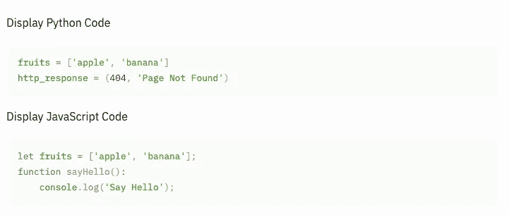
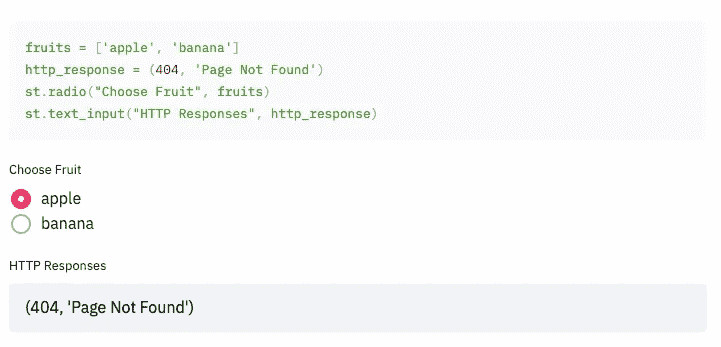
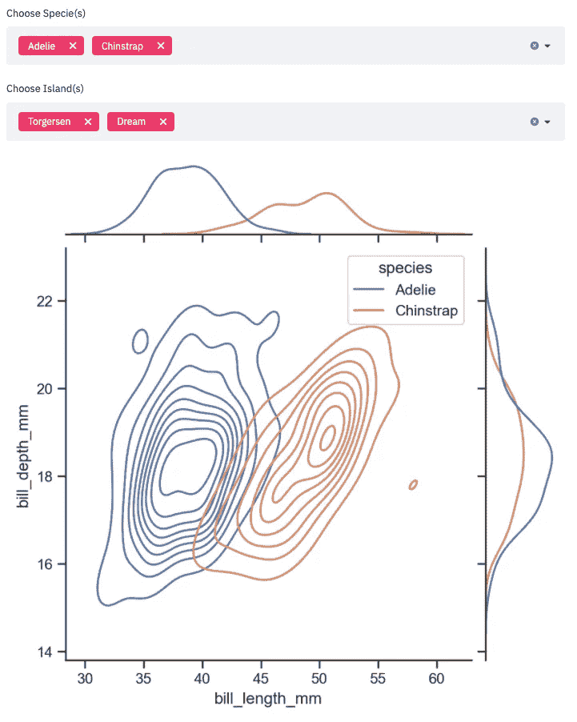
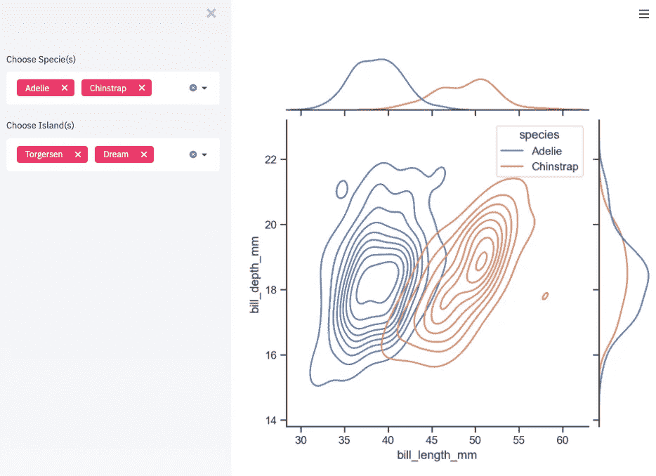
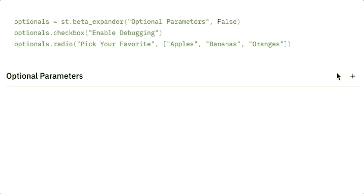
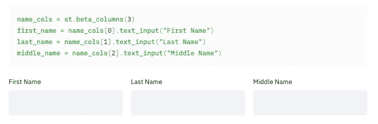
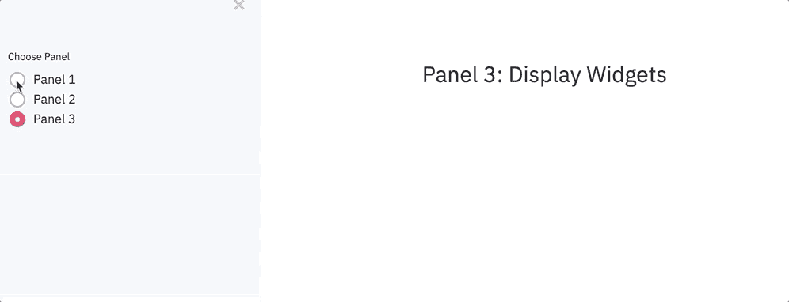
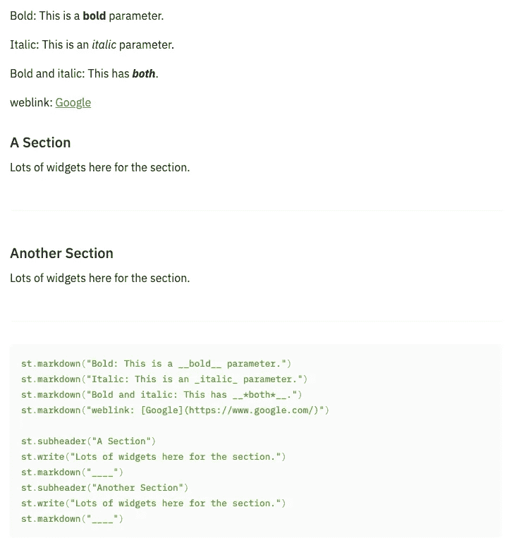
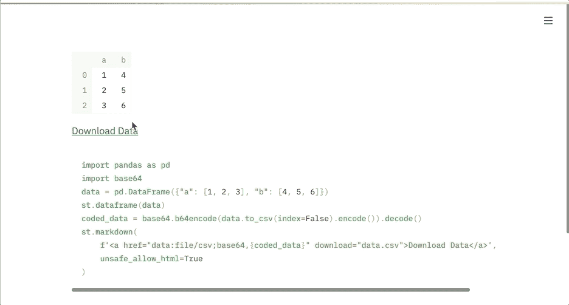
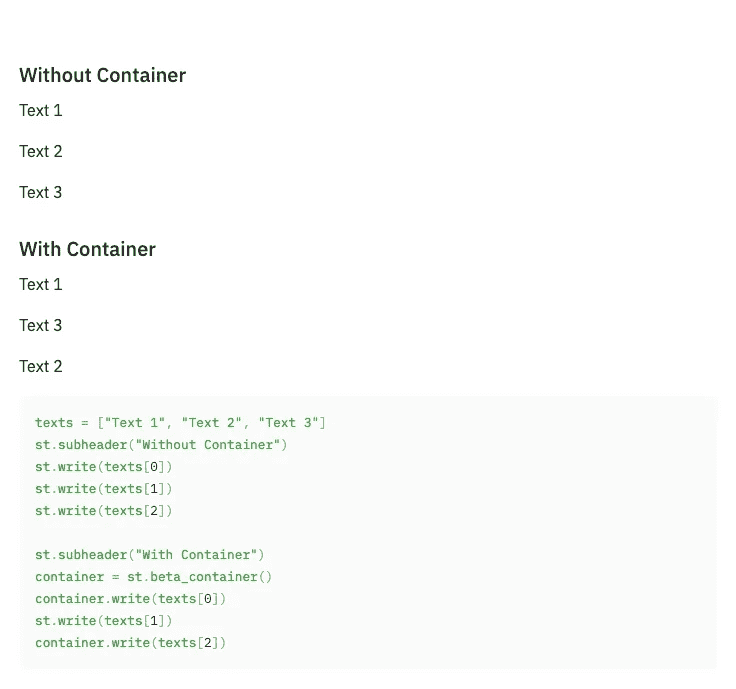

# 你应该知道的 8 个简单有用的 Streamlit 技巧

> 原文：<https://towardsdatascience.com/8-simple-and-useful-streamlit-tricks-you-should-know-ad16c6691b84?source=collection_archive---------25----------------------->

## 编写更好的简化应用


照片由[乔希·布茨](https://unsplash.com/@joshboot?utm_source=medium&utm_medium=referral)在 [Unsplash](https://unsplash.com?utm_source=medium&utm_medium=referral) 上拍摄

web 开发有几种通用的 Python 框架，包括 Flask 和 Django。然而，当涉及到数据科学的世界时，数据科学家或机器学习工程师不是 web 开发人员，他们没有兴趣花几周时间学习使用这些框架来构建 web 应用程序。相反，他们想要一个更容易学习和使用的工具，只要它可以显示数据并收集建模所需的参数。

这就是 Streamlit 发挥作用的地方——一个简单易用的 web 框架，允许我们构建基于数据的交互式 web 应用程序。如果你已经非常了解 Python，那么只需要几个小时，你就可以构建一个有意义的 web 应用。当然，学会使用它需要一些尝试和错误。在这篇文章中，我想分享一些帮助我构建 web 应用程序的技巧。

## 1.显示源代码以提供上下文

当您向对查看您的代码感兴趣的同行显示数据时，在 web 应用程序中显示您的代码非常有用。为此，您可以使用`code`小部件，它支持 Python、JavaScript、SQL、Java、Ruby 和许多其他常见语言。



显示代码块

显示直接负责小部件或其相关数据的代码通常很有用。诀窍是使用`echo`函数，如下所示。

```
with st.echo():
    fruits = ['apple', 'banana']
    http_response = (404, 'Page Not Found')
    st.radio("Choose Fruit", fruits)
    st.text_input("HTTP Responses", http_response)
```

下图显示了您将在屏幕上看到的内容。本质上， *with* 语句中的所有内容都将包含在一个代码块中。



使用 echo()

## 2.使用侧栏收集可配置的参数

如果您的 web 应用程序要根据用户输入显示数据和相关数字，那么在侧边栏中放置相关的小部件是一个好主意。这种分离使得交互性的意图对用户来说很清楚——侧边栏提供参数(即输入),而主屏幕响应用户的输入提供反馈(即输出)。

下图只是给你一个思路。如果你有更多的参数，使用侧边栏可以提高你的应用程序的整洁度。但是需要注意的是，侧边栏的宽度是有限的，所以要避免长文和大 widgets，这样会让信息流有断裂感。此外，如果您有太多超过屏幕高度的参数，您可能会考虑重新组织您的小部件。



使用侧边栏

## 3.对可选部分使用扩展器

如果您有一些对于大多数用例来说不太重要的参数，您可以将它们折叠成一个扩展器。扩展器可以选择默认扩展或不扩展。



使用扩展器

顺便说一下，你看不到的是我使用了`echo()`函数来包含代码，这样它就显示在 web 应用程序上了。

## 4.使用列来组织并行参数

当您拥有属于一个共享概念组的参数时，您可以使用列为这些小部件创建物理上的邻近性，这样用户就知道这些参数是密切相关的。下面是一个简单的例子。



使用列

## 5.使用无线电作为导航工具

当您的 web 应用程序包含多个具有不同用途的组件时，您可能会考虑使用基于选项卡的应用程序。但是，Streamlit 还不支持选项卡。一种解决方法是使用侧边栏中的`radio`小部件作为导航工具。请参见下面的使用案例。



导航无线电

## 6.为重点创造视觉线索

Streamlit 具有方便的功能，可以将某些文本显示为标题和副标题。它们是创建剖面的重要视觉线索。除了这些标题之外，我们还可以使用 markdown 来创建其他用于不同目的的视觉提示。一些常见的包括粗体、斜体和 weblink，如下所示。



降价的视觉提示

上面的代码还向您展示了如何在不同的部分之间添加显式分隔符，这可以改善描述。

## 7.创建可下载的链接

如果您准备了一些用户想要下载的输出文件，我们可以利用 Streamlit 中的 markdown 功能来完成。



可下载链接

该示例向您展示了如何为数据帧创建下载链接。你也可以对任何文本文件这样做。

## 8.稍后使用容器添加小部件

有时出于某种原因，您需要操作代码中之前添加的小部件，您不能直接修改之前的小部件，因为 Streamlit 线性地运行脚本。在这种情况下，您应该考虑使用一个容器来包装前面显示的小部件。该容器可以在以后被引用，并允许您添加额外的小部件。下面的截图向您展示了这样的用法。



使用容器

## 结论

在本文中，我们回顾了您可以在 Streamlit web 应用程序中尝试的 8 个有用功能。当然，Streamlit 仍在快速发展，我们应该期待它会变得越来越好。