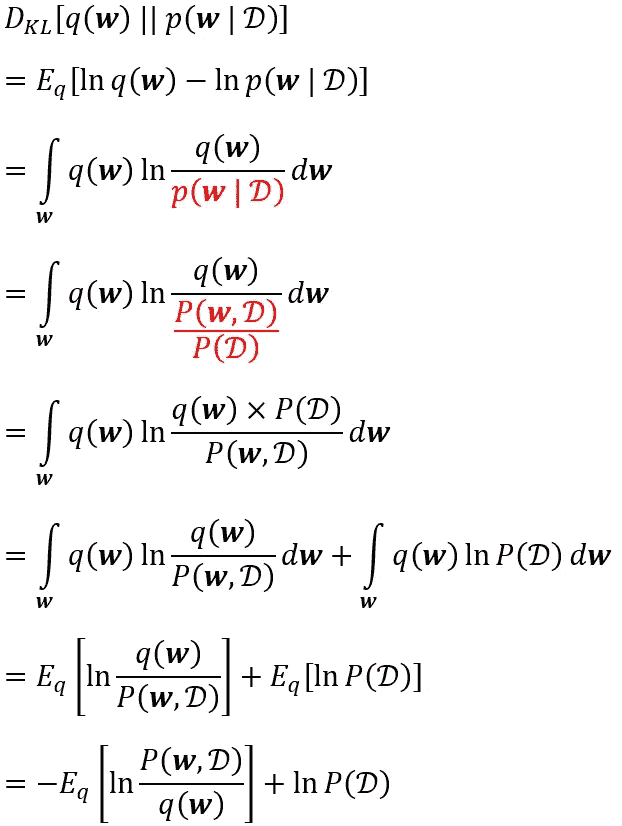

# 关于贝叶斯神经网络你应该知道的 8 个术语

> 原文：<https://towardsdatascience.com/8-terms-you-should-know-about-bayesian-neural-network-467a16266ea0?source=collection_archive---------5----------------------->

## 先验、后验、贝叶斯定理、负对数似然、KL 散度、替代、变分推理和证据下界的意义

照片由 [cyda](https://blog.cyda.hk/)

# 目标

在上一篇文章中，我们介绍了贝叶斯神经网络(BNN)。对于那些刚到 BNN 的人，确保你已经检查了下面的链接，以便熟悉标准神经网络(SNN)和 BNN 之间的区别。

</why-you-should-use-bayesian-neural-network-aaf76732c150>  

今天我们就跳到核心，学习背后的数学公式。从这篇文章中，你会学到不同的 BNN 相关术语…

1.  我们如何利用**贝叶斯推断**的概念来更新模型权重和输出的概率分布。
2.  我们将为贝叶斯神经网络使用什么具体的**损失函数**来优化模型。
3.  不同的**技术和方法**在现实生活场景中处理未知的分配问题。

# 贝叶斯推理

从上一篇文章中，我们知道贝叶斯神经网络会将模型权重和输出视为变量。我们不是找到一组最优估计，而是拟合它们的概率分布。

但问题是*“我们怎么知道他们的分布是什么样的？”要回答这个问题，你必须了解什么是先验、后验和贝叶斯定理。下面，我们将用一个例子来说明。假设有两节课——科学课和艺术课，同学们要么戴眼镜，要么不戴眼镜。现在我们从班上随机挑选一个同学，你能说出那个同学戴眼镜的概率吗？*

照片由 [cyda](https://blog.cyda.hk/)

> **1。先验概率** ( **先验**)

先验在考虑任何证据之前表达自己的信念。因此，在没有提供任何进一步信息的情况下，您可能会猜测该同学戴眼镜的概率为 0.5，因为(30+20)/(30+20+15+35)= 50/100 = 0.5。这里，我们称 0.5 为先验概率。

> **2。后验概率** ( **后验**)

Posterior 在考虑一些证据后表达一个人的信念。让我们继续上面的例子。如果现在我告诉你那个同学其实是理科班的呢？你怎么看那个同学现在戴眼镜的概率？有了更多的信息，你可能会改变你的信念，更新概率，对吗？更新后的概率我们称之为后验概率。

> **3。贝叶斯定理**

贝叶斯定理是根据证据将先验概率更新为后验概率的数学公式。

由 [cyda](https://blog.cyda.hk/) 拍摄

a 是我们感兴趣的事件，即“该同学戴眼镜”，而 X 是证据，即“该同学在科学课上”。

照片由 [cyda](https://blog.cyda.hk/) 拍摄

现在你明白后验概率是如何根据证据更新的了。对于贝叶斯神经网络，权重的后验概率计算如下

照片由 [cyda](https://blog.cyda.hk/)

# 损失函数

现在您已经理解了更新权重和输出的公式，但是我们忽略了一件重要的事情，那就是估计概率分布的评估。在下文中，我们将讨论 BNN 经常使用的两种关键测量方法。

> **4。负对数可能性**

对于回归问题，我们将始终使用均方差(MSE)作为 SNN 的损失函数，因为我们只有一个点估计。然而，我们将在 BNN 做一些不同的事情。有了预测的分布，我们将使用负对数似然作为损失函数。

照片由 [cyda](https://blog.cyda.hk/)

好了，我们一个一个来解释。

似然性是作为预测分布函数的观测数据的联合概率。换句话说，我们想知道数据的分布有多像我们预测的分布。可能性越大，我们预测的分布就越准确。

照片由 [cyda](https://blog.cyda.hk/) 拍摄

对于对数似然，我们有它是因为计算简单。通过利用对数属性(log ab = log a + log b ),我们现在可以使用求和来代替乘法。

最后但同样重要的是，我们添加负号以形成负对数似然，因为在机器学习中，我们总是通过最小化成本函数或损失函数来优化目标函数，而不是最大化它。

> **5。库尔贝克-莱布勒散度** ( **KL 散度**)

KL 散度是量化一个分布和另一个分布有多大的差异。假设 *p* 是真实分布，而 *q* 是预测分布。实际上，它正好等于两个分布之间的交叉熵减去真实分布的熵 *p* 。换句话说，它解释了预测分布 *q* 还可以改进到什么程度。

照片由 [cyda](https://blog.cyda.hk/)

对于那些不知道熵和交叉熵是什么的人来说，简单来说，熵是代表真实分布 *p* 的“成本”的最低边界，而交叉熵是使用预测分布 *q* 来代表真实分布 *p* 的“成本”。由此，KL 散度将代表预测分布 *q* 的“成本”可以进一步降低多少。

所以回到今天的焦点， *p* 将指模型权重和输出的真实分布，而 *q* 将是我们预测的分布。我们将使用 KL 散度来计算两个分布之间的差异，以便更新我们预测的分布。

# 问题与解决方案

不幸的是，边际概率 *P(D)* 通常很难处理，因为很难找到下面积分的封闭形式。源于此，对于一个复杂的系统来说，后验的*P(****w****| D)*也是棘手的。

cyda 拍摄的照片

*为了解决这个问题，统计学家们发展了一种叫做* ***变分推断*** *的方法，通过最小化* ***替代*** *模型的* ***证据下界*** *来近似真实的后验分布。*

不要担心加粗的条款。我会一一解释。

> **6。代理人**

代理模型是一个简单的模型，用来代替我们感兴趣的复杂模型。它很容易使用，并且和复杂模型一样好。一般来说，代理模型会在统计分布家族中，所以我们有它的解析解。

照片由 [cyda](https://blog.cyda.hk/)

> **7。变分推理(六**

变分推断就是用一个变分分布 *q** 来代替真实的后验分布*p(****w****| D)*的概念。但是代理模型那么多，怎么才能保证 *q** 足够好的表示*p(****w****| D)*？答案很简单，我们可以用刚刚学过的 KL 散度。

在代理模型 Q 中，我们试图找到最优的一个

照片由 [cyda](https://blog.cyda.hk/)

> **8。证据下界**

然而，同样的问题仍然存在，因为我们没有后验概率分布。我们能做的是把 KL 散度改写成

照片由 [cyda](https://blog.cyda.hk/) 拍摄

通过考虑

照片由 [cyda](https://blog.cyda.hk/)

我们可以总结出下面的公式。

照片由 [cyda](https://blog.cyda.hk/)

已知 KL 散度是非负数，证据是 0 和 1 之间的概率，因此对数证据必须是非正数，我们可以容易地推导出 *L(w)* 是证据的下限。这就是我们称之为“证据下界”的原因。换句话说，我们现在可以通过优化找到最优的一个 *q**

照片由 [cyda](https://blog.cyda.hk/)

# 结论

如果你已经看完了以上所有内容，恭喜你！希望你现在已经对贝叶斯神经网络背后的数学概念有了最基本的理解。在接下来的文章中，我将更多地关注关于如何使用张量流概率构建 BNN 模型的编码观点。敬请期待！=)