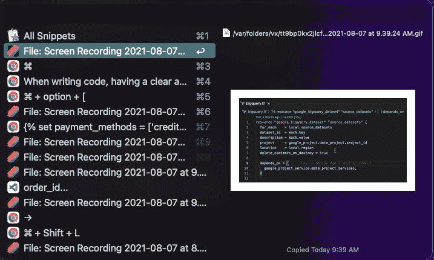

# 大大提高 VSCode 工作效率的 8 个技巧

> 原文：<https://towardsdatascience.com/8-tips-to-greatly-enhance-your-vscode-productivity-3bb49089a054?source=collection_archive---------9----------------------->

## 我给第一次使用 VSCode 或从另一个 IDE 转换过来的人的 8 个技巧。

照片由 [Unsplash](https://unsplash.com?utm_source=medium&utm_medium=referral) 上的 [AltumCode](https://unsplash.com/@altumcode?utm_source=medium&utm_medium=referral) 拍摄

无论您是工程师还是分析师，熟悉 IDE 都是至关重要的一部分。对于不太熟悉 Vim 或 VSCode 的人来说，看着一个高级开发人员在 Vim 或 vs code 中跳来跳去可能会感到害怕。然而，我向你保证，这里没有魔法。当你陷入困境时，这都是练习和搜索答案。

我在这篇文章中分享的大部分技巧将会大大提高你的工作效率。一旦你学会了这些，你将很难想象没有它们的生活。

# 1.所有快捷方式的大师

如果从这篇文章中你学到了一个捷径，那就是: **⌘ + Shift + P** (在 Windows 上你可以用所有的⌘键代替 Ctrl，用 option 代替 alt)。此快捷方式在 VSCode 中打开控件面板，您可以在其中搜索命令、操作和其他快捷方式。

命令面板—作者的 GIF

尝试搜索`Copy path of active file`或`Copy relative path of active file`并按回车键。没有更多的摸索尝试输入准确的文件路径到您的终端。最重要的是，您不必记住这些命令的实际快捷方式。你只需要记住它们做什么，并在命令面板中搜索它们。

命令调板还会记住您最近打开的一些项目，以便您可以快速浏览它们。

# 2.在您的存储库中导航文件

打开命令面板后，您可以删除`>`字符或使用 **⌘ + P** 命令在 repo 中搜索文件。如果您的项目结构错综复杂，并且需要花费时间来浏览，这将非常有用。使用这个命令，您只需记住文件名。

作者在 repo-GIF 中导航所有文件

搜索引擎挺好的，文件名长的话只需要输入名字的首字母就可以了。例如，你只需要在搜索栏中输入`ssp`来搜索一个名为`stg_stripe__payments.sql`的文件。

当您在 VSCode 窗口中打开 repo 时，您可以通过单击它们来快速预览文件。双击一个文件将打开它永久居中或在左手边。双击该文件将在右侧打开它。当您想并排比较两个文件的内容时，这非常有用。

# 3.多光标编辑

当使用代码文件时，这部分将会大大提高你的效率。多光标编辑是同时拥有多个光标并从所有这些光标进行编辑的能力，而不是一次编辑一个光标。让我们使用一个 SQL 查询，看看多游标的一些用例。

这里可能会有一些新的东西需要学习，但是如果你掌握了所有的东西，你就可以四处走动，很快地把事情做完。我发现自己经常将 Word 等其他程序的代码片段复制到 VSCode 中来操作它们。

## 重命名所有实例

一个常见的做法是选择所有事件，然后一次全部更改。在下面的例子中，我们的表的名称从`orders`更改为`order`。为此，您只需选择单词`orders`的一个实例，并使用 **⌘ + shift + L** 。该快捷方式将在单词`orders`处创建多个光标，以便您对其进行编辑。

这很像搜索，但更具灵活性。

如果我们把这个查询改成不同的方言，并且所有的列名都应该用双引号括起来。我们可以选择字符`.`的所有实例，并使用 **Shift + →** 来选择下一个单词。选择了所有的列名后，我们可以输入`"`将它们都用引号括起来。

引用所有列名—作者的 GIF

下一个例子是当我们有一个长而复杂的查询，并且只想改变 select 语句中的事件时。您可以使用⌘+ F 启用搜索模式，然后选择您想要操作的区域。接下来，按下 **⌘+选项+ L** 仅在选定区域搜索。您现在可以使用 **⌘ + shift + L** 并将错别字订单更改为订单。注意，from 语句中的单词`order`不受影响。

## 将多行转换成 Python 列表

现在，让我们尝试提取这个查询中的所有列名，并将其转换成一个 Python 列表。对于前四列，我们可以使用新的快捷方式来选择它们。首先，选择第一列中`.`字符后的空格。然后按住 **shift + option** 选择最后一列相同的空格。你可以看到，有了这个，我们已经创建了多行光标。要添加最后一列，您可以按住**选项**并选择它。最后，使用**选项** **+** →选择所有列。

选择所有列—作者的 GIF

使用复制的列，您可以将它们粘贴到下面，使用 **shift + option** 选择所有行，引用它们，添加逗号，删除新行，并将所有内容放在方括号中。

将复制的列转换为 Python 列表—作者制作的 GIF

# 4.重新排序行

您可以使用**选项+光标**上下移动任意行，而不是复制粘贴来改变行的顺序。您可以同时选择多条线，也可以使用此功能。

使用光标移动线条-作者的 GIF

您也可以根据行的长度来缩短行，方法是选择行，打开命令选项板，然后选择升序或降序对行进行排序。

使用命令调板对行进行排序—作者提供的 GIF

# 5.代码折叠

对于复杂的代码，有时很难知道发生了什么。如果代码格式良好，您可以使用`Fold All`命令面板的命令折叠所有代码。这让我们对正在发生的事情有了一个高层次的概述，我们可以深入到我们感兴趣的特定领域。

折叠所有代码—图片由作者提供

您也可以分别使用以下命令来折叠和展开选择: **⌘ + option + [** ， **⌘ + option + ]** 。

# 6.格式化

编写代码时，拥有格式清晰的代码对于保持可读性至关重要。VSCode 因其丰富的扩展库而广受欢迎，您可以在那里找到 linter 来格式化大多数编程语言。

代码格式—作者提供的 GIF

要自动格式化文件，您可以使用命令 **option + shift + F** 。如果您试图格式化的文件扩展名的 linter 没有安装，VSCode 将提示您这样做。在处理 Python、SQL 或 Terraform 文件时，我经常使用这个快捷方式。

# 7.在回购中查找实例

有时你有一个价值，你必须改变你的回购。它可以是函数名或变量。手动查找和更改它们可能会很痛苦。您可以使用 **⌘ + shift + F** 在您的 repo 中找到一个单词或短语的所有实例，并用其他内容替换它们。

# 8.切换终端

终端是任何软件开发工作流程的重要组成部分。您可以使用快捷方式: **control + `** 打开与您的编码环境相关的终端。你可以在终端中使用命令面板来`Run current file`。

如果你正在用 Python 开发，我真的很喜欢选择一段代码并在本地的 Jupyter 环境中执行它。选择您想要执行的文本，并使用**shift+enter**—非常类似于 Jupyter 笔记本中的单元格。

# (奖金)使用通用剪贴板管理器

我现在不能没有剪贴板管理器。剪贴板管理器能够保存你复制的任何东西，并保存一段时间(1 到 3 个月取决于工具)。你也可以在那里搜索物品。例如，如果我想记住我最近使用`brew`安装的一个包，我只需要在我的剪贴板管理器中搜索`brew`。

剪贴板管理器的魔力——作者 GIF

有许多剪贴板管理器。但是如果你用 Mac，我推荐你去看看 Alfred(付费)和 Raycast(免费)。它们都非常棒，还包含其他功能。

我希望你能从这篇文章中学到一些东西。直到下次😁