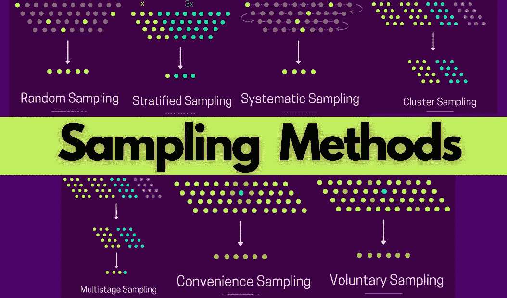
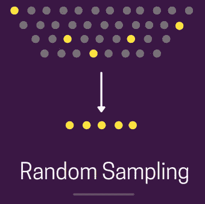
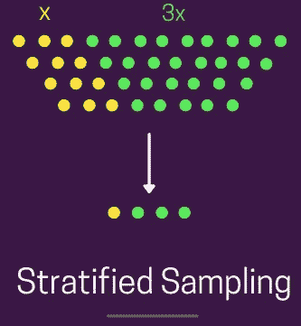
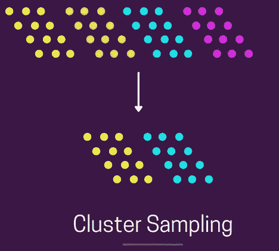
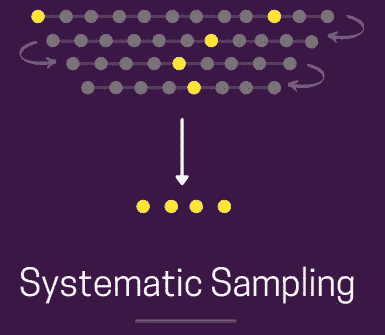
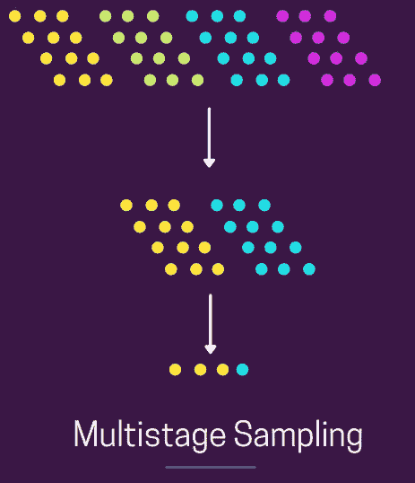
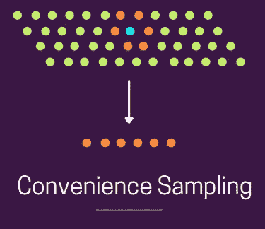
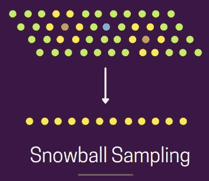

# 8 种取样技术

> 原文：<https://towardsdatascience.com/8-types-of-sampling-techniques-b21adcdd2124?source=collection_archive---------1----------------------->

## 了解采样方法(视觉和代码)



图片来自作者

**抽样**是从较大的总体中选择一个子集*(预定数量的观察值)*的过程。这是一种很常见的技术，我们进行实验并得出关于群体的结论，而不需要研究整个群体。在这篇博客中，我们将介绍两种采样方法:

1.  ***概率抽样****—这里我们选择一个基于概率论的样本。*
2.  ***非概率抽样*** *—这里我们根据非随机标准选择一个样本，并不是群体中的每个成员都有机会被包含在内。*


## 随意采样

在随机抽样的情况下，群体中的每一个成员被选中的概率都是相等的。*下图显示了相同的图示——所有点共同代表整个群体，其中每个点都有同等的机会被选中。*



随意采样

*您可以使用 python 实现它，如下所示—*

```
***import****random**population = 100* *data* ***=*** *range(population)**print(random.sample(data,5))
> 4, 19, 82, 45, 41*
```

## 分层抽样

在分层抽样中，我们根据一些共同的属性将整个人口分成子人口。*例如——典型的 ML 分类任务中的类标签。*然后，我们分别从这些组中随机抽样，这样**组仍然保持与它们在整个群体中相同的比例***。下图显示了相同的图形视图——我们有两个基于颜色的计数比率为 x 和 4x 的组，我们分别从黄色和绿色组中随机取样，并以这些组的相同比率代表最终组。*



分层抽样

使用 python sklearn lib 可以非常容易地实现它。如下图—

```
*from sklearn.model_selection import train_test_split

stratified_sample, _ = train_test_split(population, test_size=0.9, stratify=population[['label']])
print (stratified_sample)*
```

没有 lib 也可以实现它。， [*看这个*](https://www.statology.org/stratified-sampling-pandas/) *。*

## 巢式抽样法

在整群抽样中，我们**将整个人口划分为子群**，其中，每个子群都具有与总体相似的特征。此外，我们**随机选择整个子群**，而不是对个体进行抽样。*从下图中可以看出，我们有 4 个具有相似属性(大小和形状)的簇，我们随机选择两个簇并将其作为样本*。



巢式抽样法

现实生活中的例子——120 名学生分成 12 个小组进行一个共同的班级项目。像*(名称、类别、主题)*这样的聚类参数在这里也是相似的。

*你可以用 python 实现它，如下所示—*

```
*import numpy as np**clusters=5
pop_size = 100
sample_clusters=2**#assigning cluster ids sequentially from 1 to 5 on gap of 20
cluster_ids = np.repeat([range(1,clusters+1)], pop_size/clusters)**cluster_to_select = random.sample(set(cluster_ids), sample_clusters)**indexes* *= [i for i, x in enumerate(**cluster_ids**) if x in* *cluster_to_select**]**cluster_associated_elements = [el for idx, el in enumerate(range(1, 101)) if idx in indexes]**print (cluster_associated_elements)*
```

## 系统抽样

系统抽样是指以**规则的预定间隔** *(基本上是固定的和周期性的间隔)*从总体中抽取项目。*例如——每隔 5 个元素、21 个元素等等。一般来说，这种抽样方法比传统的随机抽样方法更有效。*下图显示了相同的图形视图——我们按顺序对第 9 个和第 7 个元素进行采样，然后重复这个模式。**



系统抽样

*您可以使用 python 实现它，如下所示—*

```
*population = 100
step = 5**sample = [element for element in range(1, population, step)]
print (sample)*
```

## **多级采样**

在多级采样下，我们**将多个采样方法**一个接一个的堆叠起来。例如，在第一阶段，可以使用聚类抽样从总体中选择聚类，然后我们可以执行随机抽样，从每个聚类中选择元素以形成最终集合。*下图显示了同一产品的示意图—*



多阶段取样

*你可以用 python 实现它，如下所示——*

```
*import numpy as np**clusters=5
pop_size = 100
sample_clusters=2
sample_size=5**#assigning cluster ids sequentially from 1 to 5 on gap of 20
cluster_ids = np.repeat([range(1,clusters+1)], pop_size/clusters)**cluster_to_select = random.sample(set(cluster_ids), sample_clusters)**indexes* *= [i for i, x in enumerate(**cluster_ids**) if x in* *cluster_to_select**]**cluster_associated_elements = [el for idx, el in enumerate(range(1, 101)) if idx in indexes]**print (random.sample(cluster_associated_elements, sample_size))*
```


## **方便取样**

在方便取样的情况下，研究人员只包括那些最容易接近并有时间参与研究的**个人。下图显示了相同的图示视图——蓝点是研究人员，橙点是橙色附近最容易接近的人群。**



方便抽样

## **自愿抽样**

在自愿抽样的情况下，感兴趣的人通常通过填写某种形式的调查表格来自己参与。这方面的一个很好的例子是 youtube 关于“你看过这些广告中的任何一个吗”的调查，最近这个调查显示了很多。在这里，进行调查的**研究员无权选择任何人**。*下图显示了相同的图示——蓝色圆点代表研究人员，橙色圆点代表自愿同意参与研究的人员。*


自愿抽样

## 滚雪球抽样

在滚雪球抽样中，通过其他参与者选择最终组，即研究人员要求其他已知联系人寻找愿意参与研究的人。*下图显示了相同的图示视图——蓝色圆点是研究人员，橙色圆点是(研究人员的)已知联系人，黄色圆点(橙色圆点的联系人)是准备参与研究的其他人。*



滚雪球抽样

> 此外，如果你对研究论文感兴趣，你可以查看我写的一些研究论文摘要。

我希望你喜欢读这篇文章。如果你愿意支持我成为一名作家，可以考虑注册[成为](https://prakhar-mishra.medium.com/membership)的媒体成员。每月只需 5 美元，你就可以无限制地使用 Medium

*所以，这就是我的博客。感谢您的宝贵时间！*