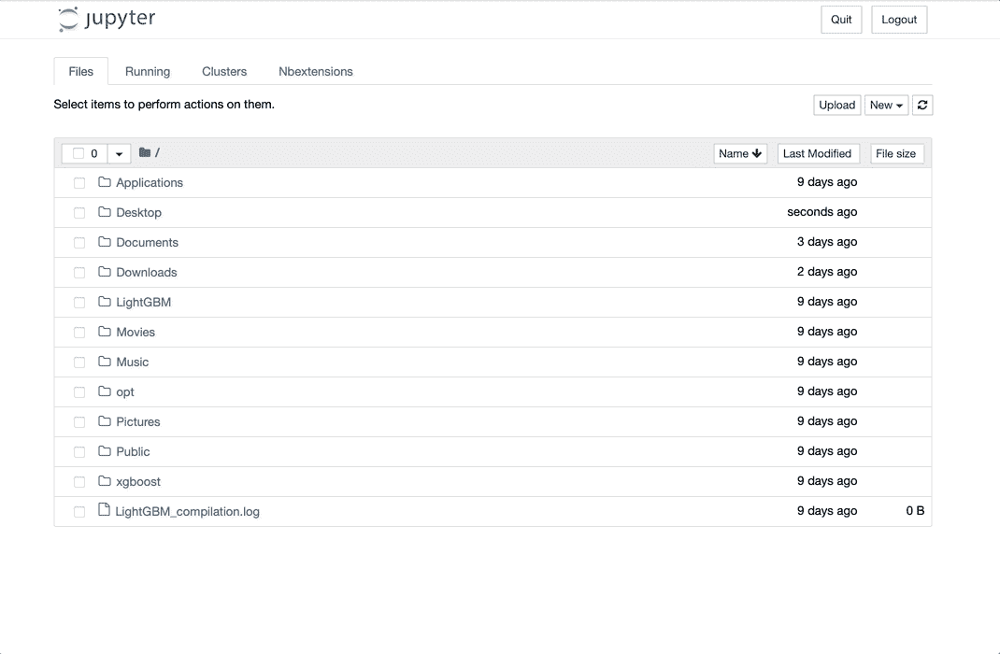
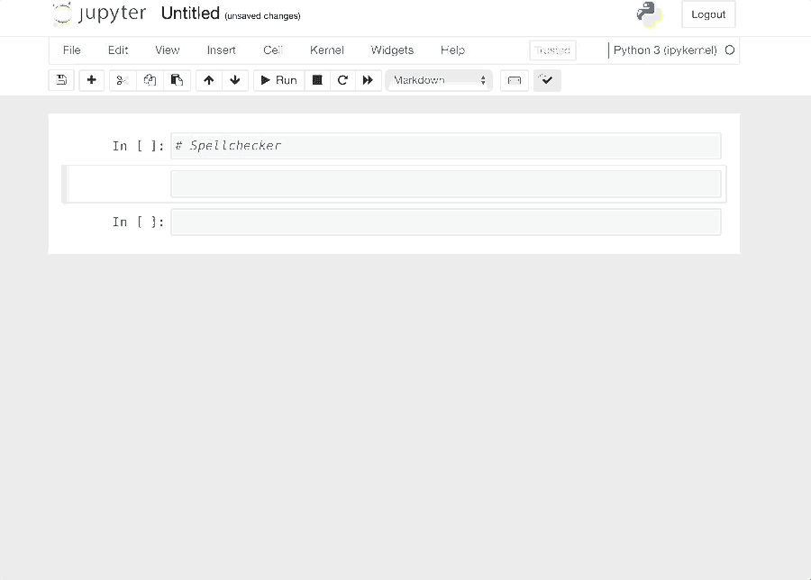
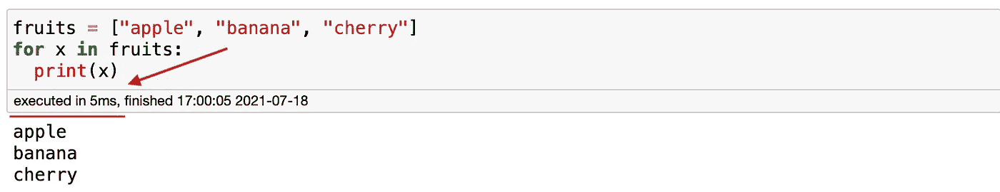
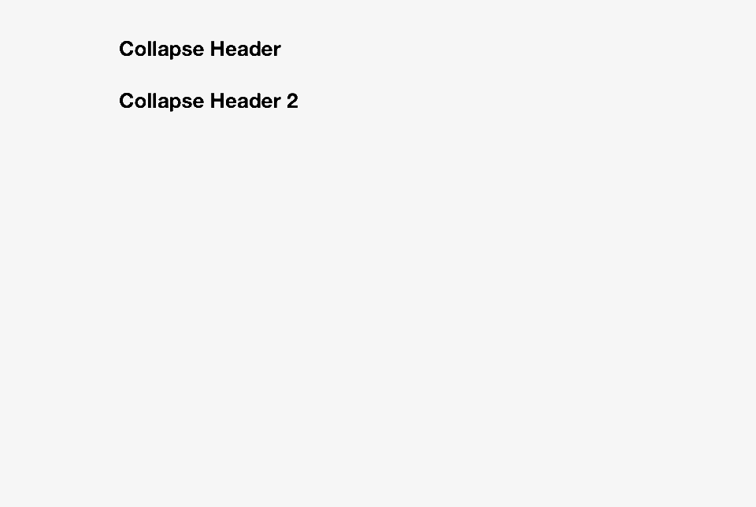
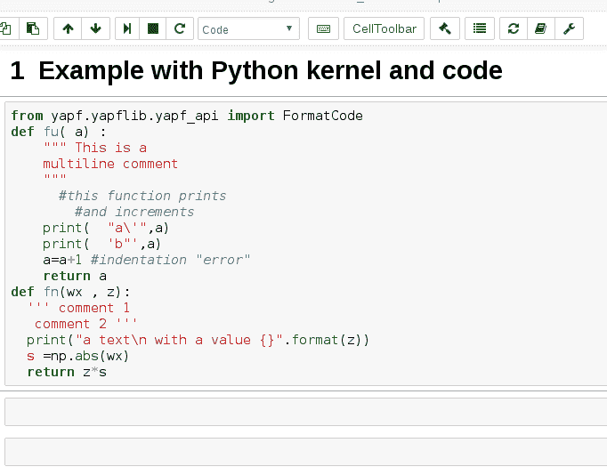
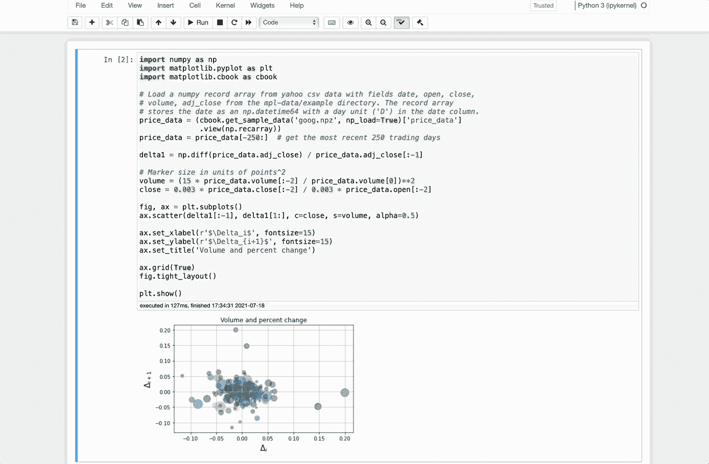
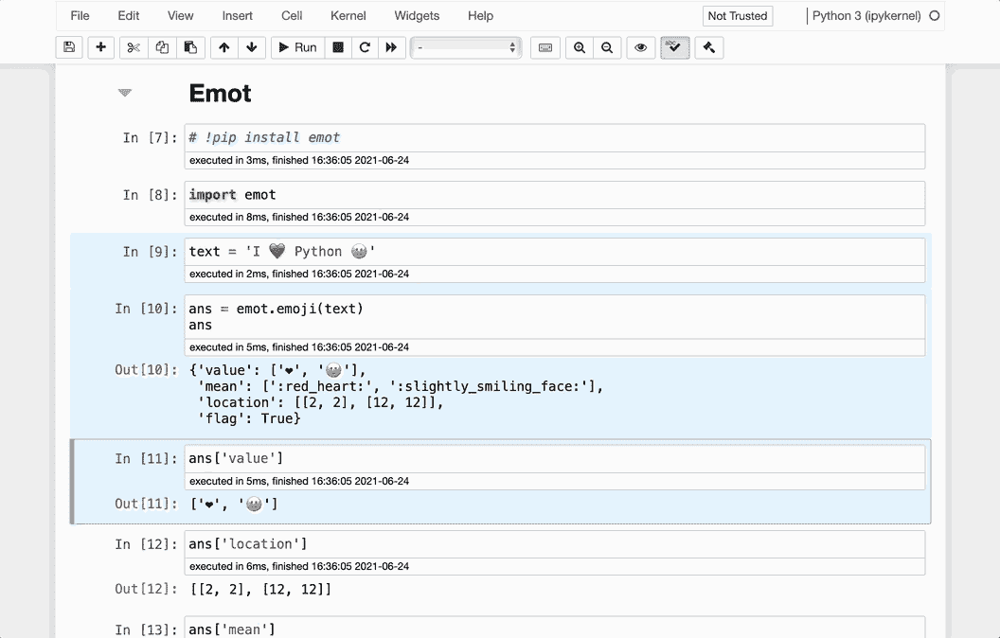
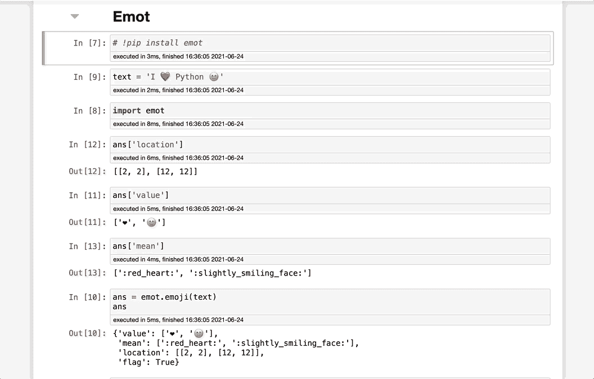

# 你应该尝试的 8 个有用的 Jupyter 笔记本扩展

> 原文：<https://towardsdatascience.com/8-useful-jupyter-notebook-extensions-that-you-should-try-out-24fbca302c04?source=collection_archive---------22----------------------->

## 大蟒

## 借助这些扩展，充分利用 Jupyter 笔记本电脑的优势


照片由[阿明·里莫尔迪](https://www.pexels.com/@armin-rimoldi?utm_content=attributionCopyText&utm_medium=referral&utm_source=pexels)从[派克斯](https://www.pexels.com/photo/cheerful-multiethnic-male-friends-using-laptop-in-green-park-5553954/?utm_content=attributionCopyText&utm_medium=referral&utm_source=pexels)拍摄

Python 库非常受欢迎，让我们的生活变得更容易，使用 Python 的一种流行方式是使用 Jupyter Notebook。尽管 Python 库很棒，但 Jupyter Notebook 提供了一些很棒的扩展，我强烈建议您尝试一下。今天，让我们来探索 8 个我最喜欢的扩展，它们会让你的生活变得更简单。

如果你正在阅读这篇文章，我相信你已经熟悉了 Jupyter 笔记本。如果你不是，下面是他们的网站对此的评论。

> Jupyter Notebook 是一个开源的 web 应用程序，允许您创建和共享包含实时代码、等式、可视化和叙述性文本的文档。用途包括:数据清理和转换、数值模拟、统计建模、数据可视化、机器学习等等。

# 装置

安装扩展只需要一行代码。只需在终端上键入以下代码，就可以开始了。

```
pip install jupyter_contrib_nbextensions && jupyter contrib nbextension install
```

现在，如果你在你的终端输入`jupyter notebook`，一旦屏幕加载，你会在顶部发现一个新的标签。只要点击`Nbextentions`，就会加载一个有多个选项的新屏幕。让我们探索其中的一些。



作者图片

# 拼写检查器

Jupyter Notebook 的一个好处是，你可以很容易地在上面批注。然而，它没有提供一个本地拼写检查器，语法上也不支持它。我在项目中看到过一些糟糕的错别字(包括我的)，如果他们使用了`spellchecker`，这些错别字本来是可以避免的。

幸运的是，扩展拼写检查器提供了一个解决方案。如果你犯了一个错别字，它会突出拼写错误的单词。不幸的是，它并没有告诉我们到底出了什么问题。然而，这总比没有好。要启用它，点击`Nbextensions`选项卡并选择`spellchecker`。



作者图片

# 执行时间

ExecuteTime 向我们展示了一个单元运行的时间。如果这是你关心的问题，那就方便了。在我看来，这对于机器学习是必不可少的，因为模型可能需要几个小时才能运行。你可以争辩说我们可以用 `%time` 来代替，但是 Jupyter Notebook 提供了更好的体验。要启用它，点击`Nbextensions`选项卡并选择`ExecuteTime`。



作者图片

# 可折叠标题

这个可以很好的帮助你整理你的笔记本。它会根据标题级别自动组织您的笔记本。如果您不需要查看部分代码，您可以隐藏它们，专注于您当前正在进行的工作。要启用它，点击`Nbextensions`选项卡并选择`Callapsible Headings`。



作者图片

# **代码美化**

我见过的被人们忽视的最常见的 Python 最佳实践之一是让 Python 代码变得美观易读。当我们没有使用适当的间距时，我们的代码会看起来杂乱无章。即使它完美地工作，一些人可能仅仅因为你的代码的样子就认为你不是一个好的程序员。

Code Prettify 的作用和它暗示的一样:它让混乱的代码看起来更好。一键点击，瞧。如果你是一个在输入代码时不经常使用空格的人，这个扩展会很方便

Code Prettify 的作用和它暗示的一样:它让混乱的代码看起来更好。一键点击，瞧。你的代码看起来会更好，更容易阅读。要启用它，点击`Nbextensions`选项卡并选择`Code prettify`。



图片由 ipython-contrib 提供。[来源。](https://github.com/ipython-contrib/jupyter_contrib_nbextensions/blob/master/src/jupyter_contrib_nbextensions/nbextensions/code_prettify/README_code_prettify.md)

# **腹地**

如果你像我一样，在记忆一些必要的代码方面有问题，那么 background 也非常方便。你需要做的就是开始输入，它会根据你输入的字母向你建议一些选项。要启用它，点击`Nbextensions`选项卡并选择`Hinterland`。


作者图片

# 隐藏所有输入

这个扩展隐藏了代码，这样您就可以专注于图形和输出。当我在 Jupyter 笔记本上交付一个项目时，我才明白它的实用性，而观众并不太懂技术。他们只分析图表，不分析代码。要启用它，点击`Nbextensions`选项卡并选择`Hide input all`。



作者图片

# 移动选定的单元格

移动选中的单元格是这个列表中最有用的扩展之一。顾名思义，你可以移动多个单元格。我数不清有多少次我想移动几个细胞，我不得不一个接一个地做。如果我以前知道的话，这个延长会节省我几分钟的时间。

要选择多个单元格，需要按`alt + up`或`alt + down`。要启用它，点击`Nbextensionstab`并选择`Move selected cells`。



作者图片

# 橡皮带

你认为上面的扩展对你来说不够好吗？然后橡皮筋会完成这项工作。橡皮筋通过按住`Shift`并用鼠标选择来帮助你选择单元格。唯一的缺点是，一旦你移动单元格，橡皮筋将取消选择它们。因此，您只能移动选定的单元格一次。要启用它，点击`Nbextensions`选项卡并选择`Rubberband`。



# 最后的想法

Python 库非常酷，但是很多人忽略扩展是事实。扩展可以帮助我们更有效地完成项目。有几十种扩展可供您使用，我强烈建议您阅读每一种。有些可能对我没用，但对你可能有好处。找出答案的最好方法是尝试。

让我知道你喜欢哪些扩展或者我应该在这里提到的任何扩展。编码快乐！