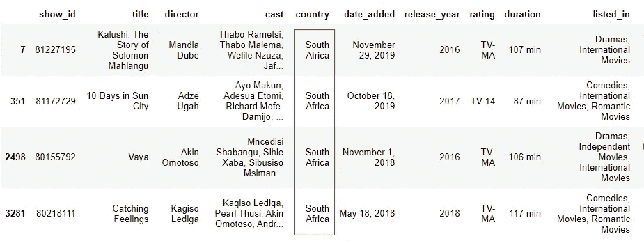

# 以 8 种方式通过部分字符串或模式过滤熊猫数据帧

> 原文：<https://towardsdatascience.com/8-ways-to-filter-a-pandas-dataframe-by-a-partial-string-or-pattern-49f43279c50f?source=collection_archive---------1----------------------->

## 如何检查数据帧并只返回所需的行


照片由 [**毛里西奥·马斯卡罗**](https://www.pexels.com/@maumascaro?utm_content=attributionCopyText&utm_medium=referral&utm_source=pexels) 拍摄自 [**Pexels**](https://www.pexels.com/photo/person-holding-magnifying-glass-712786/?utm_content=attributionCopyText&utm_medium=referral&utm_source=pexels)

过滤数据帧是指检查其内容并只返回符合特定标准的内容。这是被称为[数据争论](https://en.wikipedia.org/wiki/Data_wrangling)的数据分析任务的一部分，使用 Python 的[熊猫](https://pandas.pydata.org/docs/)库可以有效地完成。

这个想法是，一旦你过滤了这些数据，你就可以单独地分析它们，获得对这个组来说可能是独特的见解，并告知项目向前发展的预测建模步骤。

在本文中，我们将使用`Series.[isin()](https://pandas.pydata.org/docs/reference/api/pandas.Series.isin.html)`和`Series.str.[contains()](https://pandas.pydata.org/docs/reference/api/pandas.Series.str.contains.html)`等函数来过滤数据。我尽量少用`apply()`和`Lambda`函数，它们使用了更多的代码，让包括我在内的许多人感到困惑。但是，我将解释代码并包含相关文章的链接。

我们将使用来自 Kaggle 的[网飞数据集](https://www.kaggle.com/shivamb/netflix-shows)，其中包含电视节目和电影的详细信息，包括`title`、`director`、`cast`、上映日期`rating`、`year` 和`duration`。现在让我们导入所需的库并将数据集加载到 Jupyter 笔记本中。

```
import pandas as pddata = pd.read_csv('netflix_titles_nov_2019.csv')data.head()
```


作者的网飞数据框架

## 1.筛选与列中给定字符串匹配的行

这里，我们希望根据特定列的内容进行过滤。我们将使用 Pandas 的`Series.isin([list_of_values] )`函数，它为列中*与*完全匹配的每个元素返回一个`True` 的“掩码”,如果它与`isin()`函数中的任何列表值都不匹配，则返回`False`。请注意，即使只有一个值，也必须始终将这些值放在方括号中。

```
mask = data['type'].isin(['TV Show'])#display the mask
mask.head()
```


作者图片

然后我们将这个掩码应用于整个数据帧，返回条件为`True`的行。请注意，上面掩码为`True`的索引位置是下面过滤后的数据帧中唯一返回的行。

```
#Display first 5 rows 
#of the filtered datadata[mask].head()
```


**注:** `df.loc[mask]`生成的结果与`df[mask]`相同。当您想要选择几列来显示时，这尤其有用。

```
data.loc[mask, ['title','country','duration']]
```


作者图片

生成上述遮罩的其他方式；

*   如果您不想在`isin()`函数中处理大写字母和小写字母的混合，首先将该列的所有元素转换成小写字母。

```
mask = data['type'].str.lower().isin(['tv show'])
```

*   我们还可以使用==相等运算符来比较两个对象是否相同。这将比较列中的每个元素是否等于所提供的字符串。

```
mask = (data['type'] == 'TV Show')
```

*   我们可以提供一个类似于`isin([‘str1’,’str2'])`的字符串列表，并检查一个列的元素是否匹配其中的任何一个。下面的两个掩码返回相同的结果。

```
mask = data[’type’].isin([’Movie’,’TV Show’])#ormask = (data[’type’] == 'Movie’) | (data[’type’] == 'TV Show’)
```

返回的掩码将全部为 Trues，因为“类型”列只包含“电影”和“电视节目”类别。

## 2.筛选存在部分字符串的行

这里，我们想检查一个列中是否存在子字符串。

例如，`‘listed-in’`列包含每部电影或节目所属的流派，用逗号分隔。我想过滤并只返回那些有“恐怖”元素的，因为现在万圣节就要到了。

我们将使用字符串方法`Series.str.contains(‘pattern’, case=False, na=False)`，其中`‘pattern’`是要搜索的子字符串，而`case=False`表示不区分大小写。`na=False`表示列中的任何`NaN`值都将返回 False(表示没有模式),而不是从掩码中删除布尔身份的`NaN`。

```
mask = data['listed_in'].str.contains('horror', case=False, na=False)
```

然后，我们将对数据应用掩码，并显示过滤后的数据帧的三个样本行。

```
data[mask].sample(3)
```


作者图片

其他示例:

*   我们还可以检查列中是否存在符号。例如，`‘cast’`列包含由逗号分隔的参与者，我们可以检查只有一个参与者的行。这是通过用逗号(，)检查行，然后使用波浪号(~)对数据应用过滤掩码来否定语句。

```
mask = data['cast'].str.contains(',', na=False)data[~mask].head()
```


作者图片

但是现在这些结果有了`NaNs`,因为我们使用了`na=False`,波浪号返回掩码为假的所有行。我们将使用`[df.dropna](https://pandas.pydata.org/docs/reference/api/pandas.DataFrame.dropna.html)(axis=0, subset=’cast)`对数据进行过滤。我们使用`axis=0`来表示行方式，因为我们希望删除行而不是列。`subset=[‘cast’]`仅检查该列的`NaNs`。

```
data[~mask].dropna(axis=0, subset=['cast'])
```


作者图片

**注意:**要检查特殊字符，如`+`或`^`，使用`regex=False`(默认为`True`)，这样所有字符都被解释为普通字符串，而不是正则表达式模式。您也可以使用反斜杠转义字符。

```
df['a'].str.contains('^', regex=False)#ordf['a'].str.contains('\^')
```

## 3.使用两个部分字符串中的任意一个(OR)筛选行

您可以检查是否存在任何两个*或*以上的字符串，如果存在任何字符串，则返回`True`。

让我们看看“恐怖片”或“单口喜剧”来补充每次观看后的情绪状态。

我们使用`str.contains()`并传递由竖线(|)分隔的两个字符串，竖线表示“或”。

```
pattern = 'horror|stand-up'mask = data[’listed_in’].str.contains(pattern, case=False, na=False)data[mask].sample(3)
```


作者图片

*   我们也可以使用长格式，创建两个掩码，并使用`|`将它们传递到我们的数据中。


作者图片

**注意:**您可以创建许多掩码，并使用符号`|`或`&`将它们传递到数据中。`&`表示当*两个*掩码都为真时组合掩码并返回`True`，而`|`表示当*任意一个*掩码为`True`时返回真。

```
mask1 = (data['listed_in'].str.contains('horror', case=False, na=False))mask2 = (data['type'].isin(['TV Show']))data[mask1 & mask2].head(3)
```


按作者筛选的数据框架

## 4.过滤两个字符串都存在的行(AND)

有时，我们希望检查一列的元素中是否出现了多个子字符串。

在这个例子中，我们将搜索在美国和墨西哥拍摄的电影。

*   代码`str.contains('str1.*str2')`使用符号`.*`来搜索两个字符串是否严格按照顺序出现*，其中`str1`必须首先出现以返回 True。*

```
pattern = 'states.*mexico'mask = data['country'].str.contains(pattern, case=False, na=False)data[mask].head()
```


作者图片

请注意,“美国”总是首先出现在筛选的行中。

*   在顺序不重要的情况下(墨西哥可以出现在一行中的第一个)，使用`str.contains('str1.*str2|str2.*str1').`。`|`表示“返回`str1`最先出现的行，或者`str2`最先出现的行”。

```
pattern = 'states.*mexico|mexico.*states'mask = data['country'].str.contains(pattern, case=False, na=False)data[mask].head()
```


作者图片

请看“墨西哥”如何出现在第四行的第一个位置。

*   您还可以为每个国家创建一个掩码，然后使用`&`符号将掩码传递到数据中。下面的代码显示了与上面相同的数据帧。

```
mask1 = (data['country'].str.contains('states', case=False, na=False)) 
mask2 = (data['country'].str.contains('mexico', case=False, na=False))data[mask1 & mask2].head()
```

## 5.筛选特定列中带有数字的行

我们可能还想使用 regex 模式`‘[0–9]’`检查列中的数字。代码看起来像`str.contains(‘[0–9]’)`。

在下一个示例中，我们希望检查年龄等级，并返回破折号后的特定年龄，如`TV-14, PG-13, NC-17`，而忽略`TV-Y7`和`TV-Y7-FV`。因此，我们在数字模式前添加一个破折号(-)。

```
pattern = '-[0-9]'mask = data['rating'].str.contains(pattern, na=False)

data[mask].sample(3)
```


作者图片

## 6.筛选部分字符串出现在多列中的行

我们可以检查子字符串出现在两个或更多给定列中的行。

*   例如，让我们检查“tv”在三列(`‘rating’,’listed_in’`和`’type’`)中的存在，并返回它在所有中存在的行。最简单的方法是为特定的列创建三个掩码，并使用表示“and”的符号`&`过滤数据(如果至少在一列中，使用| symbol 返回 True)。

```
mask1 = data['rating'].str.contains('tv', case=False, na=False)mask2 = data['listed_in'].str.contains('tv', case=False, na=False)mask3 = data['type'].str.contains('tv', case=False, na=False)data[mask1 & mask2 & mask3].head()
```


作者图片

请查看“tv”是如何出现在上面经过筛选的数据的所有三列中的。

*   另一种方法是使用稍微复杂的 apply()和 Lambda 函数。阅读文章 [Lambda 函数和 Python](/lambda-functions-with-practical-examples-in-python-45934f3653a8?source=your_stories_page-------------------------------------) 中的实际例子，了解这两个函数是如何工作的。

```
cols_to_check = ['rating','listed_in','type']pattern = 'tv'mask = data[cols_to_check].apply(
        lambda col:col.str.contains(
        pattern, na=False, case=False)).all(axis=1)
```

上面的掩码代码表示，对于列表中的每一列`cols_to_check`，应用`str.contains('tv')`函数。然后使用`.all(axis=1)`将三个掩码合并成一个掩码(或列)，方法是为每一行返回`True`，其中*所有*列都是`True`。(使用`.any()`返回`True`表示出现在至少一列中)。


熊猫。所有()和。作者的任何()

过滤后的数据帧与之前显示的数据帧相同。

## 7.筛选一列中的值出现在另一列中的行。

我们可以检查一列中的值是否作为部分字符串出现在另一列中。

使用我们的网飞数据集，让我们检查一下`‘director’`作为演员也出现在`‘cast’`中的行。

在这个例子中，我们将使用`df.apply()`、`lambda`和`['in’](https://www.w3schools.com/python/ref_keyword_in.asp)`关键字来检查某个值是否出现在给定的字符串序列中。

```
mask = data.apply(
    lambda x: str(x[’director’]) in str(x[’cast’]), 
    axis=1)
```

上面的`[df.apply()](https://www.datacamp.com/community/tutorials/pandas-apply)`有一个 lambda 函数，它表示对于每一行(x)，检查`‘director’` 中的值是否出现在`‘cast’`列中，并返回`True`或`False`。我用`str()`包装这些列，将每个值转换成一个字符串，因为它可能因为`NaNs`而引发了一个`[TypeError](https://www.geeksforgeeks.org/handling-typeerror-exception-in-python/)` 。我们使用`axis=1`来表示列方式，因此对每一行进行操作，结果将是一列(或系列)。

```
data[mask].head()
```


作者应用()后的 NaNs

哎呦！`NaNs`真多。让我们使用导演栏作为`subset`来删除[和](https://pandas.pydata.org/docs/reference/api/pandas.DataFrame.dropna.html)并重新显示。

```
data[mask].dropna(subset=['director'])
```


导演由作者出演

关于检查一列中的值是否与另一列中的值匹配的其他方法，请阅读本文。

## 8.检查给定子字符串的列名(或索引值)

我们可以检查列标题中是否存在部分字符串，并返回这些列。

***过滤列名***

*   在下面的例子中，我们将使用`[df.filter](https://pandas.pydata.org/docs/reference/api/pandas.DataFrame.filter.html)(like=pattern, axis=1)`返回具有给定模式的列名。我们也可以用`axis=columns`。请注意，这将返回过滤后的数据，并且不会生成掩码。

```
data.filter(like='in', axis=1)
```


带有“in”子字符串的已筛选列名

*   我们也可以使用`df.loc`,在这里我们显示所有的行，但是只显示带有给定子字符串的列。

```
data.loc[:, data.columns.str.contains('in')]
```

这段代码生成的结果和上面的图片一样。阅读[这篇](/8-pandas-functionalities-for-every-data-scientist-f2cd3d890795)文章，了解`.loc`如何工作。

***按指标值过滤***

让我们先把标题设为索引，然后按‘爱’字过滤。我们将使用与上面相同的方法，只是稍作调整。

使用`df.filter(like=’Love’, axis=0)`。我们也可以用`axis=index`。

```
df = data.set_index('title')df.filter(like='Love', axis=0)
```


用“爱”过滤索引

使用`df.loc[]`显示与上述相同的结果。这里，我们在`[.loc](/8-pandas-functionalities-for-every-data-scientist-f2cd3d890795)` 的第一部分选择所需的行，并在第二部分返回所有列。

```
df.loc[df.index.str.contains('Love'), :]
```

## 其他过滤方法

*   **使用熊猫查询()函数**

这是 SQL 忍者特别青睐的一种数据过滤方式。语法是`df.query(‘expression’)`，结果是一个修改的数据帧。很酷的一点是，除了像前面那样按单个列进行过滤之外，您还可以引用一个局部变量，并在表达式中调用 mean()之类的方法。它还提供了其他复杂遮罩的性能优势。

```
#Example
data.query('country == "South Africa"')
```



按作者筛选查询

我自己很少使用这种方法，但是很多人觉得它更简单，可读性更好。我鼓励你探索更多，因为它有令人信服的优势。[这篇](https://www.dataindependent.com/pandas/pandas-query/)和[这篇](https://sparrow.dev/pandas-query/)文章是一个很好的起点。

*   **使用其他字符串(Series.str .)示例函数**

这些方法还可以过滤数据以返回掩码

*   `Series.str.len() > 10`
*   `Series.str.startswith(‘Nov’)`
*   `Series.str.endswith(‘2019’)`
*   `Series.str.isnumeric()`
*   `Series.str.isupper()`
*   `Series.str.islower()`

## 结论

作为一名数据专家，您可能经常需要根据数据的内容来分离数据。在本文中，我们研究了通过列中的字符串值过滤数据帧的 8 种方法。我们使用了熊猫、`Lambda`函数和`‘in’`关键字。我们还使用了|和&符号，以及波浪号(~)来否定一个语句。

我们知道这些函数返回一个掩码(一列)的`True`和`False`值。然后，我们使用方括号(如`df[mask]`)或使用。类似`df.loc[mask]`的锁定功能。你可以从 Github 下载完整的代码[。](https://github.com/suemnjeri/Filtering-a-DataFrame/blob/master/filtering%20a%20dataframe%20by%20strings%20or%20patterns.ipynb)

我希望你喜欢这篇文章。每当我发表新的文章时，想要收到更多这样的文章，请在这里订阅。如果你还不是一个媒体成员，并且愿意支持我成为一个作家，请点击[这个链接](https://medium.com/@suemnjeri/membership)，我将获得一小笔佣金。感谢您的阅读！

## 参考

[筛选熊猫数据帧的 10 种方法](https://www.listendata.com/2019/07/how-to-filter-pandas-dataframe.html)

[Python 熊猫字符串操作——处理文本数据](https://www.tutorialspoint.com/python_pandas/python_pandas_working_with_text_data.htm)

[从熊猫数据帧中选择部分字符串](https://stackoverflow.com/questions/11350770/select-by-partial-string-from-a-pandas-dataframe)