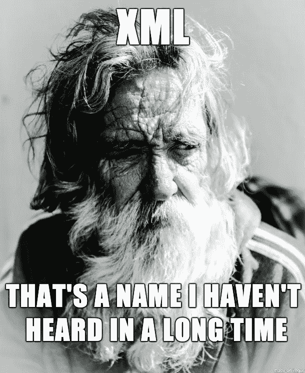
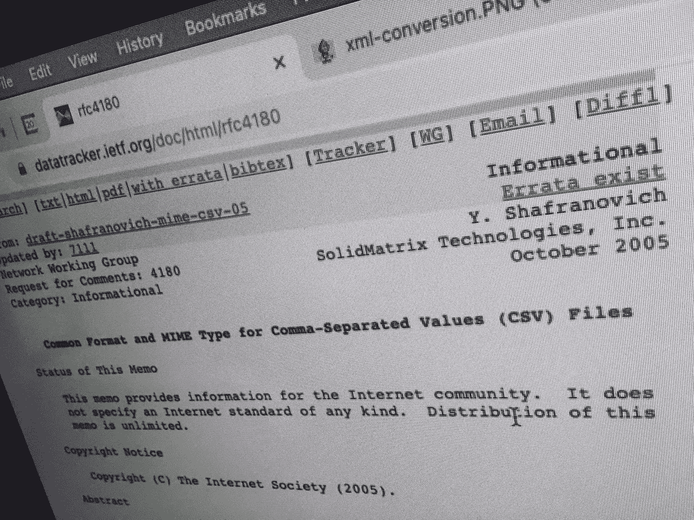

# 8 种严重混淆数据的方法——而你自己却不知道

> 原文：<https://towardsdatascience.com/8-ways-to-royally-flummox-your-data-and-not-even-know-it-29172349e55e?source=collection_archive---------27----------------------->

## [业内笔记](https://towardsdatascience.com/tagged/notes-from-industry)

## 您和您的数据可能会发现自己的尴尬处境


雅各布·罗森在 [Unsplash](https://unsplash.com/s/visual/8ebf1a31-7a7e-41b7-9155-36686cd5fa52?utm_source=unsplash&utm_medium=referral&utm_content=creditCopyText) 上的照片——由[劳伦·普雷兹比](https://www.linkedin.com/in/lauren-prezby-59b24614/)潦草地写出脏话

有多少次你偶然发现了一个大规模的数据质量问题，而这个问题几个月都没有被发现，或者直到最糟糕的时候才被发现？作为一名为一些知名政府和行业客户构建分析的专业大数据工程师，我不认为我可以公开承认我有多少次。

我承认，清理数据库真的很糟糕。如果你是那个被键盘卡住的可怜人，你必须在你的头脑中逆向工程你的整个管道。"这些数据究竟是怎么得到的？"“如果我……修好它会怎么样？哦，是的……如果不彻底毁掉那边的另一个东西，那就不行了。”“如果我用整个周末的时间在客户不使用系统的情况下解决所有这些问题，问题会在周一再次出现吗？”“为什么我们的实施团队没有抓住这一点？”“客户读过我们的数据规格吗？”只要有足够的时间和努力，并为自己犯下的可耻错误向客户道歉，你几乎总能控制住局面，但这一点也不好玩。

# 数据灾难 1:完整性灾难

作为一名软件工程师，您可能有过的最可爱、最聪明的想法之一是基于其他字段的散列为一个事件创建一个唯一的 ID。不能相信时间戳是唯一的？用用户名散列那个混蛋。如果用户可能同时做两件事——添加一个源属性。所以现在你的 ID 有点像`HASH(timestamp + username + source)`。这应该可以了。

你最好检查一下，确保`timestamp`、`username`、`source`100%完整(也就是没有`null`数据)。否则，您会发现每个系统帐户操作(碰巧有`null`用户名，可能每秒钟发生多次)或可能散列到同一个 ID，导致覆盖和可跟踪性的损失。如果数据没有时间戳，那么您现在就真的完成了——祝您好运解开这个混乱。

# **数据灾难 2:覆盖阴影**

你是否曾经在搜索框中输入一个查询，却没有找到你想要的东西？无论是谷歌搜索返回给你一个来自城市词典的不合理的结果，还是 giphy 查询返回一些真正奇怪的东西，你都直接或通过 API 与一个你无法预测的数据库进行了交互。


JOSHUA COLEMAN 在 [Unsplash](https://unsplash.com/s/photos/bizarre?utm_source=unsplash&utm_medium=referral&utm_content=creditCopyText) 上拍摄的照片

除了随机查询，你可能写的一个典型的数据库查询是“给我昨天的所有数据”，然后你将通过你的日常分析运行它。这个查询可能看起来非常简单，确实如此，但是如果您不完全理解数据是如何填充的，您可能会错过一些东西。

```
select * from  LOG_TABLE where LOG_TIME >=`2021–09–09` AND LOG_TIME < `2021–09–10`
```

例如，假设这个系统正在从一个分布式系统中聚集日志。在该系统中，有些设备始终保持连接并传输数据，而其他设备有时会断开连接或在报告时有某种延迟(例如，手机只有在连接到 wifi 时才会共享数据)。您可能没有意识到 LOG_TIME 是源事件发生的时间，而不是数据加载到数据库的时间。

这导致了以下顺序:(1)日志事件发生(2)数据库查询发生(3)日志事件加载到数据库中。在您阅读文档之后，您可能会意识到您应该查询以获得所有结果的字段是 LOG_DX_EVENT_TIME。

> 咄！

希望您将要编写并交付给客户的三年回填查询不会引发太多关于您可能错过了什么的问题。但是，这是你现在必须为 100%的数据覆盖率付出的代价。

# **数据灾难 3:整合异常**

我在一个有趣的时代开始了我的职业生涯，网络服务革命，所有的数据交换都将通过自我描述的 XML 来促进，这些 XML 遵循由本体学家联盟定义的崇高标准。XML 不仅产生了像 AJAX 和 SAX 这样有趣的名字，还意味着我们再也不用处理定义松散的逗号分隔的文本文件，以及选择分隔符和转义引用字符串带来的所有麻烦。幸运的是，现在唯一使用 CSV 的人…绝对吓坏了所有人。



由[唐纳德·提尔](https://unsplash.com/@epartner?utm_source=unsplash&utm_medium=referral&utm_content=creditCopyText)在 [Unsplash](https://unsplash.com/s/photos/old-man?utm_source=unsplash&utm_medium=referral&utm_content=creditCopyText) 上拍摄的照片

好吧，所以我们至少在下一个永恒中被 CSV 困住了，现在我们需要想出如何应对。父母们，一旦你们觉得你们的孩子已经准备好阅读章节书籍，请阅读它们。这是很好的夜间阅读，肯定能诱导睡眠，同时帮助你的孩子在平面文件输出的可怕世界中导航。



作者照片

对于那些不明白的人，我说的是这个。让我们假设您有一个从您最喜欢的数据库导出的表。(MSSQL Server 可能是我个人最喜欢的创建 janky CSV 输出的工具。)

```
Record ID,Name,Role,Home Address
1,Dan,Software Engineering Director,[Qualytics](https://qualytics.co/?utm_source=TDS.Blog&utm_medium=blog&utm_campaign=TDSblogDD9.21.21&utm_id=TDSblogDD9.21.21) Field Office 3
2,Sam,Asst. to the "Dir, SW Engineering",321 Cowboy Commit Ln. Baltimore MD
```

现在你做到了。由于额外的逗号和缺少正确的引用，记录 2 要么会破坏您的系统，要么会给出五列，这取决于您的错误处理。不管是哪种情况，Sam 现在居住在软件工程深渊的某个地方，远离他在 Cowboy Commit Ln 的甜蜜的家。

老实说，XML 也有很多一致性问题，JSON 也不是完美的，但是我敢打赌，如果你知道去哪里找，你会在你的 CSV 数据中找到各种各样的一致性问题。

# **数据灾难 MUD 的一致性**

突击测验，你能找出这两个日期之间的三个不同点吗？

```
2021–09–10T6:10:54 and 2021–09–10T10:10:54.0Z
```

你猜怎么着，它们代表了我写这篇文章前 12 个小时完全相同的时间。然而，假设您的客户最近加入了一个新的团队成员，他没有花几天或几周的时间来学习 Java 时间格式表达式的细微差别。他们可能会忽略东部时间上午 6 点(与 UTC 时间上午 10 点相同)应该表示为 06。或者，他们可能不知道 Z 代表祖鲁，这是本初子午线的航空术语，恰好是我们在皇家格林威治天文台的朋友的当地时间。甚至不要让我开始谈论 0.0 和你可以忍受的 0.0 秒的痛苦。


希瑟·扎布里斯基在 [Unsplash](https://unsplash.com/s/photos/clocks?utm_source=unsplash&utm_medium=referral&utm_content=creditCopyText) 上拍摄的照片

为什么我们要如此详细地讨论日期格式？我曾经有客户在他们当地时间的末尾加了一个“Z ”,因为我们的规范说应该有一个。客户交付的数据在上午 6 点和下午 6 点的时间戳之间完全没有差异。我见过在凌晨 1 点到 10 点之间丢弃所有数据的系统，因为“6 应该是 06”的问题。

顺便说一句，除非你在夏威夷、亚利桑那或委内瑞拉，否则有一种东西叫做夏令时。大约在[圆周率日](https://www.wolframalpha.com/input/?i=days+between+%22pi+day%22+and+%22last+daylight+saving+shift%22)的某个时候，你可能会意识到你的系统一直配置错误。是时候拿出你的旧的时移再处理脚本，在公司日历上安排一些停机时间了。

无论您在哪里发现日期/时间格式或配置问题，您都会发现每个系统之间缺乏数据一致性。分析系统中的事件可能在它们实际发生时的几个小时之前被表示出来。祝您在与最终用户的支持电话中解释这一点时好运。

# **数据灾难 5:重复复制**

上周一，一切都太棒了。您的团队刚刚实现了新的年度经常性收入(ARR)目标，并完成了一个重要的新里程碑。你的柱形图高高耸立，让区分赢家和输家的虚线黯然失色。你在每周全体会议上自豪地宣布了团队的优秀，并祝贺每个人和他们亲爱的母亲给这个世界带来了快乐。你首先倒了一杯威士忌，向公司创始人敬酒，感谢所有给你机会领导这个神奇团队的人。


ID [173831557](https://www.dreamstime.com/red-epic-w-happy-young-black-businessman-celebrating-birthday-office-workplace-party-confetti-slow-motion-helium-cinema-image173831557) [瓦迪姆·克鲁奇尼克](https://www.dreamstime.com/vadimkey_info)|[Dreamstime.com](http://dreamstime.com/)

现在距离周一的会议还有 20 分钟，你刚刚意识到…一个大客户的销售合同条款搞砸了你的进口，包括上季度和本季度的全部收入数字。你的累计总和离*还差得很远*——你现在远未达到目标，而且情况看起来根本不可能在本季度达到你的数字。

你现在打算做什么？承认错误？把销售助理扔到公共汽车下面？修好它，希望没人注意到？归咎于报告工具的小故障？明天修好，下周一走？这些都是有趣的选择(除了坦白)，但它们都伴随着你的替代者必须处理的后果。下次你也许应该检查你的数据是否重复。

# **数据灾难 6:时效性不佳**

对于您的最终用户 Martha 来说，这是一个美好的早晨，她的早晨通勤没有交通堵塞，自动咖啡机充满了水，没有咖啡渣，她的计算机不到 10 分钟就启动了。她已经准备好去度过她整个职业生涯中最有成效的一天。

玛莎导航到您的 web 应用程序。

> "没有新的通知。"

好吧，我想是时候去抖音了。

事实是…流入你系统的数据错过了截止窗口。由于客户应用程序数据库的软件升级，自动提取被延迟到早上。转换和加载逻辑努力等待提取。然而，您的分析在午夜运行，因为它总是这样，以避免大量的数据库使用。没有新数据，没有新警报。玛莎没有工作。

值班人员在早上 6 点得到了没有警报的消息，但是他们正在处理 CSV 格式的问题。当客户数据库管理员记得手动执行提取时，数据在上午 9 点交付……当随叫随到人员查看页面时，数据已经在那里——根据随叫随到人员的不同，问题要么会一直上报给 CEO，要么会被忽略。

希望您的系统足够智能，能够在新数据到达时触发，或者在几天后处理这些不合时宜的数据问题。玛莎明天会很忙。

# **数据灾难 7:体积悖论**

你曾经写过一个你真的真的不会错过任何信息的软件吗？假设这是一个访问控制系统，员工每次进出安全实验室使用计算机时，都必须在读卡器中扫描他们的徽章。如果没有，您的软件将在一天结束时检查日志，并确定存在安全违规。第二天，一名保安和他们友好的“人员问题”团队的一名成员将拜访已确定身份的员工，与他们聊天。

如果有一天“人的问题”的人打电话给你，系统所有者，问你是否绝对确定有 10 倍多的人溜进了那个实验室，而几乎同样多的登记用户却无处可寻，那该怎么办？他们说他们已经面试了三个人，并发誓他们登录正确。你看看你的报告——昨天确实有很多违规者——也许他们在集体烧烤时喝多了。或者等等……为什么从 5:30 到 6:00 没有出入卡。


照片 [225456464](https://www.dreamstime.com/serious-businessman-employer-hr-holding-cv-listening-applicant-job-interview-focused-mature-client-contract-manager-image225456464) [暗黑 1 自己](https://www.dreamstime.com/dark1elf_info)|【Dreamstime.com】T4

嗯，事实证明，在那段时间有一个系统重新部署。队列中的消息肯定已经丢失。没有人会注意到，因为它是在你慢慢放松的门槛内，以解释常规的星期五逃学。但是……对于周三来说，这是相当少的交通流量。

这是一个非常真实的例子，说明不成熟的容量检查会让数据质量问题渗透到您的系统中，并引发一系列问题，使您的用户，最终是您的团队陷入困境。

# **数据灾难 8:准确性灾难**

你可能在最近的新闻中听说过，这是真的，地球不是圆的。我是认真的——不是圆的。甚至不是扁球体。有时候这里非常平坦，有很多海龟。

好的，实际上地球是一个大地水准面，一个不规则形状的凸起。这就引出了一个问题，“你现在有多高？”不，这不是一个关于你是如何在博客的结尾提到数据质量的问题。这是合法的。你的海拔高度是多少？让我看看你的遥测数据。

想象一下，你有一架可爱的新无人驾驶相机，你想精确定位你在拍摄照片的那一侧山上的确切位置。要做到这一点，你需要相机的方向和角度，加上车辆遥测，加上[数学](https://gis.stackexchange.com/questions/163784/map-projection-process-for-three-dimensional-point-cloud)，以获得空中自拍的准确坐标。你不仅需要无人机相对于地面的高度，还需要相对于海平面的[高度](https://en.wikipedia.org/wiki/DTED)，以及如何与[世界大地测量系统](https://en.wikipedia.org/wiki/World_Geodetic_System)进行比较。否则，搜救队永远也找不到你。

我知道这很令人困惑，我也花了一分钟。别担心，这里有一个很酷的摄像无人机视频。

#圣诞清单

你需要知道的是，一个干净的最终结果只有在高度准确的数据下才有可能。尽可能找到最好的数据。检查两遍。预测误差并找到解决方案来解释误差。

## 结论错觉

如果你是一个纯粹的数据极客，一旦数据完全混乱，实际上有一些有趣的问题需要解决。对于我们这些只想信任我们的数据的人来说，先投资于数据质量检查。如果在你的系统中进行足够的数据检查真的很难做到(事实也的确如此)，那么看看我们在 [Qualytics](https://qualytics.co/?utm_source=TDS.Blog&utm_medium=blog&utm_campaign=TDSblogDD9.21.21&utm_id=TDSblogDD9.21.21) 建立的数据质量分析。

[Qualytics](https://qualytics.co/?utm_source=TDS.Blog&utm_medium=blog&utm_campaign=TDSblogDD9.21.21&utm_id=TDSblogDD9.21.21) 是为您的企业数据生态系统注入信任和信心的完整解决方案。它无缝连接到您的数据库、仓库和源系统，通过异常检测、信号和工作流主动提高数据质量。查看我们的[网站](https://qualytics.co/?utm_source=TDS.Blog&utm_medium=blog&utm_campaign=TDSblogDD9.21.21&utm_id=TDSblogDD9.21.21)，了解更多关于如何开始信任您的数据的信息。