# 转换熊猫数据帧的 8 种方法

> 原文：<https://towardsdatascience.com/8-ways-to-transform-pandas-dataframes-b8c168ce878f?source=collection_archive---------5----------------------->

## 高效数据分析实用指南


由[雄心勃勃的创意公司——Rick Barrett](https://unsplash.com/@weareambitious?utm_source=unsplash&utm_medium=referral&utm_content=creditCopyText)拍摄于 [Unsplash](https://unsplash.com/s/photos/transform?utm_source=unsplash&utm_medium=referral&utm_content=creditCopyText)

Pandas 是 Python 的一个数据分析和操作库。Pandas 的核心数据结构是 dataframe，它以带有标签的行和列的表格形式存储数据。

Pandas 提供了多种功能来修改或操作其核心结构。在本文中，我们将介绍 8 种不同的数据帧转换方法。

我们从导入依赖项开始。

```
import numpy as np
import pandas as pd
```

我们将使用下面的示例数据框架来做前几个示例。

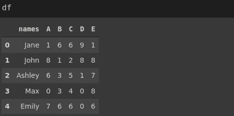

(图片由作者提供)

## 添加/删除列

首要的转换方式是添加或删除列。可以添加一个新列，如下所示:

```
df['new'] = np.random.random(5)
```

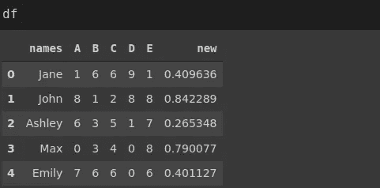

(图片由作者提供)

我们以数组或列表的形式给出值，并为新列指定一个名称。确保数组的大小与数据帧的大小兼容。

drop 函数用于删除一列。

```
df.drop('new', axis=1, inplace=True)
```

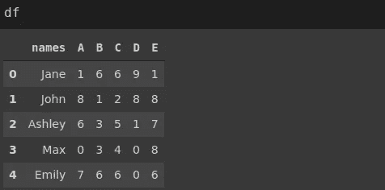

(图片由作者提供)

我们传递要删除的列的名称。axis 参数设置为 1，表示我们正在删除一列。最后，inplace 参数需要为 True 才能保存更改。

## 2.添加/删除行

我们可以使用 loc 方法向 dataframe 中添加一行。

```
df.loc[5,:] = ['Jack', 3, 3, 4, 5, 1]
```

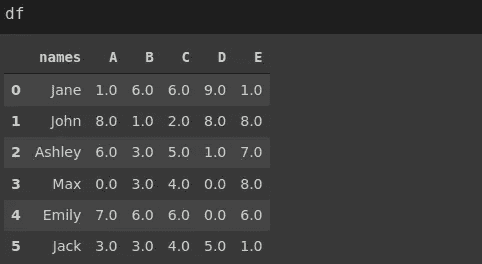

(图片由作者提供)

loc 函数指定带有标签的行和列。[5，:]表达式指示标签为 5 的行和所有列。

轴参数设置为零的 drop 函数可用于删除一行。

```
df.drop(5, axis=0, inplace=True)
```

我们刚刚删除了上一步中添加的行。

## 3.插入

insert 函数将一列添加到特定位置。

```
df.insert(0, 'new', np.random.random(5))
```

第一个参数指定列索引。第二个和第三个参数分别是列名和值。

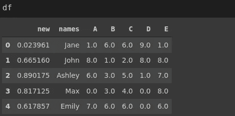

(图片由作者提供)

## 4.熔化

melt 函数将数据帧从宽格式(高列数)转换为窄格式(高行数)。最好通过一个例子来解释。考虑以下数据帧。

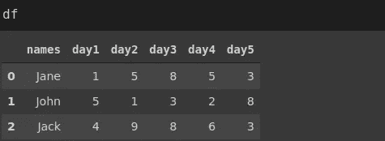

(图片由作者提供)

它包含 3 个人的连续每日测量。该数据帧的长格式可以使用 melt 函数实现。

```
pd.melt(df, id_vars='names').head()
```

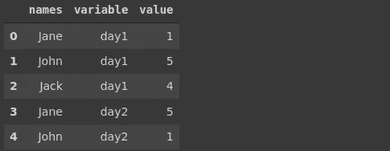

(图片由作者提供)

传递给 **id_vars** 参数的列保持不变，其他列合并在变量和值列下。

## 5.串联

concat 函数沿一个轴(索引或列)组合多个数据帧。数据帧的形状必须与轴兼容。

考虑以下两个数据帧。

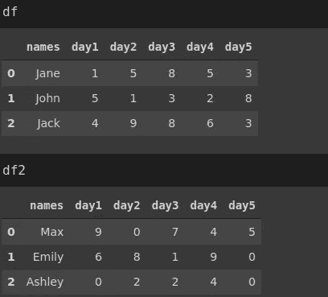

(图片由作者提供)

下面是我们将它们结合起来的方法:

```
pd.concat([df, df2], axis=0, ignore_index=True)
```

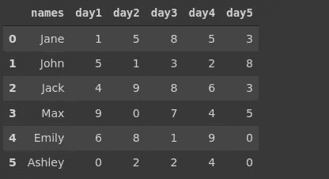

(图片由作者提供)

我们将轴参数设置为零，以沿着索引进行组合。ignore_index 参数重置索引。否则，保留原始索引(0，1，2，0，1，2)。

要沿列合并，轴参数设置为 1。

## 6.合并

Merge 函数还基于给定的一列或多列中的公共值组合数据帧。考虑以下两个数据帧。

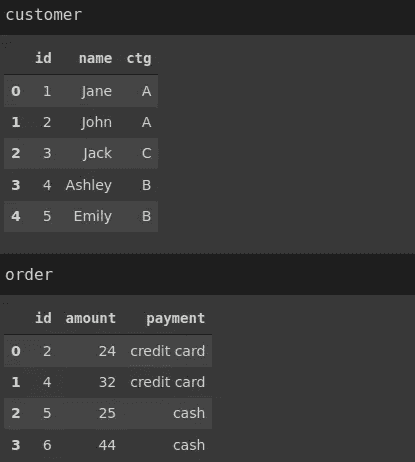

(图片由作者提供)

我们可以根据 id 列合并它们。

```
customer.merge(order, on='id')
```

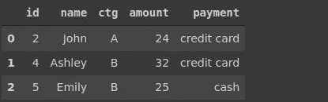

(图片由作者提供)

默认情况下，只取两个数据帧中都存在的值。我们可以用“how”参数来改变它。例如，如果我们将 is 设置为“left ”,则从左侧数据帧中获取所有值，并且仅从右侧数据帧中获取匹配的值。

## 7.拿假人

一些机器学习模型无法处理分类变量。在这种情况下，我们应该对分类变量进行编码，将每个类别表示为一列。

假设我们有以下数据帧。

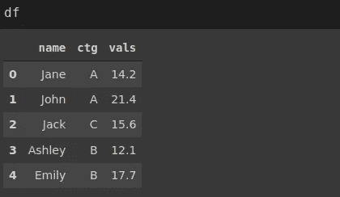

(图片由作者提供)

get_dummies 函数对 name 和 ctg 列进行编码。

```
pd.get_dummies(df)
```

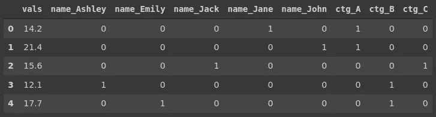

df 编码(图片由作者提供)

例如，在第一行中，姓名是 Jane，ctg 是 a。因此，表示这些值的列是 1，所有其他列是 0。

## 8.数据透视表

pivot_table 函数将数据帧转换为解释变量之间关系的格式。

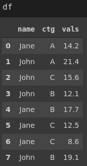

(图片由作者提供)

左边的数据框包含两个分类特征(即列)和一个数字特征。

我们希望看到两列中类别的平均值。pivot_table 函数以一种可以清楚地看到平均值或任何其他聚合的方式转换数据帧。

```
df.pivot_table(index='name', columns='ctg', aggfunc='mean')
```

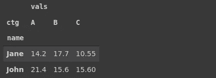

(图片由作者提供)

## 结论

我们已经介绍了转换数据帧的 8 种不同方法。有些只是改变结构，而有些则在转换过程中执行计算。

我们还看到了如何添加或删除行和列。此外，merge 和 concat 函数通过组合数据帧来转换数据帧。所有这些操作都是数据分析和处理过程的重要部分。

感谢您的阅读。如果您有任何反馈，请告诉我。