# 9 个非常棒的机器学习 Python 包，应该得到更多的赞誉

> 原文：<https://towardsdatascience.com/9-awesome-python-packages-for-machine-learning-that-should-deserve-more-credit-dbad17263145?source=collection_archive---------4----------------------->

## 这些软件包由微软、Yandex、英特尔或较小的组织或个人构建，自动化了机器学习中的许多冗余任务。

# 介绍

在过去的几周里，我有一些空闲时间，我花时间探索积压的资源。我很惊讶。这么多很酷的——不一定很有名的——关于机器学习的软件包没有登上排行榜的首位。它们的受欢迎程度看起来像利基，尽管它们应对了机器学习中的基本挑战。

所以他们来了。ML 中真正有用的 9 个在工作中学习和实现的包: **interpretML** 、 **dtreeviz** 、 **CatBoost** 、 **plaidML** 、 **mlflow** 、 **kedro** 、 **sklearn_pandas、Streamlit** 、 **pandas_profiling。**

它们包含在以下主题中:

*   **模型解释** (interpretML，dtreeviz)
*   **模型构建** (CatBoost，plaidML)
*   **模型产业化** (mlflow、kedro、sklearn-pandas)
*   **应用创建** (Streamlit)
*   **数据审计** (pandas_profiling)

# 模型解释

## [1-InterpretML](https://github.com/interpretml)

由微软作为开源项目开发的 [InterpretML](https://interpret.ml/) 是“一个帮助理解模型并实现负责任的机器学习的工具包”。 **4 个包**是这个项目的一部分，其中有 2 个是我最喜欢的:

[**解释**](https://github.com/interpretml/interpret)(Github 上的 2.7k 星星)允许你建立一个 GA2M 模型(杜撰*“可解释的助推机”*或*“EBM”*)用于分类或回归问题。GA2M 是“广义可加性 2 模型”的缩写，它是一族既高度精确又高度可解释的模型。

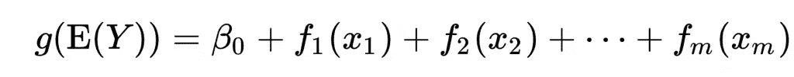

广义可加模型(或 GAM)方程。模型的最终预测是每个独立变量影响的总和。它被称为“白盒”模型。每个变量的影响可以单独绘制出来，并由人简单地理解。

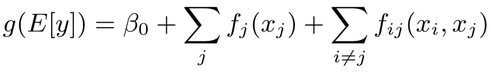

广义可加 2 模型(或 GA2M)方程。这是 GAM 模型的自然演变，有两个变量的多种组合。这个模型仍然是“白盒”,比经典的梯度增强树模型更容易被人类解释和理解。

这一系列模型几乎与经典的梯度增强树模型(如 LightGBM、CatBoost 或 XGBoost)一样准确，但更具可解释性。在大多数商业问题中，解释是关键，但也意味着不如高级模型准确。这些模型允许您在保持相对较高的可解释性的同时保持较高的准确性。这些肯定会成为机器学习社区的标准，在某种意义上，数据科学家将尝试并实现 GA2M 而不是 XGBoost。

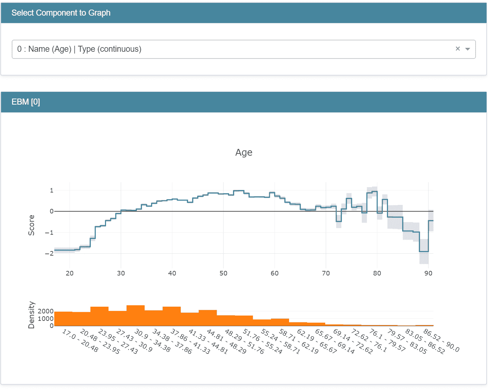

在成人收入数据集( [url](https://github.com/interpretml/interpret) )上训练的 GA2M(“EBM”)的输出。你可以看到，基于曲线的形状，变量“年龄”的影响是相加的。

*更多关于 GA2M 的话题:*[*https://blog . fiddler . ai/2019/06/a-gentle-introduction-to-ga2ms-a-white-box-model/*](https://blog.fiddler.ai/2019/06/a-gentle-introduction-to-ga2ms-a-white-box-model/)

[**interpret-community**](https://github.com/interpretml/interpret-community)(Github 上只有 123 颗星)是一个将 AzureML 的能力带到开源社区的项目。让我们来看看这个包最有趣的特性:神奇的*tabular explaner*函数，它允许你:

*   在第三个变量上用彩色编码标出 2 个变量(一个变量也可以是模型的预测值)
*   绘制总体最具预测性的变量
*   画出当地的解释(分别进行单独预测的原因)
*   使用假设情景逻辑运行模拟

而这个在**上*任意给定的型号*上**！*【注意用户界面对微软非常友好，这是你从私营公司开发的开源软件中得到的:】*

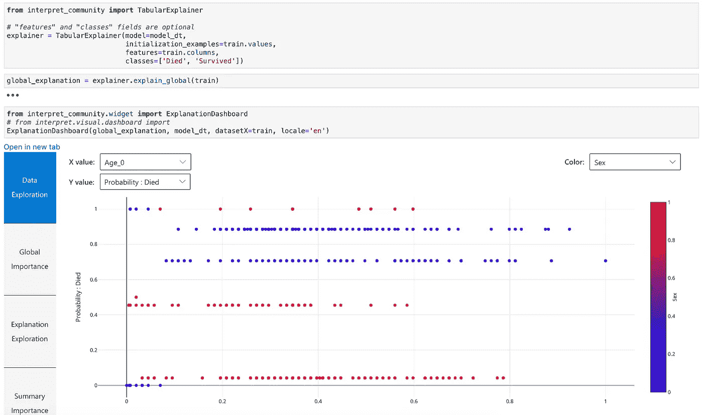

由 TabularExplainer 创建的主仪表板允许您可视化您的数据、模型预测和变量重要性。我使用泰坦尼克号数据集，用变量“年龄”(比例)绘制死亡概率，并用性别作为颜色编码。你可以看到，我的模型输出了 5 种不同的死亡概率(除了少数例外)，女性通常低于 50%的概率死亡(红点)，最老的人有超过 50%的概率死亡(“年龄”大于 0.8)


您可以选择一个单独的数据点，并可视化其预测的相对变量重要性。

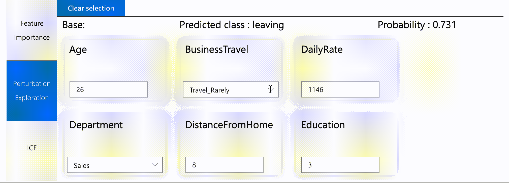

您可以选择一个单独的数据点，并通过手动更改输入来运行不同的场景。

interpretML 项目的最后两个包，[**interpret-Text**](https://github.com/interpretml/interpret-text)**和 [**DiCE**](https://github.com/interpretml/DiCE) ，分别帮助解释文本分类模型和创建“多样的反事实解释”(这是对给出相反预测的数据点的扰动)。两者看起来都很酷，尽管我还没有时间深入研究它们。**

**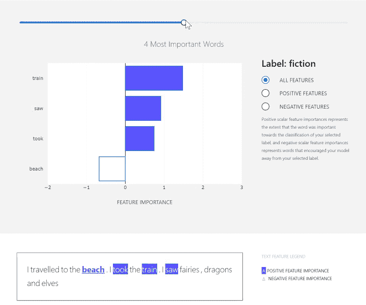**

**使用解释文本，您可以可视化单个单词对二进制分类模型( [url](https://github.com/interpretml/interpret-text) )的影响**

## **[2-dtreeviz](https://github.com/parrt/dtreeviz)**

**无论您使用 XGBoost、Random Forest 还是 CatBoost，您的模型中都内置了树。停止使用 sklearn 丑陋的 [plot_tree](https://scikit-learn.org/stable/modules/generated/sklearn.tree.plot_tree.html) 函数来显示它们。相反，使用 **dtreeviz** 。*【注一* ***爱情*** *sklearn 尽管如此】***

**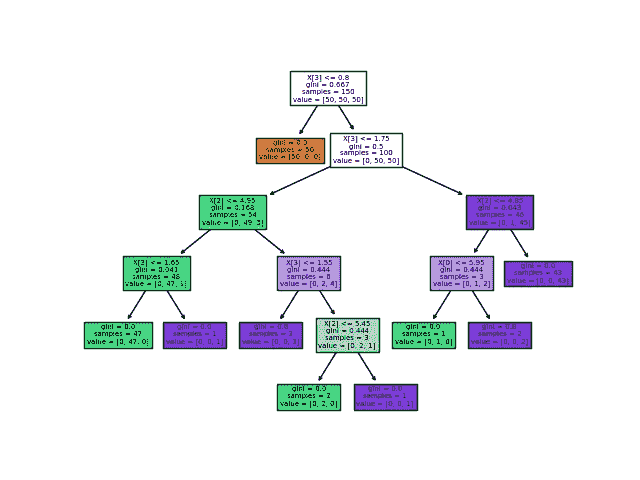**

**这就是 sklearn 的 plot_tree 函数显示的内容。除了糟糕的颜色编码之外，你还必须一盒一盒地阅读来区分大叶子和小叶子。**

**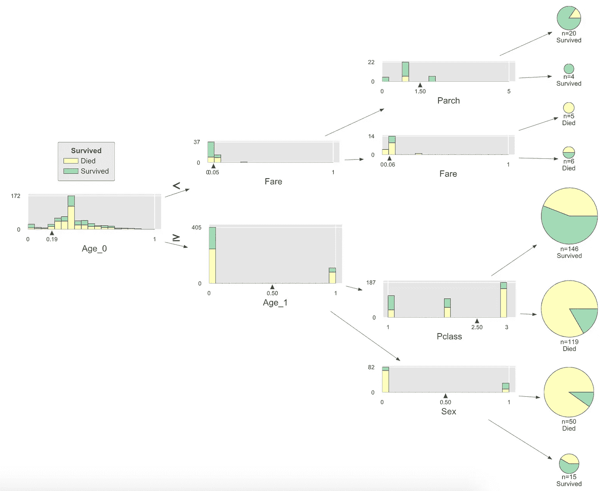**

**dtreeviz 在 Titanic 数据集上构建的决策树上的输出。难以置信的透明可视化。**

**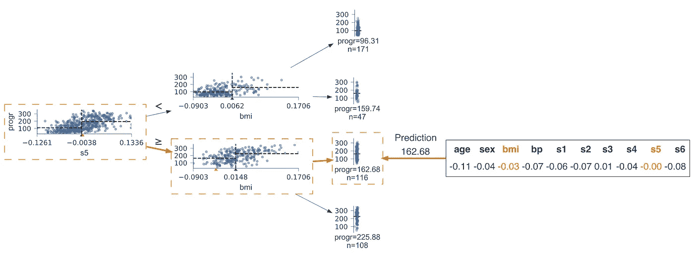**

**dtreeviz 还具有特定的回归可视化功能，显示阈值的散点图和虚线。**

**安装它并使它工作可能有点乏味，但它是值得的。你不会回头的。**

# **模型结构**

## **[3-催化增强](https://github.com/catboost/catboost)**

**由 Yandex 开发的这个软件包在准确性、速度和可解释性方面令人惊叹。我写了一篇文章总结了它的能力。数据科学家通常知道 XGBoost，可能不太想了解其他类似的 boosting 库，如 CatBoost 或 LightGBM。但是 CatBoost 有这么多很酷的附加特性(可视化训练、可解释性工具……)，如果默认使用 XGBoost 就太可惜了。**

**[](/why-you-should-learn-catboost-now-390fb3895f76) [## 为什么您现在应该学习 CatBoost

### CatBoost 正在永远改变机器学习的游戏，变得更好。

towardsdatascience.com](/why-you-should-learn-catboost-now-390fb3895f76) 

## [4-plaidml](https://github.com/plaidml/plaidml)

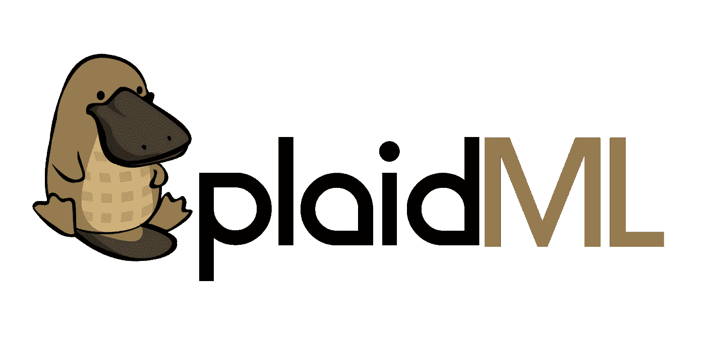

PlaidML 的标志

谁说要买英伟达昂贵的 GPU 才能做深度学习？我自己作为一个深度学习新手，不想只为了学习而去买昂贵的 GPU。而如果 Google Colab 提供了一个很好的替代方案，我还是不想依靠我的互联网连接和 Google 来做深度学习。

这是 PlaidML。由英特尔开发的 [PlaidML](https://www.intel.com/content/www/us/en/artificial-intelligence/plaidml.html) 旨在让手头没有昂贵 GPU 的人和组织能够访问深度学习。**你将能够用你的 MacBook Pro 运行深度学习模型**(耶！这就是我得到的！)

*一个重要的注意事项，使用它的社区今天看起来不大，设置它有一点挑战，我在下面详述:*

我试着为我的 Jupyter 笔记本设置它，不得不克服一些困难(比如[这个](https://github.com/plaidml/plaidml/issues/562))。基本上，我已经通过创建一个自定义环境，然后从它启动一个 Jupyter 笔记本来使它工作。下面是详细的步骤:

1.从 JupyterLab 的终端，为 plaidML 创建一个环境并激活它。

```
conda create --name plaidML
conda activate plaidML
```

2.安装 plaidML 包

```
pip install plaidml-keras plaidbench
```

3.为现有硬件设置首选项

```
plaidml-setup
```

您必须在默认设备或实验设备之间做出选择。我在默认设备中选择了一个硬件。

4.从您的常规 Jupyter 笔记本屏幕或使用 JupyterLab 打开 Jupyter 笔记本。

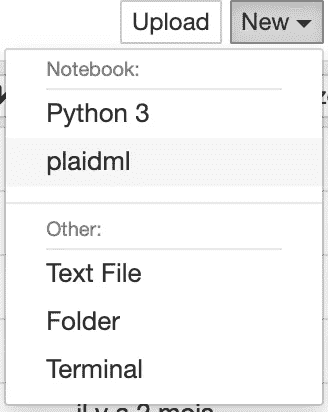

在 Jupyter 笔记本启动窗口中，单击“新建”，然后单击“plaidml”。这将打开一个笔记本，其中包含您刚刚设置的 plaidml 环境。

您还可以在正在运行的笔记本中更改环境(或内核),并选择您新创建的 *plaidml* env。

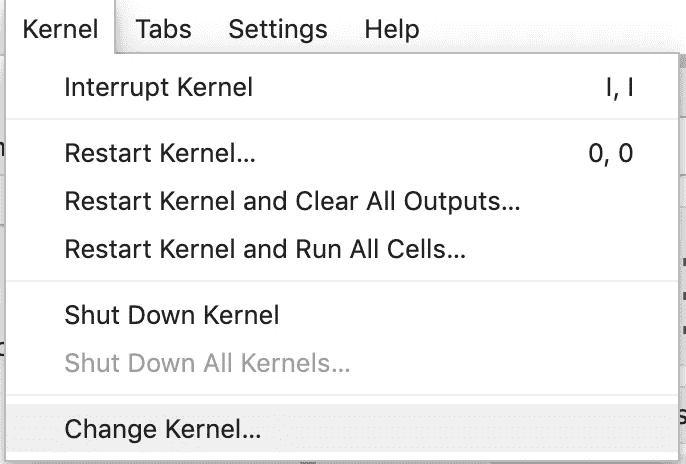

5.现在，您可以在笔记本中使用 plaidML，只需两行代码:

```
import os
os.environ[“KERAS_BACKEND”] = “plaidml.keras.backend”
```

用...测试它

```
import keras
```

它应该会输出类似这样的内容:

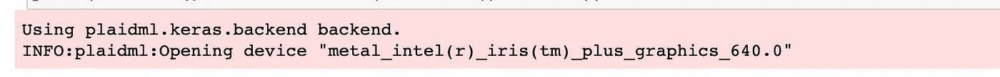

给你。快乐深度学习；)

# 模型工业化

## [**5-mlflow**](https://github.com/mlflow/mlflow/)

“机器学习生命周期的开源平台”， [ML Flow](https://mlflow.org/) 允许数据科学家运行实验，使用 API 部署他们的模型，并在集中的注册表中管理他们的模型。它是为工程方面量身定制的(你必须经常使用命令行)，对于数据科学家来说使用起来还是很简单的。

下一步肯定是在 AWS 或云提供商上安装它，看看我— *一个没有计算机科学背景的数据科学家*能否让它工作。

我可以在我的机器上测试这个库。我喜欢两个功能，因为与我以前手动操作相比，它非常简单:

*   运行具有不同参数的模型，并使用热图/“等高线图”显示精确度，以确定参数的最佳组合:

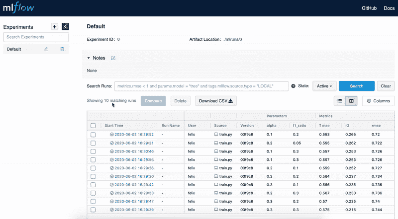

将 10 个模型(相同的模型但不同的参数集)与“等高线图”图表进行比较

*   将您的模型部署为 API:

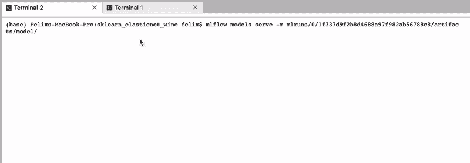

将您的模型部署为 API 就像使用命令行一样简单: **> mlflow 模型服务于**。我用一个假数据点测试 API，它立即返回预测，就像变魔术一样！

## **6-凯德罗**

> Kedro 是一个开源 Python 框架，用于创建可复制、可维护和模块化的数据科学代码。它从软件工程中借用概念，并将它们应用到机器学习代码中；应用的概念包括模块化、关注点分离和版本控制。


我在这上面花了一点时间，但是我还没有把它用于专业项目。根据我的理解，Kedro 主要面向那些专注于设计可维护的数据科学代码的工程师。

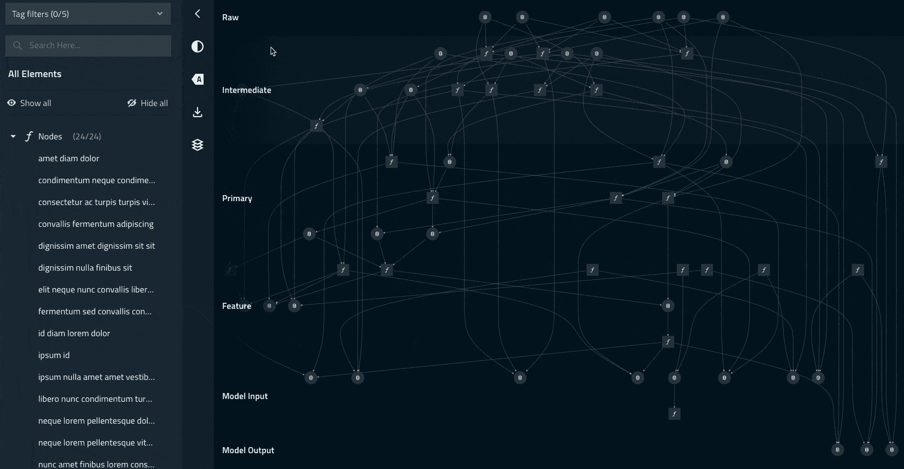

Github 回购在这里有:【https://github.com/quantumblacklabs/kedro 

## **7-sklearn-pandas**

你有没有尝试过在熊猫身上使用 sklearn，并意识到(艰难地，试图解决奇怪的错误)sklearn 是为 numpy 设计的？然后 [sklearn-pandas](https://github.com/scikit-learn-contrib/sklearn-pandas) 送给你！

我在[之前的一篇文章](/7-advanced-tricks-in-pandas-for-data-science-41a71632b5d9)里已经讲过了。基本上，它可以帮助您不再浪费时间将数据帧转换为 numpy 数组，然后再转换回数据帧，以使您的 sklearn 管道工作。

# ML 应用程序

## 8-细流

Streamlit，怎么说呢，重新定义了一个数据科学家应该具备的“软技能:)

事实上，它允许数据科学家用 Python 创建漂亮的应用程序，非数据科学家将使用它来尝试机器学习模型。

如果你以前没有尝试过 Streamlit，我估计你会上他们的网站并尽快开始使用它。[画廊部分](https://www.streamlit.io/gallery)极具启发性。


对我来说，这是交付 ML 模型的新标准。数据科学家不仅应该向数据工程师团队分发模型文件，而且最重要的是向业务团队分发一个演示应用程序来解决这个问题。

对我来说 Streamlit 最大的特点是什么？带空间的[扩展](https://spacy.io/universe/project/spacy-streamlit)！您可以创建与 NER 和其他 NLP 模型交互的漂亮应用程序。这是小菜一碟🍪

# 数据审计

## 9-熊猫 _ 简介

我在[之前的一篇文章](/7-advanced-tricks-in-pandas-for-data-science-41a71632b5d9)中已经谈过了，所以我不会深究太多。这是我作为 pd 运行 import pandas 后加载的第二个包。

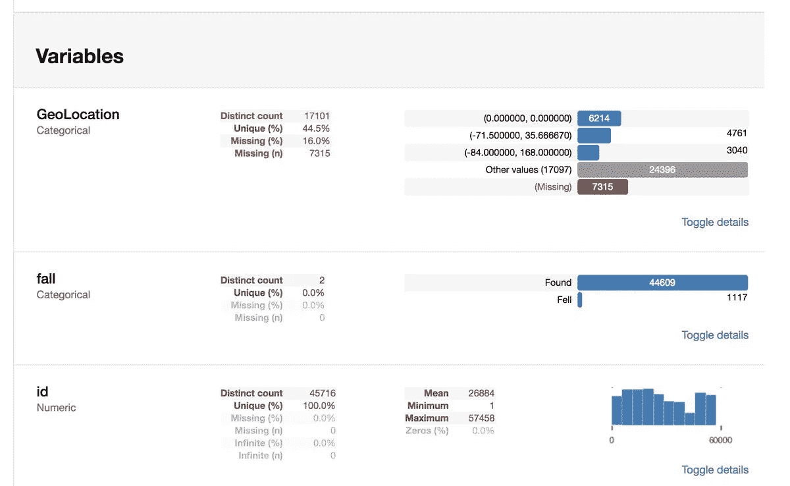

注意你可能会在安装或正确运行它时遇到一些麻烦，因为它依赖于各种其他的包。

感谢阅读！**