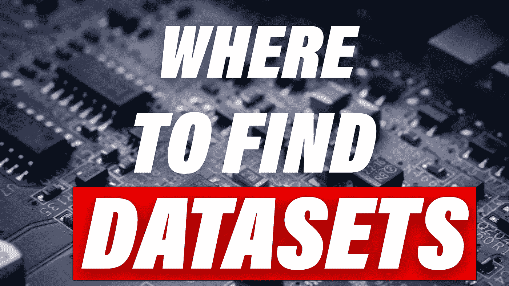
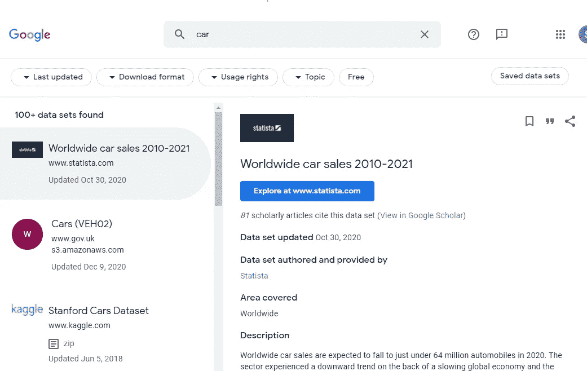
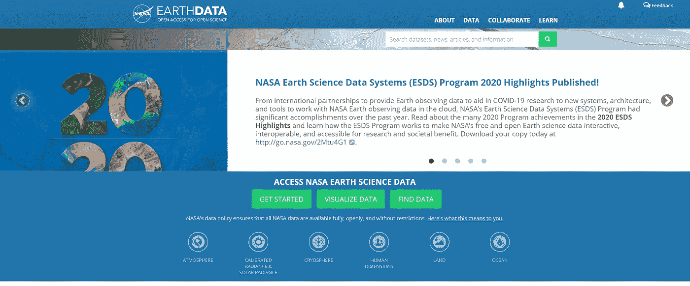
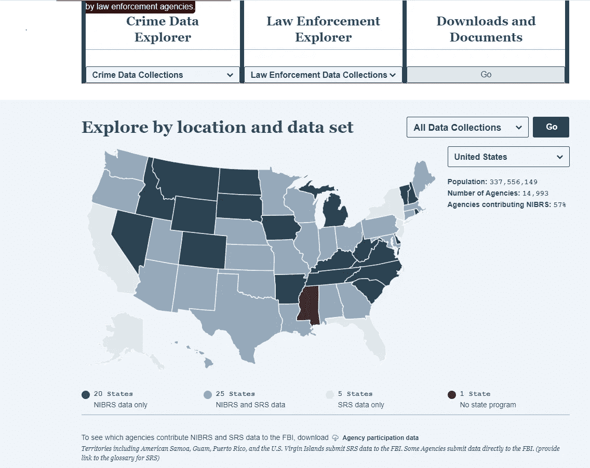

# 寻找机器学习数据集的 9 个最佳地点

> 原文：<https://towardsdatascience.com/9-best-places-to-find-machine-learning-datasets-dfdba8af5220?source=collection_archive---------11----------------------->

## 机器学习、数据科学和数据可视化的数据集集合

图片由作者提供，许可证由 [Envato](https://elements.envato.com/processing-data-K7SSXPM) 持有

机器学习通常被视为这种神奇的工具，在这里您可以洗牌数据，并将获得的知识转化为预测。然而，要做到这一点，你需要收集、清理和合并大量的数据。

今天，我们将简化您的生活，并向您概述可以找到各种用途的聚合数据集的最佳位置。从地理数据到犯罪数据，可以检查的潜在领域非常吸引人。

# 1.谷歌的数据集搜索引擎

域名:【https://datasetsearch.research.google.com/ 

与谷歌的核心产品一样，你可以使用文本轻松搜索数据集。此外，您可以按日期、数据格式和使用权过滤查询。该网站上的数据集从公司有偿提供的真实数据集到个人项目免费使用的数据集。

如果你正在寻找一个没有任何特定限制的所有可用数据集的概览，谷歌是最好的起点。

来自谷歌数据集搜索引擎的截图

# 2.Kaggle 数据集

域名:【https://www.kaggle.com/datasets 

如果你曾经参加过任何数据科学相关的课程或黑客马拉松，你可能会遇到 Kaggle。Kaggle 是世界领先的所有数据科学相关编程平台。它还允许用户查找和发布数据集，更重要的是，与其他数据科学人员就如何从中提取价值进行合作和竞争。

如果你想了解更多关于某个特定类型问题的知识，并想与世界各地的数据科学家讨论这些知识，kaggle 是你的不二之选。

# 3.地球数据

域名:[https://earthdata.nasa.gov/](https://earthdata.nasa.gov/)

对于那些想有一个高层次的概述的人来说，来自 Nasa 的地球数据是正确的地方。它拥有可能是最大的关于地球、气候和水体的地理相关数据集。

这些数据集是由世界各地的研究人员和机构提供和创建的，肯定是各个领域中最高质量的。如果您正在寻找一个专注于时间序列或地理空间数据的项目，这无疑是开始寻找的最佳地方。

截图来自地球数据

# 4.亚马逊和微软数据集，Azure 和 AWS

域名 AWS:[https://registry.opendata.aws/](https://registry.opendata.aws/)

domain Azure:[https://Azure . Microsoft . com/en-us/services/open-datasets/catalog/？q=](https://azure.microsoft.com/en-us/services/open-datasets/catalog/?q=)

大型科技巨头在他们的开放数据注册中心拥有来自世界各地的数据集。我把它做成一个联合的地方，因为虽然他们没有大量的数据集，但他们有一些特别大的数据集。

他们在云和大数据存储方面的经验肯定会在向公众提供这些数据集时派上用场。目前 AWS 有大约 200 个数据集，Azure 有大约 20 个。

如果您正在寻找大数据领域的项目并希望处理大量数据，这些地方是最佳选择。

# 5.联邦调查局犯罪数据浏览器

域名:【https://crime-data-explorer.fr.cloud.gov/downloads-and-docs 

如果你想知道那些没有很好地注释他们的代码的人会发生什么，FBI 犯罪数据浏览器可能会给你一个提示。可能是围绕犯罪和非犯罪的执法数据的最大的数据收集。它的特点是从基于州的犯罪数据到与人口贩运相关的数据。

虽然这通常是一个悲伤的故事，但它也是最令人兴奋的数据类型之一。如果你正在寻找一个变化和一个新的令人兴奋的项目，有点不同，它肯定是一个金矿。

获得 CC0 许可的 FBI 数据浏览器截图

# 6.数据世界

域名:【https://data.world/ 

一个很少被提及的集合是数据世界。它非常类似于谷歌数据集搜索引擎。然而，我发现这个实现非常令人满意的是搜索深度，当输入一个查询时，它不仅显示数据集本身，还显示可能包含所需数据的子文件。当然，这在寻找诸如人口统计和地理位置收集之类的二手数据时特别有用。

如果你正在寻找一个以数据命名的专门网站，强烈推荐《数据世界》。

# 7.CERN 开放数据门户

域名:[http://opendata.cern.ch/](http://opendata.cern.ch/)

位于日内瓦附近的欧洲核研究组织(CERN)向公众提供了许多令人难以置信的研究数据。

CERN 的开放数据门户很吸引人。他们收集并提供了超过 2pb 的数据，这些数据是关于最小的事物，粒子物理学。这是欧洲最负盛名的研究机构之一，他们关于粒子碰撞的数据质量无人能及。

来自 Cern 许可为 CC0 的开放数据的屏幕截图

# 8.Lionbridge AI 数据集:

域名:[https://lionbridge.ai/datasets/](https://lionbridge.ai/datasets/)

Lionbridge 是一家提供数据收集、注释和验证服务的公司。除此之外，定制标注环境和我们今天感兴趣的各种数据集都可以通过他们的网站找到。

在他们的数据集部分，他们向你展示了几篇包含各种来源的文章。比如‘11 个最适合机器学习的气候变化数据集’和‘50 个最适合机器学习的免费数据集’。由于他们是一家围绕数据集建立的公司，他们的建议肯定很棒。

如果您正在寻找专门数据集之间的比较，这是最好的地方。

# 9.UCI 机器学习知识库

域名:【https://archive.ics.uci.edu/ml/index.php 

加州大学欧文分校有超过 550 个数据集供你免费使用。我发现这个网站特别有教育意义，因为它提供了问题过滤。因此，分类、回归和聚类，你可以很容易地找到一个数据集，将与你目前正在探索的技术很好地工作。

除了知道如何教育人们，他们的团队肯定知道很多关于机器学习数据集以及如何评估它们的知识。

# 9:荣誉奖

在 place 9 上，我们有所有的荣誉奖和其他很棒的数据集集合，这是我们无法在一篇短文中涵盖的。我会把它们留给你，让你对它们有一个全面的了解。

## 数据中心

 [## 搜索数据集

### 从金融市场数据和人口增长到加密货币价格，有成千上万个数据集。如果你不…

数据中心. io](https://datahub.io/search) 

## 令人惊叹的数据集

 [## awesome data/awesome-公共数据集

### 注意:此回购由 apd-core 自动生成。请不要直接修改该文件。我们提供了…

github.com](https://github.com/awesomedata/awesome-public-datasets) 

## 政府统计网站—例如美国

 [## Data.gov

### 我们很高兴地宣布重新推出新的 resources.data.gov，这是一个在线的政策、工具、案例库…

www.data.gov](https://www.data.gov/) 

## 视觉数据—特别适合图像/视频工作

【https://www.visualdata.io/discovery 

# 结论

正如我们所看到的，数据世界正在迅速膨胀。从犯罪到折纸龙，越来越多的数据集涌现出来，等待人们去探索。

我希望您已经了解了您将在下一个项目中使用的数据集，现在可以围绕如何以及在哪里找到您可能需要的所有数据做出明智的决定。

如果你喜欢这篇文章，我会很高兴在 Twitter 或 LinkedIn 上联系你。

一定要看看我的 [YouTube](https://www.youtube.com/channel/UCHD5o0P16usdF00-ZQVcFog?view_as=subscriber) 频道，我每周都会在那里发布新视频。