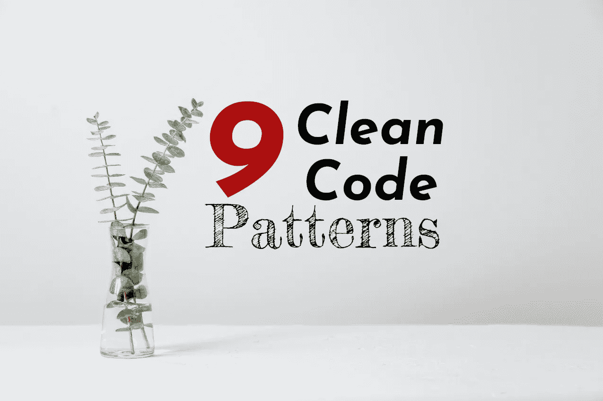

# 9 个干净的代码模式，我希望我能早点知道

> 原文：<https://towardsdatascience.com/9-clean-code-patterns-i-wish-i-knew-earlier-57ee56c5892?source=collection_archive---------4----------------------->



照片由 [Tim Chow](https://unsplash.com/@timchowstudio?utm_source=medium&utm_medium=referral) 在 [Unsplash](https://unsplash.com?utm_source=medium&utm_medium=referral) 上拍摄

当你回顾自己职业生涯早期写的代码时，你知道那种感觉吗？我总觉得有点恐怖。但这也有积极的一面:我学到了一些新东西😄

好软件的核心部分是可读性。保持较低的心理复杂度，以便每个人(包括作者)都能轻松理解。干净的代码模式有助于做到这一点。

在本文中，您将了解 9 种清晰的代码模式，它们使代码更易于阅读。请将这些模式视为工具。它们并不总是适用。不要对他们有宗教信仰。我使用的语言是 Python，但是这些模式也适用于 Python 之外。开始吧！

# №1:解释变量

这可能是你可以轻松运用的最简单的技巧。如果有些东西很难理解，你需要给它一个评论，试着给它一个名字。

```
# Bad
if not (
    string.startswith('"""')
    and string.endswith('"""')
    and '"' not in string[3:-3]
):
    return string# Good
**is_tripple_quoted_string** = (
    string.startswith('"""')
    and string.endswith('"""')
)
if not (is_tripple_quoted_string and '"' not in string[3:-3]):
    return string
```

这主要适用于布尔表达式，但也适用于正则表达式，有时也适用于返回值。

# №2:遵循惯例和风格指南


照片由[鲁特森·齐默曼](https://unsplash.com/@ruthson_zimmerman?utm_source=medium&utm_medium=referral)在 [Unsplash](https://unsplash.com?utm_source=medium&utm_medium=referral) 拍摄

每一种编程语言都有一个你需要遵循的语法，否则，它将无法工作。然后还有惯例。你不必跟随他们；它仍然会工作。然而，如果你跟随他们，会让其他人的生活变得更容易。

最简单的惯例之一是**风格指南**。在 Python 中是 [PEP 8](https://www.python.org/dev/peps/pep-0008/) ，谷歌发布了 [C++](https://google.github.io/styleguide/cppguide.html) / [Java](https://google.github.io/styleguide/javaguide.html) 、Oracle Java 代码惯例[的指南，在 PHP 中有](https://www.oracle.com/technetwork/java/codeconventions-150003.pdf) [PSR-1](https://www.php-fig.org/psr/psr-1/) ，…

其他向导是隐式的。例如，Django 项目是如何构建的。您通常存储视图、模型和模板的地方。

> 找到与你相关的风格指南，并遵循它们。

通常，也有 **linters** 或**静态代码分析工具**帮助你习惯指南。比如 Python 里有`flake8`，有很多插件。对于最简单的部分，即格式化，您可以使用工具来完成。我喜欢的一个 Python 代码自动套用格式器是黑色的。

# №3:类型检查

我喜欢 Python 中的类型注释。它们是可选的，但是我强烈推荐使用它们。在使用方法上也有区别。

例如，如果你有`Dict[str, Any]`，你可以考虑用`NamedTuple` / `TypedDict` / `pydantic` / `dataclasses`来代替。

在某些情况下，当你使用`str`作为类型时，你可能要考虑使用`NewType`来表示你正在使用哪种类型的字符串。是一个`AuthorId`吗？是一个`UserId`吗？

这两种模式也适用于其他语言。让我们这样表述:

> 善用类型系统。

如果您想了解更多关于 Python 中的类型注释，请阅读:

<https://medium.com/analytics-vidhya/type-annotations-in-python-3-8-3b401384403d>  

如果你想知道最近的改进，请阅读我的 [Python 3.10 文章](https://betterprogramming.pub/python-3-10-is-released-know-whats-new-and-if-it-s-worth-the-switch-19c7a5738f7c)。

# №4 一致的术语


由[瓦尔德马·布兰德](https://unsplash.com/@waldemarbrandt67w?utm_source=medium&utm_medium=referral)在 [Unsplash](https://unsplash.com?utm_source=medium&utm_medium=referral) 拍摄的照片

我在金融科技公司 Cashlink 工作，是一名 Python 后端开发人员。我们处理数字证券，例如代表真实价值的代币，比如太阳能发电厂的一部分。这些代币可以转让。这里开始变得有趣了。根据转移的类型，我们必须做不同的事情。要么是因为法规，要么是因为技术原因。因此，我们开始为不同类型的转账起不同的名字，以免总是混淆:

*   **转移**:任何改变平衡的动作。下面的所有条款都是某种转让(虽然我会犹豫要不要打电话给 minting，烧个转让)。
*   **造币**:代币生成。这种情况首先发生。
*   **发行**:发行人向投资人的转让。这种情况其次发生。
*   **Move** :从钱包 A 到钱包 B 的转账，其中 A 和 B 属于同一个投资人。
*   **交接**:从钱包 A 到钱包 B 的一次转账，其中 A 和 B 属于不同的投资人。
*   **烧钱**:从投资者账户中取出代币。

这些事情很重要，但是还有其他例子，其中的术语可能不同。比如内部的产品名，外部的。营销可能有不同于开发的需求。试着找到一个适合公司大多数人的词汇。

# №5 个有意义的名字

把你的代码库想象成一本书。这本书有很多很多不同的故事情节。变量就是字符。你可以在一定程度上依赖上下文，但是如果你把每个人都称为“朋友”，读者会感到困惑。如果仅仅为了名字就需要看半页，他们会很烦。

*   **避免太短的名字**，比如`i`或者`x`。他们很难找到。如果你写一个数学函数，它们可能是有意义的。
*   **避免太长的名字**比如`InternalFrameInternalFrameTitlePaneInternalFrameTitlePaneMaximizeButtonWindowNotFocusedState`。Java 开发人员经常落入这个陷阱。是的，这个名字可能非常准确。然而，这使得围绕它的所有逻辑都超级难以理解。在`x`和`InternalFrameInternalFrameTitlePaneInternalFrameTitlePaneMaximizeButtonWindowNotFocusedState`之间有一个不错的中间地带。
*   **与№4 的词汇保持一致**。同样在拼写上。决定你是想用美式英语还是英式英语。决定是否要在代码库中编写 display/show/present/print。
*   **避免使用像`user_dict`这样的名字**中的数据结构。如果你需要，那可能是你违反了第 6 条。尽量只使用一个对象的一种表示。但是请记住，这是一个普遍的规则。有时候使用`user_dict`确实有意义。
*   利用上下文。例如，`java.sql.SQLIntegrityContraintViolation`可能只是一个`java.sql.IntegrityError`。在`sql`包中，一切都应该是关于 SQL 的。而`ConstraintViolation`就是一个错误。

迭代时我喜欢的一种模式是使用迭代器的复数形式(以“s”结尾)和单数形式(没有最后的“s”)

```
# Bad
for tmp in users: ...# Good
for user in registered_users: ...
```

顺便说一句:如果你在野外看过[搞笑的变量命名](https://www.reddit.com/r/ProgrammerHumor/comments/k1wdrt/whats_the_most_inappropriate_variable_name/)请分享😄

# №6 降压法则


由 [Unsplash](https://unsplash.com?utm_source=medium&utm_medium=referral) 上的 [Larm Rmah](https://unsplash.com/@larm?utm_source=medium&utm_medium=referral) 拍摄的照片

将一个功能保持在一个抽象层次有助于你专注于一个主题。

> 独立逻辑↔数据收集/传输↔演示。

演示不一定必须是可视化的。它可以是打印语句，也可以是 API 响应。

马雷克·胡季马给[举了一个降级规则的好例子](https://marekhudyma.com/code-style/2021/03/02/step-down-rule.html)。

在 Python 中，当有大量缩进时，有时会看到这种情况。

# №7 删除死代码


照片由[吉恩·加林](https://unsplash.com/@genefoto?utm_source=medium&utm_medium=referral)在 [Unsplash](https://unsplash.com?utm_source=medium&utm_medium=referral) 上拍摄

不存在的代码是无法破解的代码。这是不会引起安全问题的代码。是不需要维护的代码。不要将代码注释掉，而是将其移除。

你可以使用 [vulture](https://pypi.org/project/vulture/) 和[flake 8-根除](https://pypi.org/project/flake8-eradicate/)在 Python 代码库中找到这样的片段。

我知道当你有了以后可能需要的东西时的感觉。我通常会尝试编写一个真正彻底的提交消息，只删除那些注释/文件，以便以后需要时能够找到它。但是有 YAGNI: [你不会需要它的！](https://en.wikipedia.org/wiki/You_aren%27t_gonna_need_it)

# 8 使用容器

如果您在代码库的几个地方传递相同的几个值，您可能要考虑编写一个容器。那可能是一个类，在 Python 中你可以使用一个[数据类](https://docs.python.org/3/library/dataclasses.html)、一个[命名元组](https://docs.python.org/3/library/typing.html#typing.NamedTuple)或者一个[类型集合](https://www.python.org/dev/peps/pep-0589/)。如果您需要序列化它，Pydantic 类也很不错。

应该使用容器格式的一个主要例子是配置。

# 避免意外

这是显而易见的，但有时很容易忘记。一个核心部分就是**避免副作用**。应该清楚函数是否改变状态。另一部分是对**文件的黑客攻击**。有时有黑客是必要的，但至少留下一个为什么有黑客的评论。

不要试图做一些聪明的事情。遵循接吻原则——保持简单和愚蠢！

# 摘要

写好代码就像写好文章一样:它需要**练习**，你会不断进步。大量阅读，[寻求反馈](https://codereview.stackexchange.com/)并鼓励人们在反馈中也给出小的笔记。那些没太大关系，只是个人喜好的。

最后，明白自己读代码讨厌什么。避免[那些模式](https://cs.fit.edu/~kgallagher/Schtick/How%20To%20Write%20Unmaintainable%20Code.html)😄—但是[应用这个](https://github.com/zedr/clean-code-python/blob/master/README.md)😍练习，接受反馈，对你的代码持批评态度。然后你会成为一名出色的软件工程师🥂

我喜欢写关于软件开发和技术的文章🤩不要错过更新: [**获取我的免费电子邮件简讯**](https://martinthoma.medium.com/subscribe) 📧或者[如果你还没有报名参加 medium](https://martinthoma.medium.com/membership)✍️——这两者都鼓励我写更多🤗