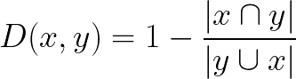
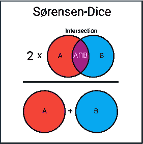

# 数据科学中的 9 种距离度量

> 原文：<https://towardsdatascience.com/9-distance-measures-in-data-science-918109d069fa?source=collection_archive---------0----------------------->

## 常见距离测量的优点和缺陷

距离测量。图片由作者提供。

许多算法，无论是有监督的还是无监督的，都利用了**距离度量**。这些度量，例如欧几里德距离或余弦相似性，经常可以在诸如 k-NN、UMAP、HDBSCAN 等算法中找到。

理解距离测量领域比你可能意识到的更重要。以 k-NN 为例，这是一种经常用于监督学习的技术。默认情况下，它通常使用欧几里德距离。就其本身而言，这是一个很好的距离度量。

但是，如果您的数据是高度多维的呢？欧几里德距离还有效吗？或者，如果您的数据包含地理空间信息呢？也许哈弗线距离会是一个更好的选择！

> 知道何时使用哪种距离度量可以帮助你从一个差的分类器到一个精确的模型。

在本文中，我们将介绍许多距离测量方法，并探讨如何以及何时最好地使用它们。最重要的是，我将谈论它们的缺点，这样你就能认识到什么时候应该避开某些措施。

**注意**:对于大多数距离测量来说，关于它们的用例、优点和缺点，可以而且已经写了很长的详细论文。我会尽可能多地覆盖，但可能会功亏一篑！因此，请将本文视为这些措施的全球概述。

# 1.欧几里得距离

欧几里德距离。图片由作者提供。

我们从最常见的距离度量开始，即欧几里德距离。它是一种距离度量，最好解释为连接两点的线段的长度。

该公式相当简单，因为距离是使用勾股定理从点的笛卡尔坐标计算的。

欧几里得距离

## **缺点**

虽然欧氏距离是一种常用的距离度量，但它并不随比例变化，这意味着根据要素的单位，计算的距离可能会有偏差。通常，在使用这种距离测量之前，需要将数据标准化。

此外，随着数据维数的增加，欧几里德距离变得越来越无用。这与维数灾难有关，维数灾难与高维空间不像我们从 2 维或 3 维空间中直观地预期的那样活动的概念有关。一个好的总结，见[这篇](https://stats.stackexchange.com/questions/99171/why-is-euclidean-distance-not-a-good-metric-in-high-dimensions)帖子。

## 用例

当您有低维数据并且向量的大小对于测量很重要时，欧几里德距离非常有用。如果对低维数据使用欧几里德距离，kNN 和 hdb 等方法可以显示出很好的现成结果。

尽管已经开发了许多其他度量来解决欧几里德距离的缺点，但是它仍然是最常用的距离度量之一，这是有充分理由的。它使用起来非常直观，实现起来非常简单，并且在许多使用案例中显示了很好的效果。

# 2.余弦相似性

余弦距离。图片由作者提供。

余弦相似性经常被用作抵消高维欧氏距离问题的一种方法。余弦相似度就是两个向量之间夹角的余弦。如果两个向量都归一化为长度为 1，那么它也有相同的向量内积。

方向完全相同的两个向量的余弦相似度为 1，而方向相反的两个向量的相似度为-1。请注意，它们的大小并不重要，因为这是方向的度量。

余弦相似性

## 不足之处

余弦相似性的一个主要缺点是不考虑向量的大小，只考虑它们的方向。实际上，这意味着价值观的差异没有得到充分考虑。以推荐系统为例，余弦相似度没有考虑不同用户之间的评分差异。

## 用例

当我们有高维数据并且向量的大小不重要时，我们经常使用余弦相似度。对于文本分析，当数据用字数表示时，这种方法非常常用。例如，当一个单词在一个文档中比在另一个文档中出现得更频繁时，这并不一定意味着一个文档与该单词更相关。可能的情况是，文档的长度不均匀，计数的大小不太重要。那么，我们最好使用余弦相似度，它不考虑大小。

# 3.汉娩距

汉明距离。图片由作者提供。

汉明距离是两个向量之间不同值的数量。它通常用于比较两个长度相等的二进制字符串。它还可以用于字符串，通过计算彼此不同的字符数来比较它们彼此的相似程度。

## 不足之处

如你所料，当两个向量不等长时，汉明距离很难使用。你可能想要比较相同长度的向量，以了解哪些位置不匹配。

此外，只要它们不同或相等，它就不考虑实际值。因此，当震级是一个重要的度量时，不建议使用此距离度量。

## 用例

典型的使用案例包括数据通过计算机网络传输时的错误纠正/检测。它可以用来确定二进制字中失真比特的数量，作为一种估计误差的方法。

此外，您还可以使用海明距离来度量分类变量之间的距离。

# 4.曼哈顿距离

曼哈顿距离。图片由作者提供。

曼哈顿距离，通常称为出租车距离或城市街区距离，计算实值向量之间的距离。想象一下在一个统一的网格(如棋盘)上描述物体的向量。曼哈顿距离是指两个向量之间的距离，如果它们只能移动直角的话。在计算距离时不涉及对角线移动。

曼哈顿距离

## 不足之处

尽管曼哈顿距离似乎对高维数据很有效，但它比欧几里得距离更不直观，尤其是在高维数据中使用时。

此外，它更有可能给出比欧几里德距离更高的距离值，因为它不是可能的最短路径。这不一定会产生问题，但你应该考虑到这一点。

## 用例

当数据集具有离散和/或二进制属性时，Manhattan 似乎工作得很好，因为它考虑了在这些属性值内实际可以采用的路径。以欧几里德距离为例，将在两个向量之间创建一条直线，而实际上这可能实际上是不可能。

# 5.切比雪夫距离

切比雪夫距离。图片由作者提供。

切比雪夫距离被定义为沿任意坐标维度的两个向量之间的最大差值。换句话说，它就是沿一个轴的最大距离。由于其性质，它通常被称为棋盘距离，因为国王从一个方格到另一个方格所需的最小移动次数等于切比雪夫距离。

切比雪夫距离

## 不足之处

切比雪夫通常用于非常特定的用例，这使得它很难用作通用的距离度量，如欧几里德距离或余弦相似性。因此，建议只在你完全确定它适合你的用例时才使用它。

## 用例

如前所述，切比雪夫距离可用于提取从一个方块到另一个方块所需的最少移动次数。此外，在允许无限制 8 向移动的游戏中，它可以是一个有用的措施。

在实践中，切比雪夫距离经常用于仓库物流，因为它非常类似于高架起重机移动物体所需的时间。

# 6.闵科夫斯基

闵可夫斯基距离。图片由作者提供。

闵可夫斯基距离是一个比大多数更复杂的度量。它是在赋范向量空间(n 维实空间)中使用的度量，这意味着它可以在距离可以表示为具有长度的向量的空间中使用。

这项措施有三个要求:

*   **零向量** —零向量的长度为零，而其他向量的长度为正。例如，如果我们从一个地方旅行到另一个地方，那么距离总是正的。然而，如果我们从一个地方旅行到它自己，那么距离是零。
*   **标量因子** —当你将向量乘以一个正数时，它的长度会改变，同时保持它的方向。例如，如果我们在一个方向上走了一定的距离，加上相同的距离，方向不变。
*   **三角形不等式** —两点间最短的距离是一条直线。

闵可夫斯基距离的公式如下所示:

闵可夫斯基距离

关于这个距离度量最有趣的是参数`**p**`的使用。我们可以使用这个参数来操纵距离度量，使其与其他度量非常相似。

`p`的常用值有:

*   p=1 —曼哈顿距离
*   p=2 —欧几里德距离
*   p= *∞* —切比雪夫距离

## 不足之处

Minkowski 与它们所代表的距离度量具有相同的缺点，因此很好地理解像曼哈顿、欧几里德和切比雪夫距离这样的度量是极其重要的。

此外，参数`p`实际上很难处理，因为根据您的使用情况，找到正确的值在计算上是相当低效的。

## 用例

`p`的好处是可以迭代它，找到最适合您的用例的距离度量。它允许您在距离度量上有很大的灵活性，如果您非常熟悉`p`和许多距离度量，这将是一个巨大的好处。

# 7.Jaccard 索引

Jaccard 索引。图片由作者提供。

Jaccard 指数(或交集/并集)是一种用于计算样本集相似性和多样性的指标。它是交集的大小除以样本集的并集的大小。

实际上，它是集合之间相似实体的总数除以实体的总数。例如，如果两个集合共有 1 个实体，总共有 5 个不同的实体，那么 Jaccard 索引将是 1/5 = 0.2。

为了计算 Jaccard 距离，我们只需从 1 中减去 Jaccard 索引:

雅克卡距离

## 不足之处

Jaccard 索引的一个主要缺点是它受数据大小的影响很大。大型数据集对索引有很大的影响，因为它可以显著增加并集，同时保持交集相似。

## 使用案例

Jaccard 索引通常用于使用二进制或二进制数据的应用程序中。当你有一个深度学习模型预测图像的片段时，例如，一辆汽车，Jaccard 指数可以用来计算预测的片段给出真实标签的准确性。

类似地，它可以用于文本相似性分析，以测量文档之间有多少单词选择重叠。因此，它可用于比较多组模式。

# 8.半正矢

哈弗森距离。图片由作者提供。

哈弗线距离是给定经度和纬度的球体上两点之间的距离。它非常类似于欧几里得距离，因为它计算两点之间的最短直线。主要区别在于不可能有直线，因为这里假设两点在一个球面上。

两点间的哈弗线距离

## 不足之处

这种距离测量的一个缺点是，它假设这些点位于一个**球**上。实际上，这种情况很少发生，例如，地球不是完美的圆形，这在某些情况下会使计算变得困难。取而代之的是，看向假定为椭球面的**万有引力距离**会很有趣。

## 用例

正如你可能已经预料到的，哈弗线距离经常用于导航。例如，当你在两个国家之间飞行时，你可以用它来计算两国之间的距离。请注意，如果距离本身已经不是很大，那么它就不太适合。曲率不会有那么大的影响。

# 9.索伦森-戴斯指数

索伦森-骰子系数。图片由作者提供。

s rensen-Dice 指数与 Jaccard 指数非常相似，因为它衡量样本集的相似性和多样性。虽然它们的计算方式相似，但索伦森-戴斯指数更直观一些，因为它可以被视为两个集合之间的重叠百分比，该值介于 0 和 1 之间:

索伦森-骰子系数

## 不足之处

就像 Jaccard 指数一样，它们都夸大了集合的重要性，而这些集合很少或根本没有真实的正集合。因此，它可能会主导多组的平均分数。它对每个项目的权重与相关集合的大小成反比，而不是一视同仁。

## 用例

用例与 Jaccard index 相似(如果不是相同的话)。你会发现它通常用于图像分割任务或文本相似性分析。

**注意:**除了这里提到的 9 种，还有更多的距离度量。如果你正在寻找更有趣的指标，我建议你看看下面的一个:Mahalanobis、堪培拉、Braycurtis 和 KL-divergence。

# 感谢您的阅读！

如果你像我一样，对人工智能、数据科学或心理学充满热情，请随时在 [LinkedIn](https://www.linkedin.com/in/mgrootendorst/) 上添加我，或者在 [Twitter](https://twitter.com/MaartenGr) 上关注我。