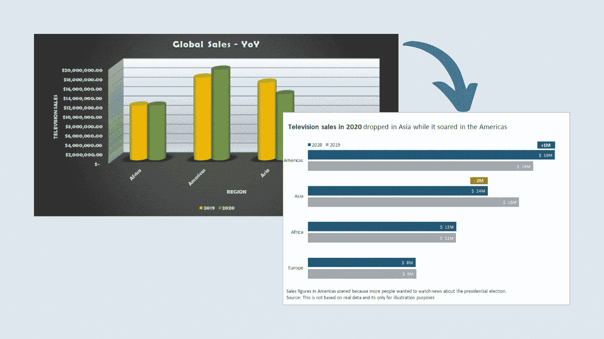
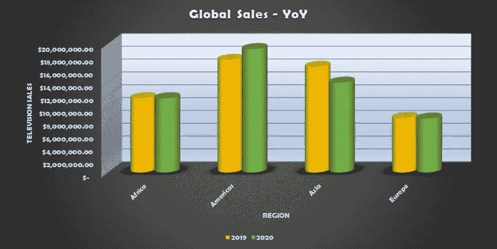
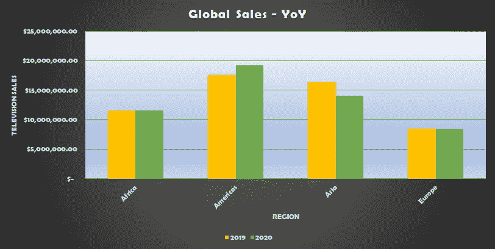
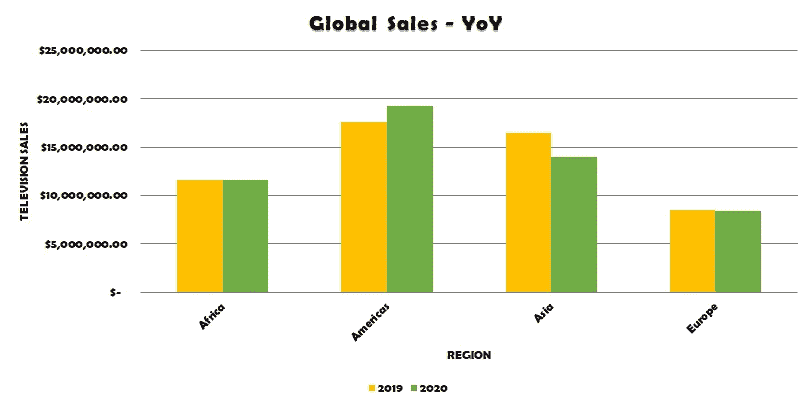
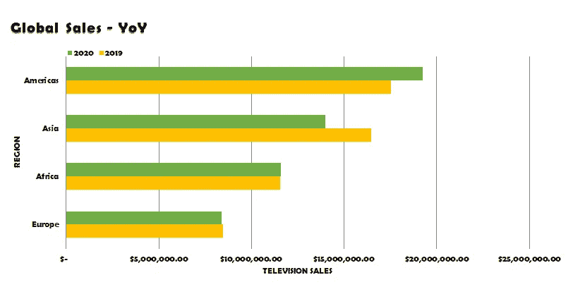
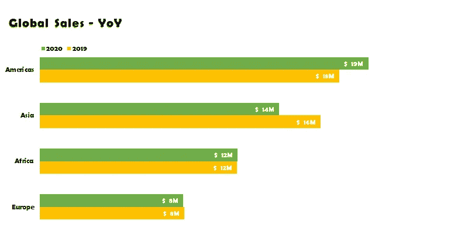
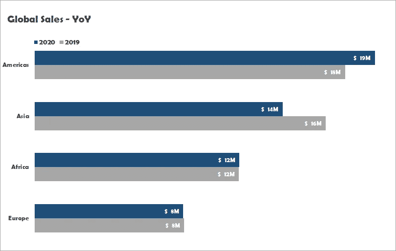
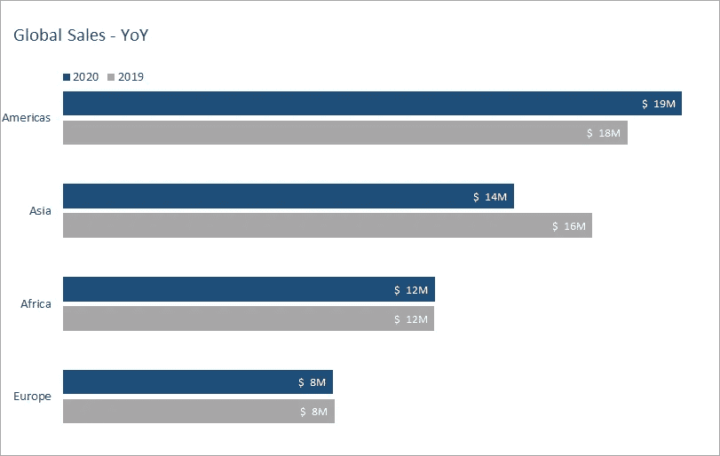
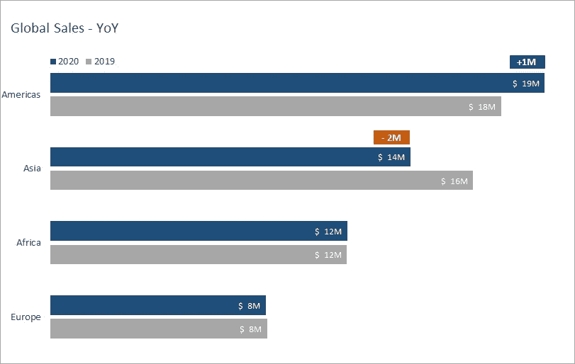
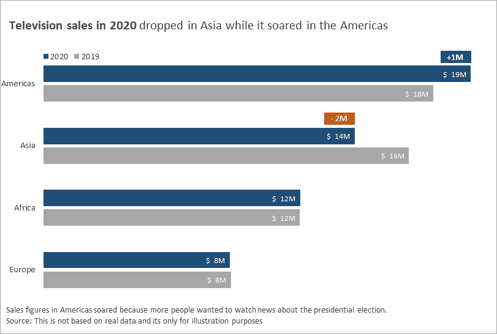

# 制作精美图表的 9 个简单步骤

> 原文：<https://towardsdatascience.com/9-easy-steps-to-make-great-charts-33e2c4612e39?source=collection_archive---------18----------------------->

## 如何用经过优雅重组的图表在演示幻灯片中讲述激动人心的故事



图片作者[作者](http://thuwarakesh.medium.com)

我是一名分析师。我主要使用图表——用于演示的图表，仪表板上的图表，等等。然而，我看到的大多数图表都是为了在客户眼中看起来漂亮而过度使用的。事实是，他们发现很难理解他们。

有用的图表简单但不乏味。它只讲述了一个故事，而且做得很好。它不言自明，只需要很少的思考就能理解。此外，这样的图表使用每个人都能看到的令人愉快的颜色。

这篇文章是实用指南。我们将通过一个混乱的条形图，使它变得优雅。这里的重点是演示图表。然而，这些原则中的大部分对于仪表板也是有用的。

[我们的平均注意力持续时间是 8 秒](https://time.com/3858309/attention-spans-goldfish/)。这就是我们的目标——在八秒钟内提出想法。

# 背景资料

我使用这个簇状柱形图来解释这些步骤。它比较了许多地区 2020 年和 2019 年的电视销售。这里使用的数据是不真实的，仅用于说明目的。



图片[作者](http://thuwarakesh.medium.com)

当然，它看起来很漂亮。我也喜欢深色背景。然而，演示文稿中图表的目的不是炫耀演示者的技能或愿望。它需要优化，以便更好地阅读。

在这个图表中，读者需要自己找出这个故事。我可以看到亚洲的销售额下降了大约 100 万美元，尽管在美国却猛增了 100 万美元。但另一个人可能会关注非洲和欧洲，那里的销售保持不变。如果你要讨论的信息是前一个，那么另一个就会造成混乱。更不用说，你的观众可能会有许多不同的解读方式。

让我们一步一步地开始清理。

# 1.比起 3D，更喜欢 2D 图形

我同意 3D 图形很美。但是我们知道更远的物体看起来比它们实际上要小。在很多情况下，它会导致一个错误的解读。

我在很多仪表盘上都见过这种情况，因为这个简单的调整让图表更有吸引力。然而，大多数[数据可视化专家会同意不应该使用 3D](https://blog.indezine.com/2012/08/problems-with-3d-charts-by-james-m-smith.html?doing_wp_cron=1610865639.9334208965301513671875)。



图片[作者](http://thuwarakesh.medium.com)

# 2.使用白色背景

出于许多原因，白色背景是首选。首先，它与所有其他颜色形成鲜明对比。白色和灰色很相配，而黑色和灰色就不相配。

第二，白色背景在印刷和数字媒体上都很好用。



图片[作者](http://thuwarakesh.medium.com)

# 3.为自然的眼球运动组织内容

我们的眼睛[从左到右扫描图表，然后从上到下](http://www.storytellingwithdata.com/blog/2019/5/13/declutter-and-question-defaults)。因此，将关键元素放在左上角。我从左对齐的标题开始，然后是图例，然后是主图表。

标称数据用[横条图，序数数据用柱形图比较好。](https://depictdatastudio.com/when-to-use-horizontal-bar-charts-vs-vertical-column-charts/)例如，如果我们创建多年的图表，最好使用柱形图。在这种情况下，当我们跨地区比较数据时，水平条是一个很好的拟合。

除了让图表水平，我还让它按 2020 年的销售数字排序。这使得图表易于理解。



图片[作者](http://thuwarakesh.medium.com)

# 4.标签比网格线和坐标轴更好

网格线和轴有助于精确测量。他们可以在探险中提供帮助。但是在演示中，观众永远不会使用它们。[如果你的读者不打算用网格线和坐标轴来阅读数据，那就去掉它们。](http://www.storytellingwithdata.com/blog/2019/5/13/declutter-and-question-defaults)更少的细节让图表更干净。

我喜欢标签，因为它们更接近数据点，也更容易理解。



图片[作者](http://thuwarakesh.medium.com)

# 5.使用令人愉快的颜色

为演示文稿选择正确的颜色是一件棘手的事情。有冷色，也有暖色。有些人看不到所有的颜色。

大约 12 个男人中有一个，200 个女人中有一个不能看到所有的颜色。在不同的类型中，[红绿色盲是最常见的一种。因此，出于可访问性的原因，最好避免使用这些颜色。](https://www.nei.nih.gov/learn-about-eye-health/eye-conditions-and-diseases/color-blindness/types-color-blindness)

蓝色和橙色的组合在大多数情况下都有效。蓝色可以用来突出某物。因为[蓝色是冷色](https://www.canva.com/learn/visual-hierarchy/#color-contrast)，所以人们可以盯着它看更久。相反，我们可以使用暖色的[橙色，来立即吸引注意力。其他元素我都用灰色，因为它不会争夺注意力。](https://www.canva.com/learn/visual-hierarchy/#color-contrast)



图片作者[作者](http://thuwarakesh.medium.com)

# 6.使用视觉层次突出故事

我们将元素放在自然的眼球运动上，并且在设计中使用了令人愉悦的颜色。我们还可以使用其他的视觉层次技术。

## 大小和接近度

[大小是设置图表元素可见性的有效方式](https://www.canva.com/learn/visual-hierarchy/#size)。我们将所有的轴标签和数据标签做得更小，因为它们对故事没有直接贡献。

[同样，邻近有助于用图表元素创建逻辑组。](https://www.canva.com/learn/visual-hierarchy/#spacing-proximity)我们使两个条形之间的间隙比任何条形的宽度都要窄。我们还使两个数据点(区域)之间的间隙比同一个数据点中两个条形之间的间隙更宽。

## 字体和排版

[无衬线字体在演示图表上清晰可见。衬线字体适用于像段落这样的大文本。](https://blog.prezi.com/top-typography-tips-presentations)我最喜欢的图表是 Calibri。

此外，轻字体有助于不分散读者的注意力。



图片作者[作者](http://thuwarakesh.medium.com)

# 7.使用辅助元素来吸引读者的注意力

辅助元素是按顺序吸引读者注意力的地标。

我们这个例子的故事是亚洲的下降和美洲的增长。我用的橙色标签更接近亚洲的 2020 酒吧。橙色很快引起注意，也告诉读者有一些奇怪的事情。

我还使用了一个靠近美洲 2020 条形图的蓝色标签来告诉读者美国销售额的增长。



图片作者[作者](http://thuwarakesh.medium.com)

# 8.描述性标题、副标题和描述

[在图表上少用文字](/data-visualization-best-practices-less-is-more-and-people-dont-read-ba41b8f29e7b)。然而，他们是一个很好的方式来告诉你的信息，并直接消除任何困惑。

我将标题和可选的副标题放在图表的左上角。因为我不想让这些元素立即引起注意，所以我使用灰色字体，并把重要的部分加粗。

我在图表底部用小字体写下了所有的描述。他们在传达我的故事中没有起到任何主要作用。因此，它应该被削弱。



图片由[作者](http://thuwarakesh.medium.com)

这个版本比我们最初的版本更容易阅读。我们的注意力立刻转向橙色的 2M 标签。这表明亚洲出了问题。然后，我们转向+100 万的标签，并认为，“美国做得很好。”

由于不再有吸引注意力的元素，我们回到左上角进行自然的眼球运动。标题说明了这张图表的内容——2020 年的电视销售。

标题后面的图例告诉我们，蓝色条是 2020 年的销售额。现在一切都开始有意义了。底部的附加注释解释了原因、来源等。

# 9.演示前测试

无论你多么努力地简化事情，都有可能没有正确传达信息。因此，把你的作品展示给与你的观众有相似特征的人总是好的。

我通常让几个同事看着图表讲一个故事。大多数人都能想出我想要传达的故事。通常需要大约 10-15 秒。仍然高于 8 秒的目标。如果他们花了更长时间或者根本想不出一个故事，我就重写。

# 结论

[一幅画胜过千言万语——弗雷德·r·巴纳德。](https://www.dictionary.com/browse/picture-is-worth-a-thousand-words--one)

我们到处使用图表来讲述我们的故事。但通常，我们认为它们是辅助材料，而它们可以扮演更重要的角色。

一个伟大的图表会自己讲述这个故事，而演示者的角色是支持性的。

在本文中，我们已经看到了许多清理和组织图表的方法，可以快速抓住读者的注意力，并引导他们浏览整个故事:

*   我们用的是 2D 图表，而不是 3D 图表；
*   喜欢白色背景而不是黑色背景；
*   利用从左到右和从上到下的自然眼球运动；
*   删除多余的元素，如网格、轴，并在其位置使用数据标签；
*   大部分使用灰度，用蓝色突出，用橙色获得即时关注；
*   利用视觉层次属性，如大小、接近度、字体和排版；
*   使用支持元素来驱动焦点；
*   使用描述性的标题、副标题和描述。

最后，我们承认，在向观众推销之前，对真实的人进行测试对于一个有用的图表是至关重要的。

这篇文章主要适用于演示幻灯片上的图表。如果是在仪表板上或用于数据探索的图表上，方法可能会有所不同。然而，有些概念仍然可以在这些情况下使用。

```
**Further reading**1\. [Story Telling With Data Blog](http://www.storytellingwithdata.com/blog)
2\. [The Ultimate Guide to Visual Hierarchy](https://www.canva.com/learn/visual-hierarchy/)
3\. [Data Visualization Accessibility](/data-visualization-and-accessibility-three-recommended-reads-and-top-tips-9c5e862b464e)
```