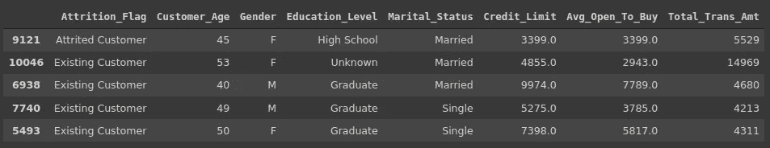
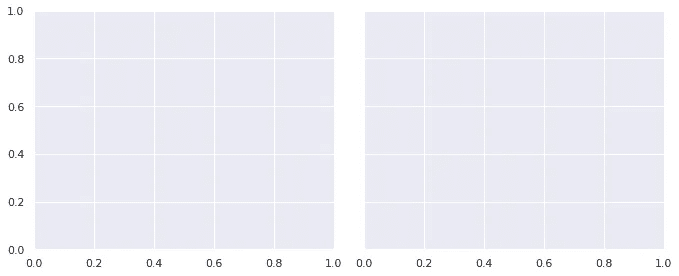
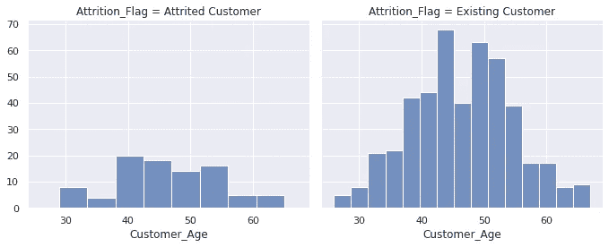
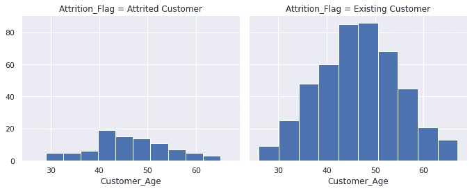
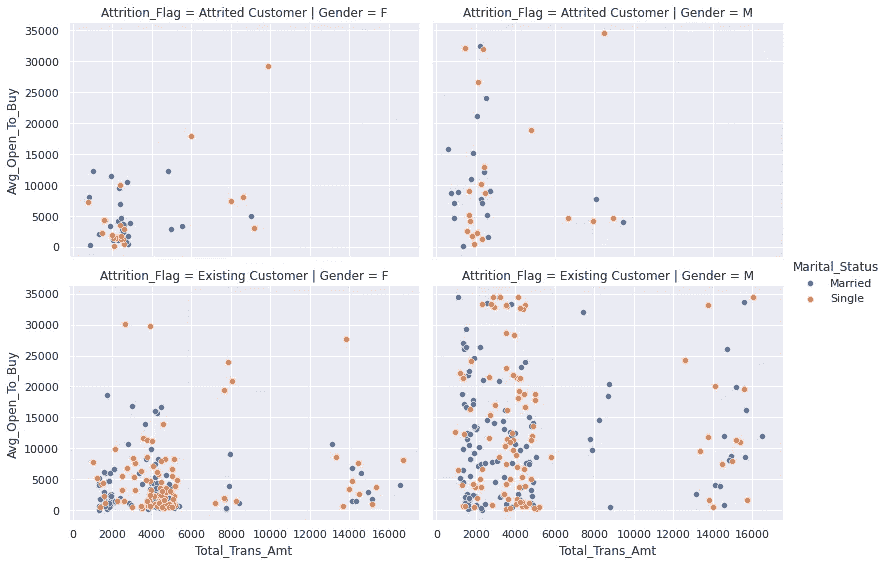
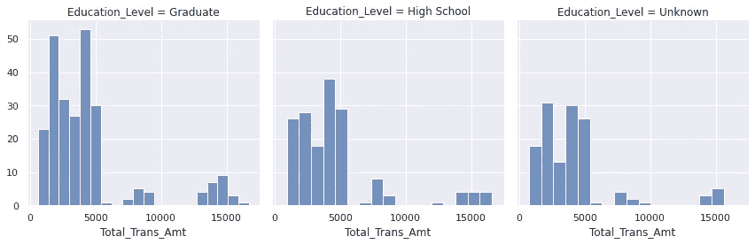
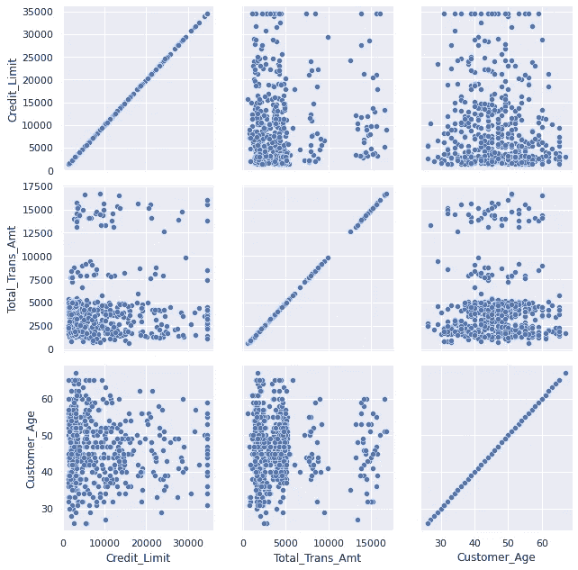
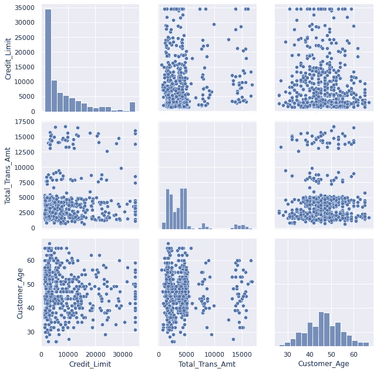
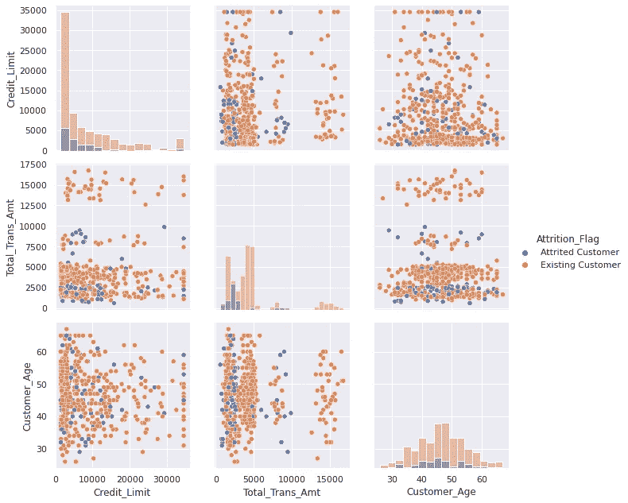
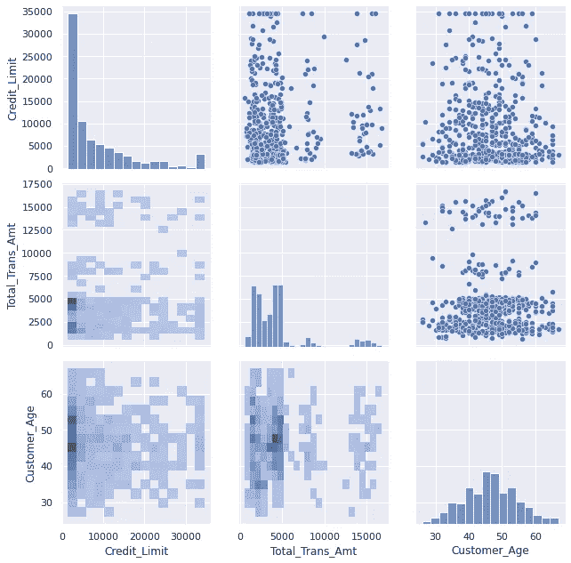

# 掌握 Seaborn 网格的 9 个示例

> 原文：<https://towardsdatascience.com/9-examples-to-master-seaborn-grids-1935bb38014c?source=collection_archive---------23----------------------->

## 面网格和对网格实用指南


马库斯·斯皮斯克在 [Unsplash](https://unsplash.com/s/photos/different-colors?utm_source=unsplash&utm_medium=referral&utm_content=creditCopyText) 上的照片

数据可视化是数据分析的一个基本部分。它帮助我们更好地理解数据中的关系，并探索底层结构。

我们可以通过在同一个图中组合多个图来创建更多的信息可视化。有许多方法可以创建多图可视化。Seaborn 库使得使用 FacetGrid 和 PairGrid 类生成这样的图变得简单明了。

在本文中，我们将通过 9 个例子来练习如何使用这些函数。我们将从非常基础的开始，逐步增加复杂性。例如，我们将使用 Kaggle 上的客户流失[数据集](https://www.kaggle.com/sakshigoyal7/credit-card-customers)。

我们从导入必要的库开始。

```
import numpy as np
import pandas as pd
import matplotlib.pyplot as plt
import seaborn as sns
sns.set(style='darkgrid')
```

下一步是将数据集读入熊猫数据帧。

```
cols = [
        'Attrition_Flag','Gender','Education_Level',
        'Marital_Status','Customer_Age','Credit_Limit',
        'Total_Trans_Amt','Avg_Open_To_Buy'
       ]churn = pd.read_csv(
    "/content/BankChurners.csv", usecols=cols
    ).sample(n=1000)churn = churn[churn.Marital_Status.isin(['Married','Single'])]churn = churn[churn.Education_Level.isin(['Graduate','High School', 'Unknown'])]churn.head()
```



(图片由作者提供)

我已经选择了原始数据集中的一些列，还做了一些过滤和采样，以便进行演示。

FacetGrid 是一个子情节网格，允许将数据集的结构转移到子情节。Row、col 和 hue 参数可以看作是 FacetGrid 对象的三个维度。

我们首先创建一个 FacetGrid 对象，然后映射数据。让我们从一个非常简单的创建 FacetGrid 结构的例子开始。

## 示例 1

```
g = sns.FacetGrid(churn, col='Attrition_Flag', height=4, aspect=1.2)
```



(图片由作者提供)

我们现在有一个仅代表结构的空图。Seaborn 根据传递给 col 和 row 参数的列中的值生成结构。由于损耗标志列有两个唯一值，因此返回一个包含两列的网格。

高度和纵横比参数调整支线剧情的大小。

## 示例 2

一旦我们有了 FacetGrid 对象，我们就可以将数据映射到它。

```
g = sns.FacetGrid(churn, col='Attrition_Flag', height=4, aspect=1.2)g.map(sns.histplot, 'Customer_Age')
```



(图片由作者提供)

map 方法将绘图函数和要绘图的变量作为参数。上面的网格使用直方图显示了客户年龄列的分布。数据点根据损耗标志列中的类别进行分隔。

## 示例 3

传递给 map 方法的绘图函数不必是 Seaborn 函数。我们也可以使用 matplotlib 函数。例如，上面的图可以用“plt.hist”创建。

```
g = sns.FacetGrid(churn, col='Attrition_Flag', height=4, aspect=1.2)g.map(plt.hist, 'Customer_Age')
```



(图片由作者提供)

**注意** : Seaborn 也接受自定义函数用于映射。但是，在创建它们时，您必须遵循某些规则。

## 实例 4

到目前为止，我们只使用了 col 参数。我们可以使用行和色调参数来添加更多的维度。

```
g = sns.FacetGrid(
   churn, row='Attrition_Flag', col='Gender', hue='Marital_Status', 
   height=4, aspect=1.4
)g.map(sns.scatterplot, 'Total_Trans_Amt', 'Avg_Open_To_Buy')g.add_legend()
```



(图片由作者提供)

我们有一个散点图网格，显示两个数字列之间的关系。我们能够在流失标记、性别和婚姻状况列中分别展示类别之间的关系。

当我们使用 hue 参数时，也应该使用 add_legend 函数添加图例。

## 实例 5

我们可以指定支线剧情所代表的类别的顺序。row_order 和 col_order 参数可用于排序。

```
col_order = churn.Education_Level.value_counts().indexg = sns.FacetGrid(
   churn, col='Education_Level', height=4,
   col_order = col_order
)g.map(sns.histplot, 'Total_Trans_Amt')
```



(图片由作者提供)

您还可以从图中注意到，类别是按大小排序的。我们已经使用 Pandas 的 value_counts 函数为类别生成了一个订单。

## 实例 6

PairGrid 生成一个图形网格，显示变量的成对关系。例如，我们可以创建一些数值变量之间的散点图网格。

```
cols = ['Credit_Limit','Total_Trans_Amt','Customer_Age']g = sns.PairGrid(churn[cols], height=3.5)g.map(sns.scatterplot)
```



(图片由作者提供)

## 例 7

在前面的例子中，对角线上的图没有用，因为它们显示的是变量本身的散点图。为了使网格提供更多信息，我们可以在对角线上绘制变量直方图。

我们通过使用 map_diag 和 map_offdiag 方法传递不同的函数。

```
g = sns.PairGrid(churn[cols], height=3)g.map_diag(sns.histplot)g.map_offdiag(sns.scatterplot)
```



(图片由作者提供)

这比前一个更好，因为我们还得到了每个变量的分布概况。

## 实施例 8

PairGrid 还支持 hue 参数，因此我们可以基于分类变量来分离散点图中的数据点。

另一个有用的参数是 var 参数。在前面的 PairGrid 示例中，我们使用了 dataframe 的一个子集，因此它只包含要绘制的列。我们还可以向 var 参数传递要绘制的列的列表。

```
g = sns.PairGrid(churn, vars=cols, hue='Attrition_Flag', height=3)g.map_diag(sns.histplot)g.map_offdiag(sns.scatterplot)g.add_legend()
```



(图片由作者提供)

## 示例 9

在 PairGrid 中，对角线上下侧的图是镜像。因此，从不同的角度来看，我们有相同的情节。

我们可以选择在对角线的上侧和下侧绘制不同类型的图。map_upper 和 map_lower 函数用于为上边和下边生成不同种类的图。

```
g = sns.PairGrid(churn, vars=cols, height=3)g.map_diag(sns.histplot)g.map_upper(sns.scatterplot)g.map_lower(sns.histplot)
```



(图片由作者提供)

上方是散点图。对角线包含每个变量的直方图。在下方，我们有二维直方图。

## 结论

我们已经练习了如何使用 Seaborn 的 FacetGrid 和 PairGrid 创建多绘图可视化。它们是探索性数据分析的非常有用的工具。Seaborn 生成这些图的方式使它们简单易懂。

理解 FacetGrid 和 PairGrid 之间的区别很重要。在 FacetGrid 中，每个子情节代表相同的关系，但条件不同。例如，我们可以在 FacetGrid 中有两个变量的散点图，并根据另一个变量的类别来分离数据点。

在 PairGrid 中，每个图显示不同的关系。例如，当我们创建一个包含三个变量的散点图对网格时，每个子图代表一个不同的成对关系。

为了丰富功能和外观，可以在 FacetGrid 和 PairGrid 对象上添加更多的特性。一旦你熟悉了基本的，你就可以创建更详细的网格了。

感谢您的阅读。如果您有任何反馈，请告诉我。