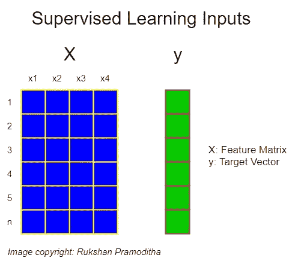
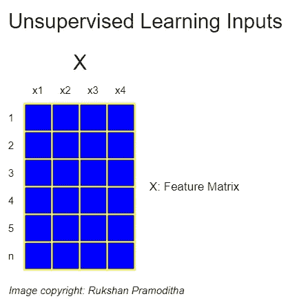
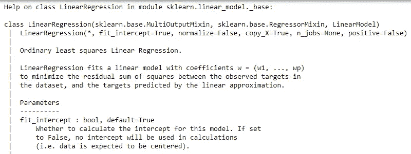
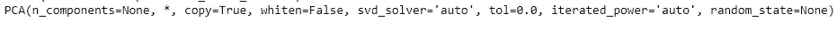

# 掌握 Scikit 的 9 个指南——学而不中途放弃

> 原文：<https://towardsdatascience.com/9-guidelines-to-master-scikit-learn-without-giving-up-in-the-middle-5102863d89d7?source=collection_archive---------18----------------------->

## 学习适合我的方法


布拉登·科拉姆在 [Unsplash](https://unsplash.com/?utm_source=unsplash&utm_medium=referral&utm_content=creditCopyText) 拍摄的照片

毫无疑问， **Scikit-learn** 是当今最好的机器学习库之一。这有几个原因。Scikit-learn 估值器之间的一致性是一个原因。你在任何其他机器学习库中都找不到这样的一致性。**。fit()/。predict()** 范式最好地描述了这种一致性。另一个原因是 Scikit-learn 有多种用途。它可以用于分类、回归、聚类、降维、异常检测。

因此，Scikit-learn 是您的数据科学工具包中必备的 Python 库。但是，学习使用 Scikit-learn 并不简单。事情没有你想象的那么简单。学之前你得设置一些背景。即使在学习 Scikit-learn 时，您也应该遵循一些指南和最佳实践。在这篇文章中，我很高兴分享 9 条指导方针，它们帮助我掌握了 Scikit-learn，而没有中途放弃学习过程。只要有可能，我将包含我以前帖子的链接，这将帮助您设置背景并继续学习 Scikit-learn。

# 设置背景

## 准则 1:在使用 Scikit-learn 进行 stat 之前，您应该熟悉 Numpy

Numpy 是一个强大的库，用于在 Python 中执行数值计算。Scikit-learn 和许多其他用于数据分析和机器学习的 Python 库都构建在 Numpy 之上。Scikit-learn 估计器的输入和输出是 Numpy 数组的形式。

数据科学和机器学习所需的数学知识中，大约 30–40%来自线性代数。矩阵运算在线性代数中起着重要的作用。我们经常使用 Numpy 在 Python 中进行矩阵运算。它也有矩阵运算的特殊类和子程序包。

从上面的事实来看，很明显你应该在 stat 使用 Scikit-learn 和机器学习之前熟悉 Numpy。我写的以下文章涵盖了 Numpy 主题，如 Numpy 基础知识、数组创建、数组索引、使用 Numpy 执行算术运算和线性代数。这些课程是专门为在学习 Numpy 相关主题时获得实践经验而设计的。

*   [面向数据科学的 NumPy:第 1 部分— NumPy 基础知识和数组创建](/numpy-for-data-science-part-1-21e2c5ddbbd3)
*   [用于数据科学的 NumPy:第 2 部分—数组索引和切片](https://medium.com/data-science-365/numpy-for-data-science-part-2-7399ffc605e5)
*   [数据科学的 NumPy:第三部分——NumPy 数组上的算术运算](https://medium.com/data-science-365/numpy-for-data-science-part-3-d4e65dbaedb2)
*   [用于数据科学的 NumPy:第 4 部分—带有 NumPy 的线性代数](https://medium.com/data-science-365/numpy-for-data-science-part-4-67b5c6e2e9df)
*   [Numpy 中的 10 大矩阵运算及示例](/top-10-matrix-operations-in-numpy-with-examples-d761448cb7a8)

## 准则 2:平行学习更有效率

一旦你熟悉了 Numpy，你就为 ***并行学习*** 做好了准备——一个可以用来同时学习几个 Python 包的学习过程。一旦你熟悉了 Numpy，你可以同时开始学习 Pandas，matplotlib 和 seaborn 包。下面我写的文章涵盖了熊猫、matplotlib、seaborn 相关的话题。

*   [pandas for Data Science:第 1 部分—pandas 中的数据结构](https://medium.com/data-science-365/pandas-for-data-science-part-1-89bc231b3478)
*   [数据科学熊猫:第二部分——探索数据集](https://medium.com/data-science-365/pandas-for-data-science-part-2-c12c3ee876c2)
*   [说“你好！”走向剧情世界](https://medium.com/data-science-365/say-hello-to-the-world-of-plots-part-1-ce353a00076)

## 准则 3:建立你自己的编码环境

边学边练是在数据科学和机器学习领域取得成功的关键。电脑上最好有自己的编码环境。获得 Python 和其他数据科学库的最简单和最容易的方法是通过 **Anaconda** 安装它们。对于数据科学来说，这是最受欢迎的 Python 发行版。它包括所有的东西:数百个包，ide，包管理器，导航器等等。它还提供了安装新库的工具。您需要做的就是通过 Anaconda 终端运行相关的命令。要开始使用 Anaconda:

*   去 https://www.anaconda.com/products/individual
*   点击相关的下载选项
*   下载安装文件后，双击它并按照屏幕上的说明在本地机器上安装 Anaconda。安装时，请保持 Anaconda 推荐的默认设置。

**注意:**在撰写本文时，Python 3.8 for Windows(64 位和 32 位)、macOS 和 Linux 都提供了 Anaconda 安装程序。您可以根据您的电脑下载相关的安装程序。

安装后，您可以在桌面上找到图标。双击它启动**蟒蛇导航器**。大多数常用的包，比如 numpy、pandas、matplotlib、seaborn、scikit-learn 和更多的包都已经附带了 Anaconda。您不需要单独安装它们。从 Anaconda navigator 中，您可以启动 Jupyter 笔记本 IDE 来运行您自己的代码。

# 开始使用 Scikit-learn

## 准则 4:区分监督学习和非监督学习

**监督学习**

在监督学习中，我们使用标记为 的 ***数据来训练模型。 **X** 和 **y** 都参与了培训过程。 **X** 包括输入变量。 **y** 包括标签。在机器学习术语中， **X** 被称为**特征矩阵**(通常是二维 numpy 数组或 pandas DataFrame)，而 **y** 被称为**目标向量**(通常是一维 numpy 数组或 pandas 系列)。***



(图片由作者提供)

数学上，当我们有 **X** 和 **y** 时，我们用监督学习算法学习输入到输出的映射函数，y=f(x)。监督学习的目标是很好地确定映射函数，以便为新的未知数据找到标签(在分类的情况下)或值(在回归的情况下)。

**分类**和**回归**是监督学习的两种类型。你可以通过阅读下面我写的文章来学习分类和回归算法。他们都会给你实践经验。在用 Python 和 Scikit-learn 实现这些算法时，您可以了解这些算法在幕后是如何工作的。

*   [带梯度下降的线性回归](https://medium.com/data-science-365/linear-regression-with-gradient-descent-895bb7d18d52)
*   [支持向量机与 Scikit-learn](https://medium.com/data-science-365/support-vector-machines-with-scikit-learn-555fa56cef25)
*   [使用决策树训练回归模型](/train-a-regression-model-using-a-decision-tree-70012c22bcc1)
*   [随机森林——决策树的集合](/random-forests-an-ensemble-of-decision-trees-37a003084c6c)
*   [具有机器学习流水线的多项式回归](/polynomial-regression-with-a-machine-learning-pipeline-7e27d2dedc87)
*   【XGBoost 之旅:里程碑 1——设置背景
*   [XGBoost 之旅:里程碑 2 —用 XGBoost 分类](/a-journey-through-xgboost-milestone-2-f3410109be5a)
*   [XGBoost 之旅:里程碑 3—XGBoost 回归](/a-journey-through-xgboost-milestone-3-a5569c72d72b)

**无监督学习**

在无监督学习中，我们仅使用输入变量(X)来训练模型，而不使用标签(y)。



(图片由作者提供)

无监督学习的目标是在给定的输入数据中发现隐藏的模式或潜在的结构或异常值。

**聚类**、**降维**和**异常(离群点)检测**是无监督学习的三种类型。你可以通过阅读下面我写的文章来学习聚类、降维、异常检测算法。他们都会给你实践经验。在用 Python 和 Scikit-learn 实现这些算法时，您可以了解这些算法在幕后是如何工作的。

*   [动手 K 均值聚类](https://medium.com/mlearning-ai/k-means-clustering-with-scikit-learn-e2af706450e4)
*   [2021 年你应该知道的 4 种有用的聚类方法](/4-useful-clustering-methods-you-should-know-in-2021-ac61301e968e)
*   [使用 Scikit 的主成分分析(PCA)-learn](/principal-component-analysis-pca-with-scikit-learn-1e84a0c731b0)
*   [用 R 和 Python 对乳腺癌数据进行主成分分析](/principal-component-analysis-for-breast-cancer-data-with-r-and-python-b312d28e911f)
*   [PCA 背后的统计和数学概念](https://medium.com/data-science-365/statistical-and-mathematical-concepts-behind-pca-a2cb25940cd4)
*   [用 R 和 Python 对“女子跟踪记录”数据进行因子分析](/factor-analysis-on-women-track-records-data-with-r-and-python-6731a73cd2e0)
*   [2021 年你应该知道的两种离群点检测技术](/two-outlier-detection-techniques-you-should-know-in-2021-1454bef89331)
*   [4 Python 中离群点检测的机器学习技术](/4-machine-learning-techniques-for-outlier-detection-in-python-21e9cfacb81d)

## 准则 5:熟悉 sci kit-学习一致性

在 Scikit-learn 中，机器学习模型通常被称为**估计器**。有两种主要类型的估计器:**预测器**和**变压器**。预测器进一步分为**分类器**和**回归器**。

**。fit()/。predict()** 范例应用于**预测器**。**。fit()/。trans inform()**范例应用于**变压器**。例如:

```
from sklearn.linear_model import LinearRegressionlin_reg = LinearRegression()
lin_reg.fit(X_train, y_train)
predictions = lin_reg.predict(X_test)
```

当我们调用 **lin_reg** 的 **fit()** 方法时，模型开始从数据中学习(即寻找线性回归模型系数)。当我们调用 **lin_reg** 的 **predict()** 方法时，预测是在新的未见过的数据上进行的。这种**。fit()/。predict()** 一致性适用于所有 Scikit-learn 预测器。另外，注意导入 **LinearRegression()** 类时的一致性。该类位于 **linear_model** 子包中。这就是为什么我们调用**" from sk learn . sub _ package _ name "**后跟 **"import class_name"** 。当导入所有 Scikit-learn 预测器时，会应用这种一致性。

**lin_reg** 的属性可以通过带下划线符号 _ 的相关名称来访问。例如， **lin_reg.coef_** 和 **lin_reg.intercept_** 给出线性回归模型系数和截距。下划线符号是评估器属性的另一个 Scikit-learn 一致性。

我们再举一个例子:

```
from sklearn.preprocessing import StandardScalersc = StandardScaler()
sc.fit(X)
scaled_data = sc.transform(X)
```

当我们调用 **sc** 的 **fit()** 方法时，模型开始学习数据(即计算 X 的每一列的均值和标准差)。当我们调用 **sc** 的 **transform()** 方法时，转换发生(即缩放 X 的值)。这种**。fit()/。transform()** 一致性适用于所有 Scikit-learn 转换器。另外，注意导入 **StandardScaler()** 类时的一致性。那个类在**预处理**子包中。这就是为什么我们调用**" from sk learn . sub _ package _ name "**后跟 **"import class_name"** 。这种一致性适用于导入所有 Scikit-learn 转换器。

您还可以通过运行以下命令来同时调用 **fit()** 和 **transform()** 方法:

```
scaled_data = sc.fit_transform(X)
```

## 准则 6:不要记忆 Scikit-learn 语法，而是使用 help()

当进行机器学习时，您不需要记住 Scikit-learn 语法。你需要做的只是考虑你的模型的工作流程，并使用 **help()** 函数来查看语法。例如:

```
from sklearn.linear_model import LinearRegressionhelp(LinearRegression)
```



获取关于 Scikit 的帮助-学习线性回归类(图片由作者提供)

## 准则 7:区分模型参数和超参数

***模型参数*** 在训练过程中学习它们的值。我们不手动设置参数值，它们从我们提供的数据中学习。例如，线性回归模型系数在训练过程中学习它们的值，以便找到最小化 RMSE 的最佳模型。

相反， ***模型超参数*** 不从数据中学习它们的值。因此，我们必须手动为它们设置值。我们总是在创建特定模型时和开始训练过程之前设置模型超参数的值。例如， **n_estimators** 超参数是指集合模型中森林中的树木数量。其默认值为 100。我们可以将其更改为更高的值，以增加树的数量。这样做会提高模型性能，但也会消耗更多的计算能力。我们的目标是将它的值设置为最佳值，这样我们就可以在模型性能和计算能力之间保持平衡。

Scikit-learn 为其估计器中的超参数提供默认值。在大多数情况下，这些值不是最佳值，我们经常希望根据我们的数据和我们试图解决的问题找到最佳值。寻找超参数最佳值的过程称为 ***超参数调整*** 。

要了解有关超参数调整过程的更多信息，请阅读我的“T22 用简单英语解释 k-fold 交叉验证 T23”文章和“T24 验证曲线解释-绘制单个超参数的影响 T25”文章的“使用 k-fold 交叉验证进行超参数调整”部分。

## 准则 8: Scikit-learn 类不同于对象

通过改变超参数的值，可以从相同的类创建不同的对象(模型)。让我们看一个例子:

```
from sklearn.decomposition import PCApca_1 = PCA()
```

当我们以这种方式从 **PCA()** 类创建 **pca_1** 对象时，下面的默认超参数值被应用。



(图片由作者提供)

但是，我们可以修改超参数的值来创建不同的对象。

```
from sklearn.decomposition import PCApca_1 = PCA()
pca_2 = PCA(n_components=2)
pca_3 = PCA(n_components=3)
pca_4 = PCA(n_components=2, 
            svd_solver='*randomized*')
```

因此，您可以根据自己的需求自由更改超参数的值。

## 准则 9:不要用与训练相同的数据来评估你的模型

做任何类型的机器学习的主要意图是开发一个更通用的模型，它可以在 ***看不见的数据*** 上执行得很好。人们可以在训练数据上建立一个 100%准确或零误差的完美模型，但它可能无法对看不见的数据进行推广。一个好的 ML 模型不仅非常适合训练数据，而且可以推广到新的输入数据。模型的性能只能用在训练过程中从未使用过的数据点来衡量。这就是为什么我们经常将数据分为训练集和测试集。使用 k 重交叉验证可以更有效地完成数据拆分过程。要了解模型评估过程的更多信息，请阅读我的“[用简单英语解释 k 重交叉验证](/k-fold-cross-validation-explained-in-plain-english-659e33c0bc0)”文章中的“使用 k 重交叉验证评估模型的性能”一节。

# 摘要

上述指导方针对我有效。本文包含的所有链接都是我自己的作品。您也可以阅读它们，并确定这些指南对学习 Scikit-learn 和机器学习的有效性。打下坚实的基础非常重要，这样你就不会中途放弃学习。

感谢阅读！

本教程由[*Rukshan Pramoditha*](https://www.linkedin.com/in/rukshan-manorathna-700a3916b/)*，*数据科学 365 博客作者设计创作。

在[https://rukshanpramoditha.medium.com](https://rukshanpramoditha.medium.com/)阅读我的其他文章

2021–04–05