# 9 Magic Command 增强您的 Jupyter 笔记本体验

> 原文：<https://towardsdatascience.com/9-magic-command-to-enhance-your-jupyter-notebook-experience-101fb5f3a84?source=collection_archive---------26----------------------->

## 它像魔法一样工作


由[美元吉尔](https://unsplash.com/@dollargill?utm_source=medium&utm_medium=referral)在 [Unsplash](https://unsplash.com?utm_source=medium&utm_medium=referral) 上拍摄的照片

你相信魔法吗？如果你不是，那么你绝对应该相信 Jupyter 笔记本魔法指令。这个名字听起来很荒谬，但是 Jupyter 笔记本包含了一个特殊的命令我们称之为**魔法命令**。

顾名思义，魔术命令或线魔术是我们在 Jupyter 笔记本中执行的一个特殊命令，以实现某些结果。magic 命令的工作方式是在您想要运行的命令中使用`%`符号。

有很多种魔法命令，但是在这篇文章中我只会展示我的 9 个顶级魔法命令。

让我们开始吧。

# 1.%谁

谁啊。谁是谁？这个命令是一个神奇的命令，可以显示 Jupyter 笔记本环境中所有可用的变量。下面让我给你看一个例子。

```
import seaborn as sns
df = sns.load_dataset('mpg')
a = 'simple'
b = 2
```

上面，我们创建了 3 个不同的变量；如果你在 Jupyter 笔记本的单元格中输入`%who`，它会显示所有现有的变量。


作者创建的图像

在上图中，我们可以看到我们拥有所有的变量，包括环境中预先存在的变量。

如果你想看到特定的变量，比如说只有 str 变量呢？这很容易。您需要在 magic 命令后键入对象类型。在这种情况下，它是`%who str`。

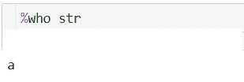

作者创建的图像

# 2.%timeit

这个神奇的命令很有趣。这个神奇的命令通过多次运行来评估代码执行速度，并产生执行时间的平均值+标准偏差。我们用一个例子来试试。

```
import numpy as np
%timeit np.random.normal(size=1000)
```

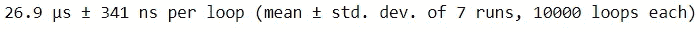

作者创建的图像

使用`%timeit` magic command，我们知道每个执行时间只偏离 341ns 左右。

当您想要查明代码执行和循环过程的稳定性时，此命令非常有用。

# 3.%商店

如果您在一个笔记本中处理一个项目，并希望将您拥有的变量传递到另一个笔记本中，该怎么办？您不需要将它保存在某个目标文件中。你需要的是使用`%store`魔法命令。

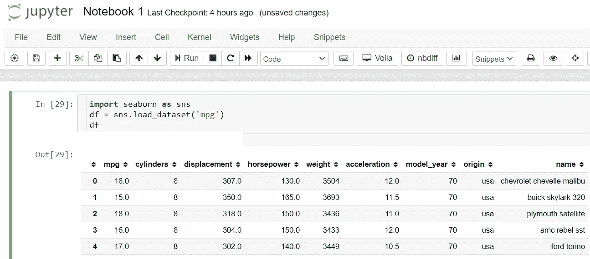

作者创建的图像

这是我们之前的 Jupyter 笔记本，带有包含 mpg 数据框的“df”变量。接下来，我想将这个“df”变量移到另一个笔记本中。我只需要打`%store df`。

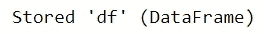

作者创建的图像

“df”变量现在存储在 Jupyter 笔记本中，可以在不同的 Jupyter 笔记本中使用。让我们试着创建一个新笔记本并键入`%store -r df`。

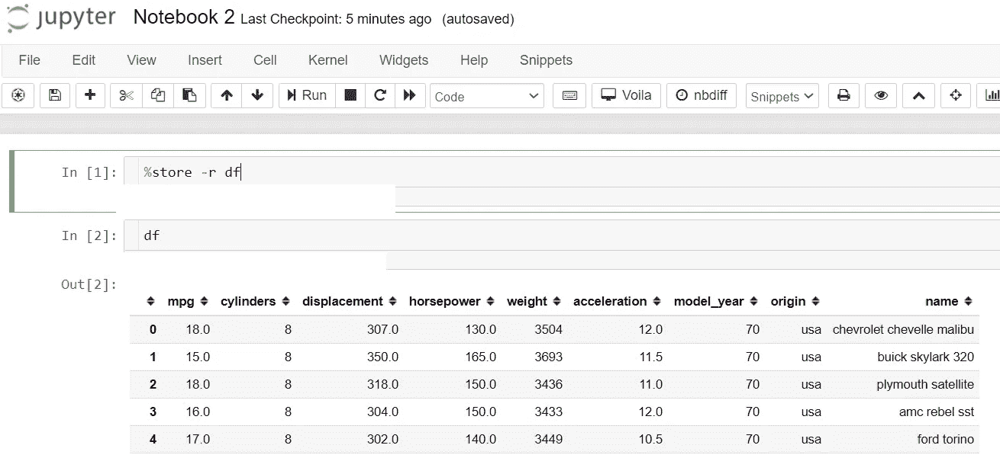

作者创建的图像

就这样，我们的“df”变量被转移到另一个笔记本中，准备用于另一个分析。`%store`魔术命令的独特之处在于，您可以删除笔记本中的变量，并且您仍然可以将变量存储在`%store`魔术命令中。

# 4.%prun

另一个与时间有关的魔法命令。`%prun`是一个特定的神奇命令，用来评估你的函数或程序执行每个函数需要多少时间。

`%prun`的神奇之处在于它显示了一个表格，在这个表格中，您可以看到每个内部函数在语句中被调用的次数、每次调用所用的时间以及函数所有运行的累计时间。

让我们用一个例子来试着运行`%prun`魔法命令。

```
%prun sns.load_dataset('mpg')
```

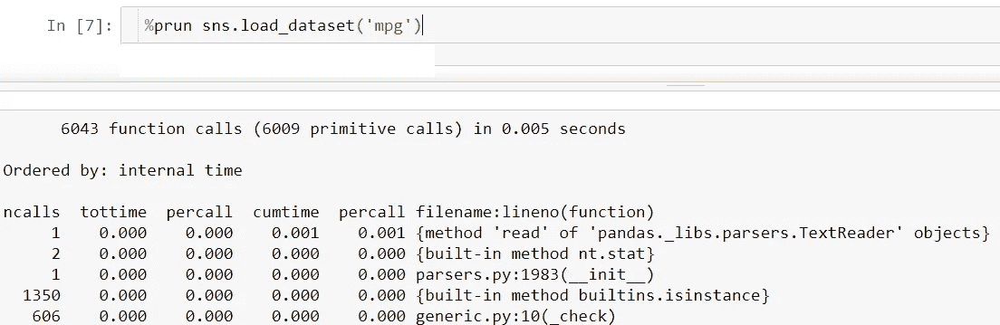

作者创建的图像

如上图所示，我们可以看到语句中每个函数的执行时间，以及它们的时间加上累计时间。

# 5.历史百分比或历史百分比

你是不是一直在做这么多的分析，想知道自己做过什么样的事情，现在的状态是怎样的？当你不得不在单元格之间跳来跳去来运行你的函数时，你可能会比以前更困惑。

在这种情况下，我们可以使用`%history`魔法命令来查看您的活动日志，并追溯您已经做了什么。

试着在你的 Jupyter 笔记本电池上运行`%history`,看看输出是什么。下面是我的。

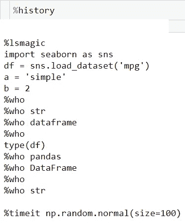

作者创建的图像

# 6.%pinfo

有时，当您在处理一个新的对象或包时，您想要获得所有的详细信息。如果你和我一样是懒惰型的，我们可以使用魔法命令`%pinfo2`来获取我们 Jupyter 笔记本单元格中的所有详细信息。

让我们尝试使用前面的 DataFrame 对象运行这个神奇的命令。

```
%pinfo df
```

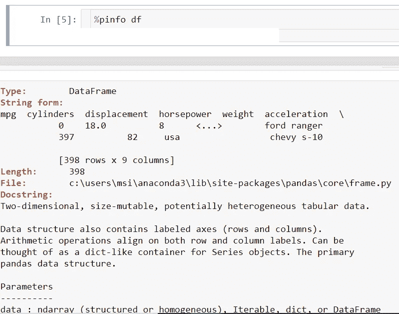

作者创建的图像

使用这个神奇的命令，我们可以看到关于对象的所有信息以及我们可以使用的所有可用参数。

# 7.%%writefile

我们知道 Jupyter Notebook 不是开发和生产环境的最佳 IDE，但这并不意味着我们不能在 Jupyter Cell 中做到这一点。

如果您已经有了自己编写所有令人惊叹的函数，并希望将其保存在 python 文件中，该怎么办呢？当然，您可以打开另一个 IDE 并复制+粘贴该文件，但是有一种更简单的方法。我们可以使用魔法命令`%%writefile`来达到同样的效果。

让我们试着运行下面的代码。

```
%%writefile test.py
def number_awesome(x):
    return 9
```

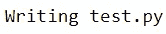

作者创建的图像

检查您当前的目录；您现在应该有一个新的 Python 文件了。

# 8.%pycat

如果您想用另一种方式，比如将 Python 文件读入您的 Jupyter 笔记本，该怎么办？你也可以使用`%pycat`魔法命令来完成。

让我们试着读一下我们之前的 Python 文件。

```
%pycat test.py
```

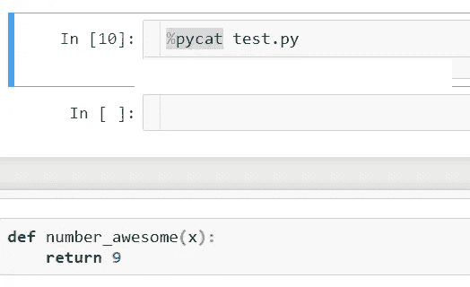

作者创建的图像

将出现一个新的弹出窗口，其中包含 Jupyter 笔记本中 Python 文件内的所有代码。

当您想要在 Jupyter 笔记本中试验许多生产和开发代码时，这个神奇的命令非常有用。

# 9.%quickref

你应该知道的最后一个魔法命令是`%quickref`。为什么这是应该知道的魔法命令？因为这个魔法命令详细解释了 Jupyter 笔记本中存在的所有魔法命令。

让我们试着在你的笔记本上运行它。

```
%quickref
```

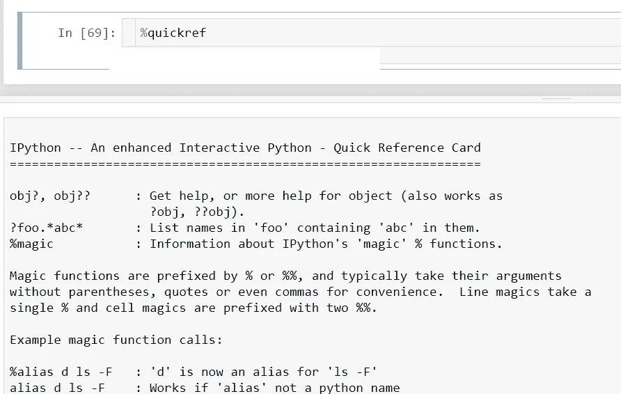

作者创建的图像

就这样，你现在看到了你可以使用的每一个魔法命令的所有解释。那有多有用啊！

# 结论

Magic command 是 Jupyter 笔记本中的一个特殊命令，用于改善我们作为数据科学家的日常活动。有 9 个神奇的命令，我觉得有必要知道的人使用；它们是:

1.  %谁
2.  %timeit
3.  %商店
4.  %prun
5.  历史百分比或历史百分比
6.  %pinfo
7.  %%writefile
8.  %pycat
9.  %quickref

希望有帮助！

# 如果您喜欢我的内容，并希望获得更多关于数据或数据科学家日常生活的深入知识，请考虑在此订阅我的[简讯。](https://cornellius.substack.com/welcome)

> 如果您没有订阅为中等会员，请考虑通过[我的介绍](https://cornelliusyudhawijaya.medium.com/membership)订阅。