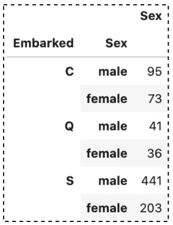
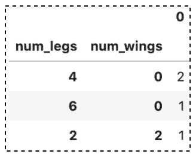

# 提高数据分析能力的 9 个技巧

> 原文：<https://towardsdatascience.com/9-pandas-value-counts-tricks-to-improve-your-data-analysis-7980a2b46536?source=collection_archive---------4----------------------->

## 探索性数据分析和数据预处理的熊猫技巧


照片由[伊琳娜·蒂萨克](https://unsplash.com/@20ira17?utm_source=unsplash&utm_medium=referral&utm_content=creditCopyText)在 [Unsplash](https://unsplash.com/s/photos/count?utm_source=unsplash&utm_medium=referral&utm_content=creditCopyText) 上拍摄

数据科学家经常花大部分时间探索和预处理数据。说到数据剖析和理解数据结构，Pandas `value_counts()`是最受欢迎的。该函数返回包含唯一值计数的序列。结果序列可以按降序或升序排序，通过参数控制包含或排除`NA`。

在本文中，我们将探索熊猫`value_counts()`的不同使用案例。您将学习如何使用它来处理以下常见任务。

1.  默认参数
2.  按升序排列结果
3.  按字母顺序排列结果
4.  从结果中包含`NA`
5.  以百分比计数显示结果
6.  将连续数据绑定到离散区间
7.  分组并呼叫`value_counts()`
8.  将结果序列转换成数据帧
9.  应用于数据帧

> 请查看[笔记本](https://github.com/BindiChen/machine-learning/blob/master/data-analysis/046-pandas-value_counts/pandas-value_counts.ipynb)获取源代码。
> 
> 访问 [Github Repo](https://github.com/BindiChen/machine-learning) 获取其他教程

# 1.默认参数

Pandas `value_counts()`函数返回包含唯一值计数的序列。默认情况下，生成的序列按**降序排列**，没有任何`NA`值。例如，让我们从 [Titanic 数据集](https://www.kaggle.com/c/titanic)中获取列“**apolloed”**的计数。

```
>>> df['Embarked'].value_counts()S    644
C    168
Q     77
Name: Embarked, dtype: int64
```

# 2.按升序排列结果

`value_count()`返回的序列默认为降序。我们可以将参数`ascending`设置为`True`来得到一个升序的结果。

```
>>> df['Embarked'].value_counts(**ascending=True**)Q     77
C    168
S    644
Name: Embarked, dtype: int64
```

# 3.按字母顺序排列结果

我们已经学习了参数`ascending`来获得按值计数 ASC 或 DESC 排序的结果。在某些情况下，按字母顺序显示我们的结果会更好。例如，这可以通过在`value_counts()`之后调用`sort_index(ascending=True)`来实现

```
>>> df['Embarked'].value_counts(ascending=True).**sort_index(ascending=True)**C    168
Q     77
S    644
Name: Embarked, dtype: int64
```

# 4.从结果中包含 NA

默认情况下，结果中会忽略包含任何`NA`值的行。有一种说法`dropna`来配置它。我们可以将值设置为`False`，以包含带有`NA`的行的计数。

```
df['Embarked'].value_counts(**dropna=False**)S      644
C      168
Q       77
**NaN      2**
Name: Embarked, dtype: int64
```

# 5.以百分比计数显示结果

进行探索性数据分析时，有时查看唯一值的百分比计数会更有用。这可以通过将参数`normalize`设置为`True`来实现，例如:

```
df['Embarked'].value_counts(**normalize=True**)**S    0.724409
C    0.188976
Q    0.086614**
Name: Embarked, dtype: float64
```

如果我们希望结果用百分号(%)格式化，我们可以如下设置[熊猫显示选项](/8-commonly-used-pandas-display-options-you-should-know-a832365efa95):

```
>>> pd.set_option('display.float_format', **'{:.2%}'.format**)>>> df['Embarked'].value_counts(**normalize = True**)**S   72.44%
C   18.90%
Q    8.66%**
Name: Embarked, dtype: float64
```

通过调用`pd.set_option('display.float_format', '**{:.2%}'.format**)`，它更新 Pandas 默认显示设置，并应用于所有浮点值。要重置，可以调用`pd.reset_option('display.float_format')`。

另外，感谢[大卫·B·罗森(博士)](https://medium.com/u/3100241e7f2c?source=post_page-----7980a2b46536--------------------------------)的建议。代替熊猫显示选项，我们可以简单地将结果转换成数据帧，并如下调用`style.format('{:.2%}')`:

```
df['Embarked'].value_counts(normalize = True).**to_frame().style.format('{:.2%}')**
```

如果你想了解更多关于熊猫的展示选项，你可以查看:

</8-commonly-used-pandas-display-options-you-should-know-a832365efa95>  

# 6.将连续数据绑定到离散区间

Pandas `value_counts()`可用于通过`bin`参数将连续数据绑定到离散区间。类似于[熊猫](/all-pandas-cut-you-should-know-for-transforming-numerical-data-into-categorical-data-1370cf7f4c4f)`[cut()](/all-pandas-cut-you-should-know-for-transforming-numerical-data-into-categorical-data-1370cf7f4c4f)`函数，我们可以传递一个整数或者一个列表给`bin`参数。

当一个整数被传递给`bin`时，该函数会将连续值离散化到**个大小相等的箱**中，例如:

```
>>> df['Fare'].value_counts(**bins=3**)**(-0.513, 170.776]**     871
**(170.776, 341.553]**     17
**(341.553, 512.329]**      3
Name: Fare, dtype: int64
```

当一个列表被传递到`bin`时，该函数会将连续值分成自定义组，例如:

```
>>> df['Fare'].value_counts(**bins=[-1, 20, 100, 550]**)**(-1.001, 20.0]**    515
**(20.0, 100.0]**     323
**(100.0, 550.0]**     53
Name: Fare, dtype: int64
```

如果你想了解更多关于宁滨的熊猫`cut()`，你可以看看:

</all-pandas-cut-you-should-know-for-transforming-numerical-data-into-categorical-data-1370cf7f4c4f>  

# 7.分组依据并执行 value_counts()

Pandas `[groupby()](/all-pandas-groupby-you-should-know-for-grouping-data-and-performing-operations-2a8ec1327b5)`允许我们将数据分成不同的组来执行计算，以便更好地进行分析。一个常见的用例是按某一列进行分组，然后获取另一列的唯一值的计数。例如，让我们通过对“**”列和“**”列进行分组，得到不同“**性”**值的计数。

```
>>> df.groupby(**'Embarked'**)**['Sex']**.value_counts()**Embarked  Sex   
C         male       95
          female     73
Q         male       41
          female     36
S         male      441
          female    203**
Name: Sex, dtype: int64
```

如果你想了解更多关于`groupby()`的信息，可以查看:

</all-pandas-groupby-you-should-know-for-grouping-data-and-performing-operations-2a8ec1327b5>  

# 8.将结果序列转换成数据帧

Pandas `value_counts()`返回一个序列，包括前面的 MultiIndex 示例。如果我们希望我们的结果显示为数据帧，我们可以在`value_count()`之后调用`to_frame()`。

```
>>> df.groupby('Embarked')['Sex'].value_counts()**.to_frame()**
```



`to_frame()`结果(图片由作者提供)

# 9.应用于数据帧

到目前为止，我们已经将`value_counts()`应用于熊猫系列，在熊猫数据帧中有一个等效的方法。Pandas `DataFrame.value_counts()`返回一个包含数据帧中**唯一行计数的序列。**

让我们看一个例子来更好地理解它:

```
df = pd.DataFrame({
    'num_legs': [2, 4, 4, 6],
    'num_wings': [2, 0, 0, 0]},
    index=['falcon', 'dog', 'cat', 'ant']
)>>> **df.value_counts()****num_legs  num_wings
4         0            2
6         0            1
2         2            1**
dtype: int64
```

通过在`df`上调用`value_counts()`，它返回一个以 **num_legs** 和 **num_wings** 为索引的 **MultiIndex** 系列。从结果中，我们可以发现 2 个记录有`num_legs=4`和`num_wing=0`。

类似地，我们可以调用`to_frame()`将结果转换成数据帧

```
>>> df.value_counts().**to_frame()**
```



df.value_counts()的结果。 **to_frame()** (图片由作者提供)

# 结论

在本文中，我们探索了熊猫`value_counts()`的不同用例。它非常方便，是探索性数据分析和数据预处理中最受欢迎的方法之一。

我希望这篇文章能帮助你节省学习熊猫的时间。我建议你查看一下`value_counts()` API 的[文档](https://pandas.pydata.org/pandas-docs/dev/reference/api/pandas.DataFrame.value_counts.html#pandas.DataFrame.value_counts)，并了解你可以做的其他事情。

感谢阅读。请查看[笔记本](https://github.com/BindiChen/machine-learning/blob/master/data-analysis/046-pandas-value_counts/pandas-value_counts.ipynb)获取源代码，如果你对机器学习的实用方面感兴趣，请继续关注。

## 你可能会对我的其他一些熊猫文章感兴趣:

*   [所有熊猫 json_normalize()你应该知道的扁平化 JSON](/all-pandas-json-normalize-you-should-know-for-flattening-json-13eae1dfb7dd)
*   [使用熊猫方法链接提高代码可读性](https://medium.com/@bindiatwork/using-pandas-method-chaining-to-improve-code-readability-d8517c5626ac)
*   如何对熊猫数据帧进行自定义排序
*   [为了数据分析你应该知道的所有熊猫移位()](/all-the-pandas-shift-you-should-know-for-data-analysis-791c1692b5e)
*   [何时使用 Pandas transform()函数](/when-to-use-pandas-transform-function-df8861aa0dcf)
*   [你应该知道的熊猫串联()招数](/pandas-concat-tricks-you-should-know-to-speed-up-your-data-analysis-cd3d4fdfe6dd)
*   [熊猫的应用()和变换()的区别](https://medium.com/@bindiatwork/difference-between-apply-and-transform-in-pandas-242e5cf32705)
*   [所有熊猫合并()你应该知道](/all-the-pandas-merge-you-should-know-for-combining-datasets-526b9ecaf184)
*   [在 Pandas 数据帧中处理日期时间](/working-with-datetime-in-pandas-dataframe-663f7af6c587)
*   [熊猫阅读 _csv()你应该知道的招数](https://medium.com/@bindiatwork/all-the-pandas-read-csv-you-should-know-to-speed-up-your-data-analysis-1e16fe1039f3)
*   [用 Pandas read_csv()解析日期列应该知道的 4 个技巧](/4-tricks-you-should-know-to-parse-date-columns-with-pandas-read-csv-27355bb2ad0e)

更多教程可以在 [Github](https://github.com/BindiChen/machine-learning) 上找到