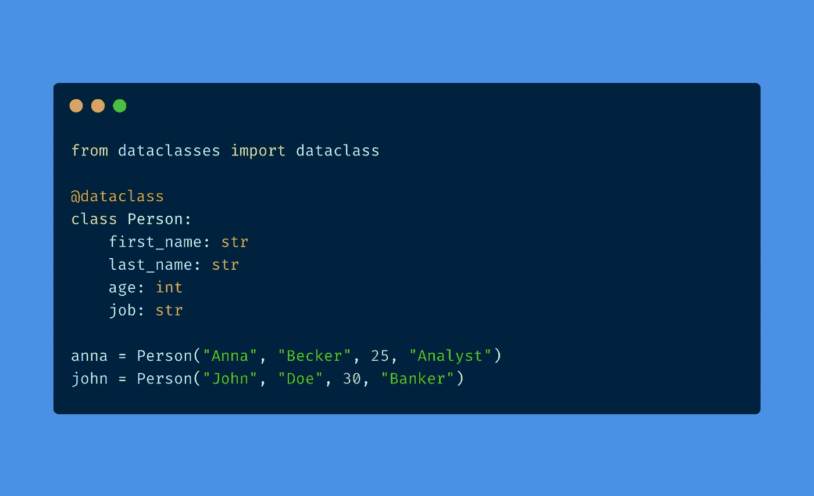
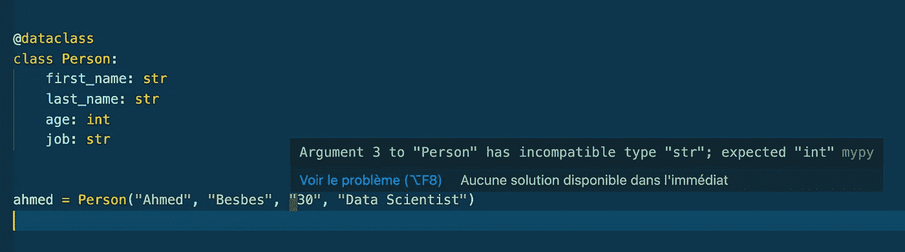
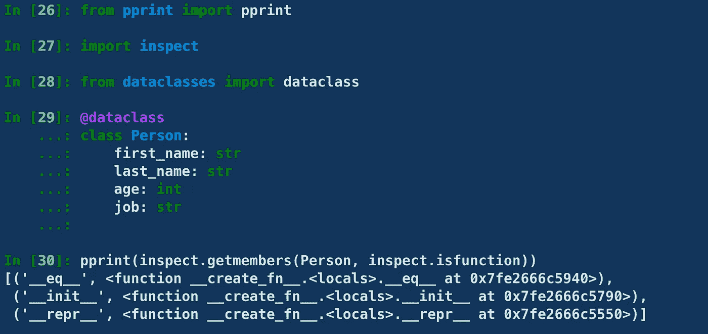
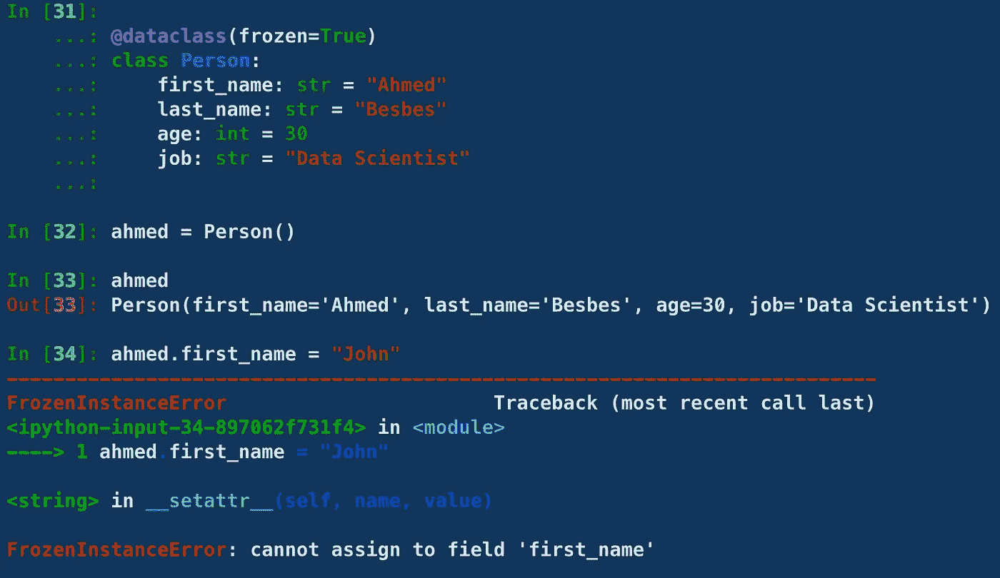
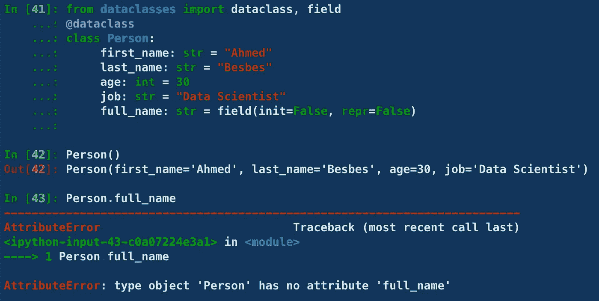

# 应该开始使用 Python 数据类的 9 个理由

> 原文：<https://towardsdatascience.com/9-reasons-why-you-should-start-using-python-dataclasses-98271adadc66?source=collection_archive---------0----------------------->

## 提高效率，减少样板代码



作者图片

从 3.7 版本开始，Python 引入了**数据类**(参见 [PEP 557](https://www.python.org/dev/peps/pep-0557/) )，这是一个定义包含和封装数据的类的新特性。

我最近开始在几个数据科学项目中使用这个模块，我真的很喜欢它。我马上想到两个原因:

1.  **较少的样板代码**
2.  **可读性更强，代码可维护性更好**

> ***这篇文章总结了我的第一印象:我将用它来介绍数据类和它们旨在解决的问题，并介绍它们提供的 9 个不错的特性。
> 我有时会将使用 dataclasses 编写的类与原生 Python 实现进行比较，找出不同之处。***

少说多做。让我们看一看🔍

*PS:我不会涵盖关于数据类的所有内容，但是我们将介绍的特性应该可以让您快速了解。然而，如果您想要更深入的了解，可以看看参考资料部分的链接。*

> 新到中？你可以每月订阅 5 美元，解锁我写的不限数量的关于编程、MLOps 和系统设计的文章，以帮助数据科学家(或 ML 工程师)编写更好的代码。

[](https://medium.com/membership/@ahmedbesbes) [## 通过我的推荐链接加入 Medium—Ahmed bes bes

### 阅读 Ahmed Besbes 的每一个故事(以及媒体上成千上万的其他作家)。您的会员费直接支持…

medium.com](https://medium.com/membership/@ahmedbesbes) 

# 0 —数据类:整体情况

顾名思义，数据类是用来保存数据的类。这个模块背后的动机是，我们有时定义只作为数据容器的类，当我们这样做时，我们会花费大量的时间编写带有大量参数的样板代码，一个丑陋的`__init__`方法和许多被覆盖的函数。

数据类缓解了这个问题，同时提供了额外的有用方法。此外，由于 dataclasses 在 Python 生态系统中相对较新，所以它强制实施了诸如类型注释之类的现代实践。

> ***👉数据类仍然是类。因此，您可以在其中实现任何自定义方法，就像在普通类中一样。***

好，现在让我们看看他们的行动。

# 1 —定义类的代码更少

当我们定义一个类来存储一些属性时，它通常是这样的。

这是标准的 Python 语法。

当您使用 dataclasses 时，您首先必须导入`dataclass`,然后在您定义的类之前使用它作为装饰器。

下面是前面使用 dataclasses 的代码。

关于这个语法，需要注意一些事情:

*   样板代码更少:我们定义每个属性一次，我们自己不重复
*   我们对每个属性使用类型注释。虽然这不会强制类型验证，但是如果您使用类似于 [mypy](http://mypy-lang.org/) 的类型检查器，它会帮助您的文本编辑器提供更好的林挺。如果你不尊重类型，你的代码仍然可以工作，但是你的代码编辑器会发出不一致的信号。



类型注释有助于检测潜在的错误—图片由作者提供

*   dataclasses 不仅仅允许您编写更紧凑的代码。dataclass decorator 实际上是一个自动添加其他方法的代码生成器。如果我们使用`inspect`模块来检查哪些方法被添加到了`Person`类中，我们可以看到`__init__`、`__eq__`和`__repr__`方法:这些方法负责设置属性值、测试相等性并以良好的字符串格式表示对象。



作者截图

如果我们允许`Person`类支持顺序(参见关于比较的技巧 9)，我们也会有这些方法。

*   `__ge__`:大于或等于
*   `__gt__`:大于
*   `__le__`:低于或等于
*   `__lt__`:低于

# 2 —支持默认值

您可以在保留注释的同时为每个属性添加默认值。

👉请记住，没有默认值的字段不能出现在有默认值的字段之后。例如，下面的代码不起作用:

# 3-对象的自定义表示

由于 dataclasses 已经添加了`__repr__`方法，当实例被打印到屏幕上时，它们有了一个很好的、人类可读的表示。

这使得调试更加容易。

这种表示可以被覆盖以实现您想要的任何定制消息。

# 4-轻松转换为元组或字典

实例可以很容易地序列化成字典或元组。当您的代码与需要这些格式的其他程序交互时，这非常有用。

# 5-冻结实例/不可变对象

使用 dataclasses，您可以创建只读对象。您所要做的就是在`@dataclass`装饰器内将`frozen`参数设置为`True`。

这样做时，一旦对象被实例化，就可以防止任何人修改属性值。

如果您试图将冻结对象的属性设置为新值，将会出现一个`FrozenInstanceError`错误。



作者截图

# 6 —不需要编写比较方法

当您使用标准 Python 语法定义一个类并测试具有相同属性值的两个实例之间的相等性时，您会得到以下结果:

这两个对象不相等，这很正常，因为`Person`类实际上没有实现测试相等的方法。为了增加平等性，你必须自己实现`__eq__`方法。这可能看起来像这样:

该方法首先检查两个对象是同一个类的实例，然后测试属性元组之间的相等性。

现在，如果您决定向您的类添加新属性，您必须再次更新`__eq__`方法。如果使用的话，`__ge__`、`__gt__`、`__le__`和`__lt__`也是如此。

这看起来像是不必要的代码输入，对吗？幸运的是，dataclasses 消除了这种困扰。

# 7-使用字段函数的自定义属性行为

在某些情况下，您可能需要创建一个仅在内部定义的属性，而不是在类被实例化时定义。当属性的值依赖于先前设置的属性时，可能会出现这种情况。

在这里，您可以使用 dataclasses 中的**字段**函数。

通过使用这个函数并将其`init`和`repr`参数设置为`False`来创建一个名为`full_name`的新字段，我们仍然可以实例化`Person`类，而无需设置`full_name`属性。

该属性在实例中尚不存在。如果我们试图访问它，就会抛出 AttributeError。



我们如何设置`full_name`的值，并且仍然将它保留在类的构造函数之外？为此，我们必须使用`__post_init__`方法。

# _ _ post _ init _ _ 挂钩

dataclasses 有一个特殊的方法叫做`__post_init__`。

顾名思义，这个方法是在调用了`__init__`方法之后立即调用的。

回到前面的例子，我们可以看到如何调用这个方法来初始化一个依赖于先前设置的属性的内部属性。

请注意，`field`函数中的`repr`参数已被设置为`True`，以使其在打印对象时可见。在前面的例子中，我们不能将这个参数设置为`True`，因为属性`full_name`还没有被创建。

# 9-比较对象并排序

在处理包含数据的对象时，一个有用的特性是能够对它们进行比较，并按照您想要的任何顺序对它们进行排序。

默认情况下，dataclasses 实现了`__eq__`。为了允许其他类型的比较(`__lt__`(小于)、`__le__`(小于或等于)、`__gt__`(大于)和`__ge__`(大于或等于)，我们必须在`@dataclass`装饰器中将`order`参数设置为`True`。

```
**@dataclasses(order=True)**
```

实现这些比较方法的方式是获取每个定义的**字段**，并按照定义的顺序进行比较，直到出现不相等的值。

让我们回到`Person`类。假设我们想要基于`age`属性比较这个类的实例(这是有意义的，对吗？).

为此，我们必须添加一个字段，我们称之为`sort_index`，并将其值设置为`age`属性的值。

我们这样做的方法是调用我们在前面的例子中看到的`__post_init__`方法。

现在来自`Person` a 类的实例可以根据`age`属性进行排序。

# 让我们结束它

Dataclasses 提供了许多特性，允许您轻松地使用充当数据容器的类。

特别是，本模块有助于:

*   编写更少的样板代码
*   以可读的格式表示对象
*   实现自定义排序和比较
*   快速访问属性并检查它们
*   使用 __post_init__ 等特殊方法来执行依赖于其他属性的属性初始化
*   定义内部字段…

# 资源:

在学习 dataclasses 的过程中，我查阅了许多资源(博客帖子、Youtube 视频、PEP、官方 python 文档)
下面是我发现的最有趣的帖子和视频的精选列表。

*   [https://docs.python.org/3/library/dataclasses.html](https://docs.python.org/3/library/dataclasses.html)
*   [https://realpython.com/python-data-classes/](https://realpython.com/python-data-classes/)
*   https://dev.to/dbanty/you-should-use-python-dataclass-lkc
*   [https://dev . to/isabelcmdcosta/data classes-in-python-are-nice-1 fff](https://dev.to/isabelcmdcosta/dataclasses-in-python-are-nice-1fff)
*   [https://youtu.be/vBH6GRJ1REM](https://youtu.be/vBH6GRJ1REM)
*   [https://youtu.be/vRVVyl9uaZc](https://youtu.be/vRVVyl9uaZc)
*   [https://medium . com/minworks/understanding-python-data classes-part-1-c3ccd 4355 c34](https://medium.com/mindorks/understanding-python-dataclasses-part-1-c3ccd4355c34)
*   (法国博客文章)[https://www.invivoo.com/dataclasses-python/](https://www.invivoo.com/dataclasses-python/)
*   [https://flori mond . dev/en/posts/2018/10/reconciling-data classes-and-properties-in-python/](https://florimond.dev/en/posts/2018/10/reconciling-dataclasses-and-properties-in-python/)

# 感谢阅读🙏

如果你已经做到这一步，我真的很感谢你的时间。

我希望我已经阐明了使数据类变得伟大的不同特性，并且我已经说服您开始使用它。

如果你仍然不相信，请告诉我你使用的替代方案。我真的很想听听他们的故事。

今天就这些了。直到下次👋


照片由[卡斯滕·怀恩吉尔特](https://unsplash.com/@karsten116?utm_source=medium&utm_medium=referral)在 [Unsplash](https://unsplash.com?utm_source=medium&utm_medium=referral) 上拍摄

# 新到中？您可以每月订阅 5 美元，并解锁无限的文章— [单击此处。](https://ahmedbesbes.medium.com/membership)