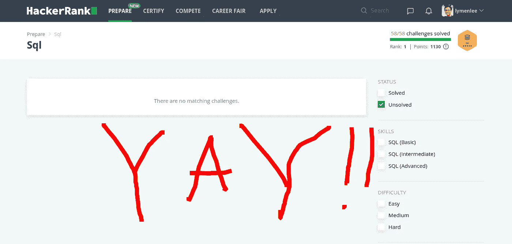

# 帮助我在两周内解决所有 HackerRank SQL 挑战的 9 个技巧

> 原文：<https://towardsdatascience.com/9-tips-that-helped-me-clear-all-hackerrank-sql-challenges-in-2-weeks-479eb0084862?source=collection_archive---------2----------------------->

## 这也将有助于您的 SQL 代码挑战之旅



作者照片

目前工作中的项目需要更多的 SQL 技能，所以我花时间使用 [HackerRank](https://medium.com/u/d3ac51b2731c) 编码挑战平台来复习我的 SQL 知识。我花了两周多一点的时间(断断续续地工作、锻炼、带孩子去日间学校等等。)来完成网站上的所有 58 个 SQL 挑战，我从这个过程中获得了一些深刻的见解(并且从中获得了相当多的乐趣！).这篇文章可以被任何想进入数据科学世界或使用像 [HackerRank](https://medium.com/u/d3ac51b2731c) 或 [LeetCode](https://medium.com/u/33f6b9a1a861) 这样的编码网站为你的下一次 SQL 面试做准备的人阅读，即使你之前没有任何 SQL 知识。我确实放了一些代码给你们看一些简单的例子。大多数技巧都是关于充分利用这些 SQL 挑战，以便您可以从中获得最大收益，而不是教您如何解决这些问题。所以，如果你不懂 SQL 或编码，也不用担心。请坐下，放松，我们开始吧。

# 动机


Sylvester Sabo 在 [Unsplash](https://unsplash.com?utm_source=medium&utm_medium=referral) 上拍摄的照片

SQL 很无聊，因为它没有巧妙的算法或复杂的数据结构。没什么好吹嘘的。它需要更严格的计划和一步一步的执行来缩小你的表格和最终结果之间的差距。然而，这对每个数据分析/数据科学专业人员来说都是必不可少的。这就是我们获取黄金 mine🪙(数据)的方式。今天，人们使用更强大的语言/模块或工具(如 Python/Pandas 或 Tableau)进行大部分数据探索和操作。然而，我们仍然离不开 SQL，因为我们需要首先从那些“尘封”的关系数据库中获取数据。

当然，当你在像 [HackerRank](https://www.hackerrank.com) 或 [LeetCode](https://leetcode.com/) 这样的网站上处理具有挑战性的编码问题时，SQL 可以不那么无聊。通过正确的方法，每个具有基本 SQL 知识的人都可以从 SQL 编码挑战中获得乐趣，并在此过程中提升他们的 SQL 技能。这就是我将在接下来的会议中讨论的内容。

# 技巧 1:首先获得一些基本的 SQL 知识

显然，您需要有一些基本的 SQL 知识来开始这些挑战，尽管在这个过程中您会学到更多。学习基本的 SQL 是相对容易的，因为我们有大量的在线资源来帮助你。我使用了两个好的来源:

> [**模式:数据分析的 SQL 教程**](https://mode.com/sql-tutorial/introduction-to-sql/) :非常有节奏，从基础到高级主题。它还提供了一个在线 SQL 环境，您可以使用教程中已经使用的数据库进行实时尝试——无需求助于 [sqlfiddle](http://sqlfiddle.com) 等。
> 
> [**SQLZoo**](https://sqlzoo.net) :在我看来，比较新的学习者友好的。从最简单的子句(如 SELECT)到更复杂的连接，它会一直帮助您。如果你从来没有学过 SQL，在这里你会感觉更舒服。脸书招聘人员也推荐它。

一旦您觉得已经掌握了大多数命令的窍门，您就可以应对这些挑战了。没有必要过度学习你的基础知识。做所有这些挑战是一个很好的方式来实践你所学的，并在此过程中学习新的技巧。

# 技巧 2:仔细观察你的数据


照片由[米卡·鲍梅斯特](https://unsplash.com/@mbaumi?utm_source=medium&utm_medium=referral)在 [Unsplash](https://unsplash.com?utm_source=medium&utm_medium=referral) 上拍摄

查看您的数据并沿途做笔记是解决问题的一半。更好的是，在头脑中想象你的数据，或者使用白板(物理的或数字的)来帮助把查询放在一起。我们人类在视觉上思考时效率更高。所以离开白板，画出你的表格，放入一些样本数据，也许画线来显示关系。有些挑战相当复杂，你必须把所有的部分放在一个大的画面中，无论是在白板上还是在你的脑海中，以找到出路。在白板上做更容易(除非你是尼古拉·特斯拉，那么你就可以简单地用你的大脑解决问题)。🤔

另一个技巧是充分利用许多小而无用的实用查询来熟悉数据。查询不会直接为最终结果构建数据，而是向您展示数据的外观，揭示有价值的见解，并为您的想法提供即时反馈。您可以从:`SELECT * FROM table LIMIT 10;`开始，看看您的表是什么样子，然后尝试在不同的列上聚合，看看您是否可以获得一些见解。

```
SELECT *， COUNT(*) FROM table GROUP BY column;
```

也许可以更好地组织数据，并把它们放在另一个中间表( [CTE](https://www.geeksforgeeks.org/cte-in-sql/) )中以备后用。

```
WITH temp_table as ( SELECT xxx…)
SELECT * FROM temp_table
```

上面的代码片段是我所说的“扔掉的”实用程序查询的简单例子。显然，您可以做得更多，这取决于您正在解决什么问题。这种解决问题的方式也在真实数据科学家的工作中广泛使用，并有一个名字:[探索性数据分析](/exploratory-data-analysis-8fc1cb20fd15)。为什么不现在就开始做呢？

# 提示 3:理解问题是解决问题的一半

我不记得有多少次我被卡住了，想知道为什么我完美的代码行不通，或者为什么问题就是无法解决，然后发现我误读了问题本身😜。这很愚蠢，但是当你急于在短时间内解决所有的挑战时(比如当你在做认证测试或面试时)，你会惊讶地发现自己是多么容易上当。

所以看题的时候要慢*慢*。不要跳过看似*次要*的语句。一个设计良好的挑战通常会在明文中隐藏重要的线索，仔细阅读问题就会发现它们。对模式、表关系以及问题的内容有一个明确的理解。你在这里度过的时间将会因为避免可怕的愚蠢的错误而得到巨大的补偿。

> 有时候慢就是快。

# 技巧 4:在编写代码之前制定一个计划


照片由[布雷特·乔丹](https://unsplash.com/@brett_jordan?utm_source=medium&utm_medium=referral)在 [Unsplash](https://unsplash.com?utm_source=medium&utm_medium=referral) 上拍摄

一旦你掌握了基本的 SQL 技能，清楚地理解了问题，并且知道了你的数据，现在是时候开始你的挑战了，首先制定一个计划。我怎么强调这有多重要都不为过。如果你只记得这篇文章中的一个提示，记住这个，制定一个计划。这是因为 SQL 挑战的本质是复杂的数据操作，通常需要多个聚合/抽象层来解决。通过对事物进行规划，在抽象的特定层面上进行思考，使认知成为可能，并防止我们钻得太深而无法回忆起全局。

> 我通常使用的思维方式是这样大声思考:问题是要求数据点 A 和 B，我可以通过聚合这 3 列来获得 A，通过使用窗口函数来打印出 c 列的有序列表来获得 B，好的，对于 A，我们需要从头开始创建列，我将使用内部连接来将它们放在一起。对于 B，窗口函数需要按 D 列划分，按 E 列排序，…

你看，我从顶层开始，逐步向下，一直到我选择的具体条款。把它说出来可以让我自己听到，加强我对问题和计划的记忆，从而帮助我思考。另一个好处是:在实际的 SQL 面试中，招聘人员通常希望你大声思考，这样他们会更好地了解你的思维过程。大多数时候，展示解决问题时的思维过程和解决问题一样重要，甚至更重要。如果你在所有的挑战中练习这一点，你会变得非常舒服(甚至有点兴奋)。大声说话会让你感觉更自信，让面试官看起来更自信。

# 技巧 5:不要为偷看讨论区而感到羞耻


照片由[迪米特里·拉图什尼](https://unsplash.com/@ratushny?utm_source=medium&utm_medium=referral)在 [Unsplash](https://unsplash.com?utm_source=medium&utm_medium=referral) 拍摄

在学习的时候偷看答案没什么好丢人的。你的目标是练习你的技能，而不是试图通过认证考试。有时候你会发现自己在一个挑战上陷得太久了。不要花费过多的时间去解决它。相反，使用 *15 分钟规则*:

> “用 15 分钟的时间，尽你所能解决问题。但是，如果 15 分钟后没有答案，你**必须**问别人。”

这里应用 15 分钟规则的一个原因是你还在学习。有时，挑战需要使用一些你还不知道的技巧或条款。就像人们说的:*你不知道你不知道的*。在这上面花更多的时间也无济于事。另一个原因是，解决问题有时需要你退后一步，再次看到更大的画面，并弄清楚你是否陷入困境，需要走出去并改变路线。

> 培养你自由切换抽象层次的能力将对你的编码/数据分析职业生涯有很大的帮助。

当你从讨论板上得到提示并完成挑战后，停下来想一想为什么你会错过它？你的知识中有没有缺失的部分？你的思维/方法的盲点？再说一遍，慢慢来。你在学习。沉思时间是你将从这些挑战中学到最多的时候，通过找出你知识中的弱点并相应地改进它。

# 提示 6:选择有助于你实现目标的挑战

大多数算法/数据结构编码挑战往往有点“棘手”，这是理所当然的。然而，对于 SQL 来说，现实生活中要解决的问题更多的是简化复杂的关系，而不是想出数学问题的巧妙解决方案。总的来说，我发现 HackerRank 的 SQL 挑战大多遵循现实世界的挑战。然而，偶尔你还是会遇到在现实生活中很难发现的问题，比如著名的挑战[打印素数](https://www.hackerrank.com/challenges/print-prime-numbers/problem)。感觉就像有人把 Python 编码挑战放到 SQL 表单中，强迫你去解决。我在这里可能有偏见，但忽略这些挑战。还不如用 Python 来做。除了智能的乐趣之外，将 SQL 用于它没有被设计的用途不会有任何帮助。我们大多数人都不会为此而访问 HackerRank 或 LeetCode 这样的网站，不是吗？

# 技巧 7:停留一会儿，思考一下


照片由[罗布·施莱克希斯](https://unsplash.com/@robschreckhise?utm_source=medium&utm_medium=referral)在 [Unsplash](https://unsplash.com?utm_source=medium&utm_medium=referral) 上拍摄

一旦你破解了挑战，抵制诱惑，点击多汁的“**下一个挑战”**按钮！我强烈建议你反思自己解决问题的过程，问自己一些高质量的问题:

我用了什么子句？它们为什么会起作用？为什么其中一些不起作用？有更好的选择吗？我是如何解决这个问题的？我如何把它分解成更小的子问题？我汇总了哪些中间数据来得到最终结果？

我知道，有时在应对复杂挑战的兴奋中，很难停下来思考这些棘手的问题，这似乎会让我们慢下来，但相信我，这是更快的学习方法。

# 技巧 8:不要让艰难的挑战阻碍你参加认证考试

我得说一些“硬”挑战可能相当棘手。在这种情况下，您需要想出一些聪明的方法将所需的数据放在一起。我曾经使用 8 个 cte、两个窗口函数和多个连接来获得我想要的结果。但是认证测试更合理，更接近真实世界的问题。我的经验是，与提出新颖的旋转技巧相比，认证测试需要更仔细的问题阅读、模式剖析，甚至白板演示。所以，即使你遇到了一些挑战，也不要让它们让你气馁！当你觉得准备好了，参加认证考试，你仍然可以轻松通过！

# 技巧 9:分而治之。逐步解决这个问题


兰斯·阿斯佩在 [Unsplash](https://unsplash.com?utm_source=medium&utm_medium=referral) 上拍摄的照片

现在来看编码部分。我会在下面列出我认为对我有帮助的内容:

*   理解子查询和 CTE( [通用表表达式](https://www.geeksforgeeks.org/cte-in-sql/))的一个简单方法是将其视为其他编程语言中的一个函数。如果你不止在一个地方使用它，为什么不把它放到一个函数里呢？而子查询就像一个 lambda 函数，您可以在运行时编写它，并在使用后将其丢弃。它们有助于使您的代码可读性更强，概念上更容易理解，这对解决复杂的 SQL 挑战有很大的价值。
*   聚合是将原始数据提炼为更有意义、更接近问题所问内容的主要方式。 **GROUP BY** 有助于使用 SUM()、COUNT()、MIN/MAX()或 AVG()压缩数据，而窗口函数在项目级别执行聚合功能(最适合处理“前 N 名”类问题)。有时你需要许多级别/步骤的聚合才能到达你想要的地方。再次，查看您的数据和挑战问题，并仔细设计您的'**聚合图**'
*   JOIN vs. LEFT JOIN:老实说，这两个是你需要的主要连接。当您希望只返回两个表中都有对的行时，请使用 JOIN，当您需要“左”表中的所有行时，请使用 LEFT JOIN，无论它们在“右”表中是否有对。
*   编写查询的顺序:最自然的方式是编写关于如何执行的查询:FROM > WHERE > GROUP BY > HAVING > SELECT > ORDER BY > LIMIT。忍住从 SELECT 开始的冲动。像机器一样思考。
*   从两端工作，你的桌子，问题问什么来解决问题。从数据/表格的角度:问问你自己，它可以用表格构建什么？什么样的聚合可以进一步提取数据？从最终结果方面:需要哪些数据？什么样的桌子有助于解决问题？想象一下，一些中级表可以帮助弥合差距。尽量两边都做，中间点会合。同样，在不同的抽象层次思考很有帮助。

# 奖金:

> **如果你破解了所有的挑战，就在 HackerRank 上进行你的 SQL 认证测试(初级和**中级**)。你能做到的！**

# 结论

SQL 挑战与常规的算法/数据结构挑战略有不同。它要求你以一种更有组织的方式思考，构建你的代码，并在不同的抽象层次之间切换。掌握这些“慢”技能，你可能会发现自己比你想象的更快地通过挑战，最重要的是，它会让你为关键的 SQL 面试做好充分准备！

我希望你觉得这篇文章读起来很有趣，并从中学习到一些东西。如果你想更多地了解我对数据科学的思考、实践和写作，可以考虑报名成为 Medium 会员。每月 5 美元，你可以无限制地阅读媒体上的故事。如果你注册使用我的链接，我会赚一小笔佣金。

[](https://lymenlee.medium.com/membership) [## 通过我的推荐链接-李立伟加入媒体

### 作为一个媒体会员，你的会员费的一部分会给你阅读的作家，你可以完全接触到每一个故事…

lymenlee.medium.com](https://lymenlee.medium.com/membership)