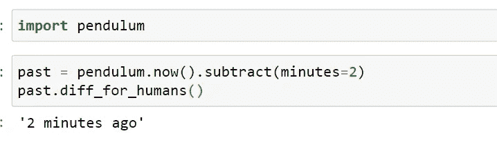
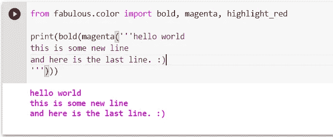

# 9 个未知的 Python 库会让你大吃一惊

> 原文：<https://towardsdatascience.com/9-unexplored-python-libraries-that-will-amaze-you-d0803a4516ba?source=collection_archive---------4----------------------->

## Python 库让您的生活变得更加轻松


约书亚·索蒂诺在 [Unsplash](https://unsplash.com?utm_source=medium&utm_medium=referral) 上拍摄的照片

Python 编程充满了机会。它简单明了，有很多很酷的库和函数，可以让任务变得更容易。每个 Python 开发者都必须使用流行的库，比如 NumPy、pandas、date time、matplotlib、Tkinter 等等。然而，有一些鲜为人知的库可以让您的开发人员生活变得更加轻松，并改善您的编码体验。

在本文中，我将讨论九个您可能感兴趣的 Python 库。其中一些库甚至可以用来替代一些标准的 Python 库。所以他们绝对是要小心的！

# **1。钟摆**

Pendulum 是一个很棒的 Python 库，可以处理日期和时间。这个库在涉及时区的情况下非常有用。关于这个库最好的部分是它继承了 Python DateTime 库，所以它也可以使用这个库。

我们可以使用下面一行代码来安装这个库。

```
pip install pendulum
```

想见识一下摆库的魔力吗？查看下面一行代码。

```
import pendulumpast = pendulum.now().subtract(minutes=2)
past.diff_for_humans()
```



使用钟摆模块的好处是用户友好。你可以得到令人兴奋的结果。

# **2。** **神话般的**

大多数运行在命令行上的 Python 应用程序看起来乏味无趣。神话般的可以用来给他们一个很好的改造，通过添加图像，彩色文本到控制台。

要安装 fantastic，我们需要运行下面的 python 命令。

```
pip install fabulous
```

要在终端上打印彩色文本，我们可以使用

```
from fabulous.color import bold, magenta, highlight_redprint(bold(magenta('''hello worldthis is some new lineand here is the last line. :)''')))
```



这个库支持 Python 2.6、2.7、3.3、3.4、3.5 和 PyPy。也可以在 Google Colab 上测试一下。

# **3。**py webview

Pywebview 是一个 python 库，用于以 GUI 形式显示 HTML、CSS 和 JavaScript 内容。这意味着使用这个库，您可以将您的网站或网页显示为桌面应用程序。

使用以下命令安装 pywebview。

```
pip install pywebview
```

要启动一个显示给定网站的窗口，我们需要运行

```
import webviewwebview.create_window(“Test window”, “target domain name”, width=400, height=200, fullscreen=False, resizable= true)webview.start()
```

将为 webview 启动一个新窗口。

> *想* ***敬请期待*** *同更多类似* ***精彩*** *文章上* ***Python &数据科学*** *—做会员考虑使用我的推荐链接:*[*【https://pranjalai.medium.com/membership*](https://pranjalai.medium.com/membership)*。*

# **4。** **海博**

Seaborn 是一个用于数据科学项目数据可视化的库。它建立在标准可视化库 Matplotlib 的基础上，可以使情节更加丰富多彩，更具吸引力

要安装它，我们可以运行以下命令。

```
pip install seaborn
```

要使用数据集绘制线图，我们可以使用:

```
import seaborn as snsdataset=sns.load_dataset(“dataset name”)sns.lineplot(x=”x-axis name”, y=”y-axis name”, data = dataset)
```

# **5。** **Psutil**

Psutil 是一个有用的跨平台 Python 库电话，可以获取与系统相关的信息。人们可以收集系统中正在进行的进程、CPU 利用率、RAM 使用等信息。

使用下面的命令安装 psutil。

```
pip install psutil
```

要计算系统在 3 秒间隔内的 CPU 利用率，我们可以运行:

```
import psutilpsutil.cpu_percent(interval=3)
```

# **6。** **PyGame**

顾名思义就是制作游戏的 Python 库。它包含许多图形和声音库，开发者可以用它们来制作游戏。此外，复杂的游戏逻辑和物理也可以使用 PyGame 的内置模块来实现。

要安装 PyGame，我们需要使用:

```
pip install pygame
```

# **7。** **Pyforest**

在从事数据科学项目时，我们需要导入许多库，如 NumPy、Pandas、Matplotlib 等。Pyforest 库帮助我们一起导入所有重要的库

我们只需运行以下命令。

```
pip install pyforest
```

你可以访问所有的库，比如 NumPy，Pandas，Matplotlib，seaborn 等等。Pyforest 还安装了其他一些重要的库，如 os、tqdm、re 等。

# **8。** **摩丁**

Modin 是一个库，它通过利用机器的所有内核而不是单个内核来改进你的熊猫工作流程。这尤其有助于提高处理大型数据集时的性能。

您可以使用这一行代码安装这个库。

```
pip install modin
```

现在，您可以像这样安装它——这样您就不需要对代码做进一步的修改。

```
**import** **modin.pandas** **as** **pd**
```

这就是你需要做的。不需要对代码做进一步的修改。

# **9。** **熊猫 _ 剖析**

这是一个 Python 库，可用于获取数据集、其属性以及属性间相关性的概述。

可以使用下面显示的命令安装它。

```
pip install pandas-profiling
```

要获得数据框的分析并将分析结果保存为 web 格式，我们可以使用

```
from pandas_profiling import ProfileReportreport = ProfileReport(dataframe)report.to_file(output_file=’output.html’)
```

您可以进一步将此报告保存为 HTML 或 pdf 文件，以供进一步分析。

如果你正在寻找更多 python 的超酷功能，那么——这里有一本关于 python 编程的书[,我**肯定会向所有初学者推荐**。](https://amzn.to/3A8OszW)

# 结论

这些是一些鲜为人知的库，可以用来改善您的编码体验，并取代现有的标准 Python 库。您可以在文档页面中获得关于这些库的详细教程，因为大多数库都是开源的。

作为开发人员，这些库肯定会让您的生活更加轻松。

***注:*** *本文包含代销商链接。这意味着，如果你点击它，并选择购买我上面链接的资源，你的订阅费的一小部分将归我所有。*

*然而，推荐的资源是我亲身经历的，并在我的数据科学职业生涯中对我有所帮助。*

> *在你走之前……*

如果你喜欢这篇文章，并且想要**继续关注**更多关于 **Python &数据科学**的**精彩文章，请点击这里[https://pranjalai.medium.com/membership](https://pranjalai.medium.com/membership)考虑成为一名中级会员。**

请考虑使用[我的推荐链接](https://pranjalai.medium.com/membership)注册。通过这种方式，会员费的一部分归我，这激励我写更多关于 Python 和数据科学的令人兴奋的东西。

还有，可以随时订阅我的免费简讯: [**Pranjal 的简讯**](https://pranjalai.medium.com/subscribe) 。