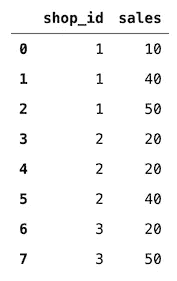
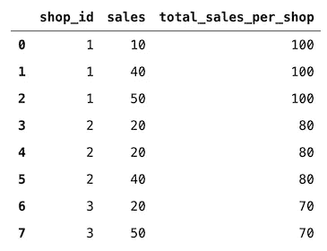
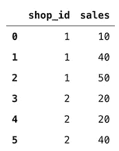
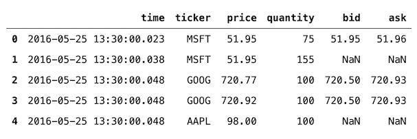
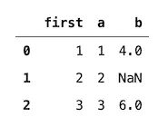
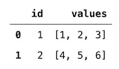
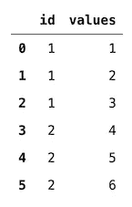
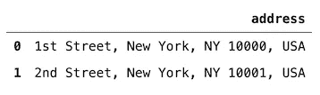
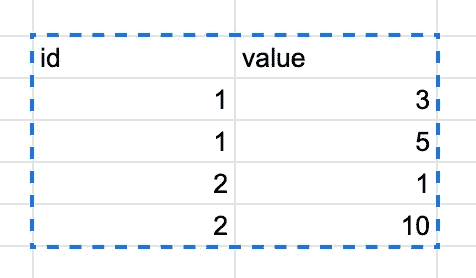
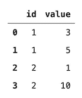

# 你可能没听说过的 9 种有用的熊猫方法

> 原文：<https://towardsdatascience.com/9-useful-pandas-methods-you-probably-have-not-heard-about-28ff6c0bceee?source=collection_archive---------9----------------------->


Zoe Nicolaou 在 [Unsplash](https://unsplash.com/s/photos/panda?utm_source=unsplash&utm_medium=referral&utm_content=creditCopyText) 上拍摄的照片

## 它们可以让你的日常工作更容易、更快捷。

在本文中，我想快速展示一些有用的`pandas`方法/函数，它们在您的日常工作中会派上用场。为了管理期望，这不是一篇展示`pandas`基本功能的文章，也没有特别的方法主题。事不宜迟，我们开始吧！

# 1.哈斯南斯

检查一个系列/数据帧是否包含缺失值的方法有很多，包括专用库，如`missingno`。检查数据帧的列是否包含缺失值的简单方法如下:

```
df["column"].isna().any()
```

或者，我们可以使用 pd 的`hasnans`方法。略少打字的系列:

```
df["column"].hasnans
```

一个缺点是这种方法不适用于数据帧，尽管我们可以很容易地将它与列表理解结合使用:

```
[df[col].hasnans *for* col *in* df.columns]
```

使用这种方法，我们自然会丢失列名。所以我认为`hasnans`的主要用例是对单个列进行快速检查。

# 2.改变

`transform`方法用于对整个数据帧进行转换，或者对选定的列进行不同的转换。然而，使这个方法脱颖而出的是它返回一个与输入形状相同的对象。

这就是为什么在处理聚合时`transform`可以节省大量时间。通常，如果我们想要在原始数据帧中有一些聚合值(想想每组的总和或平均值)，我们可以使用`groupby`创建一个新的、更小的数据帧，然后将其合并回原始数据帧。这有点耗时，并且会产生不必要的中间对象。

有了`transform`，我们可以一气呵成！让我们创建一个包含一些商店 id 及其多日销售额的数据框架(为了简单起见，我们跳过日期)。



作者图片

使用下面的代码片段，我们可以很容易地将每个商店的销售额相加:



作者图片

`transform`绝对简化了流程。`transform`的一个更高级的用例可以用于聚合过滤。例如，我们希望提取关于销售超过 75 件商品的商店的行。并且理想情况下不会在输出数据帧中创建新的列。我们可以这样做:



作者图片

# 3.merge_asof

原则上，这个函数类似于一个标准的左连接，但是，我们匹配最近的键而不是相等的键。这将通过一个例子变得更加清楚。

我们还需要知道使用`merge_asof`有 3 个连接方向(定义改编自文档):

*   `backward` —对于左侧数据帧中的每一行，我们选择右侧数据帧中最后一行，其`on`键小于或等于左侧键。这是默认的。
*   `forward` —对于左侧数据帧中的每一行，我们选择右侧数据帧中的第一行，其`on`键大于或等于左侧键。
*   `nearest` —对于左侧数据帧中的每一行，我们搜索选择右侧数据帧中其`on`键在绝对距离上最接近左侧键的行。

另一件要考虑的事情是两个数据帧都必须按键排序。

我不会尝试重新发明轮子，我将使用[文档](https://pandas.pydata.org/pandas-docs/stable/reference/api/pandas.merge_asof.html)中提供的例子。这里，我们有两个数据框架，一个包含交易信息，另一个包含报价。两者都包含详细的时间戳(包括毫秒)。

然后，我们在报价时间和交易时间之间的`2ms`内合并两个数据帧:

以下数据帧的结果是什么:



作者图片

通过从输出帧到两个数据帧的几个例子，最容易理解合并的逻辑。

# 4.插入

这是一个简单而方便的方法。我们可以用它在数据帧中的特定位置插入一列。最常见的用例是当我们想要添加一个包含额外信息的列，以便更容易地分析输出时。为了我们和利益相关者的方便，这些信息作为第一栏将是最有用的。我们可以通过下面的代码片段做到这一点:



作者图片

# 5.激增

当我们想要将一个数据帧中的列表展开成多行时，explode 非常有用。想象一下下面的情况——我们有两个 id，并且在列表中为每个 id 存储了多个值。我们希望每个 ID-值组合都有一行。



作者图片

```
df.explode("values", *ignore_index*=True)
```



作者图片

# 6.潜艇用热中子反应堆（submarine thermal reactor 的缩写）

当处理包含字符串的列时，我们可以使用`str`，它允许我们使用各种方便的方法，这些方法可以以矢量化的方式应用于整个列。例如，我们可以很容易地将包含完整地址的列拆分成单独的部分。首先，让我们创建数据框架。



作者图片

然后，我们可以使用`str.split`方法来创建新的列。


作者图片

另一种可能性是使用`str.replace`方法来修改字符串。

# 7.阅读 _ 剪贴板

当您经常使用 Excel/Google 工作表或接收此类文件中的数据时，这种方法尤其有用。使用 `read_clipboard`，我们可以使用计算机的剪贴板轻松地将数据从源表加载到`pandas`。这样，我们可以绕过将文件保存到`.csv`或`.xls`的需要。自然，这对于一些小的、特别的分析非常有用。



作者图片

上面你可以看到 Google sheets 中一个简单表格的例子。我们选择范围，按下`cmd+c`(或者对于 Windows 按下`control+c`，然后使用下面的代码片段轻松地将数据加载到 Python 中:

```
pd.read_clipboard()
```

什么会返回以下内容:



作者图片

# 8.evaluate 评价

`eval`方法使用字符串表达式来有效地计算数据帧上的操作。根据文件:

> 支持以下算术运算:`+`、`-`、`*`、`/`、`**`、`%`、`//`(仅限 python 引擎)以及以下布尔运算:`|` (or)、`&` (and)、和`~` (not)。此外，`'pandas'`解析器允许使用与相应的位操作符具有相同语义的`[and](https://docs.python.org/3/reference/expressions.html#and)`、`[or](https://docs.python.org/3/reference/expressions.html#or)`和`[not](https://docs.python.org/3/reference/expressions.html#not)`。


作者图片

# 9.挤压

还记得当您想从一个数据帧中提取一个标量值，经过一些过滤后，您使用`.values[0]`来访问最终输出的情况吗？然后你可能会想，一定有更好的方法来做这件事。确实有——`squeeze`方法。

首先，让我们定义一个数据帧:

然后，我们可以尝试访问数据帧中的特定值，例如:

```
df.loc[df["a"] == 3, "b"]
```

输出如下所示:

```
2    6.0
Name: b, dtype: float64
```

对于一个简单的`print`来说，这是可以的，但是当我们想把这个值赋给一个变量或者甚至把它放在另一个数据帧中时，这可能会导致一些问题。

获取标量值的优雅解决方案是在末尾添加`squeeze`方法:

```
df.loc[df["a"] == 3, "b"].squeeze()
```

回报:

```
6.0
```

# 在你走之前

你可以在我的 [GitHub](https://github.com/erykml/medium_articles/blob/master/Data%20Wrangling/useful_pandas.ipynb) 上找到本文使用的代码。此外，欢迎任何建设性的反馈。我将非常高兴听到一些`pandas`功能，使您的工作更容易！你可以在推特[或评论中联系我。](https://twitter.com/erykml1?source=post_page---------------------------)

喜欢这篇文章吗？成为一个媒介成员，通过无限制的阅读继续学习。如果你使用[这个链接](https://eryk-lewinson.medium.com/membership)成为会员，你将支持我，不需要你额外付费。提前感谢，再见！

您可能还会对以下内容感兴趣:

</make-working-with-large-dataframes-easier-at-least-for-your-memory-6f52b5f4b5c4>  </explaining-the-settingwithcopywarning-in-pandas-ebc19d799d25>  </embed-your-interactive-visualizations-in-medium-posts-using-datapane-9613314f048d> [## 使用 datapane 将您的交互式可视化嵌入到中型帖子中

towardsdatascience.com](/embed-your-interactive-visualizations-in-medium-posts-using-datapane-9613314f048d)