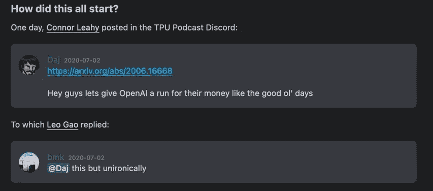

# 2021 年 NLP 回顾展

> 原文：<https://towardsdatascience.com/a-2021-nlp-retrospective-b6f51e60026a?source=collection_archive---------21----------------------->

## 是时候回顾一下自然语言处理领域今年的一些亮点了

图片由[莲蓬头](https://commons.wikimedia.org/wiki/File:Christmas_tree_sxc_hu.jpg)；根据[知识共享署名 3.0](https://creativecommons.org/licenses/by/3.0) 获得许可

在过去的一年中，自然语言处理(NLP)领域发生了很多事情，我想花一些时间来反思一下我个人的一些亮点。

# TL；速度三角形定位法(dead reckoning)

对于那些赶时间的人:

*   如果你只读了 2021 年 NLP 上的一篇文章，那就让它成为《纽约客》上的聊天机器人问题(T4)
*   如果你只读了今年的一篇论文，我强烈推荐[关于随机鹦鹉的危险:语言模型会不会太大？](https://dl.acm.org/doi/pdf/10.1145/3442188.3445922)
*   如果你只想花时间在一个课程上，以达到最先进的 NLP 的速度，请查看[拥抱脸的课程](https://huggingface.co/course/chapter1/1)(免费！)
*   如果你在 NLP 上只看了一个视频，我发现谷歌的 LaMDA 演示给人印象非常深刻

# 一月

让我们从一个有趣的问题开始:[果蝇能学习单词嵌入吗？](https://arxiv.org/abs/2101.06887)本文研究生物学和神经网络之间的关系。虽然从生物学中获得了高层次的灵感，但当前一代的深度学习方法不一定符合生物学现实。这提出了一个问题，即生物系统是否可以进一步为新网络架构和学习算法的发展提供信息，从而导致机器学习任务的竞争性能或提供对智能行为的更多见解。

为了做到这一点，研究人员使用了果蝇的模拟大脑，这是神经科学中研究得最好的网络之一。事实上，他们能够显示，令人惊讶的是，这个网络确实可以学习单词和它们的上下文之间的相关性，并产生高质量的单词嵌入。

# 二月

跟踪自然语言生成(NLG)的进展是很棘手的，因为就其本质而言，NLG 任务没有固定的正确与错误的定义。为了克服这一挑战并跟踪 NLG 模型的进展，一个涉及来自 44 个机构的 55 名研究人员的全球项目[提出了 GEM](https://arxiv.org/abs/2102.01672) (生成、评估和度量)，这是一个以评估为重点的 NLG 生活基准环境。

GEM 项目的最终目标是实现对数据和模型的深入分析，而不是关注单个排行榜分数。通过测量跨越许多 NLG 任务和语言的 13 个数据集的 NLG 进度，希望 GEM 基准也可以为未来使用自动和人工度量评估生成的文本提供标准。

研究人员已经向 NLG 研究社区开放了该项目，资深成员将帮助新来者做出贡献。GEM 基准位于 gem-benchmark.com 的，更多信息也可以在拥抱脸的[数据中心](https://huggingface.co/datasets/gem#dataset-description)找到。

# 三月

声明:我为 AWS 工作，对下一个 100%有偏见，但我真的认为它很酷:)

拥抱脸和 AWS 的合作关系已经彻底改变了我的工作。我敢肯定，没有人阅读这个博客需要介绍[拥抱脸](https://huggingface.co/)。今年 3 月宣布的合作伙伴关系引入了新的拥抱脸深度学习容器(DLC)，使得在亚马逊 SageMaker 中训练和部署拥抱脸变压器模型比以往任何时候都更容易。

这个惊人的 [Github 库](https://github.com/huggingface/notebooks/tree/master/sagemaker/)由 [Philipp Schmid](https://medium.com/@schmidphilipp1995) 开发，让你尝试所有的新特性，从分布式培训到模型部署&自动扩展。

# 四月

剑桥大学的化学系和物理系在四月份发表了一篇非同寻常的论文，其中描述了他们如何训练一种不同的语言模型。

研究人员使用序列嵌入，一种众所周知的 NLP 技术，将蛋白质序列转换成 200 维嵌入向量。如果你想知道，200 维确实被认为是如此复杂信息的低维表示！这项技术允许团队训练一个语言模型，该模型优于几种现有的机器学习方法，用于使用公开可用的数据集预测蛋白质液-液相分离(LLPS)。

现在，我不会假装我理解什么是 LLPSs，但是从我的理解来看，它们是理解蛋白质的分子语法和发现潜在错误的基础。这可能是癌症和神经退行性疾病(如阿尔茨海默氏症、帕金森氏症和亨廷顿氏症)研究取得突破的第一步。

# 五月

我很确定你曾经尝试过和你的智能家居助手进行一次适当的对话。我知道我有过，但从来没有持续过那么久。除了一两次交流之外，助理通常无法掌握谈话的内容，这种尝试通常以令人沮丧的*“我不确定我理解这个”*而告终。

在今年 5 月的谷歌 I/O 大会上，[公司宣布了其在对话式人工智能领域的最新进展](https://www.youtube.com/watch?v=aUSSfo5nCdM)， [LaMDA](https://blog.google/technology/ai/lamda/) (对话应用的语言模型)。这是一种会话式的语言模式，似乎能够进行更长时间的对话。他们与冥王星和纸飞机对话的演示给人留下了深刻的印象。值得称赞的还有他们披露的事实，即现在还为时尚早，并指出该模式的一些局限性。我真的希望谷歌能在某个时候发布一个版本来玩玩。

# 六月

如果你喜欢弱者挑战强者的故事，这本书可能适合你:

作者图片

这是 Connor Leahy 和 Leo Gao 之间的一次交流，启动了 [EleutherAI](https://www.eleuther.ai/) ，这是一个由志愿者研究人员、工程师和开发人员组成的分散式基层集体，专注于人工智能对齐、扩展和开源人工智能研究。成立于 2020 年 7 月，他们的旗舰项目是 GPT-近地天体系列模型，旨在复制 OpenAI 开发的 GPT-3。他们的 [Discord 服务器](https://discord.gg/zBGx3azzUn)已经开放，欢迎贡献者。

六月，他们发布了最新的模型，GPT-J，它有 60 亿个参数，相比之下 GPT-3 有 1750 亿个参数。尽管规模小得多，但 GPT J 在编写代码等专业任务上胜过它的大兄弟。

我发现这种趋势非常令人鼓舞，并很兴奋地期待着 EleutherAI 的下一步。

# 七月

七月份《纽约客》发表了一篇关于语言模型偏见的文章。这在 NLP 社区中并不是一个新话题。然而，对于像《纽约客》这样的杂志来说，选择这样的主题凸显了现代 NLP 模型的重要性和关注点。这让我想起了 2020 年《T2 卫报》关于 GPT-3 的文章——这是主流媒体关注小众话题的时刻。

《纽约客》的这篇文章关注的是语言模型如何反映我们的语言，最终反映我们自己。尤其是这句话让我印象深刻:*“我们正被迫面对作为技术问题的人类基本奥秘:我们对自己内心的黑暗知之甚少，我们对这种黑暗的控制又是多么微弱。”*

# 八月

接下来的这个故事引起了《纽约客》文章的共鸣，因为在八月[玛格丽特·米歇尔加入了拥抱脸](https://twitter.com/mmitchell_ai/status/1430218595569594371)。米切尔在 2021 年 2 月被解雇之前一直是谷歌的伦理人工智能研究员。她与人合著了一篇关于大型 NLP 模型相关成本和风险的[论文](https://dl.acm.org/doi/pdf/10.1145/3442188.3445922)(笔名为 Shmargaret Shmitchel ):

> 我们已经确定了与越来越大的 LMs 的热潮相关的各种各样的成本和风险，包括:环境成本(通常由那些没有受益于由此产生的技术的人承担)；财务费用，这反过来又设置了进入壁垒，限制了谁能对这一研究领域作出贡献，以及哪些语言能从最先进的技术中受益；机会成本，因为研究人员将精力从需要较少资源的方向上转移；以及实质性伤害的风险，包括刻板印象、诋毁、极端主义意识形态的增加和错误逮捕，如果人类遇到看似连贯的 LM 输出，并认为它是对所说的话负责的某些人或组织的话。

我很高兴看到 Mitchell 加入了 Hugging Face，这是一家推动开源机器学习和繁荣社区的公司。如果你想更多地了解她在拥抱脸的工作，可以看看她的视频[关于开发机器学习项目时要记住的价值观。](https://www.youtube.com/watch?v=8j9HRMjh_s8&ab_channel=HuggingFace)

# 九月

说到开源 NLP，[爆炸](https://explosion.ai/)也经历了很棒的一年。这是最受欢迎的 NLP 图书馆之一 [spaCy](https://spacy.io/) 背后的公司。9 月份，他们在首轮融资中以 1.2 亿美元的估值筹集了 600 万美元。

不得不承认，2021 年的 spaCy 我还没跟上。我主要专注于在变形金刚库上提升自己的技能。因此，我很惊讶地看到 spaCy 今年早些时候在 spaCy 3.0[中发布的所有新功能。2022 年我一定会再次把目光投向 spaCy。](https://explosion.ai/blog/spacy-v3)

Explosion 不仅提供了一个最流行的 NLP 库，他们还创建了 Prodigy，一个[现代注释工具](https://explosion.ai/software#prodigy)。这很重要，因为创建更好的模型的一个潜在方法是首先创建更好的训练数据——这就是数据注释工具派上用场的地方。

看到一位女性( [Ines Montani](https://ines.io/) )成为一家人工智能公司的首席执行官是一个不错的转变:)

# 十月

十月，NLP 峰会 2021 召开。本次会议展示了 NLP 最佳实践、真实世界的案例研究、在实践中应用深度学习&迁移学习的挑战，以及您今天可以使用的最新开源库、模型&变形金刚。

许多 NLP 圈子里的知名演讲者在这次会议上发言，其中一些亮点是:

*   为什么&如何关注 NLP 伦理？
*   科学文献的极端概括
*   利用人工智能实现经济复苏

你仍然可以在他们的网站上点播所有的讲座。

# 十一月

拥抱脸有相当一年，我不得不再次提到他们。11 月，该公司发布了他们课程的第二部分，帮助你快速入门最先进的 NLP 模型。本课程将带您踏上一段旅程，首先从高级管道 API 开始，让您通过两行代码利用 NLP 技术。然后，它逐渐深入到变形金刚的堆栈中——在你意识到之前，你已经从头开始创建了自己的因果语言模型。

第二部于 11 月推出，伴随着一系列讲座和会谈，你可以在这里找到。

# 十二月

非常合适的是，这个列表中的最后一项也提供了 NLP 领域未来的展望。12 月，Louisa Xu 在《福布斯》上发表了她关于自然语言的黄金时代的文章。

这是一篇很棒的文章，介绍了目前最有影响力的三家 NLP 公司。她的总结和展望非常到位，我让她自己来说:

> 每一家从语言中获取价值的公司都会从 NLP 中受益，NLP 是机器学习中最具变革潜力的分支。语言几乎是我们所有交往中的最小公分母，我们从语言中获取价值的方式在过去三年中发生了巨大的变化。NLP 的最新进展具有极大的潜力来提高业务绩效。它甚至有希望将信任和诚信带回我们的在线互动中。大型现任者是第一批跳上船的，但真正的希望在于下一波 NLP 应用和工具，它们将把围绕人工智能的宣传从意识形态转化为现实。

# 结论

所以，现在你知道了，这些是我个人在 NLP 的 2021 年的亮点。我希望你喜欢这个总结，如果能听到你在过去 12 个月里在 NLP 的个人亮点，那就太好了。请对这篇博文发表评论或直接联系。