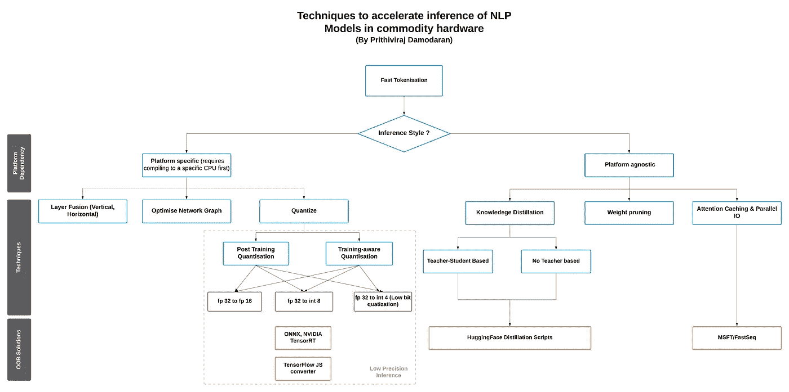
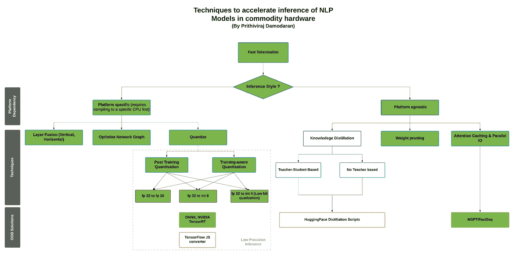
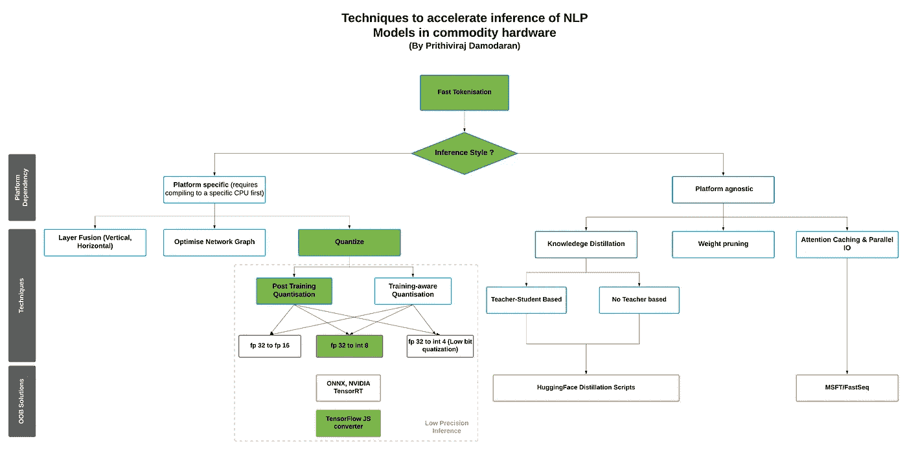
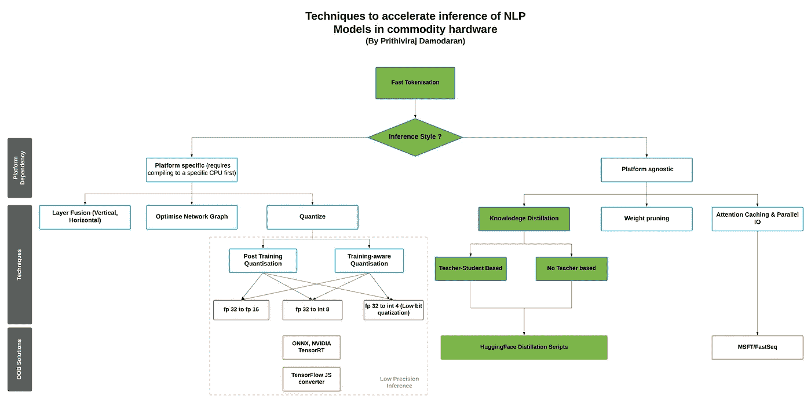

# 关于如何在商用硬件上加速 NLP 模型推理的 3 分钟阅读。

> 原文：<https://towardsdatascience.com/a-3-minute-read-on-how-to-accelerate-nlp-model-inferences-in-commodity-hardware-575a8075d424?source=collection_archive---------36----------------------->

## **罗盘导航**地景**加速推理**

## **序幕**

一种在使用串行和/或并行专用硬件的数据中心中加速服务器端模型推断被证明是简单的(理解为简单而不容易)。一段时间以来，数据中心一直在使用专门的硬件，即:*图形处理单元(GPU)、现场可编程门阵列(FPGAs)和专用集成电路(例如谷歌 TPU)* ，这要感谢云服务提供商，他们使这些硬件变得非常容易访问。现在，像 FPGA 这样的专用硬件甚至出现在智能手机这样的消费设备上(iPhones 上的[FPGA](https://www.forbes.com/sites/aarontilley/2016/10/17/iphone-7-fpga-chip-artificial-intelligence/#:~:text=An%20FPGA%20is%20a%20type,has%20appeared%20in%20an%20iPhone.))，所以，手机上的 ASICs 不是想象中的事情。像东京的 LeapMind 这样的公司正在积极开发专用硬件，用于受约束和边缘设备的训练和加速推理。但使用专门的硬件来加速推理是一个非常狭窄的世界，并留下了巨大的空间。*但幸运的是，已经有很多关于在没有任何专门硬件的情况下，即在商品硬件和* ***中加速推理的研究，这篇文章将作为一个指南针，帮助你浏览可用的选项。***

## 最大的问题

> 如何在服务器端和客户端(胖客户端和受限/边缘设备)的商用硬件中加速模型推理？

## 但是为什么呢？

由于“**推理预算”**通常非常少，因此有几个原因可以加速商用硬件上的模型推理，尤其是在客户端。此外，由于**延迟**和**带宽**的问题，并不是所有基于 ML 的解决方案都能提供服务器端推理的最佳用户体验。对于一些应用来说，**数据** **隐私**是另一个挑战:消费者不希望数据像智能手机一样离开他们的设备。像 [**差分** **隐私**](https://en.wikipedia.org/wiki/Differential_privacy) 和 [**联合** **学习**](https://en.wikipedia.org/wiki/Federated_learning) 这样的创新确实有助于缓解担忧，但实现起来很复杂。因此，我们最好在更紧的推理预算内寻找一些操作选项。

# **基于自然语言处理模型的心理模型**

在商品硬件中，加速推理是棘手的，因为它不是推理预算等式中的唯一变量。模型尺寸和我们可能权衡的精确度也是至关重要的。因此，这里有一些技术可以帮助 ***压缩模型(可选)和/或加速推理，而不会在准确性上做出巨大的妥协。***

这篇文章的范围是分享关于可用选项的广泛观点，并给出一般性建议。所以在这篇文章中，你不会找到太多关于这些技术如何在内部工作的信息。我会写一篇后续。

## 可用选项

NLP 中的任何推理请求都有两部分:一是**输入** **标记化**二是实际**模型** **预测**调用。HuggingFace 通过将标记化的最新研究民主化，钉死了标记化部分。这里有一个 [**概要**](https://huggingface.co/transformers/tokenizer_summary.html) 。

商用硬件上的 NLP 推理—可用选项(图片由作者提供)

## 胖客户端/服务器端推断(例如 Outlook 自动响应)

商用硬件上胖客户端和服务器端推理的路径(图片由作者提供)

## 瘦客户端推理(例如基于浏览器)

瘦客户端路径，如基于浏览器的推理硬件(图片由作者提供)

## 受限/边缘设备推断(例如智能手机、物联网设备)

边缘或受约束设备推断的路径(图片由作者提供)

想法/评论？

[**参考文献:**](https://huggingface.co/blog/accelerated-inference)

1.  【https://huggingface.co/blog/accelerated-inference 
2.  [https://towards data science . com/low-precision-inference-with-tensorrt-6 EB 3c da 0730 b](/low-precision-inference-with-tensorrt-6eb3cda0730b)
3.  [https://en . Wikipedia . org/wiki/专用集成电路](https://en.wikipedia.org/wiki/Application-specific_integrated_circuit)