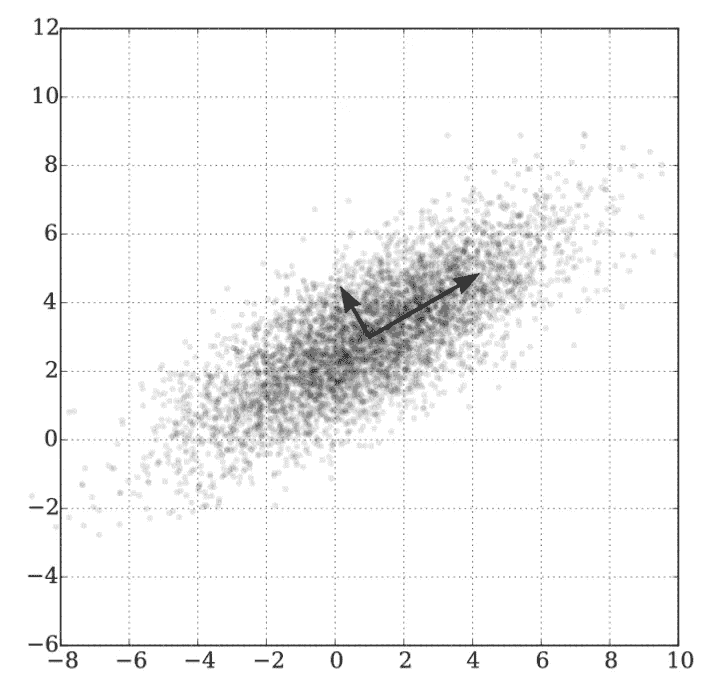
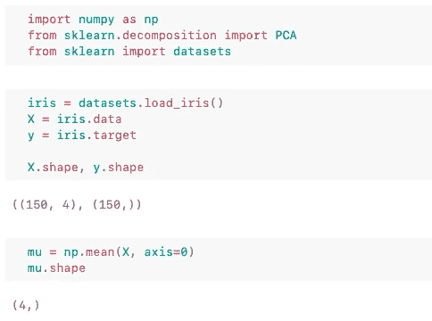
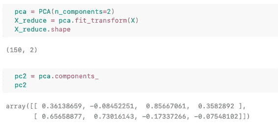
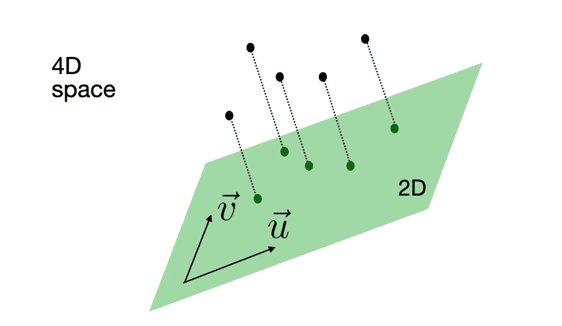
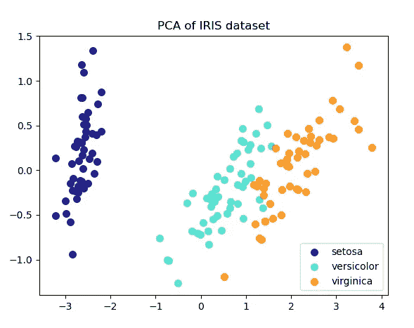
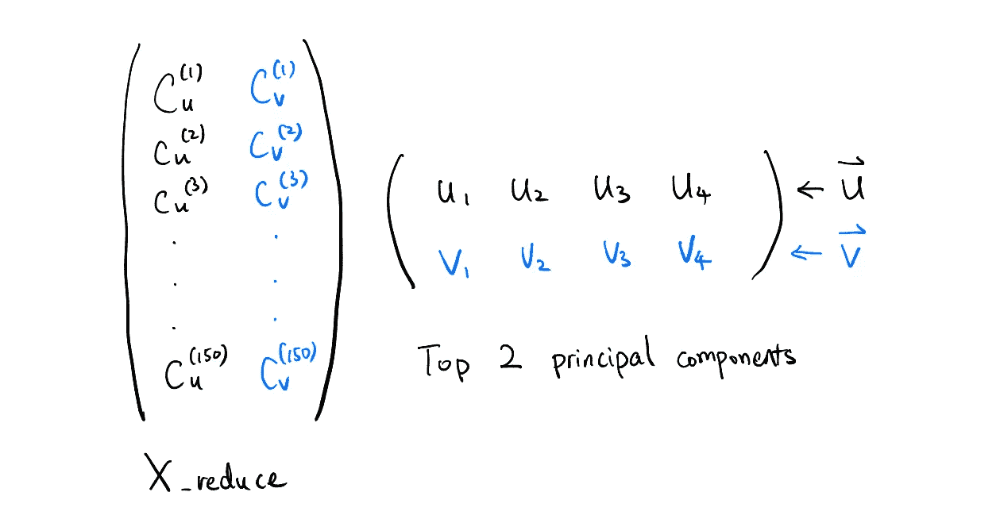
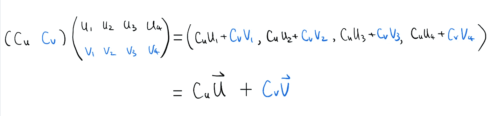
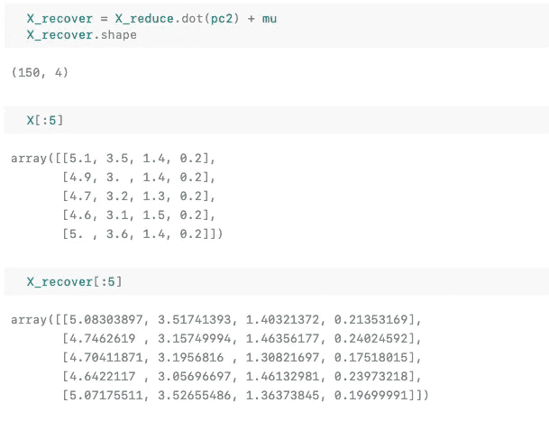

# 对 PCA 的 3 分钟回顾:压缩和恢复

> 原文：<https://towardsdatascience.com/a-3-minute-review-of-pca-compression-and-recovery-38bb510a8637?source=collection_archive---------44----------------------->

## 3 分钟回顾

## PCA 最便捷的视觉笔记

照片由乔尼·克洛在 [Unsplash](https://unsplash.com?utm_source=medium&utm_medium=referral) 上拍摄

如今，数据科学家和 ML 工程师的知识深度通常通过他们对算法的数学和实现细节的反馈来判断。我不同意这种做法。现实是，没有人能记住每一个细节，这没关系。**你不需要知道如何实现一个算法来应用它。即使你知道如何实现它，面对实际问题时，你仍然会错误地判断何时以及如何正确地使用它。**

**提取直觉以便正确应用是关键**。

我正在创建这个 3 分钟的算法回顾系列，重点放在直觉部分。通过一个简单的算法是什么、如何、为什么和何时的例子，你可以很快很容易地抓住要点。

在今天的文章中，让我们深入研究 PCA——最重要的降维算法。

> PCA 做投影降维。

直观上，它只是从数据点到一个更低维的超平面画出正交线，找到着陆点。超平面的轴基于它们捕获的方差的*最大化来选择。他们捕捉的差异越多，预测保留的信息就越多。通过这种轴选择方案，PCA 实现了最小的信息损失，并对数据进行了良好的*压缩*。*

[维基百科](https://en.wikipedia.org/wiki/File:GaussianScatterPCA.svg)

# 最小的例子:从 4D 到 2D 的投影

让我们用`sklearn`和著名的 Iris 数据集来演示它是如何工作的。

作者图片

从代码中，我们看到有 150 个例子和 4 个特性列。很难直接可视化 4D 的数据，让我们使用`sklearn.decomposition.PCA`将它们投影到 2D。

作者图片

`pc2`是两个最高级的*主成分*——这里的两个行向量。它们在原始特征空间中，因此是 4 维的。

我们要投影到的 2D 平面由`pc2`中的这两个向量(主分量)构成。它们是平面的*基向量*。让我们称他们为`u`和`v`。这架 2D 飞机生活在 4D 空间。从原始特征空间——4D 空间的角度来看，PCA 所做的是将原始 4D 数据点投影到这个 2D 平面上。

矩阵`X_reduce`的形状为(150，2)，即约化 2D 空间中的 150 个例子。每一行是一个有两个坐标的向量。请记住，第一个数字对应于`u`上的系数，第二个数字对应于`v`上的系数。

作者图片

这样，原始(150，4)数据被缩减/压缩为(150，2)。

在 2D 可视化结果:

作者图片

# 从 2D 到 4D 的复苏

如果你只关心可视化，工作就完成了。但 PCA 作为一种压缩方案的好处在于，你可以使用*主成分*、*、*、*投影*、原始特征*表示*来恢复数据，并获得非常接近原始数据的近似值。

`X_reduce`具有 2D 的所有投影，我们可以通过简单地用`pc2`做矩阵乘法并加回平均值来获得恢复的数据。矩阵形状:(150，2) * (2，4)––>(150，4)。

作者图片

我们可以查看`X_reduce`中的一行，即一次一个示例，这样可以更清楚地看到矢量变换。`Cu`是基准`u`上的坐标，`Cv`在`v`上。

作者图片

这就是我们如何从 2D 恢复 4D 数据——通过使用 2D 投影乘以 4D 主成分。最后，别忘了加回均值。

现在让我们看看恢复的数据与原始数据的接近程度

作者图片

仅仅通过目测，我们就可以知道复苏做得相当不错。这就是为什么 *PCA 也可以压缩图像*的原因，因为图像与这里的矩阵没有太大的不同。

就是这样！通过这个极小的例子，我希望你在高层次上获得 PCA 背后的线性代数的*感觉*，并且知道将来什么时候使用它。如果你对寻找引擎盖下主要部件的过程感兴趣，网上有大量的资料。关键词是奇异值分解(SVD)。

同样，你不需要知道如何实现一个算法来使用它，这就是为什么很多库从我们这里抽象出细节。只要你理解基本的机制和直觉，作为一个调用库并且从未从头实现算法的 ML 实践者是没问题的。

反胃容易，消化难。

这里是我的一些其他文章，你可能会感兴趣

*   [可视化神经网络优化轨迹](/from-animation-to-intuition-visualizing-optimization-trajectory-in-neural-nets-726e43a08d85)
*   [为什么是乙状结肠:概率观点](/why-sigmoid-a-probabilistic-perspective-42751d82686)
*   [我如何设计自己的全栈式 ML 工程学位](/how-i-designed-my-own-full-stack-ml-engineering-degree-297a31e3a3b2)
*   [为反向传播建立心智模型](/building-a-mental-model-for-backpropagation-987ac74d1821)

关注我并订阅我的[电子邮件列表](https://medium.com/@loganyang/about)以获取新文章的更新。