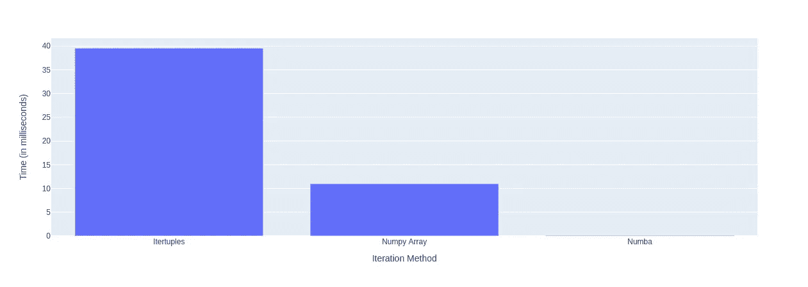
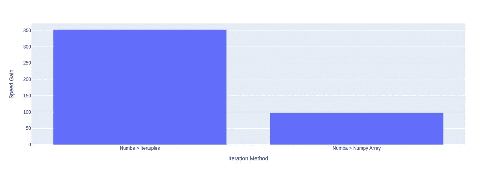

# 迭代数据时速度提升 300 倍？是的，请！

> 原文：<https://towardsdatascience.com/a-300x-speed-boost-when-iterating-data-yes-please-b11a29b9b818?source=collection_archive---------30----------------------->

## 当你必须浏览大量数据时，如何让自己的速度提高 300 倍(使用 Numba！)

回溯测试面临的挑战之一是必须遍历行。与矢量化成为可能并带来显著速度提升的其他操作不同，回溯测试时会受到限制，因为通常需要前一行的值来计算下一行。这迫使你不得不迭代数据，正如我们所知，这是非常缓慢的。

最近，我需要对一个包含大约 15 年期权数据的数据集进行迭代。诚然，这不是我见过的最大的数据集，但它仍然是一个相当大的数据集。因此，我决定探索和比较三种不同的方法来遍历它

## TL；博士；医生

[数字巴](https://numba.pydata.org)是地球上最伟大的发明。如果您可以使用数组和 numpy 来执行迭代，请使用 numba。

# 准备数据

这里真的没什么可看的——只是通过移除美元符号并将所有内容转换为浮点数来稍微清理一下数据。

我们要测试的主要内容是迭代数据框架以及平仓和开仓交易，计算 PnL 和账户规模的变化。账户大小将决定下一笔交易的手数，因此矢量化是不可能的，因为每笔后续交易的 PnL 取决于手数，而手数又取决于前一笔交易中账户大小的变化。

## 方法一:`Itertuples`

对 StackExchange 的粗略搜索表明,“itertuples”是当人们询问有关遍历数据帧的问题时通常会出现的方法。这比“iterrows”更快，因为在底层，pandas 将每一行转换成一个元组，而不是 pandas 系列，这使得访问数据更快。我还使用了我在某处读到的一个技巧，即设置“name=None ”,以便创建未命名的元组(这已被证明可以提高速度)。

## 方法 2:循环数组

这里，我们去掉了笨重的熊猫数据帧，代之以使用 numpy 数组。不幸的是，由于我需要回测的方式，矢量化不是一个选项，也没有任何我可以使用的 numpy ufuncs。好的老的循环必须做。

## 方法三:数字巴

最后，我决定在前面的循环数组中添加 numba。Numba 通过将某些 Python 和 Numpy 代码翻译成机器码(！！)在运行时。这使得它能够实现更高的速度。作为一个额外的奖励，它使用起来非常简单——只需安装@ `numba.jit`装饰器，就可以开始了！

# 测试时间

为了使用我的 array 和 Numba 函数，我必须将我的 dataframe 转换成一个数组。

然后，我对每个函数都运行了一次“计时”。注意，我只对非 numba 函数运行了 100 次循环，因为 1000 次循环花费的时间太长了…

鉴于三个测试的单位完全不同，结果非常清楚。这里有一些显示原始速度的图表(我知道这是一个非常糟糕的图表)

按作者分类的图表

一个更清晰的图表显示了使用 Numba 获得的速度提升

按作者分类的图表

# 结论

Numba 似乎将竞争对手打得落花流水——因此，当需要在不能向量化的回溯测试环境中迭代数据帧时，使用 numpy 数组，然后加入“ [@numba](http://twitter.com/numba) .jit”装饰器，您将会在这些迭代中取得突破。