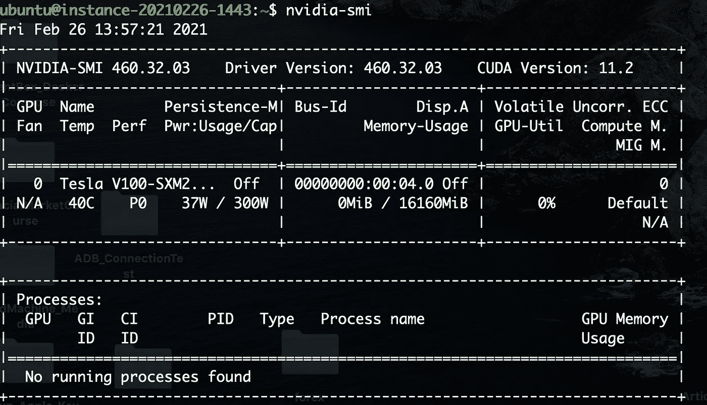
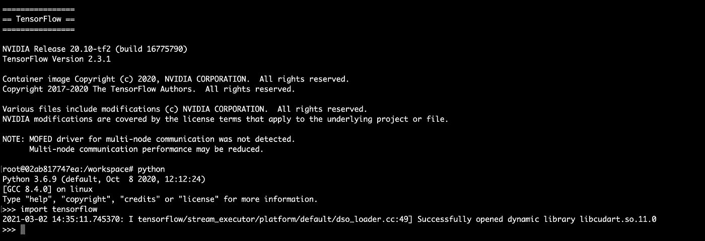

# 深度学习项目的 5 分钟生产就绪设置

> 原文：<https://towardsdatascience.com/a-5-minutes-production-ready-setup-for-your-deep-learning-project-9ff860fc3c4b?source=collection_archive---------20----------------------->

## 忘掉所有配置 GPU 的头疼事吧

无论你使用什么深度学习库或框架，都不再重要。您将能够在短短 5 分钟和几行代码内设置好它。

https://unsplash.com/photos/7nsqPSnYCoY

# 为你的深度学习项目建立一个良好的环境并不是一件容易的事情。

您有太多的事情需要处理:库必须匹配特定的版本，整个环境需要可复制到其他机器，所有的东西都需要能够与您拥有的机器中的所有驱动程序通信。这意味着您需要为您的 NVIDIA GPU 安装特定的驱动程序，这是一个 CUDA 库，必须与您的驱动程序和您想要使用的框架兼容。

***“好吧，但是来吧，你只需要做一次就行了，对吧？”*** 没有比这更远离事实的了。库发展如此之快，以至于你可能需要最新的能力。所以你需要更新一切。

> 你可以用 Anaconda 来管理一切，对吗？嗯，也许吧。

这里你的纸牌屋肯定会倒塌。你可以用 Anaconda 来管理一切，对吗？嗯，也许吧。Anaconda 为您做了很多事情，很难在不影响整个环境的情况下改变*【只是一件小事】*。

但是，如果您的软件包不适用于您的平台、操作系统，或者您只需要一个不存在的版本，该怎么办呢？您将使用快速 *pip* 命令手动添加它。

## 嘣！你搞砸了一切，你需要从头开始(或者从你最近的备份)重建一切。

好吧，是时候从这个噩梦中走出来了。

# 欢迎来到英伟达 NGC。

随着容器彻底改变了软件开发的世界，它们现在可以帮助数据科学家构建更健壮的环境。

**有一点是肯定的:数据科学可以从软件开发世界中学到一些东西。**

> 嘣！你搞砸了一切，你需要从头开始(或者从你最近的备份)重建一切。

NGC 是软件中心，提供 GPU 优化框架、预训练模型和工具包，以在生产中训练和部署人工智能。它是一个容器注册表，包含训练模型所需的所有工具:不管您使用的是 Caffe2、Pytorch、Tensorflow、Keras、Julia 还是其他工具。

在 [NGC 目录](https://ngc.nvidia.com/catalog/)中有成吨的生产准备好的容器，你只需要选择你的。

英伟达 NGC 不仅是一个容器注册表，它内置了许多功能，可以帮助您的组织将模型投入生产。查看 NVIDIA 的文档页面了解更多信息。

# 我们应该从什么开始？

先说一台配有 GPU 的 Linux 机器(*如果要训练模型，GPU 不是强制性的但是强烈推荐)*。我在 Ubuntu 20.04 LTS 版和 18.04 LTS 版上进行了测试，但可以很容易地适应其他 Linux 发行版或 Windows 机器。

## **注意** : **你没有 GPU 还是你只是不想搞乱你的系统？**

> [只需注册 Oracle Cloud 的免费试用版。您将获得 300 美元的积分，并且可以使用 GPU(只要确保您选择了一个可以使用 GPU 的家庭区域)。](https://bit.ly/rob-oc-free-tier)
> 
> [点击此处](https://www.oracle.com/uk/cloud/data-regions/)了解更多关于 GPU 地区的信息。如果您注册，您还可以访问 Oracle 永不过期的免费云资源！你可以用这些资源做很多事情，如果你想要一些想法[请查看我写的关于这个的文章](https://roberto-di-bella.medium.com/5-reasons-why-oracle-free-tier-is-better-than-your-raspberry-pie-277ac8cb37e3)！

# 我们需要做什么？

## 步骤很简单，我们只需要安装 NVIDIA 驱动程序和 Docker。然后我们下载想要的 docker 镜像，开始工作！

# 步骤 1:在 Ubuntu 20.04 上安装 NVIDIA 驱动程序

> 注意:如果你使用的是另一个 Ubuntu 版本，请确保相应地修改脚本。此外，如果您启用了安全引导，这种方法将不起作用。

在 Ubuntu 20.04 上安装最新的 NVIDIA 驱动程序

要验证安装，使用命令 ***nvidia-smi*** 。您应该会看到类似这样的内容。

# 第二步:在 Ubuntu 20.04 上安装 Docker

> ***注:*** *没有* sudo *权限* *的情况下使用* docker *命令* ***需要注销并登录。***

# 第三步:是时候让 Docker 与 NVIDIA 驱动程序进行通信了

在 Docker 19.03 或更高版本上启用原生 GPU 支持。

我们现在想测试 Docker 是否能够与 NVIDIA 驱动程序通信。要做到这一点，只需运行下面的命令，您应该会看到与第 1 步类似的内容。

> **注意**:我在不同的云提供商上进行了试验，根据操作系统、虚拟机类型和 GPU，此时可能需要重启。因此，如果你得到一个错误，只需尝试 **sudo 重启**并再次执行上述命令。现在，您应该可以看到第 1 点的 tipycal nvidia-smi 结果。

# 第四步:让我们拉图像并运行它！

> ***注*** *:标志*—shm-size = 1g—ulimit memlock =-1—ulimit stack = 67108864*是必要的，以避免操作系统限制资源分配给 Docker 容器。*

我们现在进入容器，让我们看看是否一切正常。

*python*

*导入张量流*

从图中可以看出，GPU 可用，tensorflow 可以使用。

# 可选:访问环境

当你从机器上断开时，你会注意到你不再在集装箱里了。

要再次连接，您需要使用 *docker ps* 找到正在运行的容器的*容器 _* *id* ，然后:

*docker exec-it<container _ id>/bin/bash*

# 最终考虑

在本教程中，我们发现使用英伟达 NGC 的映像，使用您需要的所有库和工具来创建生产就绪环境是多么容易。

我们看到了配置 Docker 使其与 NVIDIA 驱动程序和您需要的框架通信是多么容易。

我们在 **5 分钟**、**内完成了所有这些，没有头痛**。

> 你需要一个永远免费的云环境来测试你的想法或者支持你的项目吗？ [**查看 Oracle 云永不过时层**](http://bit.ly/rob-oc-free-tier) **！**

> *我是 Roberto Di Bella，甲骨文公司的数据科学家顾问。帮助数据科学家、开发人员和公司在 Oracle 云上取得成功。*
> 
> *随时连接上*[*LinkedIn*](https://www.linkedin.com/in/roberto-di-bella-9ba3b915b/)*。*