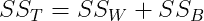
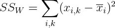
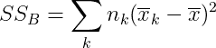
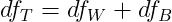
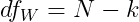
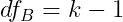
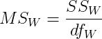
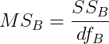
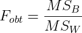
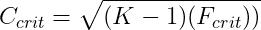

# A/B/C 测试:如何分析多组实验的结果

> 原文：<https://towardsdatascience.com/a-b-c-tests-how-to-analyze-results-from-multi-group-experiments-ad5d5cee0b05?source=collection_archive---------18----------------------->

## 方差分析的解释(ANOVA)

图片来自 [Pixabay](https://pixabay.com/illustrations/speed-internet-high-download-4028234/)

在科技初创公司中，实验被广泛用于决定是否推出新产品功能、用户界面设计变化、营销活动等，通常目标是提高转化率、收入和/或销量。通常，我们想要测试一个改变(治疗组)对现状(对照组)的影响，但是如果我们正在考虑几个选项，并且想要对两个以上的组进行实验呢？

在本文中，我将介绍单向方差分析背后的直觉，以及如何使用它来分析您在多组实验中的结果。

# 为什么你不应该做多重 t 检验

你可能想知道在你的实验中是否可以使用 t 检验来比较各组之间的差异。简短的回答是不，你不应该这样做！不仅会变得乏味，而且如果您使用 t-test 来比较许多对，您犯 I 型错误(假阳性)的几率会增加。

为了说明这一点，考虑一个有 5 个不同组的实验。在这种情况下，我们需要运行的 t 测试的数量是`5 Choose 2` = 10 个 t 测试！如果我们进行这 10 次 t 检验，即使我们将每个 t 检验的显著性水平设为 0.05，I 型错误的概率也不再是 5%。

相反，类型 I 错误的概率增加到`1 — (1 — 0.05) ^ 10 = 0.40`，因为我们正在进行十次比较，并且在所有测试中没有获得*任何*显著结果的概率现在是`0.95 ^ 10 = 0.60`。这意味着，如果我们做 10 次 t 检验来比较实验中 5 组之间的平均值，我们最终会在 40%的时间里错误地拒绝零假设，而不是在 5%的时间里！

# 关于 ANOVA

ANOVA 代表方差分析，是对两组或多组平均值之间差异的统计显著性的检验。本质上，它将数据中的总方差划分为不同的类别，允许我们比较组的平均值之间的*变化量和每组*内的单个观察值之间的*变化量。*

## 假设

在进行 ANOVA 检验之前，我们需要确保满足以下三个假设:
1。*我们从中抽取样本的基础人群是正态分布的。*检查的一种方法是绘制观察值的直方图，以直观显示分布是否呈正态分布。

2.*样本所来自的总体的方差相等。*我们可以用箱线图检查这一点，看看观察值的方差是否相等。

3.*每组中的观测值是相互独立的，每组内的观测值是随机抽样的。*我们需要确保实验是精心设计的，以保证组间的独立性和组内的随机抽样。

## 假设检验

在这一节中，我将介绍计算检验统计量和进行假设检验所需的步骤。在单因素方差分析中，零假设是所有组的平均值相等，而另一个假设是至少有一个平均值不同。

R 和 Python 中有许多[计算器](https://goodcalculators.com/one-way-anova-calculator/)在线和统计软件包，您可以使用它们来执行计算，但是以下步骤中的细节旨在帮助您理解方法和概念。如果公式看起来很吓人，不要担心，相反更重要的是理解每一步的直觉！

1.  **计算平方和**

在简单的方差分析中，我们可以将总平方和(SS_T)视为组内平方和(SS_w)和组间平方和(SS_B)之和:

组内平方和(SS_w)代表组内可变性的数量，但不受组间总体差异的影响。组内平方和等于一个组内所有观察值与其组均值的偏差平方和，即所有组的总和。

组间平方和(SS_B)可视为组间差异，但不受组内变异量的影响。它可以计算为总体大平均值的组平均值之间的平方和。

**2。计算自由度**

接下来，我们需要计算自由度。类似于平方和，总自由度等于组内自由度(df_w)和组间自由度(df_B)之和:

组内自由度(df_w)是观察数-组数，而组间自由度(df_B)是组数- 1。

**3。计算均方值**

为了能够比较平方和，我们将它们除以相关的自由度(df)以获得均方值。

**4。计算 F 统计量**

检验(F)统计量是组间均方(MS_B)与组内均方(MS_w)的比值

**5。求 F 的临界值**

对于α、组内自由度(N - k)和组间自由度(k - 1)的相应值，从 [F 分布表](http://homepages.wmich.edu/~hillenbr/619/AnovaTable.pdf)中确定 F 的临界值。

**6。方差分析测试的结论**

如果从你的实验中得到的 F (F_obt)值大于 F (F_crit)的临界值，我们可以拒绝均值之间没有差异的零假设。这意味着至少一个平均值在统计学上显著不同于一个或多个其他平均值。

## 比较成对平均值:谢弗法

能够拒绝方差分析检验的零假设告诉我们至少有一个均值是显著不同的，但是我们如何知道哪个均值是不同的呢？

回想一下我们上面进行多重 t 检验的例子，这将导致 I 型错误的增加。然而，如果我们能够使用 ANOVA 拒绝均值无差异的零假设，我们可以使用事后分析的 Scheffé方法来比较任何一对均值，而不用担心增加 I 型误差。

我们可以使用 Scheffé方法计算一个称为 C 的统计量。计算从我们的实验中获得的 C 的公式是:

其中，x̄₁和 x̄₂是被比较的两组的平均值，N₁和 N₂是这两组中的观察次数，MS_w 是来自方差分析的组内均方值。

然后，我们可以将从我们的观察中获得的 C 值与 C 的临界值进行比较。C 的临界值可以从以下公式中找到:

其中 K 是组的数量，F_crit 是 F 的临界值，您可以从 [F 分布表](http://homepages.wmich.edu/~hillenbr/619/AnovaTable.pdf)中查找相应的自由度和显著性水平。

如果得到的 C 值大于 C 的临界值，可以拒绝均值对相等的零假设。

## 关联强度:ω平方

来自 ANOVA 的检验统计可以告诉我们组间均值的差异是否具有统计学意义，但不能告诉我们效果大小。为了确定治疗效果的强度，我们可以使用下面的公式来计算ω平方(ω2):

其中，SS_B 为组间平方和，K 为组数，MS_w 为组内均方，SS_T 为平方和。

ω平方(ω2)告诉我们治疗效果可以解释多少总可变性，可以取-1 到+1 之间的任何值，0 表示没有任何影响。

# 结论

我希望这篇文章能帮助你更好地理解什么是方差分析，以及如何用它来解释多变量实验的结果。以下是一些关键要点:

*   ANOVA 是对两组或多组平均值之间差异的统计显著性的检验。
*   如果您能够使用 ANOVA 拒绝均值无差异的零假设，您可以使用事后分析的 Scheffé方法来比较任何一对均值，而不用担心增加 I 型误差。
*   为了确定治疗效果的关联强度，您可以计算ω平方(ω2)，这可以告诉您治疗效果可以解释多少总可变性。

实验需要时间和资源来设计、设置和部署到生产中。希望这有助于您将测试工具包扩展到多元实验中！