# A/B 测试:统计测试完全指南

> 原文：<https://towardsdatascience.com/a-b-testing-a-complete-guide-to-statistical-testing-e3f1db140499?source=collection_archive---------0----------------------->

## [入门](https://towardsdatascience.com/tagged/getting-started)

## 对于营销人员和数据科学家来说，建立正确的测试至关重要。

约翰·麦克阿瑟在 [Unsplash](https://unsplash.com/s/photos/red-and-blue?utm_source=unsplash&utm_medium=referral&utm_content=creditCopyText) 上的照片

# 什么是 A/B 测试？

A/B 测试是用来优化网络营销策略的最流行的控制实验之一。它允许决策者通过查看从两个可能的选项 A 和 b 获得的分析结果来选择网站的最佳设计。

在本文中，我们将看到如何使用不同的统计方法来使 A/B 测试成功。我推荐你也看一下 [**这本笔记本**](https://github.com/FrancescoCasalegno/AB_Testing/blob/main/AB_Testing.ipynb) 你可以在那里玩本文讨论的例子。

为了理解 A/B 测试是关于什么的，让我们考虑两个可选择的设计:A 和 B。一个网站的访问者被随机提供两个中的一个。然后，通过网络分析收集关于他们活动的数据。给定这些数据，可以应用统计测试来确定两种设计中的一种是否具有更好的功效。

现在，不同种类的指标可以用来衡量一个网站的功效。对于**离散度量**，也称为**二项式度量**，只有两个值 **0** 和 **1** 是可能的。以下是流行的离散指标的例子。

*   [点击率](https://en.wikipedia.org/wiki/Click-through_rate)——如果用户看到广告，他们会点击吗？
*   [转化率](https://en.wikipedia.org/wiki/Conversion_rate_optimization)——如果给用户看广告，他们会转化为顾客吗？
*   [跳出率](https://en.wikipedia.org/wiki/Bounce_rate) —如果用户正在访问一个网站，那么下面访问的页面是否在同一个网站上？

离散指标:点击率(作者图片)

使用**连续度量**，也称为**非二项式度量**，度量可以采用连续值，而不限于一组两个离散状态。以下是流行的连续指标的例子。

*   [每用户平均收入](https://en.wikipedia.org/wiki/Average_revenue_per_user) —一个用户一个月产生多少收入？
*   [平均会话持续时间](https://en.wikipedia.org/wiki/Session_(web_analytics))——用户在一个会话中在网站上停留多长时间？
*   [平均订单价值](https://www.optimizely.com/optimization-glossary/average-order-value/) —一个用户的订单总价值是多少？

连续指标:平均订单值(作者图片)

我们将详细了解离散和连续指标如何需要不同的统计测试。但首先，让我们快速回顾一下统计学的一些基本概念。

# 统计显著性

利用我们从网站用户活动中收集的数据，我们可以比较两种设计 A 和 b 的功效。简单地比较平均值没有多大意义，因为我们无法评估我们观察结果的**统计显著性**。确定两个样本之间观察到的差异源于偶然的可能性确实是至关重要的。

为此，我们将使用[双样本假设检验](https://en.wikipedia.org/wiki/Two-sample_hypothesis_testing)。我们的**零假设 H0** 是两个设计 A 和 B 具有相同的功效，即它们产生了相等的点击率，或每用户平均收入等。然后通过 **p 值**测量统计显著性，即观察到样本间差异至少与我们实际观察到的差异一样大的概率。

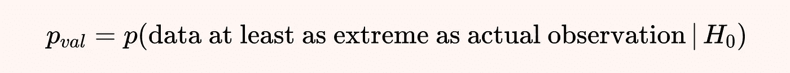

p 值(图片由作者提供)

现在，必须小心谨慎地正确选择**替代假设 Ha** 。该选择对应于[单尾和双尾测试](https://en.wikipedia.org/wiki/One-_and_two-tailed_tests)之间的选择。

在我们的情况下，双尾检验更可取，因为我们没有理由先验地知道 A 和 B 的结果之间的差异是有利于 A 还是 B。这意味着我们考虑另一个假设**Ha**A 和 B 具有不同功效的假设。

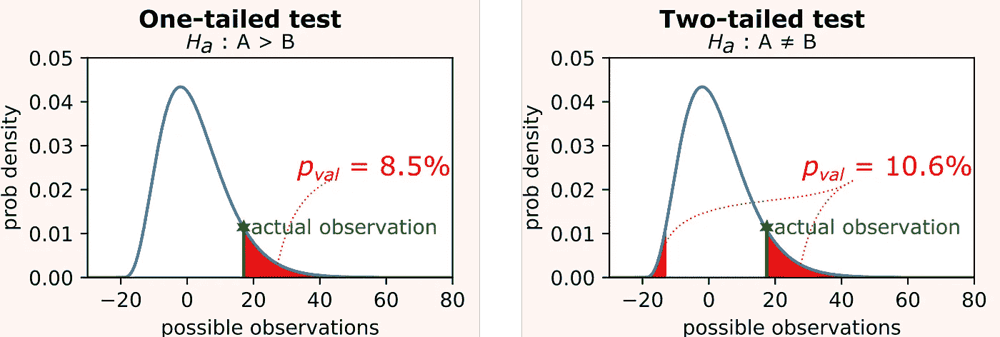

单尾和双尾测试(图片由作者提供)

因此， **p 值**被计算为所有**x’**s . t .**p(x’)<= p(我们的观察)**上所选检验统计量的概率密度函数 **p(x)** 的两个尾部下的面积。这种 p 值的计算显然取决于数据分布。因此，我们将首先了解如何针对离散指标计算它，然后针对连续指标计算它。

# 离散度量

让我们首先考虑一个离散的指标，比如点击率。我们随机向访问者展示两种可能的广告设计中的一种，并记录有多少人点击了它。

假设我们收集了以下信息。

*   **nX = 15** 访客看到了广告 A，其中 **7** 人点击了它。
*   **nY = 19** 访客看到了广告 B，其中 **15** 人点击了它。

点击率:列联表(图片由作者提供)

乍一看，版本 B 似乎更有效，但是这种差异在统计学上有多大意义呢？

# 费希尔精确试验

使用上面显示的 2x2 [列联表](https://en.wikipedia.org/wiki/Contingency_table)，我们可以使用 [Fisher 精确检验](https://en.wikipedia.org/wiki/Fisher%27s_exact_test)来计算精确的 p 值并检验我们的假设。为了理解这个测试是如何工作的，让我们首先注意到，如果我们固定表格的边距(即每行和每列的四个和)，那么只有少数几种不同的结果是可能的。

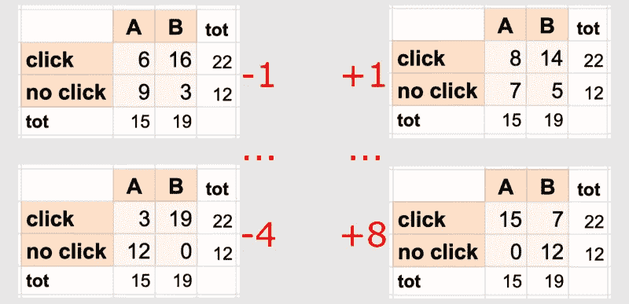

点击率:可能的结果(作者图片)

现在，关键的观察是，在零假设 H0 下，A 和 B 具有相同的功效，观察到这些可能结果的概率由[超几何分布](https://en.wikipedia.org/wiki/Hypergeometric_distribution)给出。

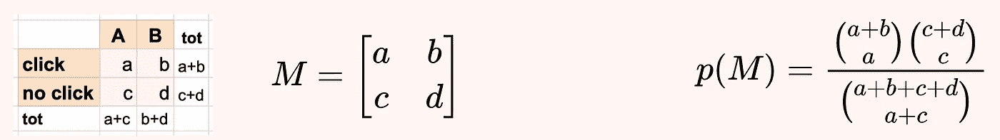

可能结果的超几何分布(作者图片)

使用这个公式，我们得到:

*   看到我们实际观测的概率是 **~4.5%**
*   如果 B 为 **~1.0%** (左尾)，则看到更多不太可能的有利观测的概率；
*   如果 A 为 **~2.0%** (右尾)，则看到更不可能的观察结果的概率为赞成。

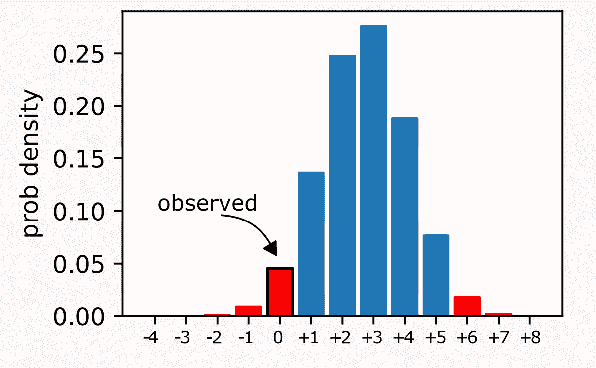

点击率:尾部和 p 值(作者图片)

所以费雪精确检验给出 **p 值≈ 7.5%** 。

# 皮尔逊卡方检验

费希尔精确检验具有计算精确 p 值的重要优势。但是，如果我们有一个大的样本量，它可能是计算效率低下。在这种情况下，我们可以使用[皮尔逊卡方检验](https://en.wikipedia.org/wiki/Pearson%27s_chi-square_test)来计算一个近似的 p 值。

让我们将列联表第 **i** 行和第 **j** 列的观测值称为 **Oij** 。在行列独立性的零假设下，即假设 A 和 B 具有相同的功效，我们可以很容易地计算出相应的期望值 **Eij** 。此外，如果观察值呈正态分布，那么χ2 统计量恰好遵循具有 1 个自由度的[卡方分布](https://en.wikipedia.org/wiki/Chi-square_distribution)。

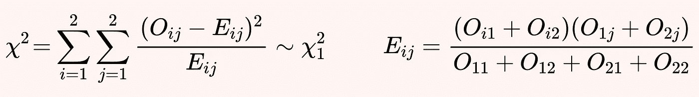

皮尔逊卡方检验(图片由作者提供)

事实上，由于[中心极限定理](https://en.wikipedia.org/wiki/Central_limit_theorem)，如果样本量足够大，该检验也可以用于非正态观测值。

在我们的例子中，使用皮尔逊卡方检验，我们得到 **χ2 ≈ 3.825** ，这给出了 **p 值≈ 5.1%** 。

# 连续指标

现在让我们考虑一个连续指标的情况，比如每个用户的平均收入。我们随机向访问者展示我们网站的两种可能布局中的一种，并根据每个用户一个月产生的收入，我们希望确定两种布局中的一种是否更有效。

让我们考虑下面的情况。

*   **nX = 17** 用户看到了布局 A，然后进行了以下购买:200 美元，150 美元，250 美元，350 美元，150 美元，350 美元，250 美元，150 美元，250 美元，150 美元，150 美元，150 美元，200 美元，0 美元，100 美元，50 美元。
*   **nX = 14** 用户看到了布局 B，然后进行了以下购买:300 美元，150 美元，150 美元，400 美元，250 美元，250 美元，150 美元，200 美元，250 美元，150 美元，300 美元，200 美元，250 美元，200 美元。

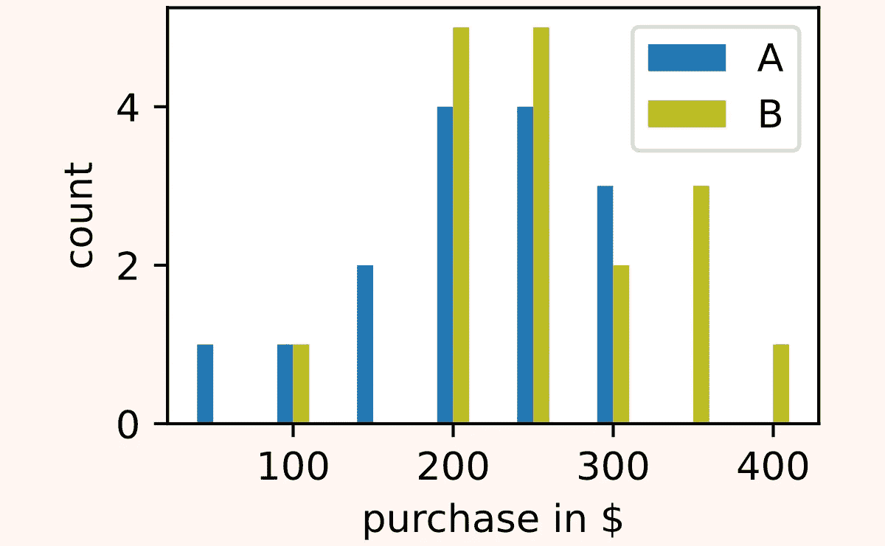

每个用户的平均收入:样本分布(作者图片)

同样，乍一看，版本 B 似乎更有效。但是这种差异在统计学上有多大意义呢？

# z 检验

[Z 测试](https://en.wikipedia.org/wiki/Z-test)可在以下假设条件下应用。

*   观察值呈正态分布(或样本量较大)。
*   采样分布具有已知的方差 **σX** 和 **σY** 。

在上述假设下，Z 测试利用了以下事实:下面的 **Z 统计量**具有标准正态分布。

z 测试(图片由作者提供)

不幸的是，在大多数实际应用中，标准偏差是未知的，必须进行估计，因此 t 检验是更可取的，我们将在后面看到。无论如何，如果我们知道 **σX=100** 和 **σX=90** 的真实值，那么我们将得到 **z ≈ -1.697** ，这对应于一个 **p 值≈ 9%** 。

# “学生”t 检验

在大多数情况下，抽样分布的方差是未知的，所以我们需要估计它们。[学生的 t 检验](https://en.wikipedia.org/wiki/Student%27s_t-test)可以在以下假设下应用。

*   观察值呈正态分布(或样本量较大)。
*   采样分布具有“相似”的方差 **σX ≈ σY** 。

在上述假设下，Student 的 t 检验依赖于以下观察结果:下面的 **t 统计量**具有 Student 的 t 分布。

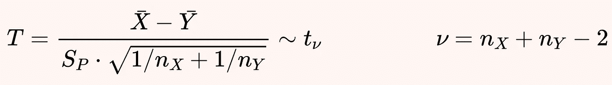

“学生”t 检验

这里 **SP** 是从样本方差 **SX** 和 **S Y** 中获得的[合并标准差](https://en.wikipedia.org/wiki/Pooled_variance)，它们是使用应用[贝塞尔修正](https://en.wikipedia.org/wiki/Bessel%27s_correction)的无偏公式计算的。

在我们的示例中，使用学生的 t-检验，我们得到了 **t ≈ -1.789** 和 **ν = 29** ，这给出了 **p 值≈ 8.4%** 。

# 韦尔奇 t 检验

在大多数情况下，学生的 t 检验可以有效地应用于良好的结果。然而，很少会违反第二个假设(抽样分布的相似方差)。在这种情况下，我们不能计算混合方差，我们应该使用[韦尔奇的 t 检验](https://en.wikipedia.org/wiki/Welch%27s_t-test)，而不是学生的 t 检验。

该测试在学生 t-测试的相同假设下进行，但取消了对相似方差的要求。然后，我们可以使用一个稍微不同的 **t 统计量**，它也有一个学生的 t 分布，但是具有不同的自由度数量 **ν** 。

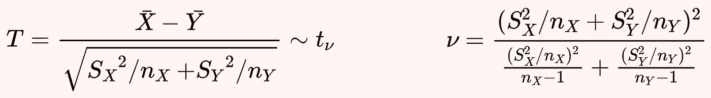

韦尔奇 t 检验

**ν** 的复杂公式来自[韦尔奇-萨特思韦特方程](https://en.wikipedia.org/wiki/Welch%E2%80%93Satterthwaite_equation)。

在我们的例子中，使用 Welch 的 t 检验，我们得到了 **t ≈ -1.848** 和 **ν ≈ 28.51** ，这给出了 **p 值≈ 7.5%** 。

# 连续非正态度量

在前面关于连续度量的部分中，我们假设我们的观察值来自正态分布。但是在处理每个用户的月收入时，非正态分布是非常普遍的。常态经常在几个方面被破坏:

*   零膨胀分布 —大多数用户根本不买任何东西，所以有很多零观察值；
*   [多式联运分销](https://en.wikipedia.org/wiki/Multimodal_distribution) —一个细分市场倾向于购买便宜的产品，而另一个细分市场购买更贵的产品。

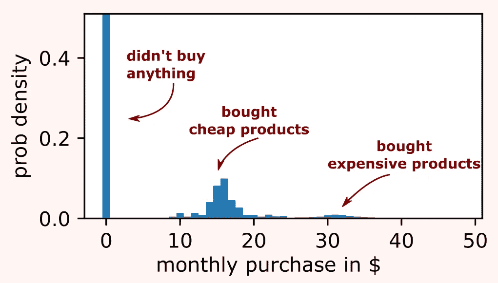

连续非正态分布(图片由作者提供)

然而，如果我们有足够的样本，在正态假设下导出的检验，如 Z 检验、Student’s t 检验和 Welch’s t 检验，仍然可以应用于显著偏离正态的观察值。事实上，由于[中心极限定理](https://en.wikipedia.org/wiki/Central_limit_theorem)，随着样本量的增加，检验统计量的分布趋于正态。在我们正在考虑的零膨胀和多峰的例子中，即使是 40 的样本大小也会产生一个非常接近正态分布的分布。

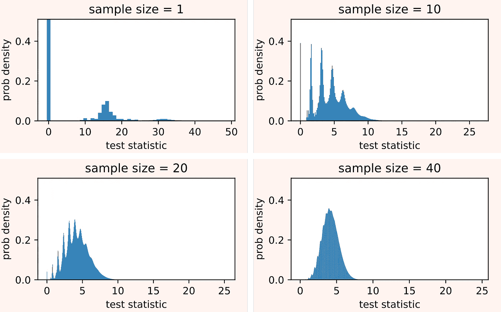

非正态分布的正态收敛(图片由作者提供)

但是，如果样本量仍然太小，无法假设正态性，我们没有其他选择，只能使用非参数方法，如曼-惠特尼 U 检验。

# 曼恩-惠特尼 U 检验

该检验没有对抽样分布的性质做出假设，因此它是完全非参数的。[曼-惠特尼 U 检验](https://en.wikipedia.org/wiki/Mann%E2%80%93Whitney_U_test)的思想是计算下面的 **U 统计量**。

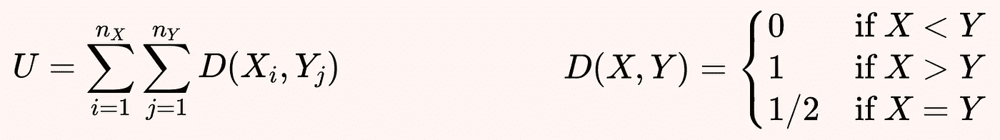

曼-惠特尼 U 检验(图片由作者提供)

该检验统计量的值被制成表格，因为分布可以在零假设下计算，即对于来自两个总体的随机样本 **X** 和 **Y** ，概率 **P(X < Y)** 与 **P(X > Y)** 相同。

在我们的例子中，使用曼-惠特尼 U 检验，我们得到 **u = 76** ，这给出 **p 值≈ 8.0%** 。

# 结论

在本文中，我们已经看到不同种类的度量、样本大小和抽样分布需要不同种类的统计测试来计算 A/B 测试的显著性。我们可以用决策树的形式总结所有这些可能性。

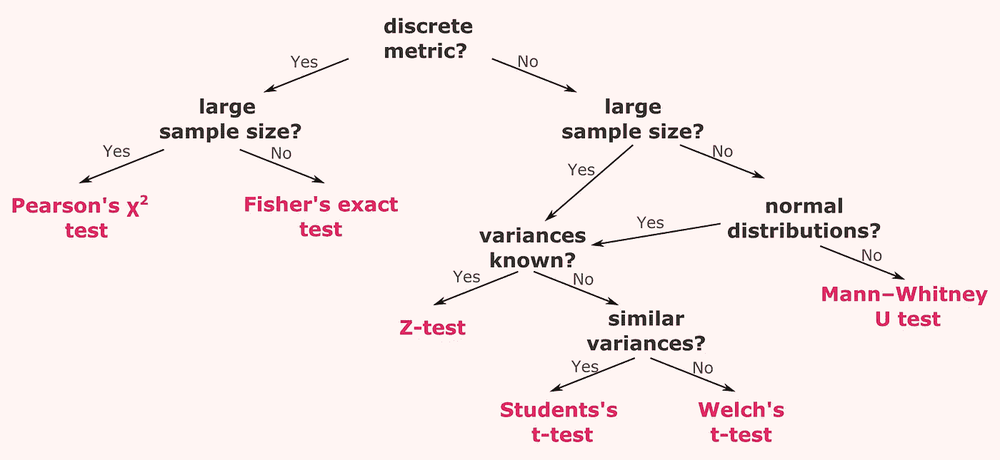

用于 A/B 测试的统计测试摘要(图片由作者提供)

如果你想了解更多，你可以从玩 [**这个笔记本**](https://github.com/FrancescoCasalegno/AB_Testing/blob/main/AB_Testing.ipynb) 开始，在那里你可以看到本文讨论的所有例子！