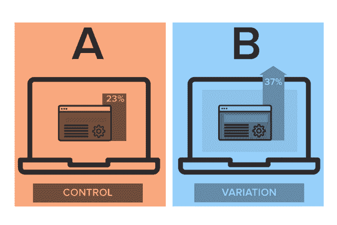
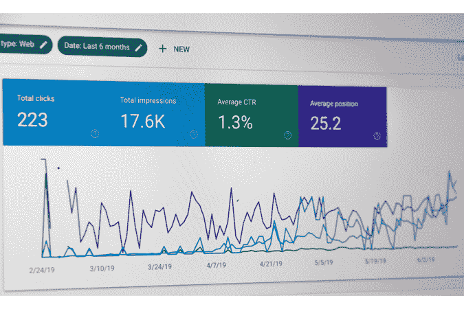

# A/B 测试数据科学面试问题指南

> 原文：<https://towardsdatascience.com/a-b-testing-data-science-interview-questions-guide-53b03bd73548?source=collection_archive---------23----------------------->

## *如何以一种让你脱颖而出的方式回答 A/B 测试数据科学面试问题*

A/B 测试是许多数据科学面试的主要内容，尤其是当角色决定如何最好地设计某种形式的用户体验时，通常是通过某种形式的应用程序或网站。想想亚马逊、优步和 Youtube——所有这些公司的应用程序都有不断变化的功能，每个变化的背后都有一个 A/B 测试，这是许多数据科学家的面包和黄油。

作者原创图片

只要在谷歌上快速搜索一下，你就会发现很多关于如何构建经典 A/B 测试答案的指南。这些指南可能相当有用，但它们不会让你的答案脱颖而出。这就是本文的内容:我将与您分享一两件(或三件)关于我如何在自己的数据科学面试经历中接受 A/B 测试问题的事情，以及我如何让我的答案给面试官留下额外的印象。我不会涉及制定假设和进行 t 检验的基础知识，但我会更加关注如何将你的答案与其他答案区分开来。

# 什么是 A/B 测试？

A/B 测试本质上是一个受控的实验，以做出关于产品发布的关键决策，这些变化可以从按钮的大小和颜色这样的小元素到应用程序上整个新页面这样的大变化。

# 变体

与只测试两个不同版本的 A/B 测试相反，A/B/N 测试涉及同时测试 N 个版本。A/B/N 测试通常用于大规模变更。

多变量测试发生在版本和相关变量的所有排列同时被测试的时候，并且经常在必须做出组合决策的时候使用，而不是在每个变化上运行 A/B 测试。

# 机会规模

对于许多受访者来说，他们会直接谈论样本大小、统计意义等。当被问到一个暗示 A/B 测试的问题时，他们不顾一切地卸下他们在准备面试时记忆的框架和答案。然而，这些答案并没有脱颖而出。

相反，不仅仅要考虑 A/B 测试的技术，还要考虑 A/B 测试进行的环境。A/B 测试在现实世界中的现实是，并不是所有提议的变更都值得测试，并且在任何公司中，当决定某个特定的 A/B 测试是否值得追求时，都有一个有限的元素需要时间和资源的明智分配。

当产品经理带着一个想法来到你这个数据科学家面前时，我们希望能够根据历史数据评估这个想法的潜在影响。这种形式的机会评估至关重要，因为它让您作为数据科学家的努力变得有价值。例如，考虑一个新的电子商务网站的变化，它将允许来自多个零售商的结帐。为了确定这个机会的大小，我们需要通过分析用户通常购买的不同商品的数量来获得一个上限。如果只有一小部分用户购买了大量的商品，这种 A/B 测试可能根本就不值得进行。因此，重要的是要估计实际上会改变行为的用户数量，以及这如何转化为大公司的实际数量。

更重要的是，要回答关于机会规模的问题，您需要绝对清楚您打算使用什么指标。概述你在面试中所做的确切假设，并坚定地表明这个机会的评估价值。

# 韵律学

度量，度量，度量。如果你不能全面而自信地谈论度量标准，那么任何关于 A/B 测试的答案都是不完整的。谈论指标的关键是要很好地了解公司的产品，并研究通常会使用哪种指标。例如，在我面试电子商务公司的经历中，你经常会被要求评估一个行动号召功能，比如一个提醒你某个优惠即将到期的弹出窗口。

如果您正在评估行动号召功能:

*Stephen Phillips 许可在 Unsplash (* [*链接*](https://unsplash.com/photos/shr_Xn8S8QU) *)* 上使用的图片

因此，关键是要很好地了解应用程序接口，并理解什么指标倾向于与它相关联。不要把所有可能的指标都塞进你的答案里。更重要的是，你绝不能停留在仅仅提及可能相关的度量标准。记住，一定要在上下文中回答！你必须告诉面试官为什么这个指标很重要，它对整体用户体验有什么影响。

*你如何量化 Twitter 用户的影响力？*

这里有一个关于指标的问题，实际上是在 Twitter 产品访谈中被问到的:

问题链接:[https://platform . stratascratch . com/technical/2051-influencer-metrics](https://platform.stratascratch.com/technical/2051-influencer-metrics)

一些常见的答案可能是关注者数量、转发数量、喜欢和提及数量。如果你想给出一个更有力的答案，可以提到一些类似推特链接的点击率，或者固定时间跨度内的互动次数。对关注者数量的一个更精确的回答是提到实际上为特定用户打开通知的关注者的数量。根据我的经验，面试官不希望你列出所有你已经知道的可能答案。相反，面试官心中有一个理想的答案，你必须努力思考他或她可能会给你的线索。

作者原创图片

有很多方法可以得到一个全面的答案，但是有两个概念我一定要提到:转换漏斗和 ltv。转换漏斗描述了导致用户最终决策点的考虑和体验的各个阶段。术语“漏斗”用于说明沿着漏斗向下发生的自然损耗。始终将度量标准的选择放在一个漏斗的框架中，这将使您的答案听起来更加深思熟虑！如果你真的想了解转换漏斗的细节，看看这篇关于七种不同类型漏斗的文章。更好的是，使用终身价值(LTV)的概念来评估你的度量的长期观点。这告诉面试官，你考虑的不仅仅是一个特定设计决策的直接后果，还包括它如何影响用户的未来，以及它如何影响其他用户(外部性)。事实上，我希望你能更进一步，谈谈外部性是如何违反控制组和治疗组之间的独立性假设的，以及我们可能希望如何对此进行控制。

# 样本量

1.  检验的功效(通常约为 0.8–0.9):当替代假设为真时，拒绝零假设的概率。考虑幂的另一种方式是 1 减去β，其中β是第二类错误的概率，对于那些更熟悉统计方法的人来说。
2.  检验的显著性水平:错误地拒绝零假设的最大可能性，当它实际上为真或类型 1 错误时
3.  最小期望效应

在 A/B 测试面试中谈论样本大小是没有商量余地的。一般来说，A/B 测试所需的样本量取决于三个因素:

MDE 是您愿意观察的基线上的最小改进。例如，如果我们关注观察到每花 10 美元购买就会增加 1 美元的效果，我们将 MDE 设置为 10%。

事实上，大多数准备充分的受访者不会错过在他们的答案中提到 MDE，但真正精彩的答案会更进一步。在现实世界中，更有效的方法是忘记精确地修复 MDE 相反，我们应该设定限制，以便更好地做出决策。例如，保持 MDE 为 5%不变，我们可以计算不同水平的基线需要多少样本。一般来说，基线越小，检测相同 MDE 所需的样本量越大。想一想，看看为什么直觉上这是对的。

# p 值

什么是 p 值？样本大小如何影响 p 值？

这听起来像是一个相对简单的问题，但你会惊讶地发现，当被问到这个问题时，有多少受访者实际上答非所问！

以下是对这个问题的转述解释:[https://platform.stratascratch.com/technical/2043-p-value](https://platform.stratascratch.com/technical/2043-p-value)

p 值是在零假设下找到观察结果的概率。如果您有更多的数据，那么观察结果的标准误差(不确定性)会降低(因为 SE=std/sqrt(N))，因此检验统计量会增加，因此我们可以更有信心拒绝零。此外，测试的统计能力(1-(当空值为假时拒绝空值失败的概率)会增加。现在，这些信息可以使你的假设检验更强(效应大小)，但它与我们对 p 值的解释无关。

这是另一种思考方式。p 值是从 0 到 1 的数，其提供了所获得的测试结果的统计显著性水平的指示，与仅仅由于随机性而获得的测试结果相反。具体来说，p 值衡量在假设零假设为真的情况下获得测试结果的可能性。通常，高于 0.05 的 p 值是令人信服的证据，表明我们不能拒绝无效的零假设。

当我们进行 A/B/N 测试时，事情变得稍微复杂一些，这就是你在统计课上学到的知识派上用场的地方。例如，如果我们有 4 个治疗组和一个对照组，观察到至少 1 个假阳性的概率是多少？(类型 1 错误)[提示:不是 0.05 * 4]

答案如下:

pr(FP = 0)= 0.95 * 0.95 * 0.95 * 0.95 = 0.8145

因此，

pr(FP > = 1)= 1–0.8145 = 0.1854(18.54%，而不是 20%)

# 干扰

最后，我们来谈谈干扰，也就是说当治疗组和对照组之间的独立性假设被违反时。在 A/B 测试的世界里，一切都是理想的，因为除了治疗变量之外的一切都是可控的。然而，这种其他条件不变的情况在现实世界中是不真实的。对于像优步这样的公司来说尤其如此，他们为相互依赖的用户提供服务。今天让我们来谈谈其中的一个干扰，以及作为一名受访者，你如何通过分享一些潜在的解决方案来让面试官惊叹。

对于像优步和 Lyft 这样提供双边市场的公司来说，干预将导致通常所说的高估偏差，因为控制组和处理组的成员都在利用资源。例如，如果优步在我们的治疗组中引入了吸引驾驶员的特征，这将意味着我们的对照组中可用的驾驶员更少，并且对治疗效果的最终估计将是不准确的。

这就是实验的设计如此重要的原因！那么我们能做些什么呢？首先，我们可以考虑按位置随机分组，这样我们可以充分隔离治疗组和对照组。通过这样做，当治疗组的机制发生时，我们防止了强加给对照组的外部性。但这里有一个隐藏的权衡:在地理上隔离各组可能会导致我们估计效果的更大标准误差，因为现在每个治疗组和对照组可能有更多我们无法控制的属性。例如，想一想中央商业中心的司机和农村地区的司机。最终，必须做出取舍，作为一名受访者，你会想提到它们。或者，我们可以根据时间随机分组。这克服了我们基于地理随机化的缺点，但只有在治疗效果应该持续很短时间的情况下才有效。相反，如果治疗效果意在捕捉类似于同行转诊方案的效果，那么时间随机化可能不是最理想的。

还有哪些因素会威胁到你的有效性？有很多，所以你面临的挑战是在面试中快速思考，尽可能给出更多可能的答案。更多可能的干扰，请查看下面的[文章](https://www.invespcro.com/blog/ab-testing-questions-answered/)。

最终，A/B 测试的答案可以而且应该有很大的不同，这取决于谁在提问以及问题是关于什么的。在我看来，最重要的是永远要在语境中回答！任何人都可以背诵一个关于假设检验和 A/B 检验步骤的记忆答案，但真正优秀的候选人是知道如何以及何时应用正确技术的人，是能够根据被检验的假设快速适应并思考不同方法的利弊的人。

*最初发表于*[*【https://www.stratascratch.com】*](https://www.stratascratch.com/blog/ab-testing-data-science-interview-questions-guide/)*。*