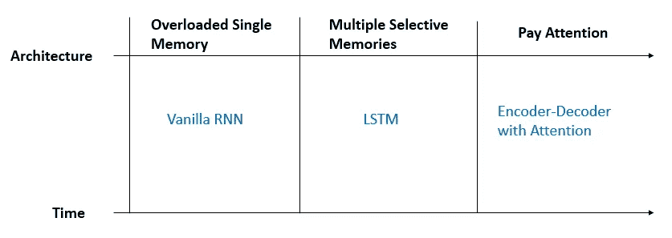
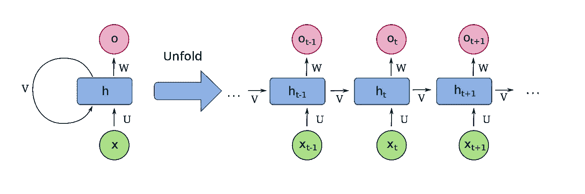
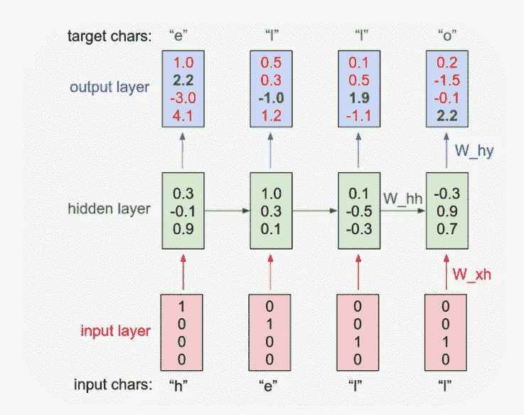
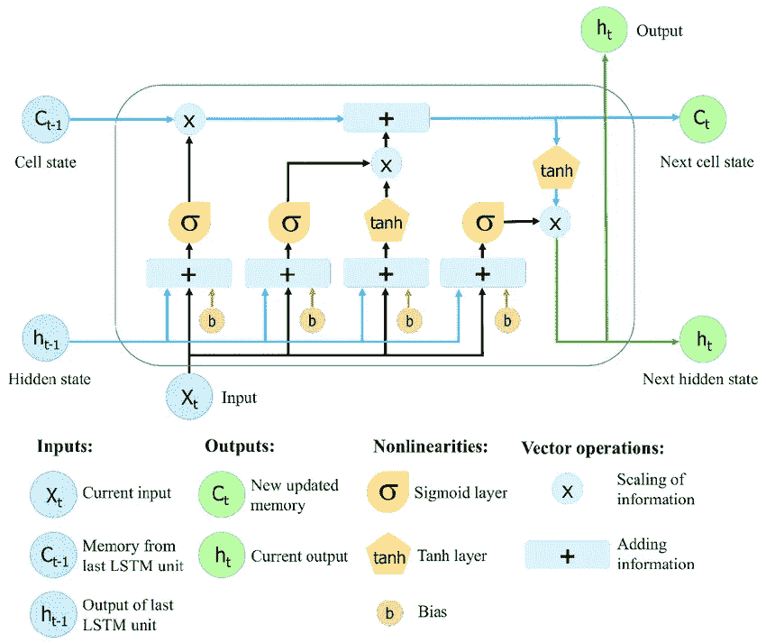
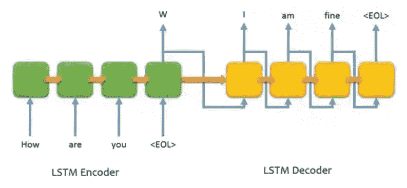
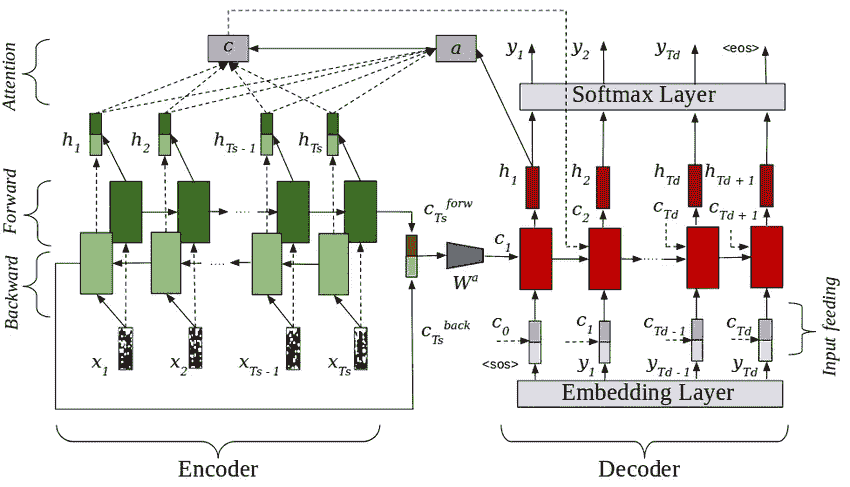
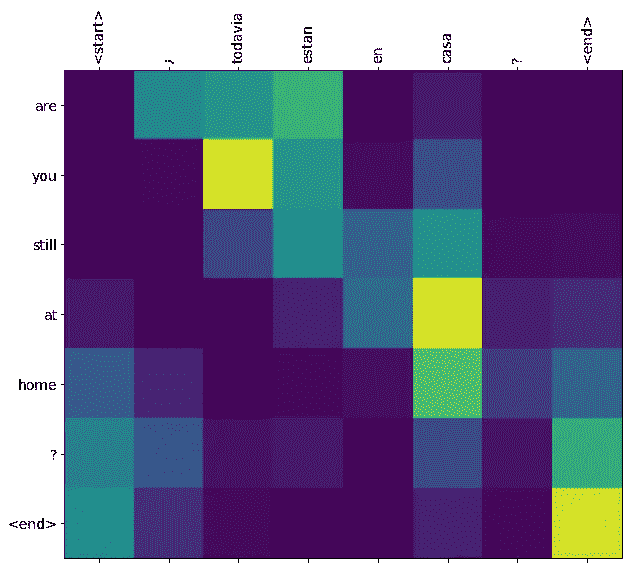

# 对抗健忘症:循环神经网络的简史和介绍

> 原文：<https://towardsdatascience.com/a-battle-against-amnesia-a-brief-history-and-introduction-of-recurrent-neural-networks-50496aae6740?source=collection_archive---------18----------------------->

> 只有回顾过去，才能理解生活。必须向前看。
> 
> ——本杰明·巴顿奇事

这是我关于深度学习和强化学习系列的第二篇文章([第一篇关于卷积神经网络](/from-alexnet-to-nasnet-a-brief-history-and-introduction-of-convolutional-neural-networks-cf63bf3320e1))。

在日常生活中有许多顺序建模问题:机器翻译、语音识别、文本分类、DNA 测序分析等。这些问题大多属于监督学习。模型的输入或输出是大小可变的序列。正常的神经网络难以处理不同大小的输入和输出。

在下面的章节中，我将解释为什么递归神经网络或 RNN 适用于序列建模问题。然后，我将谈论具有代表性的架构**香草 RNN、长短期记忆(LSTM)** ，以及已经在机器翻译和许多其他用例中得到著名应用的**编解码器**。最后，我将用 Pytorch 中的一个简单实现来演示 LSTM。

# 1 为什么选择 RNN

## 1.1 历史

RNN 的概念是在 1986 年[提出的](https://en.wikipedia.org/wiki/Recurrent_neural_network)。著名的 LSTM 建筑发明于 1997 年。RNN 知名建筑的数量比 CNN 少得多。俗话说“ ***一张图片胜过千言万语*** ”暗示着，图像有更多的信息和回旋的空间，所以 RNN 的进化史并不丰富多彩也就不足为奇了。我试图将历史分为三个阶段，分别是香草 RNN 的**过载单存储器**、LSTM 的**多门存储器**和 RNN 的**注意**编码器-解码器架构。

当我带你走过的时候，你会意识到 RNN 进化的主题是与健忘症作斗争。换句话说，每一代 RNN 人都试图尽可能多地记住过去的重要信息，以便更准确地预测未来。



RNN 的演变

## 1.2 为什么 RNN 致力于可变输入/输出


图片来源:[安德烈·卡帕西](http://karpathy.github.io/2015/05/21/rnn-effectiveness/)

普通的神经网络很难处理不同大小的输入和输出。以下是他们无法处理的一些用例。请注意， **Many** 对于模型的每个输入或输出并不是一个固定的数字。

*   **一对多:**图像字幕，文字生成
*   **多对一:**情感分析，文本分类
*   **多对多:**机器翻译，语音识别

RNN 能够通过一个**递归处理单元**(单层或多层单元)来处理这些用例，其中**隐藏状态源自过去**。

该架构的递归性质既是一件好事也是一件坏事。好处是它可以处理不同大小的**输入/输出。**但这是有代价的，除了**回忆过去的困难**之外，还有**消失/爆炸渐变**的问题。任何有一些编程经验的人都会生动地回忆起递归程序是多么容易得到[堆栈溢出](https://en.wikipedia.org/wiki/Stack_Overflow)或[内存不足](https://en.wikipedia.org/wiki/Out_of_memory)异常。

# RNNs

## 2.1 香草 RNN



基本的 RNN 建筑。来自[维基百科](https://en.wikipedia.org/wiki/Recurrent_neural_network)

上面是基本的 RNN 体系结构，带有自循环或指向自身的递归指针。 **x、o** 和 **h** 为输入、输出和隐藏状态，其中 **U、W** 和 **V** 分别为作用于它们的参数。在绿色 RNN 细胞内，可能有一层或多层正常神经元或其他类型的 RNN 细胞。

**递归指向结构是 RNN 的中心概念。这意味着几件事:**

*   输入和输出的大小是不同的
*   有一个**隐藏状态来表示过去的知识**，它也被用作下一步的输入。来自先前步骤的隐藏状态，连同当前步骤的输入，用于导出当前隐藏状态。然后用它来导出当前步骤的输出。
*   RNN 的每一步共享相同的激活函数和相同的参数集。在上面的例子中，U **、V** 和 **W 在所有的 RNN 单元之间共享，不管 RNN 网络增长到多大。**
*   **隐藏状态成为 RNN** 的关键组成部分，因为它不仅是输入和输出的桥梁，更重要的是过去和现在。

现在你应该已经注意到 RNN 的瓶颈是所有 RNN 单元之间的共享参数，特别是当网络变得太大时隐藏状态参数 V。一个只有单一记忆的大脑是**很容易超载**，并且不能记住一段距离以外的过去。

具有多层的普通 RNN 单元可以在一定程度上提高性能，但是逻辑上没有太大的区别，因为它仍然被认为是一维数据的一个处理单元。但是有许多方面的信息需要处理。

## **2.2 RNN 工作方式的简单例子**

我用一个简化的[字符级语言模型预测单词“hello”](http://karpathy.github.io/2015/05/21/rnn-effectiveness/)的下一个字符的例子来说明。



简化字符级语言模型。图片来源:[安德烈·卡帕西](http://karpathy.github.io/2015/05/21/rnn-effectiveness/)

*   第一步:字符嵌入。字典是[h，e，l，o]。“h”变成[1，0，0，0]，“e”变成[0，1，0，0]，“l”变成[0，0，1，0]，“o”变成[0，0，0，1]
*   第二步:计算误差。随机实例化网络，依次向网络输入字符“h”、“e”、“l”、“l”、“o”。在输入“h”的第一时间步，我们得到输出“o”(因为 4.1 是最大的置信度得分，并且在第四个位置)，而不是预期的“e”(绿色)。对于其他时间步长，反之亦然。我们希望增加绿色位置的置信度得分，并减少其他值。
*   第三步:反向传播。汇总误差，进行反向传播，分别更新 **W(hh)、W(xh)** 和 **W(hy)** 的参数。
*   第 4 步:重复第 2 步和第 3 步，直到网络以高置信度预测出正确的字符序列。

## 2.3 LSTM

LSTM 是最受欢迎的 RNN 建筑，即使它已经诞生了 20 多年。但是为什么是 LSTM 呢？最大的原因是香草 RNN 不能很好地记住过去。香草 RNN 中仅有的几组参数需要处理和记忆太多的信息，很容易超载。

对于像对话和文本这样的连续信息，有几个维度需要处理，比如强调什么，输出什么，忘记什么。LSTM 介绍了三种选择存储器(门)，分别是**输入、**输出、**遗忘门**，以及 **Sigmoid** 函数来表示要处理的信息的百分比。



LSTM 概述。图片来源: [ResearchGate](https://www.researchgate.net/figure/The-structure-of-the-Long-Short-Term-Memory-LSTM-neural-network-Reproduced-from-Yan_fig8_334268507)

*   **输入门:记什么**。即。像“a”、“the”这样没有用的词不会出现在输入中。
*   **输出门:输出什么。**即。一些信息将存储在隐藏状态中，但不会存储在输出中。
*   **忘门:忘什么。**即。背景变了。以前的一些信息会被遗忘
*   **乙状结肠函数:信息百分比。**sigmoid 函数值在 0 到 1 之间，非常适合用来表示信息输入、输出和遗忘的百分比。

拥有三个逻辑记忆单元来处理不同的维度极大地提高了 LSTM 记忆长期和短期信息的能力。在后一节中，我将通过一个具体的编码示例更详细地说明 LSTM。

## 2.4 注意编码器和解码器

**2.4.1 编码器-解码器**

严格来说，编码器-解码器是一个不属于 RNN 的通用架构。在[序列中广泛应用于对](https://en.wikipedia.org/wiki/Seq2seq)深度学习用例进行排序。变换器是另一种不基于 RNN 的编码器-解码器架构。OpenAI 最先进的预训练 NLP 模型 [GPT-2](https://en.wikipedia.org/wiki/GPT-2) 和 [GPT-3](https://en.wikipedia.org/wiki/GPT-3) 基于变压器架构。



编码器-解码器架构。图片来源: [Quora](https://www.quora.com/What-is-an-Encoder-Decoder-in-Deep-Learning)

编码器-解码器试图模仿人脑的认知过程。例如，当我们看到一些东西，我们将它作为某种格式(编码向量)编码到我们的“神经网络”(大脑)中。当我们想要描述我们所看到的东西时，我们从大脑中取出编码向量，并通过我们的嘴将其“解码”成我们自己的语言。

编码器末端出来的向量还有一个名字叫做[潜在空间](/understanding-latent-space-in-machine-learning-de5a7c687d8d)。**潜在空间是机器学习中一个非常重要和有用的概念。这意味着对于任何类型的信息(即语音、文本、图像或视频)，只要它们可以在相同的潜在空间中被表示，它们就可以相互交流和理解，**例如图像到文本(图像字幕)和语音到文本(语音识别)。

**2.4.2 注意事项**

香草编码器解码器有什么问题？来自编码器端的定长向量是编码器和解码器之间唯一的交换媒介。解码器仅在编码器的最后一步之后才暴露给编码器结果。编码器矢量已成为信息瓶颈。距离越远，信息就越难以保存在编码器矢量中。

香草 RNN 的问题听起来熟悉吗？是的。具有更多存储器的相同解决方案也适用。不是一个固定长度的编码向量，**我们为每个目标词**准备了一个向量，叫做注意力向量。注意力向量与隐藏状态和输入一起被用于预测输出。



注意编码器-解码器。图片来源: [ResearchGate](https://www.researchgate.net/figure/RNN-Encoder-Decoder-Network-with-Attention-layer-Encoder-is-a-bidirectional-LSTM-whose_fig2_326570264)

直观上，每个注意力向量允许每个目标单词只关注输入中的几个单词。下面是[一个机器翻译例子](https://www.tensorflow.org/tutorials/text/nmt_with_attention)的注意力矩阵热图。您可以看到，每个目标单词将更多的注意力集中在几个输入单词上。



来自 [Google Tensorflow 机器翻译示例](https://www.tensorflow.org/tutorials/text/nmt_with_attention)的注意力热图

## 2.5 RNN 调谐技术

大部分神经网络整定技术也可以用来提高 RNN 性能，如**脱落、批量归一化、残差学习、激活函数、**等。您必须根据您的用例尝试各种技术来获得最佳性能。神经网络调谐在很多时候是一门艺术而不是科学。

# 3 示例:Pytorch 中 LSTM 的实现

## 3.1 使用案例

我使用了 torchtext 的 [AG 新闻数据集进行文本分类](https://pytorch.org/tutorials/beginner/text_sentiment_ngrams_tutorial.html)。输入是新闻文本，分为 10 个类别的标签。

Pytorch 的[嵌入](https://pytorch.org/docs/stable/generated/torch.nn.Embedding.html)用于编码输入。为了实现高效的批处理，每个输入的长度限制为 50。超出的单词将被截断，而短缺的单词将被“DUMMY”填充。请参照本笔记本[。](https://github.com/ahhuisg/deep-learning-practice/blob/main/notebooks/lstm-pytorch.ipynb)

## 3.2《LSTM 执行计划》

以上 LSTM 部分的建筑形象也请参照**执行。**

## **3.2.1 遗忘门**

```
*# Forget Gate Calculation*
forget_gate = torch.sigmoid(torch.matmul(embedded_input, self.f_x) + torch.matmul(h, self.f_h) + self.f_b)
```

**3.2.2 输出门**

```
# Output Gate Calculation
output_gate = torch.sigmoid(torch.matmul(embedded_input, self.o_x) + torch.matmul(h, self.o_h) + self.o_b)
```

**3.2.3 输入门**

```
# Input Gate Calculation
input_gate = torch.sigmoid(torch.matmul(embedded_input, self.i_x) + torch.matmul(h, self.i_h) + self.i_b) 
```

**3.2.4 新状态&输出**

```
# mid state for new state calculation
input2_state = torch.tanh(torch.matmul(embedded_input, self.i2_x) + torch.matmul(h, self.i2_h) + self.i2_b)# New State after the LSTM Cell
state = input2_state * input_gate + state * forget_gate# New Output from the LSTM Cell
h = output_gate * torch.tanh(state)
```

**3.2.5 检测结果**

我只对这个模型进行了 10 个时期的训练和测试。准确率从 0.29 提高到 0.78。

```
Done Training with Epoch 9 - Loss: 0.30023258924484253\. Test Accuracy: 0.7806578947368421
```

# 4 .结论

在本文中，我简要地谈到了一些 RNN 建筑，我还用 Pytorch 中的一个简单实现来说明 LSTM。RNN 有独特的能力来处理顺序建模问题，RNN 的演变完全是为了从过去**中记住尽可能多的重要信息，以便更准确地预测未来。**

[***人在同一条河里走两次***](https://www.goodreads.com/quotes/117526-no-man-ever-steps-in-the-same-river-twice-for) 。许多现实生活中的用例是顺序依赖的。我很有信心，除了 LSTM，更新更好的 RNN 将会出现，RNN 将继续在人工智能行业扮演重要角色。