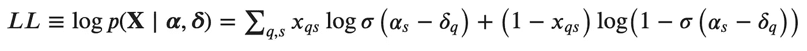
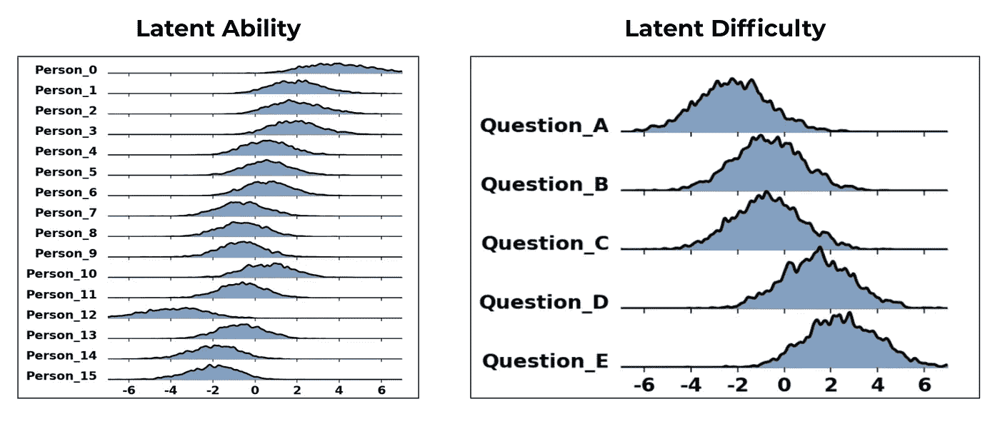

# Rasch 模型的贝叶斯方法(项目反应理论)

> 原文：<https://towardsdatascience.com/a-bayesian-approach-to-rasch-models-item-response-theory-cc08805cbb37?source=collection_archive---------20----------------------->

## 使用 Rasch 模型和 PYMC3 客观地衡量人的表现

# 客观测量的挑战

客观地衡量个人在评估或测试中的表现*，*提出了独特的挑战。以一个有 20 个问题的测试为例，其中前 15 个很容易，后 5 个比较难。

测试分数示例

我们在上面看到，**人 A** 比**人 B** 多答对了 4 道题，B 比**人 C** 多答对了 4 道题。基于此，我们可以断言**人 A** 和**人 B** 的知识差异与**人 B** 和**人 C** 的知识差异相同。然而，这忽略了测试的一个关键组成部分，即每个问题之间的难度差异。如果**人 A** 答对了 5 道难题中的 3 道，但**人 B** 和**人 C** 都没有答对任何一道难题，该怎么办？凭直觉，我们会得出这样的结论:A**人**和 B 人**的知识差异大于 B** 人**和 c**人人**的知识差异**

# 拉希模型

以乔治·拉希命名的[拉希模型](https://en.wikipedia.org/wiki/Rasch_model)旨在通过分析作为两者函数的测试结果来解决上述挑战，即人 ***能力*** 和问题 ***难度*** 。因此，个人 *i* 答对问题 *q* 的概率是个人潜在能力和问题固有难度的函数。

具体而言，Rasch 表明:

其中 **⍺** =个人潜在能力 **𝝳** =潜在困难的问题

这简单来说就是能力和难度之差的逻辑回归，潜在能力在潜在难度之上越高，个人答对问题的概率就越高。

目标是根据我们观察到的反馈来评估*能力*和*困难*。对于 NxM 矩阵(N =回答者数量，M =问题数量)，我们需要估计 N 个潜在的*能力*和 M 个潜在的*困难*。

## 最大概似法

假设 i.i.d .数据使用上述模型的可能性为:

其中𝝈(⍺-𝝳) = (⍺-𝝳) / (1 + e^((⍺-𝝳))

## 对数似然

对数可能性是:

其中𝝈(**⍺**-𝝳)=(**⍺**-𝝳)/(1+e^((**⍺**-𝝳))

目标是找出能够最好地解释我们使用上面的对数似然方程观察到的数据的 **⍺** 和**𝝳。**

## 贝叶斯方法— PYMC3

Rasch 模型有可能过度拟合，尤其是在小数据的情况下。如下所示，对潜在变量 **⍺** 和𝝳设置独立的先验有助于防止过度拟合，并解决参数的不确定性。

# 数据

假设我们进行了一次由 16 名学生和 5 个问题组成的大学考试。我们的数据是一个 16x5 的二分矩阵，如下所示。

## 探测

像许多考试分布一样，我们的结果显示了一个钟形曲线(左图)，其中大多数学生得到了 40%(只有 2 个问题正确)。请注意，1 名学生答对了所有 5 道题，1 名学生答错了所有题。第二，问题的难度似乎在增加；13/16 的学生答对了问题 A，但只有 3/16 的学生答对了最后一个问题(问题 E)。

分数分布(左)和问题难度百分比(右)

## 模型拟合

下面是 pymc3 的实现，使用先验的正态分布来估计*能力*和*难度*参数。

# 结果

## 参数不确定性

在 [logit](https://en.wikipedia.org/wiki/Logit) 中测量*能力*和*难度*变量，以便在线性标度(-∞到∞)上表达测量结果。因为我们的贝叶斯方法，我们可以解释“真实”参数的不确定性。每个人会有一个*能力*的分配，每个问题会有一个*难度*的分配，如下所示:

Logit 中的能力和难度度量

查看能力图表，看起来人 0 具有最高的能力(即，对于该测试最聪明)，而人 12 具有最低的能力；尽管每个人都有相当多的不确定性。同样的故事对于潜在的困难；很多不确定性，但很明显，除了问题 B 和问题 c 之外，每个问题的难度都在增加。它们在难度上似乎有相当大的重叠。

## 模型预测

有了我们现在估计的潜在参数，我们可以预测一个特定的人答对一个特定问题的概率。因为我们的贝叶斯方法，他们的概率是不确定的。

下图显示了两个不同的人(第 5 个人和第 1 个人)答对同一个问题(问题 D)的概率。尽管两者都有很大的不确定性，但看起来人 1 更有可能以 60%的平均概率答对，而人 5 的平均概率为 37%(如三角形所示)。事实上，因为我们有模拟的概率，我们可以断言有 20%的机会第 5 个人比第 1 个人更有可能答对问题 D。

在右图中，我们可以看到与被采样的人-问题对的*能力*和*难度*相关联的联合密度。随着你向图的右下方移动，你的能力和问题难度之间的差异增加，这反过来增加了你回答正确的概率。相反，当你向左上方移动时，问题变得越来越难，你的能力在下降(当然是独立的)，这反过来会降低你正确回答问题的概率。

# 诊断学

在这一部分，我们将讨论如何深入研究我们的结果，以提出更有意义的问题:

1.  ***范围*** 预测概率在人-问题对之间如何变化？
2.  我们对哪些人的真实能力最没有信心？(也就是说，考试不能区别他们的能力？)
3.  有没有人的 ***结果异常*** ？

## 人-问题对概率分布

每个问题对的排序 HPD 和期望概率

上图是总结预测和每个人在特定问题上的相关不确定性的简洁方式。对于每个问题，预测按预期概率排序(例如，人 0 具有答对 5 个问题中任何一个的最高预期概率。

## 个别检查

> 我们对哪些人的真实能力最没有信心？

左边的图像显示了所有 16 个人潜在能力的标准偏差，从最高到最低排序。

请注意，我们对 0 岁和 12 岁的人的真实能力最没有信心。如果我们检查他们的具体测试结果，我们会看到人员 0 **答对了所有 5 个问题**，而人员 12 **答对了所有 5 个问题。这很直观，因为测试不能有效地衡量他们的能力。如果一个人所有的问题都答对了，我们是否认为他是无限聪明的(即有∞能力)？不太可能，他们的能力是有限的，但我们不确定在给定的具体测试其测量。**

## 不寻常的嫌疑人

是否有任何个人的结果可能有问题(例如作弊？幸运的猜测？).使用 Rasch 模型，我们可以计算装备，这只是每个人在所有问题上的 MSE:

每个人的装备得分

我们立即注意到，11 号人物的着装得分明显高于其他所有人。当我们检查他们的测试结果时，我们观察到:

学生 11 的测试结果

第 11 个人对第一个问题回答错误，但对最后两个问题回答正确。这是一个常见的(也是不适合的)问题，因为前三个问题比最后两个简单。这个人最近两次运气好吗？为什么他们在较简单的问题上做了 0/3，而在较难的问题上做了 2/2？有作弊吗？这套装备对这些异常值很敏感，可以用来揭示这种不寻常的结果。

# 结论

Rasch 模型提供了一个框架，用于:

*   设计和分析社会测试和调查(例如，评估员工评论)，更重要的是，
*   使我们能够将本质上可能是非线性的原始测试/调查结果转换为线性标度，以便于比较
*   确定具有相似难度的问题，以便排除问题
*   确定问题难度的差距

使用贝叶斯方法对 Rasch 模型至关重要，尤其是在数据有限且不确定性高的情况下。