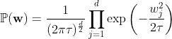

# 模型正则化的贝叶斯方法

> 原文：<https://towardsdatascience.com/a-bayesian-take-on-model-regularization-9356116b6457?source=collection_archive---------19----------------------->

## [入门](https://towardsdatascience.com/tagged/getting-started)

## 在这篇文章中，我们探索了我们如何通过贝叶斯先验信念来正则化和控制模型的复杂性。

我目前正在读斯塔尼斯拉斯·德阿纳的*《我们是如何学习的》*。首先，我不能向任何对学习、教学或人工智能感兴趣的人推荐这本书。

这本书的一个主题是解释为什么人类如此擅长快速学习事物*和高效学习*的*神经学*和*心理学*基础，即只给予有限的经验。Dehaene 关于为什么人类能够如此有效地学习的主要论点之一是因为我们能够降低我们对世界的模型的复杂性。根据*奥卡姆剃刀*的原理，我们找到*最简单的可能模型*，即*解释*我们经历的数据，而不是选择更复杂的模型。但是为什么我们要这样做，即使是从出生开始？一个论点是，与儿童心理学中的频繁主义观点(相信婴儿完全通过他们的经验学习)相反，我们在出生时就已经被赋予了关于世界的先前的信念。**

****

**甚至在我们开始体验这个世界之前，我们的大脑就已经有了固有的知识和惊人的学习能力。娜塔莎·康奈尔在 [Unsplash](https://unsplash.com?utm_source=medium&utm_medium=referral) 上的照片**

**这种简化模型选择的概念在机器学习领域有一个共同的名字:**模型正则化。在这篇文章中，我们将从贝叶斯的角度来谈论正则化。****

**我们有什么方法可以控制从观察中学习的模型的复杂性？我们可以通过在我们的模型分布上放置一个**前**来做到这一点。在我们展示这一点之前，让我们简要回顾一下正则化，在这种情况下，分析正则化用于监督学习。**

# **正规化的背景**

**在机器学习中，**正则化**或模型复杂性控制是一种基本和常见的做法，以确保模型获得高样本外性能，即使样本外数据(测试/验证数据)的分布与样本内数据(训练数据)的分布明显不同。本质上，模型必须*平衡*具有小的*经验损失*(它在给出的数据上有多“错误】)和小的*正则化损失*(模型有多复杂)。**

****

**在正则化中，模型学习在**经验损失**(其预测有多不正确)和**正则化损失**(模型有多复杂)之间进行平衡。照片由[古斯塔沃·托雷斯](https://unsplash.com/@topspot?utm_source=medium&utm_medium=referral)在 [Unsplash](https://unsplash.com?utm_source=medium&utm_medium=referral) 上拍摄**

**在监督学习中，正则化通常通过 **L2 (Ridge)⁸，L1 (Lasso)⁷，或 L2/L1(elasticnet)⁹)**正则化来完成。对于神经网络，也有**辍学**或**早期 Stopping⁴** 等技术。现在，我们将集中于分析正则化技术，因为它们的贝叶斯解释更加明确。这些技术总结如下。**

**让我们首先定义我们的**数据集**和**参数**:**

********

**接下来，对于给定的监督学习问题，其中我们希望最小化损失函数(例如，均方误差):**

****

**然后，对于每种类型的分析监督正则化技术，我们有以下目标:**

*   ****L2(山脊):**参数的**平方**值的处罚(L2 常模**)。直观上，这限制了模型参数的大小，同时最小化了模型预测的“错误”程度。****

********

*   ******L1(拉索):**参数的**绝对值**(**L1 定额**)。直观上，这将一些系数约束为零。你可能注意到下面的正则项是不可微的；这种不可微性导致系数取 0 或非 0 value⁵.****

********

*   ******L2/L1 (ElasticNet):** 这种正则化技术惩罚了参数向量的 **L1** 和 **L2** 范数，导致来自 **L1** 和 **L2** 回归的正则化结果的组合。****

********

****下面是一个对比图，显示了**套索**、**弹性网**和**脊**规则化的标准图，每个都绘制在一个单位球体上。生成该图的代码可以在附录中找到。****

********

****说明规则化不同效果的图。**左:套索，中:弹力网，右:脊。******

****总之，这些正则化技术实现了控制模型复杂性的不同目标。在下一部分中，我们将**通过将**先验信念**(以**概率分布**的形式)强加到**我们的模型参数**上来导出**这些**正则化目标**，从而直接在**先验信念**和**模型正则化**之间建立联系。****

# ****作为模型先验信念的模型正则化****

****让我们通过对模型参数的先验信念，更深入地探究实现正则化背后的概率和优化理论。具体来说，我们将证明:****

1.  ******L2 正则化(吉洪诺夫 Regularization⁶的特例)**通过**多元高斯先验**实现****
2.  ******L1 正则化(LASSO)** 是通过**多元拉普拉斯先验**实现的****

****我们将分析回归问题的这些主张，但它们也扩展到其他监督学习任务，如分类。我们将专注于严格地呈现这些主张背后的数学原理(你也可以在本文[这里](https://drive.google.com/file/d/1hOQAxuoEpKPKHLfThPZXuwIFodnHvGGl/view?usp=sharing)找到这些推导)。让我们开始吧！****

******作为多元高斯先验的 L2(岭)正则化******

********

****直观地说，当使用**脊正则化**时，我们在模型学习的曲面/超曲面中创建一个脊。杰里米·毕晓普在 [Unsplash](https://unsplash.com?utm_source=medium&utm_medium=referral) 上的照片****

****假设我们再次具有相同的一组观察值 D 和一个参数向量 **w** ，我们想要优化该参数向量以便对来自 D:****

****************

****使用**最大后验概率(MAP)规则**，我们可以表明，当我们在 **w** 上调用高斯先验分布时， **w** 的后验分布的均值和众数就是**岭回归**的解。我们首先调用贝叶斯规则:****

********

****我们现在定义先验和观测模型分布，假设如下:****

******a .先验模型(参数 w 上的分布):******

********

******b .观察模型(观察值的条件分布** D **以参数为条件):******

********

****现在，让我们把这些表达式代入贝叶斯法则:****

********

****为了导出我们的 **L2 正则化的**估计量，我们现在使用**映射规则**和**负对数似然函数**将乘积上的表达式转换成和上的表达式。****

****该操作是允许的，因为:****

****(I)目标的对数是似然函数的*严格单调变换*，因此取对数似然函数的最大自变量将保持似然目标的基数并产生相同的最大化自变量。****

****(二)任一目标 J( **θ** )的*最大化*自变量与负目标 J( **θ** )的*最小化*自变量相同。****

****因此，论点 **w*** 即*最大化*对数似然将*最小化*负对数似然:****

********

****将我们的后验分布代入负对数似然的表达式:****

********

****由于对数将乘积转换成和，我们可以将乘积的对数分解成依赖于我们的参数 **w** 的求和项的和，以及不依赖于 **w** 的常数。然后，我们可以使用对数规则来简化这个表达式。****

********

****(请注意，在第一行中，我们省略了常数，以便将该方程放在一行中。)****

****************

****移除不依赖于我们的参数 **w** 的项，将表达式乘以常数σ，我们得到:****

********

******λ = σ / τ** 的设置使得我们的 MAP 估计量也是通过**岭回归**得到的估计量(当我们的数据以 0 为中心时):****

********

****这与我们上面的**山脊目标**(用于回归)完全一致！在封闭形式中，这产生了正规方程:****

********

****其中λI 项用于确保待求逆的矩阵(X^T X)是半正定的，因此是可逆的。****

****因此，在我们的**参数**上放置一个**多元高斯先验**相当于**用一个 **L2 范数惩罚来正则化**我们的**参数**。******

## ****作为多元拉普拉斯先验的 L1(拉索)正则化****

********

****利用**套索正则化**，我们鼓励**稀疏性**，即把对减少经验损失没有多大贡献的模型系数设置为零。马库斯·斯皮斯克在 [Unsplash](https://unsplash.com?utm_source=medium&utm_medium=referral) 上拍摄的照片****

****我们现在将检查一个具有**拉普拉斯先验的类似情况。**再次假设我们有一个观察值 D 的数据集和一个参数向量 **w** ，我们希望对其进行优化，以便对来自 D:****

****************

****再次使用映射规则，当我们在 **w** 上调用高斯先验分布时，我们可以表明 **w** 的后验分布的均值和众数是**套索回归**的解。我们首先调用贝叶斯规则:****

********

****我们现在定义先验和观测模型分布，假设如下:****

******a .先验模型(参数 w 上的分布):******

********

******b .观察模型(分布同上):******

********

****重复上述步骤(参考下文):****

1.  ****使用**映射规则写出参数的**后验**分布和最优参数 **w*** 。******
2.  ****从**地图目标**中导出**负对数似然函数**。****
3.  ****从**负对数似然中移除不依赖于 w 的项******
4.  ******适当设置**超参数 **p、q、α1、**和 **α2。******

****下面是**套索**的相应推导:****

****************************************

****(注意上一步我们设置 **p = 1，q = 1，**和 **λ = α_1 / α_2** 。)****

****如前所述，我们已经得到了我们的**套索目标**(用于回归)，如上一节所述！****

# ****为什么这很重要？****

********

****照片由 [Unsplash](https://unsplash.com?utm_source=medium&utm_medium=referral) 上的 [Dmitry Ratushny](https://unsplash.com/@ratushny?utm_source=medium&utm_medium=referral) 拍摄****

****虽然看起来我们所做的只是调用一些优化、对数和概率分布的技巧，但上述推导的意义可能在前面提到的小说*“我们如何学习”*的上下文中得到最好的理解。****

****如果我，一个人类，正在学习一个世界的模型，为什么我倾向于最简单的模型来解释我的观察？其中一个原因是，我们的大脑甚至在学习之前就对我们学习的模型建立了“先验信念”，这是我们从经验中学习时考虑的因素。然而，我们不是仅仅从经验中学习这些模型，而是用经验来更新我们以前对这些模型的信念。****

****通过预先相信我们学习的模型必须尽可能简单，**我们能够控制我们学习的模型的复杂性，甚至在我们学习它们之前**！这正是我们在上面的分析推导中所做的:通过对模型参数分布的先验信念(即“模型参数 **w** 是**正态分布**”)，我们能够直接确定这些模型有多复杂。****

# ****摘要****

****在本文中，我们介绍了*模型复杂性和正则化* ***、*** 的概念，以及这些概念如何与*先验信念的概念相关联。*我们声称，我们可以控制模型的复杂性，即*正则化*它，通过对我们的参数分布设置先验信念。然后，我们简要介绍了一些常见的分析，监督正则化技术(岭，套索，和弹性网回归)。然后，我们展示了如何分别使用多元高斯和拉普拉斯先验分布来推导脊正则化和套索正则化的目标函数。最后，我们讨论了为什么这些结果不仅对机器学习，而且对心理学都很重要。****

****感谢阅读:)更多强化学习、计算机视觉、编程、优化方面的文章请关注我！****

****另外，非常感谢 [CODECOGS](https://codecogs.com/) 的[在线方程式渲染工具](https://codecogs.com/latex/eqneditor.php)！如果你想在你的中等文章中渲染数学，这是非常有用和容易使用的。****

# ****参考****

****[1]德阿纳，斯塔尼斯拉斯。我们如何学习:为什么大脑比任何机器都学得好……目前来说。企鹅，2020。****

****[2]拉斯姆森，卡尔爱德华，和邹斌 Ghahramani。“奥卡姆剃刀”*神经信息处理系统的进展*(2001):294–300。****

****[3] Srivastava，Nitish 等人，“辍学:防止神经网络过度拟合的简单方法。”*机器学习研究杂志*15.1(2014):1929–1958。****

****[4]卡鲁阿纳、里奇、斯蒂夫·劳伦斯和李·贾尔斯"神经网络中的过度拟合:反向传播、共轭梯度和早期停止."*神经信息处理系统的进展*(2001):402–408。****

****[5]罗伯特·蒂布拉尼。"通过套索的回归收缩和选择."皇家统计学会杂志:B 辑(方法学)58.1(1996):267–288。****

****[6]卡尔维蒂、丹妮拉和洛萨·赖歇尔。"大型线性问题的吉洪诺夫正则化."位数值数学 43.2(2003):263–283。****

****[7]罗伯特·蒂布拉尼。"通过套索的回归收缩和选择."《皇家统计学会杂志:B 辑(方法论)》58.1(1996):267–288。****

****[8]霍尔、阿瑟·e 和罗伯特·w·肯纳德。"岭回归:非正交问题的有偏估计."*技术计量学*12.1(1970):55–67。****

****[9]邹、惠和特雷弗·哈斯蒂。"通过弹性网的正则化和变量选择."皇家统计学会杂志:B 辑(统计方法学)67.2(2005):301–320。****

# ****附录****

****生成图的代码(改编自[这个堆栈溢出帖子](https://stackoverflow.com/questions/48723466/l0-and-inf-norms-plotting-with-contour-contourf))。****