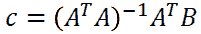

# 一种看待线性回归的美丽方式

> 原文：<https://towardsdatascience.com/a-beautiful-way-of-looking-at-linear-regressions-a4df174cdce?source=collection_archive---------8----------------------->

## 一旦你看到它，你以前的想法将只是投影

汤姆·巴瑞特在 [Unsplash](https://unsplash.com?utm_source=medium&utm_medium=referral) 上的照片

*你知道线性回归是正交投影吗？这对数学家来说是显而易见的，但像你我这样头脑简单的人可能从未想过这个问题。尽管如此，我们仍然可以欣赏它的美丽。知道每一个线性回归都可以被视为一个空间问题是一个游戏规则的改变者。如果你不知道这些，不要难过。你仍然有机会第一次有一个令人兴奋的经历。*

# 最小二乘法是什么，为什么要关心？

[最小二乘法](https://en.wikipedia.org/wiki/Least_squares)是数据拟合中最常用的方法之一。它允许你获取一堆数据，并得出一个数学表达式来模拟这些数据的行为。如果你认为这与你无关，你可能错了。最小二乘不仅仅是数学家和工程师的专利。最小二乘无处不在，属于每个人。他们沉浸在你的手机偏好、你的网飞账户和你的日常生活中。无论你走到哪里，数据都在被收集和用于构建模型，这些模型代表了数据的行为，并预测下一步应该是什么。即使这些模型比我们在这里要解释的更复杂，最小二乘的基本方面仍然存在。

图一。建模数据和观测数据之间的差异。作者在 [desmos](https://www.desmos.com/) 中做的图，之前用的[这里用的](/the-interesting-world-of-non-linear-regressions-eb0c405fdc97)。

这可能是最小二乘法最简单的解释:我们有一些输入数据 *x* 负责一些输出数据 *y* 。我们的目标是找到一个计算 *x* 的数学表达式，并产生一个尽可能接近 *y* 的 *ŷ* 。图 1 显示了一些红色的数据点和一条紫色的曲线。数据点是我们试图匹配的观察数据。紫色曲线是我们用来表示红点行为的数学模型。注意我们如何计算观察值( *y* )和建模值( *ŷ* )之间的差异。这些差异用字母 *r* 表示。再说一次，我们的目标是找到一个 r 尽可能小的模型。然而，我们有一个问题: *r* 可能是负的，也可能是正的，这取决于我们如何计算它。为了解决这个，我们不打算把 *r* 算成 *y* - *ŷ* 或者 *ŷ* - *y* 。我们的计算将是:

等式 1。差异的平方

如果我们计算 *y* 和 *ŷ* 之差的平方，结果总是正的。然后，最小二乘法包括寻找模型，其中观察数据和建模数据之间的差的平方尽可能小。

# 传统的解释

观测数据和建模数据之间的差异通常称为残差，数学上表示为:

等式 2。残差

注意 *ŷ* 是一个函数 *f* ，使用系数 *a* 对每个 *xi* 进行评估。找到这些系数是我们的主要目标。理想情况下，我们想知道哪些系数使我们达到 *S* 的最小可能值。

等式 3。残差和

为了找到 *S* 的最小值，我们可以将梯度设置为零，并找到系数 *a* 。如果你不清楚如何在梯度等于零时找到最小值，你可以访问[这篇文章](/the-interesting-world-of-non-linear-regressions-eb0c405fdc97)(特别是“使用导数最小化函数的图解说明”一节)。

在线性回归问题中，最小二乘法的应用总是有唯一的解，而对于[非线性回归](/the-interesting-world-of-non-linear-regressions-eb0c405fdc97)则不是这样。线性问题的解决方案在下面的等式中给出，其解释可以在多本书和[网页](https://en.wikipedia.org/wiki/Least_squares#Solving_the_least_squares_problem)中找到。

等式 4。未知系数向量

这里要理解的主要内容是，向量 ***c*** 包含对数据建模的线性表达式的系数。这个向量是观察值( ***B*** )、输入值(***)A***)以及我们想要用作模型的表达式类型的函数。下图显示了使用相同输入数据但更改了模型或方程类型的四个线性回归示例。 ***A*** 的每一列代表方程的一项，每一行代表输入值。请注意 ***c*** 将始终是一个只有一列、行数等于我们定义的参数数的矩阵。每个图中包含的方程代表了每个模型数据的最佳数学表示。

图二。使用相同输入数据但改变数学模型的线性回归示例。作者制作的图表。

# 再看一眼

在上图的所有例子中，我们有一个输入数据变量( *x* )和一个输出数据变量( *y* )。然而，我们可以对输入数据使用多个变量。我们可以有这样一个函数:

等式 5。依赖于两个独立变量的模型

在这种情况下，我们可以获得一个曲面，而不是获得一条描述模型和数据之间最佳匹配的直线。如果我们不断向输入数据中添加更多的变量，我们可以找到更多的最佳拟合系数。因此，最小二乘法和线性回归不仅适用于图 2 中的图，您还可以应用这种方法来找到代表多个独立变量的数学模型。

当应用最小二乘法进行线性回归时，我们可以用不同的方式来思考。假设我们有一个矢量*，由图 3a 中的蓝线表示。这个向量的位置也标记了一条线在 *xy* 平面上的位置(蓝色细虚线)。现在让我们说，我们想找到那条线上离平面上另一个点最近的点是什么，在这种情况下， *B* 。这类似于问 *B* 到蓝线的最小距离是多少。该最小距离对应于 *B* 在直线上的正交投影。图 3b 示出了代表该投影的点 *X* 。如你所见，从 *B* 到 *X* 的绿线与蓝线成 90 度，这意味着 *X* 是 *B* 在蓝线上的正交投影。*

**

*图 3。(a)点 B 在由向量 a 定义的直线上的正交投影，(B)点 B 到其正交投影的距离。作者制作的图表。*

*现在的问题是:怎样才能找到 *X* ？图 3b 显示有一个常数 *C* 与向量 A 相乘，这样 *A* 的位置就是我们正在寻找的值。所以寻找 *X* 的问题可以通过确定 a *c* 乘以*将使 *B* 到蓝线的距离最小来解决。**

**首先要做的是找到计算 *B* 和 *A* 之间距离 *d* 的方法。一种方法是使用这些点之间的[欧几里德距离](https://en.wikipedia.org/wiki/Euclidean_distance)。我们可以如下计算该距离:**

****

**等式 6。二维空间中两点之间的欧氏距离**

**注意 *Bx* 、 *Ax* 、 *By* 和 *Ay* 分别对应 *A* 和 *B* 在 *x* 和 *y* 轴上的坐标。这是这种距离计算的一个很酷的特性。对于这个例子，我们正在计算平面上两点之间的距离。我们还可以计算空间中两点之间的距离，甚至可以计算 10 维空间中两点之间的距离。等式总是相同的，可以写成如下形式(其中 *N* 代表维数):**

****

**方程式 7。N 维空间中任意多个点之间的欧几里得距离**

**我们有一种方法来计算 *B* 和 *A* 之间的距离。我们现在需要的是找到哪一个 *c* 会使这个距离最小化。你知道该怎么做，对吧？让我们对方程求关于 *c* 的微分，并将其设为 0。在此之前，有一点非常重要，那就是计算 eq 的最小值。7 等同于计算以下各项的最小值:**

****

**等式 8。每个维度中多个点之间距离的平方和**

**这是由于平方根函数的[单调性](https://en.wikipedia.org/wiki/Monotonic_function)。不要被名字吓到。这就意味着，求函数平方根的最小值，实际上就是求函数平方根自变量的最小值。如果有人问你√5 和√6 哪个更小，你可以很快回答 5，因为平方根函数是单调的。**

**回到我们的讨论，目标是取情商。8 并计算 *c* 使得 *d* 最小。如果我们对这个方程求导，我们会得到:**

****

**等式 9。对等式 8 求微分并将其设置为零**

**等式中包含的求和。如果我们用矩阵而不是单个值来工作，9 可以被替代。假设 ***A*** 表示所有维度上的 *A* 的值的数组(在 2D 问题中，这将意味着 *Ax* 和 *Ay* ),而 ***B*** 表示另一个数组，其值为所有维度上的 *B* 。那么我们可以将前面的等式表示为:**

****

**方程式 10。情商。9 矩阵形式**

**记住，要乘矩阵，第一个矩阵的列数需要与第二个矩阵的行数相匹配。这就是为什么要将 *A* 乘以 *B* 或 *A* 乘以 *A* 我们需要计算 *A* 的[转置](https://en.wikipedia.org/wiki/Transpose)。**

**从上式我们可以得到 *c* ，即:**

****

**方程式 11。使点 B 和由矢量 A 定义的直线之间的距离 d 最小的矢量 c**

**这个值 *c* 就是我们一直在寻找的，并且是(令人惊讶的可能？)我们之前在等式 4 中使用的。这是什么意思？从投影的角度来看， *c* 代表点 *B* 的正交投影在矢量**T5a**定义的直线上的位置(图 3)。从线性回归的角度来看， *c* 代表乘以 *A* 中每一行的系数，这将引导您找到输入数据的最佳可能表示(图 2)。这可能看起来是两件完全不同的事情，但它们实际上是有联系的。当我们进行线性回归时，我们会找到包含在*的每一行中的函数的线性组合。在直线的例子中，*中只有一行，所以求这个单一函数的线性组合实际上就是求 *B* 在直线上的投影。****

**是时候举个例子了！假设我们想要计算点 *B* =(4，2)在由矢量 *A* =(1，2)定义的直线上的投影，如图 4 所示。对于这种情况，我们可以定义一个矩阵 ***A*** 和一个矩阵 ***B*** 并用我们在等式上找到的表达式计算 *c* 。11.**

****

**图 4。向量 a 定义的直线上 B 点投影的计算示例。作者制作的图形。**

***B* 在直线上的投影位置为*X*=***A***。 *c* 即(1.6，3.2)。那么，这和线性正方形有什么关系呢？假设我们不是将 *A* 和 *B* 读取为两个点，而是将它们读取为一对输入/目标数据。在这种情况下，我们将有两个数据点:(1，4)和(2，2)，我们希望使用线性回归来拟合模型。如图 5 所示，我们找到的线性回归系数也是 1.6。**这意味着执行线性回归就像寻找目标向量在子空间上的正交投影，该子空间由我们想要包含在回归中的每个函数构成**。在这种情况下，点(4，2)被投影到由向量(1，2)形成的子空间中。这就像图 2 中的示例 2，其中定义线性回归元素的矩阵*只有[x1，x2，…xn]的值。***

******

***图 5。(a)点 B 在向量 a 定义的直线上的投影，(B)点(1，4)和(2，2)的线性拟合。作者制作的图表。***

***是的，线性回归是一个正交投影，一旦你看到它，一切都有意义。我们甚至可以以之前的例子为例，找到另一个具有相同正交投影的点 *E* ，注意到线性回归系数是相同的(图 6)。在这种情况下，数据点更靠近直线，因此 [R](https://en.wikipedia.org/wiki/Coefficient_of_determination) 将增加。然而，两种情况下的斜率完全相同。我们可以找到用相同回归系数调整的点的无限组合，因为有无限多个点的正交投影是 *X* 。你听说过安斯科姆的四重奏吗？现在是看一看它的好时机。***

****

**图 6。(a)点 E 在向量 a 定义的直线上的投影，(b)点(1，0.4)和(2，3.8)的线性拟合。作者制作的图表。**

# **向第三维度的飞跃**

**到目前为止，我们看到的例子只包含 2 个数据点。这是有原因的。拥有 *N* 个数据点意味着我们想要投影的向量是 N 维的，难以可视化。假设我们有一组 100 个数据点，我们希望调整到以下形式的线性回归:**

****

**方程式 12。具有 3 个系数的线性表达式示例**

**在这种情况下，我们会有一个 100 维的向量，我们想投影到一个 3 维空间。你能想象这个吗？也许太多了。让我们用一个更简单的例子:我们有一个 3 点的数据集，我们想用两个系数的线性回归来调整。这如图 7 所示。**

****

**图 7。3 点数据集的 y=a+bx 类型的线性回归。作者制作的图表。**

**如果我们将线性回归应用到前面的例子中，我们会发现最佳拟合出现在 a=-⅓和 b=3/2 时。我们如何在三维空间中表现它呢？对于这种情况，我们有一个目标向量***t***=【2，1，5】，我们希望将其投影到由向量*=【1，1，1】和***B***=【1，2，3】形成的曲面上。记住我们要找的表达式有一个系数乘以 *x* (向量 ***A*** )和一个偏差或者系数乘以 1(向量 ***B*** )。请看图 8。***

****

**图 8。点 t 在向量 A 和 b 形成的子空间上的投影。作者使用[这个 Python 笔记本](https://github.com/manfrezord/MediumArticles/blob/ef454411bd9d6713d7b51864bdc188b9f667003e/LinearReg_as_OrthoProject.ipynb)制作的图形。**

**点 *c* 表示目标向量**T3t**在由定义线性回归的向量形成的表面上的正交投影。 *c* 为(-0.33，1.5)的原因是，如果我们想象一个由**B=(1，1，1)为 y 轴、 *A*** =(1，2，3)为 x 轴组成的 2D 坐标系， *c* 在 *y* 为负， *x* 为正。如果我们改变想要投影的点的位置，我们将看到它在 2D 子空间上的位置也相应地改变(图 9)。**

****

**图 9。点 t2 在向量 A 和 b 形成的子空间上的投影。作者使用[这个 Python 笔记本](https://github.com/manfrezord/MediumArticles/blob/ef454411bd9d6713d7b51864bdc188b9f667003e/LinearReg_as_OrthoProject.ipynb)制作的图形。**

**类似于我们之前所做的，我们现在可以找到无穷多个点，它们在平面上的投影也是 *c* 。这意味着这些点将使用相同的线性回归系数进行调整，尽管这些点到模型的距离会发生变化。如果你想玩不同的点和平面，欢迎你使用我上传到 GitHub 的这个 Python 笔记本。我试图尽可能多地解释我在代码的每一部分做了什么。**

**在前面的例子之后，可能更容易想象这样一种情况:我们想要将属于 100 维空间的一个点投影到由 2 个向量构成的 2 维空间中。很难对这个 100 维空间的样子有一个清晰的描述，但是，如果我们外推我们之前所做的，毫无疑问，我们将在 2D 空间中找到一个点，它代表原始点在 100 维空间中的正交投影。来自匹兹堡大学的约翰·d·诺顿教授的这篇文章包含了一个关于如何在四维空间中可视化事物的很好的解释。我会把 100 维空间里的点的画面留给你去想象！**

# **结论**

**这篇文章所写的并不新鲜。正如我在引言中所说，如果你是一名数学家，很可能所有这些对你来说都是显而易见的。然而，我决定写这篇文章的原因是，在不同的程序中运行多元线性回归之后，我从未停下来思考我实际上在做什么。当我意识到线性回归实际上是正交投影时，我觉得我终于明白了我多年来一直在做的事情。这帮助我认识到为什么线性回归是有封闭解的问题，以及为什么在某些情况下它们不是一个好主意。无论如何，不管你的数学知识如何，我希望你会觉得这很有趣，就像我几天前翻阅我的旧线性代数书时发现的一样。**

# **参考**

*   **弗拉基米尔·米库利克(2017)。[为什么线性回归是投影](https://medium.com/@vladimirmikulik/why-linear-regression-is-a-projection-407d89fd9e3a)。**
*   **托马斯·s·罗宾逊(2020)。[计量经济学的基本定理。第三章。](https://bookdown.org/ts_robinson1994/10_fundamental_theorems_for_econometrics/linear-projection.html)**
*   **约翰·诺顿(2001 年)。[四维空间是什么样的？](https://sites.pitt.edu/~jdnorton/teaching/HPS_0410/chapters/four_dimensions/index.html)**
*   **Christopher M. Bishop (2006)模式识别和机器学习。斯普林格。**