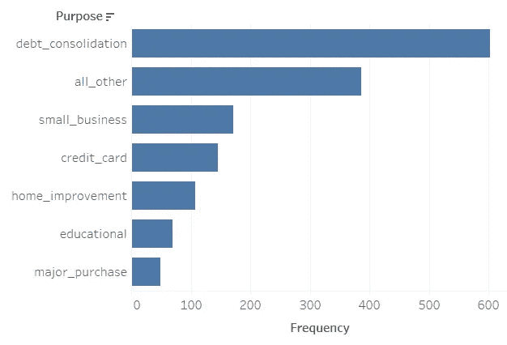
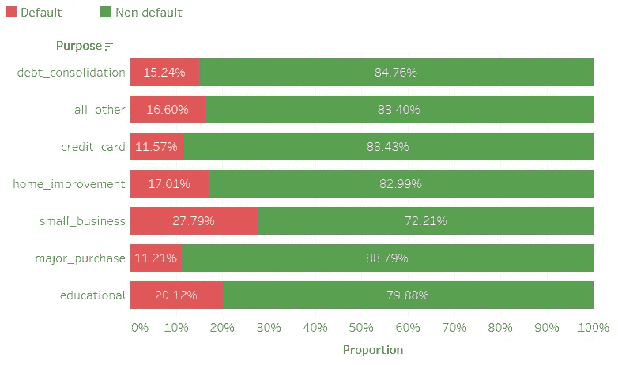
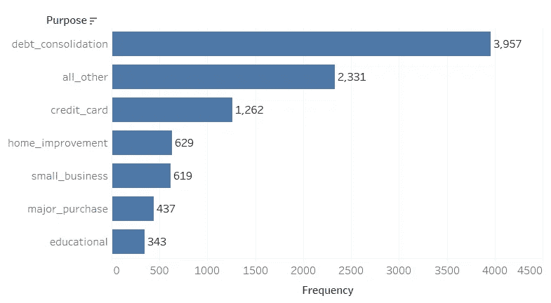
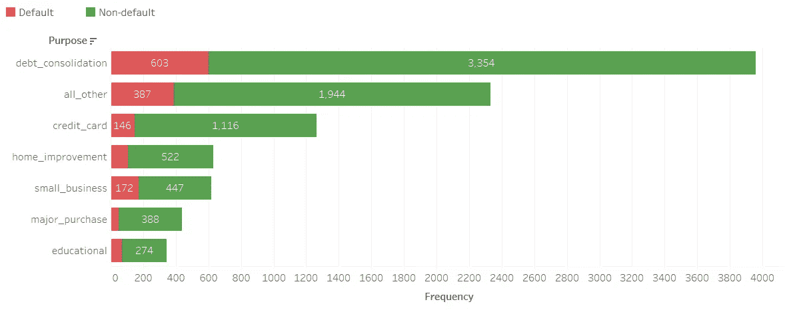

# 探索性数据分析的初学者困境

> 原文：<https://towardsdatascience.com/a-beginner-dilemma-in-exploratory-data-analysis-8919b4e737e8?source=collection_archive---------16----------------------->

## 探索性数据分析(EDA)是数据科学项目中的一个重要步骤，在这里您可以对数据有所了解。

对于初学者来说，EDA 可能会带来一些挑战。本文讨论了每个探索性数据分析初学者在某个时间点可能面临的挑战之一。本文假设读者具备 EDA 的基础知识。

[Firmbee.com](https://unsplash.com/@firmbee?utm_source=unsplash&utm_medium=referral&utm_content=creditCopyText)在 [Unsplash](https://unsplash.com/@firmbee?utm_source=unsplash&utm_medium=referral&utm_content=creditCopyText) 上拍照

最近，我在玩一个从 Kaggle 获得的玩具数据集([贷款数据](https://www.kaggle.com/itssuru/loan-data))。我使用这个数据集在 Tableau 中创建了一个仪表板，并将其发布到 Tableau Public(您可以在这里找到已发布的仪表板)。在我的数据科学之旅的早期，我面临着一个两难的选择，即从数据中选择正确的答案。我觉得值得与这一领域的初学者分享。

让我们用一个例子来理解这个困境。在贷款数据集中，假设我们需要找出"**哪种类型的贷款(数据集中的“目的”特征)最有可能出现违约？**”。我能想到两种方法来寻找答案。

## 方法 1

在这种方法中，我首先只选择已经违约的借款人(在“未全额支付”功能中为 1)，然后绘制这些违约借款人的贷款类型条形图。那么这个图看起来会像下面这样。

违约者的贷款(图片由作者提供)

上图显示，大多数违约者接受了“债务合并”贷款。因此，我们可以说“债务合并”贷款的违约率最高。

## 方法 2

在这种方法中，我们将绘制一个堆积条形图，以查看贷款类型的违约比例。

按贷款类型划分的违约比例(图片由作者提供)

上面的情节说的是另外一个故事。在这里，“小企业”贷款的违约率最高。

## 哪种方法是对的？

方法 2 是回答“哪种类型的贷款最有可能出现违约？”这个问题的正确方法。那么，方法 1 有什么问题呢？

方法 1 回答了“哪种贷款最受违约者欢迎？”。在方法 1 中，我们将“债务合并”贷款放在顶部，因为这是贷方提供的最受欢迎的贷款类型(针对违约者和非违约者)。下面的剧情来看看吧。

贷款频率(图片由作者提供)

正如我们所见,“债务合并”是贷方提供的最受欢迎的贷款。超过 50%的贷款用于债务整合。因为，债务合并贷款提供给许多借款人，违约也更多。这并不意味着采取债务合并贷款的人有相对更多的违约。

## 如何克服这种困境？

**1。正确设计问题**

正确地提出问题可以解决你 90%的困境。在上面的例子中，我们想知道“哪种贷款类型最有可能出现违约”，而不是“哪种贷款最受违约者欢迎”。

**2。相信比例，而不是绝对数字**

让我们用绝对数代替比例来试试方法 2。我们将会看到，我们最终会得到与方法 1 相同的结果。

按贷款类型分类的违约频率(按作者分类的图片)

在上面的图中，我们再次看到债务合并贷款的违约率最高。但是，这是不正确的。由于债务合并贷款是由大量贷款人提供的，违约率也会很高。并不是说债务合并贷款违约率最高。

这就好比说，与印度人相比，美国人更有可能在美国的 X 公司失业。假设 X 雇佣了 100 名美国人和 10 名印度人，X 解雇了 10 名美国人和 5 名印度人。这并不意味着美国人更有可能失业。如果你以绝对数字来看，更多的美国人被解雇，但也要记住，他们构成了雇员的大多数。但是，如果你用百分比来看，只有 10%的美国人被解雇，而 50%的印度人被解雇。因此，绝对数字可能会误导人，所以要相信比例。