# 电影推荐的协同过滤介绍

> 原文：<https://towardsdatascience.com/a-beginner-friendly-guide-to-recommender-system-3f5fa2a57c02?source=collection_archive---------3----------------------->

## 推荐系统分步指南

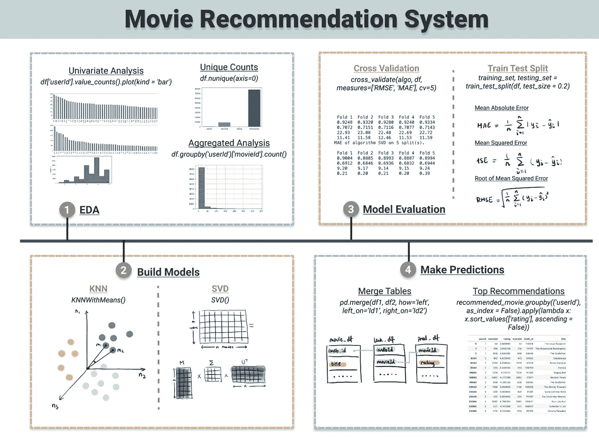

推荐系统备忘单(图片来自作者的[网站](https://www.visual-design.net/)

随着我们对个性化内容推送需求的增加，推荐系统已经成为一个新兴的话题。我想我们都熟悉 YouTube 上的推荐视频，我们都——不止一次——是深夜网飞狂看的受害者。

推荐系统中有两种流行的方法，基于协作的过滤和基于内容的过滤。**基于内容的**过滤根据内容属性(如流派、语言、视频长度)预测观众可能喜欢的内容。而**协同过滤**基于其他相似用户的偏好进行预测。因此，协同过滤方法倾向于基于实例的学习，通常由手头有大量数据的大公司应用。

在本文中，我将关注基于协作的过滤，并简要介绍如何使用属于这一类别的两种算法进行电影推荐， **K 最近邻(KNN)和奇异值分解(SVD)。**

我使用来自 Kaggle 的[电影数据集](https://www.kaggle.com/rounakbanik/the-movies-dataset)来预测个人级别的推荐电影。

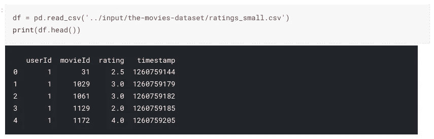

评级数据集

# 推荐系统的 EDA

每种机器学习算法都需要不同的方式来探索数据集，以获得有价值的见解。我使用了以下三种技术来研究手头的数据。要查看更全面的 EDA 指南，请查看我的博客。

</semi-automated-exploratory-data-analysis-eda-in-python-7f96042c9809>  

## 1.唯一计数和数据形状

首先，概述数据集中包括多少不同的用户和电影。使用`df.nunique(axis = 0)`很容易做到这一点，然后将其绘制成条形图。

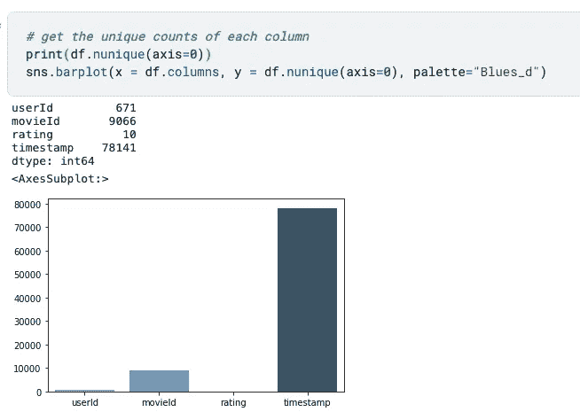

唯一计数代码(图片由作者提供)

## 2.单变量分析

单变量分析(一次分析一个特征)有助于我们更好地理解三个问题:

1.  *评论最多的电影有哪些？*
2.  *提供最多评论的用户是谁？*
3.  *收视率的分布情况如何？*

```
# univariate analysis
plt.figure(1, figsize = (16,4))
df['movieId'].value_counts()[:50].plot(kind = 'bar') #take top 50 movies
plt.figure(2, figsize = (16,4))
df['userId'].value_counts()[:50].plot(kind = 'bar') #take top 50 users
plt.figure(3, figsize = (8,4))
df['rating'].plot(kind = 'hist')
```

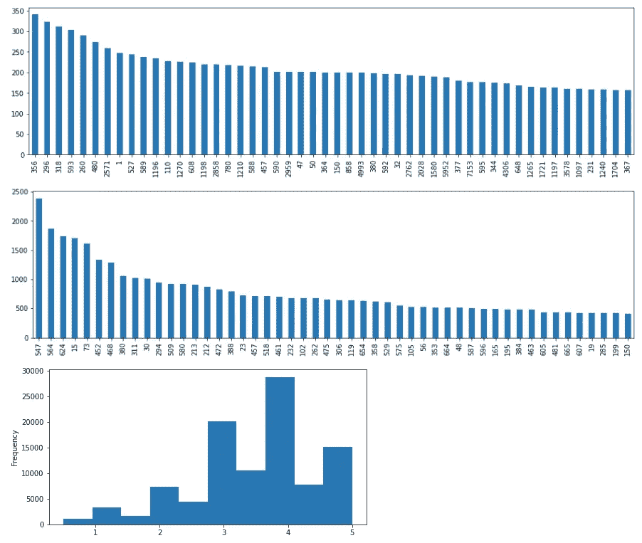

单变量分析结果(图片由作者提供)

我们可以从单变量分析中得到一些启示:

1.分级在电影中不是均匀分布的，分级最高的电影是“356 ”,其分级不超过 350；

2.评级在用户中分布不均，用户最多提供 2400 个左右的评级；

3.大多数人可能会给出 4 左右的评级

## 3.汇总分析

单变量分析给我们更多的是单个电影或用户层面的视图，而聚合分析帮助我们理解元层面的数据。

*1。每部电影的收视率分布是怎样的？*

```
ratings_per_user = df.groupby('userId')['movieId'].count() ratings_per_user.hist()
```

直方图显示，大多数用户(671-80%中的大约 560 人)的评分低于 250。

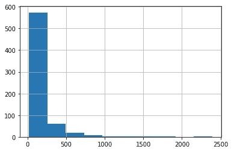

*2。提供评分的用户分布如何？*

```
ratings_per_movie = df.groupby('movieId')['userId'].count() ratings_per_movie.hist()
```

直方图显示，大多数电影(大约 9，066-90%中的 8，200 部)的评分低于 25 分。

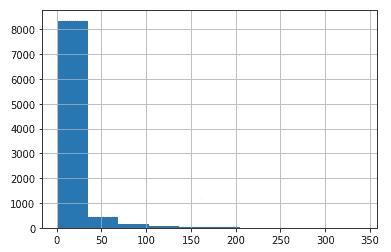

在这个阶段，我们应该对手头的数据有一个相当清晰的了解。

# 基于协作的过滤算法

我想介绍两种基于协作的过滤算法——K 近邻和奇异值分解。惊奇库允许我们用几行代码实现这两种算法。

```
from surprise import KNNWithMeans
from surprise import SVD# KNN
similarity = {
    "name": "cosine",
    "user_based": False,  # item-based similarity
}
algo_KNN = KNNWithMeans(sim_options = similarity)# SVD
algo_SVD = SVD()
```

但是，为了恰当地实现算法，最好对每种算法背后的理论有一个基本的了解。

## 1.k 最近邻(KNN)

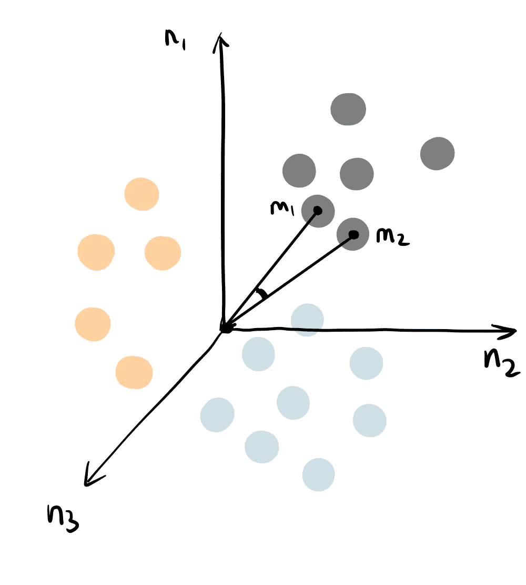

KNN 插图(图片来自作者的[网站](https://www.visual-design.net/)

选项`user_based: False`确定该 KNN 使用基于项目的相似性，因此我们基于具有已知评级的类似项目来预测项目 m1 的未知评级。您可以将 k 近邻算法视为在由 n 个用户定义的 n 维空间中表示电影项目。基于**余弦相似度**计算点之间的距离，余弦相似度由两个向量之间的角度决定(如图中 m1 和 m2 所示)。余弦相似度优于欧几里德距离，因为当数据集维数较高时，它受到的影响较小。

## 2.矩阵分解—奇异值分解(SVM)

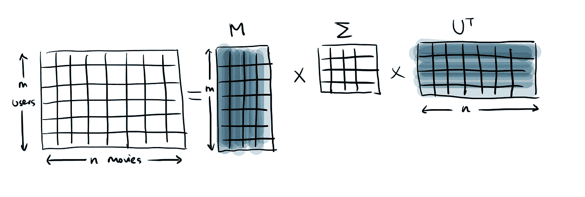

SVD 插图(图片来自作者的[网站](https://www.visual-design.net/))

奇异值分解是一种**矩阵分解**技术，将矩阵分解为低维矩阵的乘积，然后从最高重要性到最低重要性提取潜在特征。这是一个相当长的句子，所以让我把它分解一下…

它不像 KNN 那样遍历单个评级，而是将评级矩阵视为一个整体。因此，与 KNN 相比，它的计算成本更低，但可解释性也更差。

SVD 提取**潜在特征**(它不是数据集中包含的实际特征，而是算法神奇地发现的有价值的隐藏特征)以形成分解矩阵 U 和 V 转置，并将它们按特征重要性降序排列——就像图中从深蓝色到浅蓝色。然后，它通过采用基于特征重要性的加权方法转置的 U 和 V 的乘积来填充空白评级。这些潜在特征参数通过最小化误差来迭代学习。

说到误差，现在来说说模型评估。

# 模型评估

协同过滤技术将推荐系统表示为一个回归模型，其输出是一个数字评分值。因此，我们可以将回归评估指标应用到我们的推荐系统中。如果您想深入了解常见的回归评估指标，例如线性回归，您可能会发现“[简单实用的线性回归指南](https://www.visual-design.net/post/a-simple-practical-guide-to-linear-regression)”中的模型评估部分很有帮助。

</a-practical-guide-to-linear-regression-3b1cb9e501a6>  

在这个练习中，我用以下两种方法来评估 KNN 和奇异值分解。

## 1.交互效度分析

惊喜库提供了自动执行交叉验证的`cross_validate`功能。为了让惊喜库理解数据集，我们需要使用`load_from_df`将数据集摄取到惊喜阅读器对象中，并将评分范围保持在 0 到 5 之间。

```
from surprise import Dataset
from surprise import Reader# load df into Surprise Reader object
reader = Reader(rating_scale = (0,5))
rating_df = Dataset.load_from_df(df[['userId','movieId','rating']], reader)
```

然后将算法 _KNN 和算法 _ 奇异值分解传递给交叉验证函数，进行 5 次交叉验证。

```
from surprise.model_selection import cross_validatecross_validate_KNN = cross_validate(algo_KNN, rating_df, measures=['RMSE', 'MAE'], cv=5, verbose=True)cross_validate_SVD = cross_validate(algo_SVD, rating_df, measures=['RMSE', 'MAE'], cv=5, verbose=True)
```

结果显示了 KNN 和奇异值分解的比较。如图所示，奇异值分解具有较小的 RMSE、平均熵值，因此性能优于奇异值分解，并且计算时间也少得多。

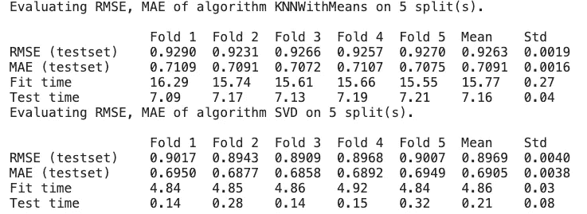

交叉验证结果

## 2.训练测试分割评估

这种方法将数据集分成 80%用于训练，20%用于测试。与交叉验证中迭代模型构建 5 次不同，它将只训练模型一次并测试它一次。我已经定义了函数`train_test_algo`来打印出 RMSE，平均误差，平均误差并返回测试数据帧。

```
from surprise.model_selection import train_test_split
from surprise import accuracy# define train test function
def train_test_algo(algo, label):
    training_set, testing_set = train_test_split(rating_df, test_size = 0.2)
    algo.fit(training_set)
    test_output = algo.test(testing_set)
    test_df = pd.DataFrame(test_output)

    print("RMSE -",label, accuracy.rmse(test_output, verbose = False))
    print("MAE -", label, accuracy.mae(test_output, verbose=False))
    print("MSE -", label, accuracy.mse(test_output, verbose=False))

    return test_df
```

我们来对比一下模型精度，一窥测试输出。

```
train_test_KNN = train_test_algo(algo_KNN, "algo_KNN")
print(train_test_KNN.head())train_test_SVD = train_test_algo(algo_SVD, "algo_SVD")
print(train_test_SVD.head())
```

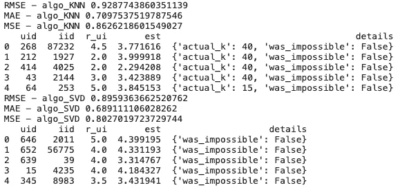

训练测试分割评估结果

结果与交叉验证非常相似，表明 SVD 误差较小。

# 提供顶级推荐

仅仅建立模型是不够的。正如您在上面看到的，当前的测试输出只预测随机分配到测试集的用户或电影的评级，我们还希望看到带有电影名称的实际推荐。

首先，让我们加载*电影元数据*表和*链接*表，这样我们就可以将 movieId 翻译成电影名称。

```
movie_df = pd.read_csv("../input/the-movies-dataset/movies_metadata.csv")
links_df = pd.read_csv("../input/the-movies-dataset/links.csv")
movie_df['imdb_id'] = movie_df['imdb_id'].apply(lambda x: str(x)[2:].lstrip("0"))
links_df['imdbId'] = links_df['imdbId'].astype(str)
```

这是三个数据帧如何链接在一起的示意图。

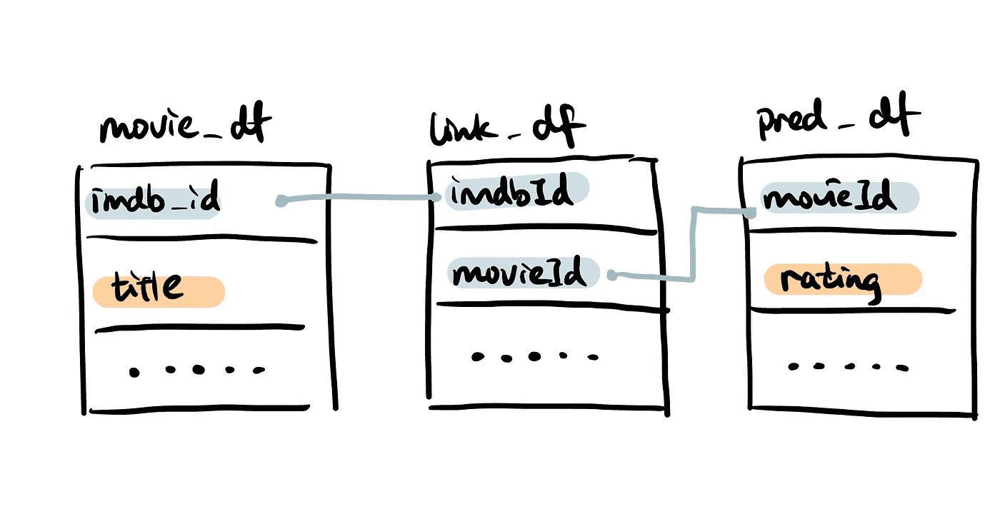

合并表格(作者图片来自[网站](https://www.visual-design.net/)

然后我定义了一个`prediction(algo, users_K)`函数，允许你为你感兴趣的 K 个用户创建一个数据帧，并在调用预测算法的同时遍历数据集中的所有 9067 部电影。

```
def prediction(algo, users_K):
    pred_list = []
    for userId in range(1,users_K):
        for movieId in range(1,9067):
            rating = algo.predict(userId, movieId).est
            pred_list.append([userId, movieId, rating])
    pred_df = pd.DataFrame(pred_list, columns = ['userId', 'movieId', 'rating'])
    return pred_df
```

最后，`top_recommendation(pred_df, top_N)`执行以下程序:

1)使用`pd_merge()`将数据集合并在一起；

2)按用户标识对评分进行分组，并使用`sort_values()`按评分值降序排序；

3)使用`head()`获得最高值；

4)返回排序的推荐和最推荐的电影

```
def top_recommendations(pred_df, top_N):
    link_movie = pd.merge(pred_df, links_df, how='inner', left_on='movieId', right_on='movieId')
    recommended_movie = pd.merge(link_movie, movie_df, how='left', left_on='imdbId', right_on='imdb_id')[['userId', 'movieId', 'rating', 'movieId','imdb_id','title']]
    sorted_df = recommended_movie.groupby(('userId'), as_index = False).apply(lambda x: x.sort_values(['rating'], ascending = False)).reset_index(drop=True)
    top_recommended_movies = sorted_df.groupby('userId').head(top_N)
    return sorted_df, top_recommended_movies
```

*顺便提一下，当在 dataframe 中应用 merge 时，我们需要更加注意连接在一起的键的数据类型，否则您将意外地得到许多空结果。*

最后，比较 KNN 和奇异值分解给出的每个用户的前 3 个预测。

```
# KNN predictions
pred_KNN = prediction(algo_KNN, 10)
recommended_movies_KNN, top_recommended_movies_KNN = top_recommendations(pred_KNN, 3)## SVD predictions
pred_SVD = prediction(algo_SVD, 10)
recommended_movies_SVD, top_recommended_movies_SVD = top_recommendations(pred_SVD, 3)
```

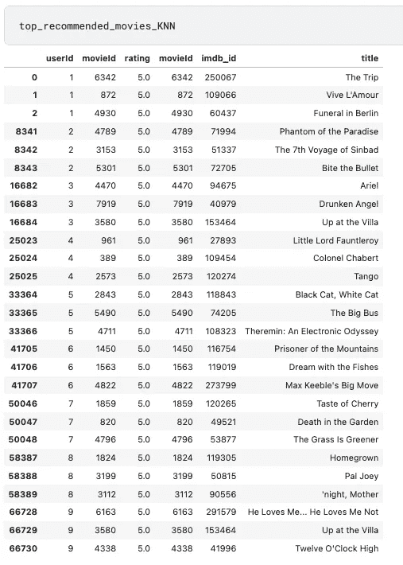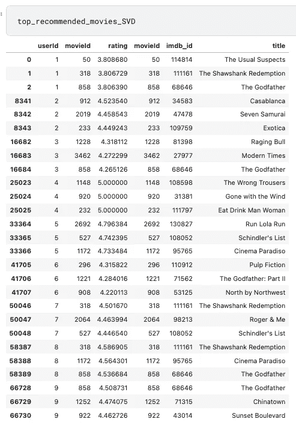

KNN vs SVD 推荐(图片来自作者的[网站](https://www.visual-design.net/)

正如你所看到的，两种算法给出了不同的建议，KNN 在评分方面显得更慷慨。

希望你喜欢这篇文章，并感谢到目前为止！如果您想访问完整的代码，请访问我网站上的[代码片段](https://www.visual-design.net/code)。如果你想阅读我更多关于媒介的文章，我会非常感谢你的支持，注册成为媒介会员。

# 带回家的信息

本文将带您了解构建推荐系统的过程，并比较 KNN 和奇异值分解提供的推荐。

第一行摘要:

*   推荐系统的 EDA:单变量分析、聚合分析
*   两种协同过滤算法:K 近邻和奇异值分解
*   模型评估:交叉验证与训练测试分割
*   提供顶级建议

## 更多这样的文章

</clustering-algorithm-for-customer-segmentation-e2d79e28cbc3>  </a-practical-guide-to-linear-regression-3b1cb9e501a6>  </simple-logistic-regression-using-python-scikit-learn-86bf984f61f1>  

*原载于 2021 年 12 月 6 日*[*【https://www.visual-design.net】*](https://www.visual-design.net/post/semi-automated-exploratory-data-analysis-process-in-python)*。*