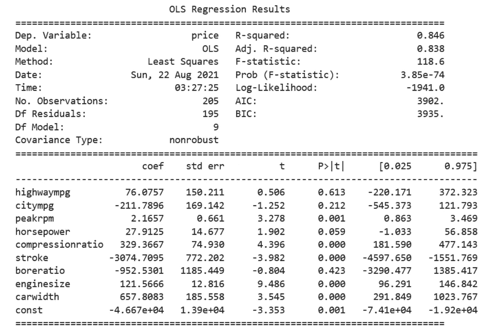
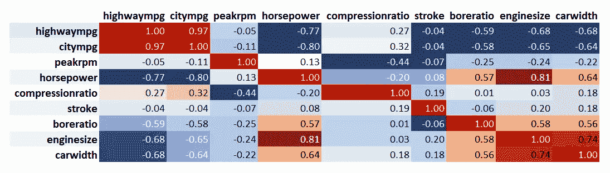
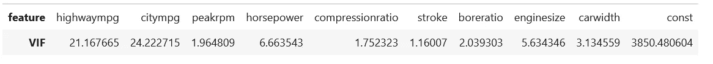
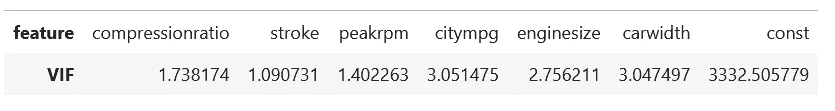
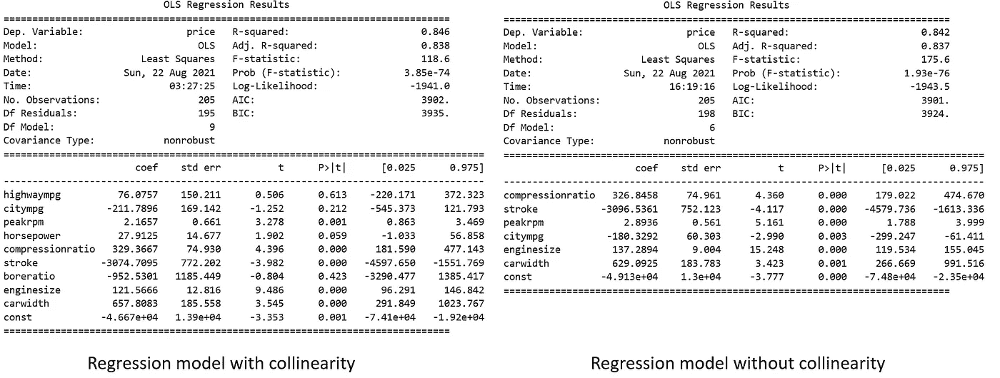

# 共线性入门指南:什么是共线性以及它如何影响我们的回归模型

> 原文：<https://towardsdatascience.com/a-beginners-guide-to-collinearity-what-it-is-and-how-it-affects-our-regression-model-d442b421ff95?source=collection_archive---------13----------------------->

## *什么是共线性？它如何影响我们的模型？我们该如何处理？*

作者在 [Canva](https://canva.com/) 上创建的图片

当我们构建回归模型时，我们显然希望对因变量和一个或多个自变量之间的关系进行建模。然而，更多的时候，我们可能会遇到这样的情况，每个自变量的拟合系数“没有意义”，我们无法解释为什么会出现这种情况。如果您遇到这种情况，您的回归模型中可能存在共线性。

# 什么是共线性？

出现共线性是因为我们用来建立回归模型的独立变量彼此相关。这是有问题的，因为顾名思义，自变量应该是独立的。它不应该和其他自变量有任何相关性。

如果自变量之间存在共线性，就违背了回归分析的关键点。在回归分析中，我们希望隔离每个自变量对因变量的影响。这样，我们可以将每个自变量的拟合系数解释为自变量每变化 1 个单位时因变量的平均变化，同时保持其他自变量不变。

现在如果我们有共线性，上面的关键点就不再成立，就好像我们改变一个自变量的值，相关的其他自变量也会改变。

在这篇文章中，我们将了解为什么共线性会成为我们回归模型的一个问题，我们如何检测它，它如何影响我们的模型，以及我们可以做些什么来消除共线性。

# 共线性问题

共线性会在几个方面影响我们的模型，它们是:

*   独立变量的系数估计对模型的变化非常敏感，即使是微小的变化。假设我们想要删除或添加一个自变量，那么系数估计值将会大幅波动。这让我们很难理解每个自变量的影响。
*   共线性会增大系数估计的方差和标准误差。这反过来会降低我们模型的可靠性，我们不应该相信我们模型显示的 p 值来判断一个独立变量对我们的模型是否具有统计显著性。

为了更清楚地说明为什么共线性是这样一个问题，让我们看一下下面的用例。

假设我们想预测一辆汽车的价格。为了预测它，我们有独立的变量，如汽车的城市英里数，公路英里数，马力，发动机大小，冲程，宽度，峰值转速和压缩比。接下来，我们建立一个回归模型，下面是我们的模型的统计摘要。

我们的模型实际上做得很好，因为它有 84%的 R。现在问题来了，当我们试图解释这个模型的时候。如果我们看一下系数估计，高速公路 MPG (76.07)和城市 MPG (-211.78)的符号相反。这完全没有意义，因为如果一辆汽车的高速公路 MPG 提高了价格，那么城市 MPG 也应该这样做。但事实并非如此。

此外，模型显示公路 MPG 和城市 MPG 的 p 值不显著(> 0.05)，表明我们可以将它们从回归模型中排除。但它们真的无足轻重吗？如果我们认为模型中可能存在轻微的共线性，我们就不应该马上相信这个 p 值。

# 检测共线性

有两种简单的方法来检测我们的回归模型中是否存在共线性。

# 相关矩阵

第一个是通过观察我们自变量的相关矩阵。经验法则是，如果两个独立变量的皮尔逊相关系数大于 0.9，那么我们可以说这两个独立变量彼此高度相关，因此它们是共线的。这是我们用例的关联矩阵。

作者创造的形象

从上面的图像中，我们可以清楚地看到公路 MPG 和城市 MPG 高度相关，因为它们的皮尔逊相关系数为 0.97。由于它们具有正相关性，这意味着如果我们增加高速公路 MPG，城市 MPG 也将增加几乎相同的数量。

# 方差膨胀因子

方差膨胀因子或 VIF 衡量共线性对系数估计方差的影响。VIF 可以用数学方法描述如下:

从上式我们知道，如果自变量**的 ***Ri*** 大或者接近 1，那么*对应的 VIF 也会大。这意味着自变量*可以用其他自变量来解释或者换句话说，*与其他自变量高度相关。因此，系数估计值 ***βi*** 的方差也很高。*****

**下面是我们用例中自变量的 VIF:**

****

**在我们决定我们的自变量的共线性是一个值得关注的原因之前，有很多关于什么是 VIF 的合适阈值的讨论，但是大多数研究论文都认为 VIF 高于 10 表明自变量之间存在严重的共线性。**

**在我们的使用案例中，我们可以看到高速公路 MPG 和城市 MPG 的 VIF 得分远高于 10，表明它们彼此高度相关。从上面的相关矩阵中我们也可以看到这种现象。**

***查看我们的* [*综合统计小抄*](https://www.stratascratch.com/blog/a-comprehensive-statistics-cheat-sheet-for-data-science-interviews/?utm_source=blog&utm_medium=click&utm_campaign=medium) *了解统计和概率的重要术语和方程***

# **消除共线性**

**既然我们知道独立变量中存在严重的共线性，我们需要找到一种方法来解决这个问题。有两种常见的方法可以消除共线性。**

# **变量选择**

**这是消除共线性的最直接的解决方案，通常，领域知识对实现最佳解决方案非常有帮助。为了消除共线性，我们可以从回归模型中排除具有高 VIF 值的独立变量。让我们看一下我们的用例示例，为什么领域知识在这种情况下会有帮助:**

*   **我们知道公路 MPG 和城市 MPG 有很高的 VIF 值。如果我们有领域知识，我们知道没有必要从我们的回归模型中排除这两者。相反，我们只需要选择其中之一。假设我们从模型中排除了公路 MPG。**
*   **我们还知道马力和发动机尺寸也有相当高的 VIF 值。虽然它们测量的东西不同，但较高的发动机尺寸或发动机排量通常对应于较高的马力。因此，我们从模型中排除了马力。**

**最后，我们再次建立了我们的回归模型，但这次没有公路 MPG 和马力。**

****

**现在独立变量之间不再有严重的共线性。现在我们可以进行回归分析了。**

# **主成分分析**

**消除共线性的第二种方法是使用主成分分析或 PCA，这是一种常用于降维的方法。这种方法将有利于消除共线性，因为主成分分析将我们的独立变量分解成一定数量的独立因素。**

**然而，用 PCA 消除共线性有一个很大的缺点。由于我们从主成分分析中得到的独立因素与我们最初的自变量完全不同，我们不再有自变量的同一性。这似乎有点违背直觉，因为我们去除共线性的主要原因是为了让我们更容易理解自变量对因变量的影响。**

# **回归模型中消除共线性的作用**

**现在我们移除了自变量中的共线性，让我们比较有共线性和没有共线性的回归模型。**

****

**左侧是具有共线性的回归模型，右侧是通过变量选择移除共线性后的回归模型。**

**共线性的问题是，它会夸大系数估计的方差或标准误差。现在，如果我们看一下这两个模型，在没有共线性的回归模型中，系数估计的标准误差比有共线性的模型小得多。最明显的一个是城市 MPG 变量。当存在共线性时，该变量系数估计的标准误差为 169.14，而当消除共线性时为 60.30。**

**如果我们看一下 p 值，具有共线性的模型得出结论，城市 MPG 变量在统计上不显著，这意味着我们可以从模型中排除该变量以获得更好的性能。但是当我们去除共线性后，这个变量的 p 值是 0.003，实际上是有统计学意义的。共线性会夸大独立变量系数估计的方差，使我们很难相信从模型中得到的 p 值。**

**此外，在充分选择变量的情况下，无共线性模型的 F-统计量比有共线性模型显著得多，尽管有共线性模型的自变量更多。**

# **我们需要消除共线性吗？**

**我们应该注意的一件重要事情是，共线性不会影响模型预测或模型的准确性。如果你看看上面有和没有共线性的模型的 R 比较，两者都差不多。事实上，具有共线性的模型通常具有更高的准确性，因为它通常具有更多的独立变量。**

**共线性仅影响系数估计的方差和 p 值。它影响模型的可解释性，而不是模型的预测能力。**

**所以，如果你想建立一个回归模型来进行预测，并且不需要了解每个自变量的影响，那么你就不需要去除模型中的共线性。**

**但是，如果模型解释对您很重要，并且您需要了解每个独立变量对模型预测的影响，那么删除模型中的共线性是必要的。**

***最初发表于*[*【https://www.stratascratch.com】*](https://www.stratascratch.com/blog/a-beginner-s-guide-to-collinearity-what-it-is-and-how-it-affects-our-regression-model/?utm_source=blog&utm_medium=click&utm_campaign=medium)*。***