# 离散时间马尔可夫链初学者指南

> 原文：<https://towardsdatascience.com/a-beginners-guide-to-discrete-time-markov-chains-d5be17cf0e12?source=collection_archive---------7----------------------->

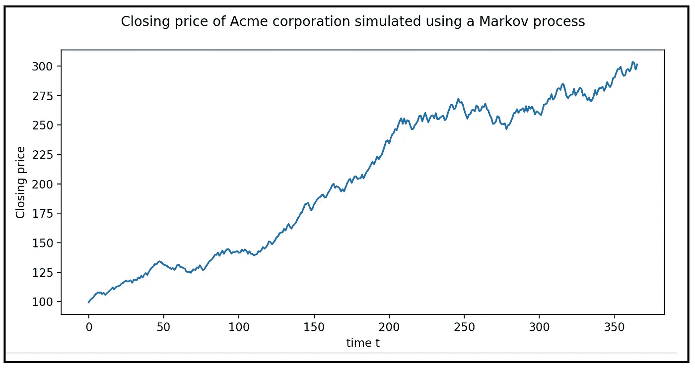

Acme corporation 的收盘价使用 2 态马尔可夫过程模拟(图片由作者提供)

## 以及如何使用 Python 模拟离散马尔可夫过程的教程

离散时间马尔可夫链可以用来描述系统以一定的概率从一个状态跳到另一个状态的行为，并且这个转移到下一个状态的概率只取决于系统当前处于什么状态，即它不取决于系统在当前状态之前处于哪个状态。

上面的定义很好地总结了离散时间马尔可夫过程或通常所说的马尔可夫链的长短。

但是上面的描述看似简单。正如我们将看到的，即使是最简单的马尔可夫链也能创造出丰富有趣的系统行为模式。

在本文中，我们将互换使用术语马尔可夫过程和马尔可夫链。

# 一个简单的 2 态马尔可夫链

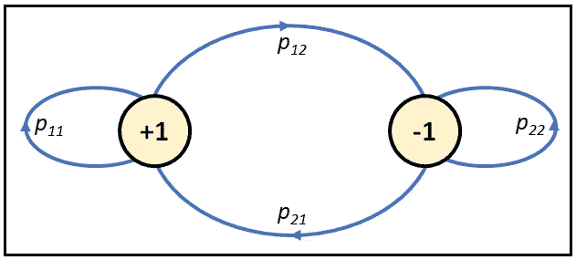

一个双态马尔可夫过程(图片由作者提供)

上面显示的马尔可夫链有两种状态，或者叫做*状态*:+1 和-1。这两种状态之间可能有四种状态转换:

*   状态+1 到状态+1:这个转换以概率*p11*发生
*   状态+1 到状态-1，转移概率*p12*
*   状态-1 到状态+1，转移概率为 *p_21*
*   状态 1 到状态 1 的转移概率 *p_22*

上图被称为马尔可夫过程的*状态转移图*。

下图显示了表示这个马尔可夫过程的另一种方法。X 轴是时间轴。气泡代表流程在每个时间步可能处于的不同状态。

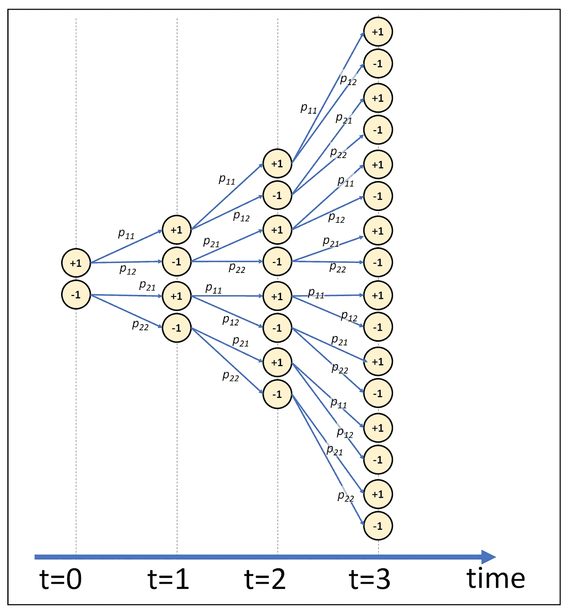

沿时间轴显示的两状态马尔可夫过程(图片由作者提供)

实际上，在每一个时间步，过程将处于许多可能状态中的一个。在下图中，黑色气泡描绘了一个跨越 4 个连续时间步长的马尔可夫过程的*实现*:


跨越 4 个连续时间步的 2 状态马尔可夫链的实现(图片由作者提供)

有许多这样的实现是可能的。在一个 2 态马尔可夫过程中，在 *N* 个时间步上有*个 2^N* 个可能的马尔可夫链实现。

通过说明马尔可夫过程沿时间轴的行进，我们收集了马尔可夫过程的以下重要性质:

> 沿着时间维度的马尔可夫链的实现是时间序列。

# 状态转移矩阵

在 2 状态马尔可夫链中，有四种可能的状态转移和相应的转移概率。我们可以用一个状态转移矩阵 ***P*** 来表示它们如下:

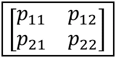

一个 2 态马尔可夫过程的状态转移矩阵 **P** (图片作者提供)

对于 n 个状态的马尔可夫链 *(1，2，3，…，n)* ，转移矩阵看起来像这样:

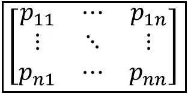

一个 n 态马尔可夫过程的状态转移矩阵 **P** (图片由作者提供)

状态转移矩阵有以下两个重要属性:

*   由于每个元素 *p_ij* 是一个概率， *0 ≤ p_ij ≤ 1*
*   每一行的 ***P*** 的总和为 1.0，即

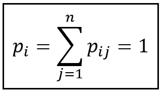

标记过程的转移矩阵的每一行总计为 1.0(图片由作者提供)

这是因为行索引表示在时间 *t* 的源状态，而列索引表示在时间 *(t+1)* 的目的状态。如果流程在时间 *t* 处于源状态 *i* ，在 *(t+1)* ，它必须处于一组允许的状态 *(1，2，3，…，n)* 。

因此，我们可以将 2 状态马尔可夫过程的转移矩阵重新表述如下:

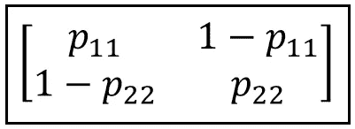

2 态马尔可夫过程的状态转移矩阵 P(图片由作者提供)

# 介绍马尔可夫分布随机变量

我们现在引入一个随机变量*X _ t .**X _ t*中的后缀 *t* 表示时间步长。在每个时间步 *t* ， *X_t* 按照某种概率分布从状态空间*【1，2，3，…，n】*中取一个值。 *X_t* 可以取的一个可能的值序列是 *{X_0=1，X_1=3，X_2=4，X_3=0，…，X_t=k}。*

## 转移概率作为条件概率

在时间 *t* 处，假定 *X_t* 在前一时间步 *(t-1)* 处已经取值 *i* ，则 *X_t* 取某个值 *j* 的概率由以下条件概率给出:

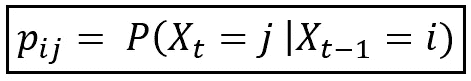

假设马尔可夫链在(t-1)时处于状态 I，那么它在 t 时处于状态 j 的概率(图片由作者提供)

的确，这就是跃迁概率 *p_ij* 。

# 马尔可夫性质

**马尔可夫属性**声明 *p_ij* 独立于系统在时间 *(t-2)，(t-3)，…，0* 的状态。马尔可夫属性陈述如下:

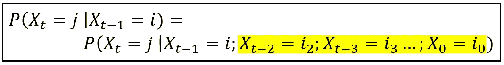

马尔可夫属性(图片由作者提供)

# n 步转移概率

状态转移矩阵 ***P*** 具有这一良好的特性，即如果你将它与自身 *k* 相乘，那么矩阵 ***P*** *^k* 包含所有 k 步长的转移的概率，即系统在从状态 *i、*开始经过 *k* 个转移后将处于状态 *j* 的概率

例如，考虑以下两步马尔可夫过程的转移概率矩阵:

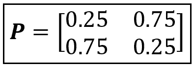

双态转移概率矩阵(逐个图像)

两步转移概率计算如下:

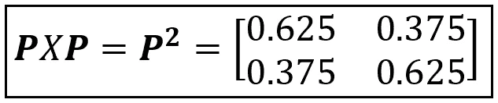

2 状态马尔可夫过程的两步转移概率(逐个图像)

在 ***P*** 中， *p_11=0.625* 是从状态 *1* 开始遍历*两个*状态后返回状态 *1* 的概率。

*类似地，p_12=0.375* 是从状态 *1* 开始在恰好两个时间步长内到达状态 2 的概率。

这些概率已经考虑了从状态 1 到状态 1(或者从状态 1 到状态 2，等等)的所有可能的方式，这些方式有两步长。

# 状态概率分布

我们可以继续将 ***P*** 永远乘以自身，以观察 n 步概率如何随时间变化。更有趣的是，如果我们能知道在每个时间步 *t* 上 *X_t* 的无条件概率分布是什么。

例如，在我们的两步马尔可夫过程示例中，在每个时间步 *t* ，X_t 可能是+1 或-1 的概率是多少？这些概率构成了所谓的马尔可夫变量 *X_t* 在时间 *t* 时的**状态概率分布**，用***π****_ t*(或***δ****_ t****)表示。*** 例如，对于由状态+1 和-1 组成的 2 状态马尔可夫过程，状态分布如下:

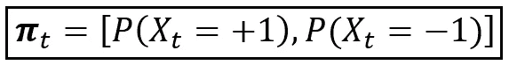

2 状态马尔可夫过程的状态概率分布(图片由作者提供)

在状态*【1，2，3，…，n】*上操作的 *n* 状态马尔可夫过程在时间 *t* 可能处于这些 *n* 状态中的任何一个，因此***π****_ t**是长度为*n*的向量***

*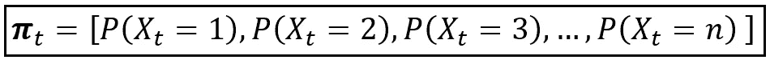*

*时间 t 时 X_t 的状态概率分布(图片由作者提供)*

*一般来说， *π_t* 的每个元素都可以用符号 ***π*** *_jt 来引用。****π****_ JT*使用两个变量 *j* 和 *t* 进行索引，表示进程在时间 *t:* 处于状态 *j* 的无条件概率*

*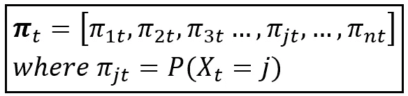*

*向量 ***π*** 包含马尔可夫过程在时间*t*处于状态*j =*【1，2，…n】的无条件概率*

> *由于 ***π*** _t 是一个概率分布，其元素总和总是 1.0:*

*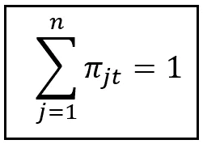*

*(图片由作者提供)*

## *如何计算 *π_t**

*通常，假设***π****_ 0*的某个值是状态 0 的概率向量。而给定***π****_ 0*，可以看出***π****_*t 可以计算如下:*

**

*给定 t=0 时的概率分布和转移矩阵 **P** (图片由作者提供)，马尔可夫过程在 t 时的状态概率分布公式*

*计算***π****_*t 背后的思想是将状态转移矩阵与自身 *t* 次相乘得到 t 步转移概率，将 t 步转移概率与 t=0 时的无条件概率分布 ***π*** *_0 相乘。**

*请注意上面等式的以下两点:*

*马尔可夫过程在时间 *t* 的状态概率分布取决于:*

1.  *初始概率分布***π****_ 0*在时间 *t=0，*和*
2.  *这取决于时间步长 t。*

*因此，*

> **马尔可夫分布随机变量的概率分布随时间演化。**

# *马尔可夫过程示例*

*让我们用一个例子来复习一下到目前为止学过的所有概念。*

*假设 Acme 公司的股票按照以下规则增加或减少:*

*   *与前一天的收盘价相比，当天的收盘价或高或低几个百分点。例如，某一天，Acme 的股票收盘价比前一天高 2.3%。在其他日子，它可能会比前一天的收盘价低 0.8%。*
*   *给定由“前一天”、“昨天”和“今天”表示的任何 3 天序列，如果 Acme 昨天收盘高于前一天，则它今天将以概率 *p_11* 收盘高于昨天。因此，今天的收盘价有可能比昨天低 *(1 — p_11)。**
*   *我们还假设，如果 Acme 昨天比前天收盘更低，那么它今天再次收盘更低的概率是*p22*。因此，今天收盘比昨天高的概率是*(1-p22)*。*

*您可能已经猜到 Acme 的股票价格可以使用两状态马尔可夫过程来建模。它的状态转换图是这样的:*

*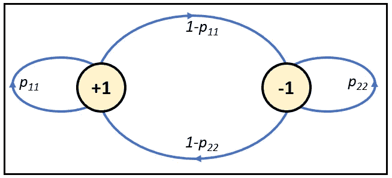*

*用于模拟 Acme 股票价格变动的马尔可夫过程的状态转换图(图片由作者提供)*

*它的转移概率矩阵 ***P*** 看起来是这样的:*

**

*2 态马尔可夫过程的状态转移矩阵 P(图片由作者提供)*

*现在让我们确定这些概率的一些样本值。假设 Acme 的价格连续两天上涨的概率是 0.6，价格连续两天下跌的概率是 0.25。因此，*

**p11 = 0.6*和*p22 = 0.25**

*因此，我们有:*

**p12 = 1—p11 = 0.4，并且，p21 = 1—p22 = 0.75**

*Acme 股票的状态转移矩阵如下:*

*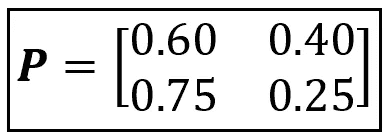*

*Acme 股价运动的状态转移矩阵(图片由作者提供)*

*Acme 股票的马尔可夫过程模型的状态转移图如下:*

*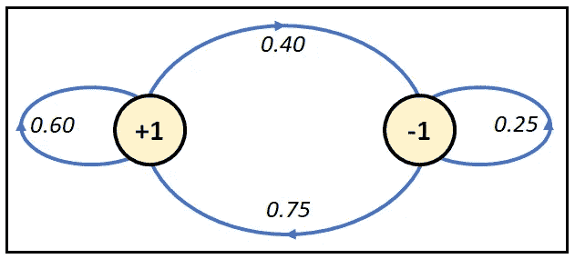*

*Acme 股票运动的马尔可夫过程模型的状态转换图(图片由作者提供)*

*我们现在要计算下面的无条件概率分布:*

**

*2 状态马尔可夫过程的状态概率分布(图片由作者提供)*

*让我们假设一个初始值为**_ 0 =*【0.5，0.5】，即与 IPO 价格相比，它在上市日收盘上涨(+1 状态)或下跌(-1 状态)的概率相等。如果我们重复应用***π****_*t =***π****_ 0 *****p****^t*的公式，我们将得到每个时间步 t 的概率分布向量***π***【t46 _】**

**下面的 Python 代码计算了***π****_*t:**

```
****import** numpy **as** np
**from** matplotlib **import** pyplot **as** plt

***#initialize the transition matrix P*** P=np.**array**([[0.6,0.4],[0.75,0.25]])
***#initialize pi_0*** pi_0=np.**array**([0.5, 0.5])

***#set up the array to accumulate the state probabilities at times t=1 to 10***pi=[]
pi.**append**(pi_0)

P_mul=P.copy()

***#calculate the state probability for each t and store it away* for** i **in range**(10):
    P_mul=np.**matmul**(P_mul,P)
    pi_t = np.**matmul**(pi_0,P_mul)
    pi.**append**(pi_t)

pi = np.**array**(pi)**
```

**上面的代码将所有计算出的 ***π_*** *t* 向量存储在数组 ***π中。*** 让我们分别绘制组件***π****_ 1t*和***π****_ 2t*of***π_****t****=【******π****_ 吧***

```
****#plot pi_1t = P(X_t = +1) versus t**
fig = plt.**figure**()
fig.**suptitle**(**'Probability of closing higher than previous day\'s close'**)
plt.**plot**(**range**(**len**(pi)), pi[:,0])
plt.**show**()**#plot pi_2t = P(X_t = -1) versus t** fig.**suptitle**(**'Probability of closing lower than previous day\'s close'**)
plt.**plot**(**range**(**len**(pi)), pi[:,1])
plt.**show**()**
```

**我们得到以下两个图:**

**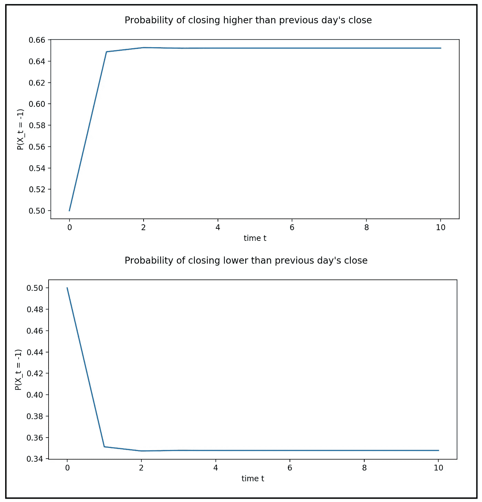**

**(图片由作者提供)**

**我们看到，在短短几个时间步骤中，无条件概率向量***π_****t****=【******π****_ 1t****、π****_ 2t】*稳定到稳态值**

**事实上，可以证明，如果具有以下转移矩阵的两状态马尔可夫过程“长时间”运行:**

****

**2 态马尔可夫过程的状态转移矩阵 P(图片由作者提供)**

**然后将状态概率分布***π_****t*定态为以下常数(极限)概率分布，该分布独立于 *t* 和初始概率分布*π_ 0****:*****

**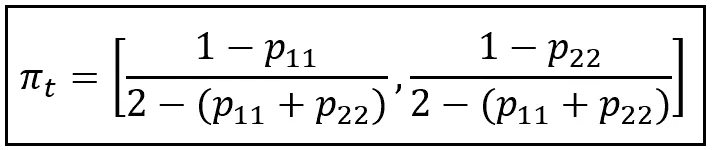**

**2 状态马尔可夫过程的状态概率的极限分布(图片由作者提供)**

# **使用马尔可夫过程模拟 Acme 的股票价格运动**

**让我们使用时间 t 处的概率分布 *π_t 来模拟 Acme Corp .在每个时间步长 *t* 的股票价格运动。*模拟过程如下:**

*   *假设 Acme 的 IPO 价格为 100 美元。*
*   *设置初始概率分布:
    *π_0=[P(X_t = +1)=0.5，P(X_t = -1) = 0.5]。**
*   *将+1 马尔可夫状态映射到在区间[0.0%，2.0%]内以随机百分比增加 Acme 前一日收盘价的动作。*
*   *将-1 马尔可夫状态映射为在区间[0.0%，2.0%]内以类似的随机百分比降低 Acme 前一天的收盘价。*
*   *在每个时间步 *t* ，计算状态概率分布 *π_t=[P(X_t = +1)，p(x _ t =-1)= 0.5】*，通过使用公式***π_****t =****π****_ 0 ***
*   **在区间*【0，1.0】产生一个均匀分布的随机数。*如果该数小于或等于 *π_1t* = *P(X_t = +1)* ，则从前一时间步开始，以区间【0.0%，2.0%】内的随机百分比增加收盘价，否则以相同的随机百分比减少前一收盘价。根据需要重复此步骤。**

**这是 Acme 在 365 个交易日内的股价变化图:**

****

**Acme corporation 的收盘价使用 2 态马尔可夫过程模拟(图片由作者提供)**

**下面是生成上述图形的源代码:**

```
*****#Simulate the closing price of a company*** closing_price = 100.0
***#initialize pi_0*** pi_0=np.array([0.5, 0.5])
***#create a random delta in the range [0, 2.0]*** delta = random.random() * 2
***#generate a random number in the range [0.0, 1.0]*** r = random.random()
***#if r <= P(X_t = +1), increase the closing price by delta,
#else decrease the closing price by delta* if** r <= pi_0[0]:
    closing_price = closing_price*(100+delta)/100
**else**:
    closing_price = math.max(closing_price*(100-delta)/100,1.0)
***#accumulate the new closing price*** closing_prices = [closing_price]
P_mul=P.copy()
T=365
***#now repeat this procedure 365 times* for** i **in** range(T):
 ***#calculate the i-step transition matrix P^i***P_mul=np.matmul(P_mul,P)
 ***#multiply it by pi_0 to get the state probability for time i***pi_t = np.matmul(pi_0,P_mul)
 ***# create a random delta in the range [0, 2.0]***delta = random.random() * 2
 ***# generate a random number in the range [0.0, 1.0]***r = random.random()
 ***# if r <= P(X_t = +1), increase the closing price by delta,
    # else decrease the closing price by delta*****if** r <= pi_t[0]:
        closing_price = math.max(closing_price*(100+delta)/100,1.0)
    **else**:
        closing_price = closing_price*(100-delta)/100
 ***# accumulate the new closing price***closing_prices.append(closing_price)

***#plot all the accumulated closing prices*** fig = plt.figure()
fig.suptitle(**'Closing price of Acme corporation simulated using a Markov process'**)
plt.xlabel(**'time t'**)
plt.ylabel(**'Closing price'**)
plt.plot(range(T+1), closing_prices)
plt.show()**
```

**以下是本文中使用的完整源代码:**

**离散时间马尔可夫过程模拟**

# **引用和版权**

## **形象**

**本文中的所有图片的版权归 [CC-BY-NC-SA](https://creativecommons.org/licenses/by-nc-sa/4.0/) 所有，除非图片下方提到了不同的来源和版权。**

***感谢阅读！如果您喜欢这篇文章，请* [***关注我***](https://timeseriesreasoning.medium.com) *获取关于回归和时间序列分析的提示、操作方法和编程建议。***