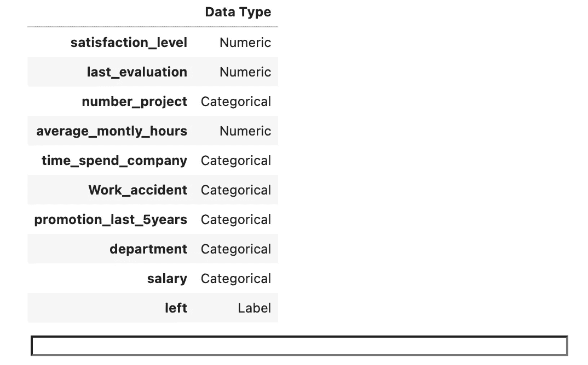

# 端到端机器学习初学者指南

> 原文：<https://towardsdatascience.com/a-beginners-guide-to-end-to-end-machine-learning-a42949e15a47?source=collection_archive---------3----------------------->

## [实践教程](https://towardsdatascience.com/tagged/hands-on-tutorials)

## 学习培训、调整、部署和监控模型


[Unsplash](https://unsplash.com/s/photos/bridge?utm_source=unsplash&utm_medium=referral&utm_content=creditCopyText) 上 [Modestas Urbonas](https://unsplash.com/@modestasu?utm_source=unsplash&utm_medium=referral&utm_content=creditCopyText) 的照片

监督机器学习是一种无需显式编程，将一系列输入(X)映射到一些已知输出(y)的技术。训练机器学习模型是指机器学习 X 和 y 之间的映射的过程。一旦训练完毕，该模型可用于在输出未知的情况下对新输入进行预测。

机器学习模型的训练只是端到端机器学习生命周期的一个要素。对于一个真正有用的模型，这个映射需要被存储和部署以供使用。这通常被称为将模型投入生产。此外，一旦模型投入生产，就需要监控模型的预测和整体性能，以确保预测的质量不会随着时间的推移而降低。

为了介绍端到端机器学习工作流中的基本概念，我将使用 python 库 [Pycaret](https://pycaret.org/) 。Pycaret 是一个低代码机器学习库，它通过提供一个高级编程接口，并寻求自动执行机器学习中的一些重复任务，来简化和加速整个机器学习工作流。

该库正在快速发展，最近增加了功能，以涵盖整个端到端的机器学习工作流。从模型开发到部署和监控。在下面的文章中，我将使用这个包来简单介绍端到端的机器学习生命周期。

# 数据

在本教程中，我将使用 Pycaret 的内置数据集“employee”。这由一组关于未指定公司的雇员的特征和一个表示该雇员是否已经离开公司的目标变量组成。这是机器学习中的一个经典分类任务，目标是训练一个模型来预测员工是否可能离开。

数据可以很容易地通过 Pycaret API 导入。在下面的代码中，我们读入数据，并保留一个验证样本，供以后在工作流中使用。

数据的前几行如下所示:


“雇员”数据集的前几行。图片作者。

# 预处理

Pycaret 有一组模块，包含一套用于特定机器学习任务的函数。我们使用的数据集包含一个分类问题，所以我们将主要使用[分类](https://pycaret.org/classification1/)模块。

第一步是导入设置功能。该功能在执行任何其他步骤之前运行。它初始化 Pycaret 环境，并创建一个转换管道来预处理准备建模的数据。当运行 Pycaret 时，它将推断所有特性和目标列的数据类型。



Pycaret 已经推断出特性和目标变量的数据类型。作者图片

如果我们很高兴这些数据类型是正确的，也很高兴依赖 Pycaret 的默认预处理方法，那么我们可以简单地点击 enter，Pycaret 将为建模准备数据，并打印一份报告，描述已经采取的步骤。

下面是这份 59 行报告的前 15 行。设置函数有大量可选参数，可用于创建自定义预处理。例如，参数`categorical_features`可用于手动指定数据类型未被正确推断的分类列。可用参数的完整列表可在 [**这里**](https://pycaret.org/classification1/) 找到。


预处理报告的前 15 行。图片作者。

在现实世界的机器学习项目中，我们可能会执行更深入的探索性分析和自定义预处理。然而，出于本教程的目的，我们将继续使用默认的预处理。

# 基线模型

通常，在机器学习工作流中，明智的做法是在转向更复杂的算法之前，先训练一个简单的模型，以开发性能基线。

在撰写本文时，Pycaret 支持 18 种不同的分类算法。完整名单可以在 这里找到 [**。对于基线模型，我们将使用逻辑回归，并使用函数`create_model`进行训练。为了选择算法，我们传递在**](https://pycaret.org/classification1/) **[**文档**](https://pycaret.org/classification1/) 中找到的缩写字符串。训练之后，Pycaret 将打印一份报告，详细说明我们模型的性能。**


创建模式报告。图片作者。

# 比较模型

通过建立基线模型，我们已经确定预处理和设置足以建立分类模型。

下一步是比较不同的分类算法，以确定哪种算法最适合我们的数据集和问题。Pycaret 有一个名为`compare_models()`的函数，它允许我们用一行代码比较所有可用算法的性能。

该函数将尝试所有算法，并输出一个按准确度排序的列表。您可以使用`sort`参数将指标更改为目标。


比较模型。图片作者。

由此可见，随机森林总体上是最好的模型。我们将在余下的工作流程中使用这个模型。

我们再次运行`create_model()`，这次选择随机森林算法。

# 调整模型

当我们运行 create_model 时，它会自动使用默认参数。这些不一定是使用的最佳参数集，因此我们需要调整模型以找到最佳选择。运行`tune_model()`功能，使用随机网格搜索调整模型的超参数。

默认情况下，该功能将使用预定义的参数网格，但这可以通过将自定义网格传递到`custom_grid`参数中进行自定义。默认情况下，该功能还会优化准确度分数，但也可以使用`optimize`参数进行定制。

在下面的代码中，我们使用默认的参数网格来调整模型和优化 MCC 分数。

该函数返回一个包含 k 倍验证分数的表，默认情况下，折叠数为 10。


模型调整。图片作者。

# 解释结果

Pycaret 有一个内置的图表选择来解释模型的结果，可以使用`plot_model()`函数访问。

下面我们使用这个函数来检查特性的重要性。


特征重要性。图片作者。

让我们也可视化混淆矩阵。


混乱矩阵。图片作者。

# 部署模型

Pycaret 具有使用 AWS 将模型部署到云中的附加功能。

要在 AWS 上部署该模型，您必须首先在[aws.amazon.com](https://aws.amazon.com/?aws-products-analytics.sort-by=item.additionalFields.productNameLowercase&aws-products-analytics.sort-order=asc&aws-products-business-apps.sort-by=item.additionalFields.productNameLowercase&aws-products-business-apps.sort-order=asc&aws-products-containers.sort-by=item.additionalFields.productNameLowercase&aws-products-containers.sort-order=asc&aws-products-compute.sort-by=item.additionalFields.productNameLowercase&aws-products-compute.sort-order=asc&aws-products-iot.sort-by=item.additionalFields.productNameLowercase&aws-products-iot.sort-order=asc&aws-products-ml.sort-by=item.additionalFields.productNameLowercase&aws-products-ml.sort-order=asc&aws-products-mgmt-govern.sort-by=item.additionalFields.productNameLowercase&aws-products-mgmt-govern.sort-order=asc&aws-products-migration.sort-by=item.additionalFields.productNameLowercase&aws-products-migration.sort-order=asc&aws-products-network.sort-by=item.additionalFields.productNameLowercase&aws-products-network.sort-order=asc&aws-products-security.sort-by=item.additionalFields.productNameLowercase&aws-products-security.sort-order=asc&aws-products-storage.sort-by=item.additionalFields.productNameLowercase&aws-products-storage.sort-order=asc)上创建一个帐户。创建后，您需要生成一个访问密钥，以便允许 Pycaret 函数写入您的帐户。为此，请遵循以下步骤。

1.  登录您的 AWS 帐户。
2.  将鼠标悬停在右上角的用户名上。
3.  从出现的列表中选择安全凭据。


4.从这里展开访问密钥部分，并单击“创建新的访问密钥”。


5.在这个阶段，您需要根据提示下载凭证文件。稍后您将需要此文件中包含的凭据。

6.要允许 Pycaret 与您的 AWS 帐户交互，您还需要安装和配置 AWS CLI。为此，首先运行以下命令。

```
curl "[https://awscli.amazonaws.com/AWSCLIV2.pkg](https://awscli.amazonaws.com/AWSCLIV2.pkg)" -o "AWSCLIV2.pkg"
```

然后运行以下命令:

```
sudo installer -pkg ./AWSCLIV2.pkg -target /
```

现在输入`aws --version`确认所有东西都已经正确安装。您应该会看到类似这样的内容。


现在安装完毕，我们可以使用您的帐户详细信息配置 AWS CLI 了。为此，运行下面显示的命令。它会要求您输入以下信息。

**AWS 访问密钥 ID:** 这可以在我们之前下载的凭证文件中找到。

**AWS 秘密访问密钥:**也可以在凭证文件中找到。

**默认区域名称:**这可以在 AWS 控制台上找到。

**默认输出格式:**此处应留空。

接下来，我们创建一个 S3 存储桶来存储部署的模型。从 AWS 控制台选择 S3，然后用您选择的名称创建一个存储桶。


现在我们准备使用 Pycaret 来部署我们选择的模型。

如果模型已经部署，您将看到以下消息。


# 生成预测

为了使用该模型，我们根据之前保留的验证数据生成预测。

下面显示的代码从 S3 加载模型，并在删除标签的情况下根据验证数据生成预测。

让我们通过运行`predictions[:5]`来查看前 5 个预测。


前 5 个预测。作者图片

# 监视

生产机器学习工作流的一个重要方面是跟踪和监控所执行的实验。Pycaret 与管理端到端机器学习生命周期的开源平台 [MLflow](https://mlflow.org/) 集成。

要通过 Pycaret 使用 MLflow，我们需要导入 MLflow(这应该已经与 Pycaret 一起安装了)并设置跟踪 URI。然后，在调用 setup 函数时，我们添加一些额外的参数，如下所示。

现在，如果我们将跟踪 URI 复制到浏览器中，您应该会看到 mlflow UI 和它所跟踪的实验。


mlflow UI。作者图片

我们可以点击查看每个实验的度量、工件和参数。


实验跟踪。作者图片

这是一个简单的教程，学习端到端机器学习项目中涉及的基本步骤。在现实世界中，大多数机器学习问题、数据和部署解决方案需要更复杂的处理。然而，出于本教程的目的，我使用了一个简单的数据集和 python 库来帮助您开始了解端到端机器学习生命周期。

Pycaret 是一个低代码机器学习库的例子。有许多正在开发的工具试图以不同的方式简化机器学习的开发。要了解更多关于这些低工作量机器学习库的信息，请参阅我之前的文章。

</low-effort-machine-learning-tools-9622d7d57135>  

有关现实世界中机器学习的更多信息，请参见下面的文章。

</machine-learning-in-real-life-eebcb08f099c>  

感谢阅读！