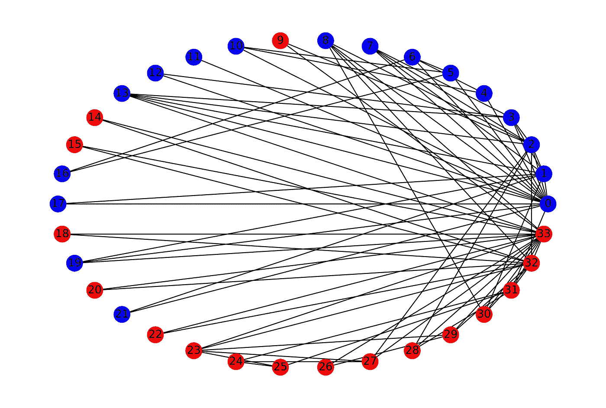
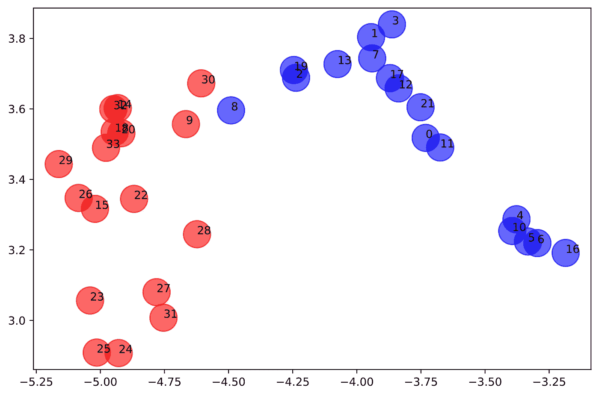

# 使用 PyTorch 几何图形的神经网络初学者指南—第 2 部分

> 原文：<https://towardsdatascience.com/a-beginners-guide-to-graph-neural-networks-using-pytorch-geometric-part-2-cd82c01330ab?source=collection_archive---------4----------------------->

## 使用深度行走嵌入作为我们的 GNN 模型的输入特征。


照片由[像素](https://www.pexels.com/photo/time-lapse-photography-of-blue-lights-373543/?utm_content=attributionCopyText&utm_medium=referral&utm_source=pexels)的[皮克斯拜](https://www.pexels.com/@pixabay?utm_content=attributionCopyText&utm_medium=referral&utm_source=pexels)拍摄

在我之前的[帖子](https://medium.com/@rohithtejam/a-beginners-guide-to-graph-neural-networks-using-pytorch-geometric-part-1-d98dc93e7742)中，我们看到了 PyTorch 几何库如何用于构建 GNN 模型，并在 [Zachary 的空手道俱乐部](https://en.wikipedia.org/wiki/Zachary%27s_karate_club)数据集上制定节点分类任务。

# **语境。**

图形神经网络模型需要初始节点表示来进行训练，之前，我采用节点度数作为这些表示。但有几种方法可以做到这一点，另一种有趣的方法是使用基于学习的方法，如节点嵌入作为数字表示。

# **回顾:空手道俱乐部数据集。**



空手道俱乐部数据可视化(来源:作者)

这是数据集及其可视化的一个小总结，用两种不同的颜色显示了两个派别。

数据集:[扎卡里空手道俱乐部](https://en.wikipedia.org/wiki/Zachary%27s_karate_club)。

这里，节点代表参与俱乐部的 34 名学生，链接代表俱乐部外成对成员之间的 78 种不同互动。有两种不同类型的标签*即*两派。

# 节点嵌入。

我们的想法是使用一组称为低维嵌入的数字来捕获网络信息。存在专门用于学习图节点的数字表示的不同算法。

[DeepWalk](https://arxiv.org/abs/1403.6652) 是一种基于随机行走概念的节点嵌入技术，我将在本例中使用。为了实现它，我选择了[图形嵌入](https://github.com/shenweichen/GraphEmbedding) python 库，它提供了 5 种不同类型的算法来生成嵌入。

首先，安装图形嵌入库并运行安装程序:

```
!git clone https://github.com/shenweichen/GraphEmbedding.gitcd GraphEmbedding/!python setup.py install
```

我们使用深度行走模型来学习我们的图节点的嵌入。变量`embeddings`以字典的形式存储嵌入，其中键是节点，值是嵌入本身。

正如我之前提到的，嵌入只是网络的低维数字表示，因此我们可以对这些嵌入进行可视化。这里，嵌入的大小是 128，所以我们需要使用 [t-SNE](https://scikit-learn.org/stable/modules/generated/sklearn.manifold.TSNE.html) ，这是一种降维技术。基本上，t-SNE 将 128 维数组转换成 2 维数组，这样我们就可以在 2D 空间中将其可视化。

> 注意:嵌入大小是一个超参数。

使用上述代码制作的可视化效果如下所示:



节点嵌入的可视化(来源:作者)

我们可以看到，为该图生成的嵌入具有良好的质量，因为红点和蓝点之间有清晰的分离。现在，我们可以建立一个图形神经网络模型，在这些嵌入上进行训练，最后，我们将有一个好的预测模型。

我将重用我之前的[帖子](/a-beginners-guide-to-graph-neural-networks-using-pytorch-geometric-part-1-d98dc93e7742)中的代码来构建节点分类任务的图形神经网络模型。我们现在遵循的程序与我之前的帖子非常相似。我们只是将节点特征从 DeepWalk 嵌入改为 deep walk 嵌入。

# 数据准备。

这里，我们只是准备将在下一步中用于创建自定义数据集的数据。请注意我如何更改了保存从 DeepWalk 算法生成的节点嵌入值的`embeddings`变量。

# 自定义数据集。

为了将结果与我之前的[帖子](/a-beginners-guide-to-graph-neural-networks-using-pytorch-geometric-part-1-d98dc93e7742)进行比较，我使用了与之前类似的数据分割和条件。

数据对象现在包含以下变量:

> Data(edge_index=[2，156]，num _ class =[1]，test_mask=[34]，train_mask=[34]，x=[34，128]，y=[34])

我们可以注意到`x`变量的维数从 1 到 128 的变化。

# 图卷积网络。

我们使用相同的代码来构建图形卷积网络。

现在是时候训练模型并在测试集上进行预测了。

# 训练 GCN 模型。

使用与之前相同的超参数，我们获得如下结果:

> 训练精度:1.0
> 测试精度:0.90

这是一个巨大的进步！

# 推论。

从结果中可以看出，当 GNN 模型在[第 1 部分](/a-beginners-guide-to-graph-neural-networks-using-pytorch-geometric-part-1-d98dc93e7742)的类似条件下进行训练时，我们实际上在训练和测试准确性方面都有了很大的提高。

> 注意:我们当然可以通过进行超参数调整来改善结果。

这表明当我们使用基于学习的节点嵌入作为输入特征时，图形神经网络表现得更好。现在问题来了，为什么会这样？

回答这个问题需要一点解释。所以我会写一篇新的帖子来解释这种行为。敬请期待！

# 参考文献。

1.  PyTorch 几何:【https://github.com/rusty1s/pytorch_geometric 
2.  深度行走:【https://arxiv.org/abs/1403.6652 
3.  图形嵌入库:[https://github.com/shenweichen/GraphEmbedding](https://github.com/shenweichen/GraphEmbedding)
4.  GCN 代码示例:[https://github . com/rusty 1s/py torch _ geometric/blob/master/examples/gcn . py](https://github.com/rusty1s/pytorch_geometric/blob/master/examples/gcn.py)

5.链接到本系列的第 1 部分。我强烈建议看看这个:

</a-beginners-guide-to-graph-neural-networks-using-pytorch-geometric-part-1-d98dc93e7742>  

我希望你喜欢阅读这篇文章，你可以在 [LinkedIn、](https://www.linkedin.com/in/rohithteja/) [Twitter](https://twitter.com/RohithTeja15) 或 [GitHub](https://github.com/rohithteja) 上找到我。随便打个招呼吧！