# 机器学习中图像增强的初学者指南

> 原文：<https://towardsdatascience.com/a-beginners-guide-to-image-augmentations-in-machine-learning-22c48a2fbd99?source=collection_archive---------7----------------------->

马库斯·斯皮斯克在 [Unsplash](https://unsplash.com?utm_source=medium&utm_medium=referral) 上的照片

数据扩充是机器学习系统中最重要但被低估的方面之一，对模型的性能有着重要的影响。在本文中，我们将回顾一些流行的图像增强技术，并讨论为什么首先需要这些方法。

我们将尝试回答各种问题，例如:为什么图像增强对于任何机器学习管道都是必要的？实现目标的技术是什么？我们如何使用 python、OpenCV 和 NumPy 来使用这些技术呢？

# 为什么有必要？

首先，我们应该问问自己，数据增强是否值得我们花时间去做。简单的回答是“有”，原因多种多样，比如训练数据量小，避免过拟合，还有很多其他原因。下面给出更详细的讨论:

*   **缺乏广泛的训练数据:-** 在许多场景中，例如在医学领域，获取数据很困难(由于严格的法规)，而且成本高昂，而标记数据的成本更高。在所有这些情况下，使用数据扩充技术人工生成更多的训练数据变得越来越重要。
*   **避免过度拟合:-** 对少量数据进行训练的一个重要意义是过度拟合的可能性。当模型被认为已经记住了训练数据，使得它在训练数据上表现得更好，而在看不见的测试数据上表现得很差时，就会发生过拟合。在这种情况下，数据量被人为地增加，以迫使模型从许多场景中学习，从而减少过度拟合的机会。
*   **包括数据的多样性:-** 以 MNIST 数据集为例，我们可以认为，对于数据中的所有 60000 位数字，所有数字都位于图像的中心，并且完全水平。如果部署一个根据这些数据训练的系统来识别现实生活场景中的数字，它将会悲惨地失败，因为许多数字都是倾斜的。所以，必须修改它，使所有这样的用例减少系统的错误。在这种情况下，我们可以旋转图像以扩展数据集，并在扩展的数据集上进行训练以提高性能。

我们已经在本节讨论了数据扩充的必要性。在下一节中，我们将继续讨论使用 python 代码的各种图像增强技术。

# 各种图像增强技术有哪些？

在本节中，我们将继续讨论一些广泛使用的数据扩充技术。除此之外，我们还要回答一些问题，比如为什么我们需要一个特定的方法，这个方法如何改善结果，还有代码和一个图像示例。

我们已经讨论了诸如模糊、噪声添加、调整大小、随机裁剪、中心裁剪、直方图均衡化、翻转、旋转和归一化等技术。在这些技术之后，我们将深入一些更高级的技术，如剪切混合、剪切和混合。

## 虚化

在许多情况下，数据集图像通常是在最佳照明条件下用最佳摄像设备拍摄的，以获得最佳质量的数据集。但是在现实生活中，情况往往并非如此，常常会导致糟糕或误导性的结果。因此，使用蓝色和其他噪声添加技术来降低数据集的质量，以引入缺陷，从而使机器学习模型对现实生活中的例子更加鲁棒。

模糊图像的代码。

图像和模糊图像。( [Unsplash](https://unsplash.com/photos/7LsuYqkvIUM)

## 噪声添加

如前一段所述，需要降低数据集的质量，使用了噪声添加和模糊等技术。除此之外，为了模拟相机传感器，通常将噪声添加到图像中以训练去噪模型。

密度估计用于模拟图像的概率分布，这些图像通常在本质上是量化的。神经网络假设分布是连续的，因此以连续形式转换图像是必要的。因此，在许多情况下，如 VAE，数据中经常会加入归一化流量噪声。噪声添加的一个例子可以看做如下:

用于在图像中添加噪声的代码。

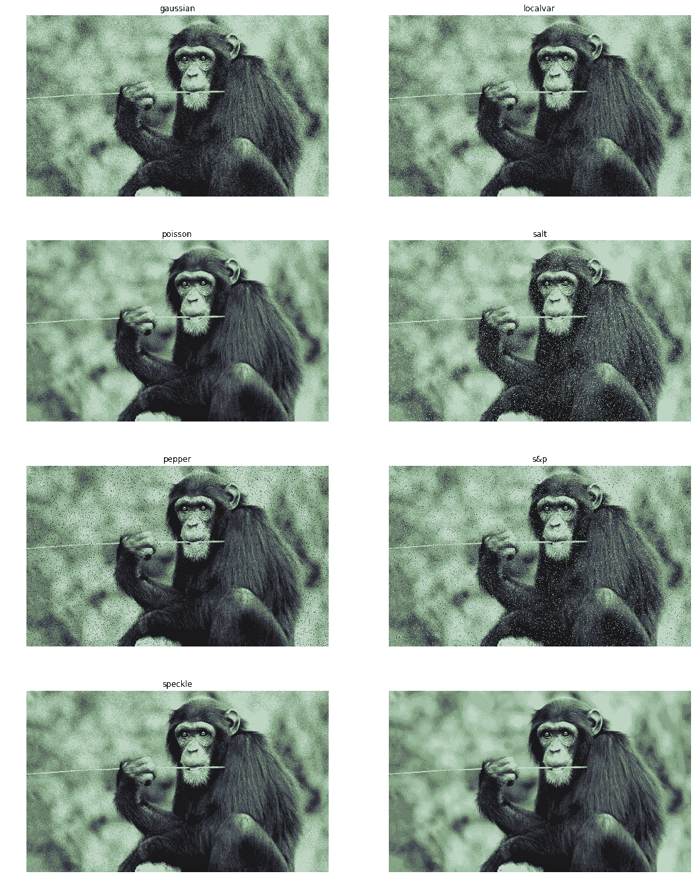

添加噪声后的结果图像(真实图像在右下方)

## 调整大小

调整大小是一种图像处理操作，通常用于改变图像的大小。它有多种用途，例如维护数据集的大小一致性、减少内存消耗(大图像消耗更多内存)、改善延迟等。

有各种技术来执行图像尺寸调整，例如双线性插值、最近邻插值、双三次插值、分形插值、克里金技术等。这些技术产生具有细微差别的高质量图像，除非我们更仔细地观察图像，否则通常是看不到的。

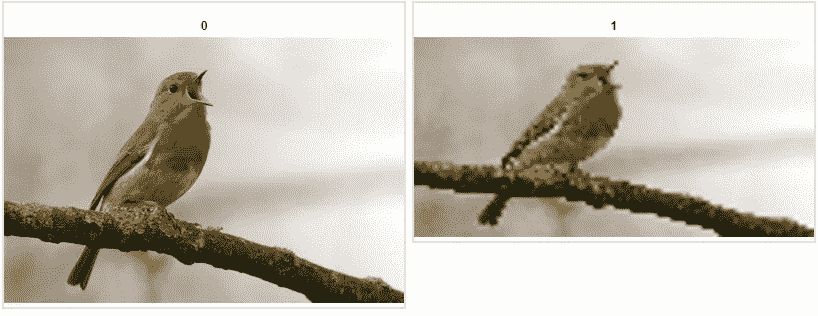

( [Unsplash](https://unsplash.com/photos/7LsuYqkvIUM)

## 随机裁剪(随机调整裁剪大小)

随机裁剪是在图像中随机裁剪图像的一部分的技术。这样做是为了在训练期间引入正则化，并减少模型中的过拟合。它通常在训练时应用，因此模型不会两次得到相同的图像。它有助于更好地推广该模型。随机裁剪增加了训练数据的数量，有助于模型更好地概括，并在数据中引入多样性。

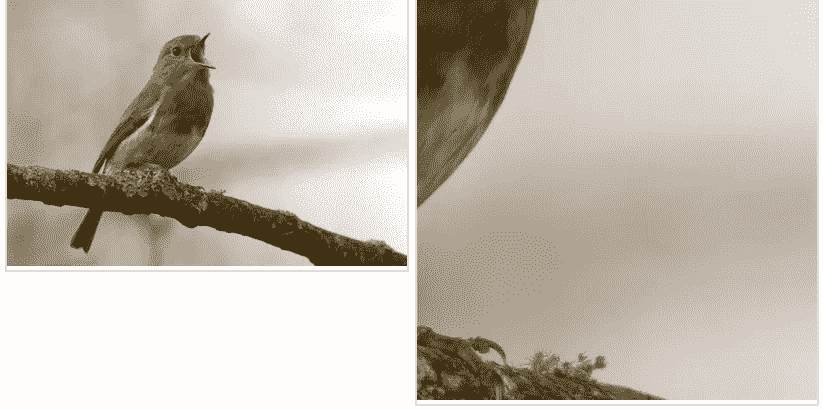

( [Unsplash](https://unsplash.com/photos/7LsuYqkvIUM)

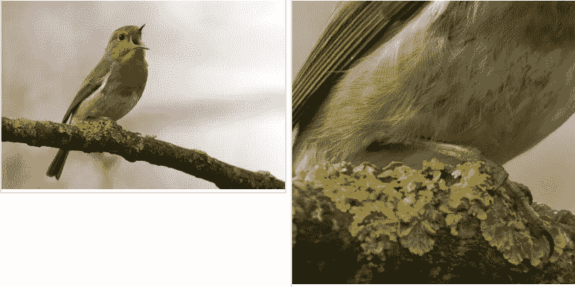

( [Unsplash](https://unsplash.com/photos/7LsuYqkvIUM)

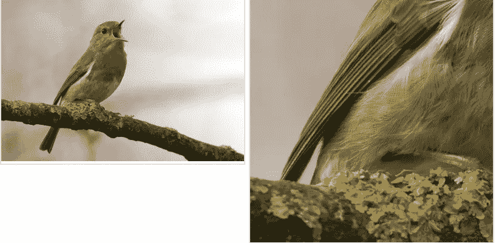

( [Unsplash](https://unsplash.com/photos/7LsuYqkvIUM) )

## 中间作物

像随机裁剪一样，这种技术也用于裁剪图像。中心裁剪和随机裁剪的主要区别在于，前者的裁剪只在图像的中心进行。这种技术用于图像的中心部分比角部包含更多信息的情况，因此为了迫使模型从图像的中心部分而不是角部学习，使用这种技术。

([不飞溅](https://unsplash.com/photos/7LsuYqkvIUM))

## 直方图均衡

简而言之，它是一种通过使用直方图来扩展像素强度值以调整图像对比度的技术。在许多低对比度的图像中，亮区和暗区相互重叠，产生了缺乏质量和照明的图像。缺乏对比往往导致模型缺乏概括性。因此，图像中应该有足够的对比度来区分亮区和暗区。

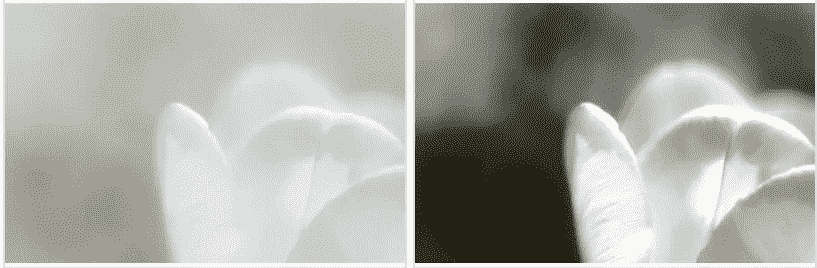

( [Unsplash](https://unsplash.com/photos/7LsuYqkvIUM) )

## 水平/垂直翻转

这种技术用于在训练过程中增加数据集的大小，通常随机应用于图像，以减少过度拟合并在数据中引入多样性。每当使用这种技术时，通常假设标签是不变的或者可以被变换。例如，在分割中，遮罩也可以翻转。同时，采用这种技术，但不采用数字识别，因为翻转的数字将具有不同的含义，并导致完全错误的模型。

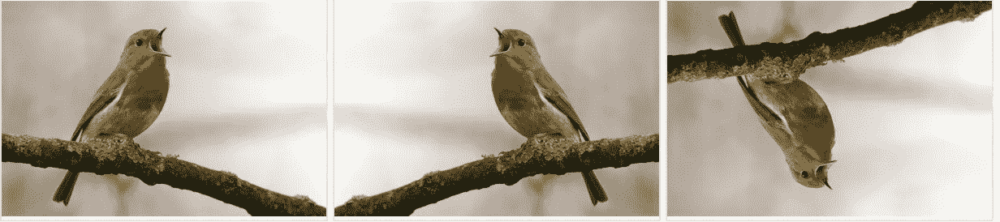

( [Unsplash](https://unsplash.com/photos/7LsuYqkvIUM)

## 旋转

应用旋转来训练模型，以避免过度拟合和在数据中引入多样性。旋转相对于翻转的主要优点是，如果应用到一定程度，例如在[-45，+45]范围内，它不会完全改变数据的含义。此外，当在训练期间随机应用旋转时，它还有一个额外的优点，即模型永远不会看到同一个图像两次。

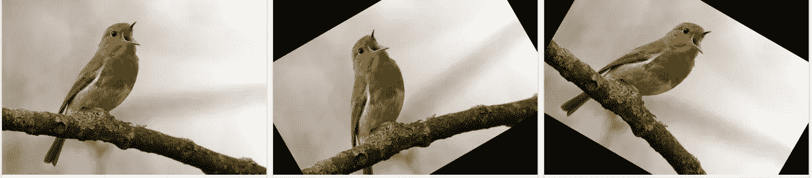

( [Unsplash](https://unsplash.com/photos/7LsuYqkvIUM)

## 正常化

该技术用于在训练模型之前标准化像素的范围和顺序。这样做通常是为了保持不同数据集的一致性。例如，一些数据集可能有 8 位图像，而一些可能有 16 位图像。如果模型直接针对它们进行训练，就会产生问题。因此，在训练之前标准化图像是至关重要的。可以采用最小-最大缩放、z 分数等技术来实现这一目的。

## 断流器

剪切指的是一种技术，其中图像的重要部分被模糊化，随机应用于输入图像，以充当正则化并因此改进模型。这种技术类似于丢弃，即输入的特定部分被随机设置为零，以阻止跨层的信息流。在各种计算机视觉任务中，例如物体检测、人体姿态估计等，剪切块也用于模拟物体遮挡情况。还可以看出，即使在遮挡不是问题的情况下，使用剪切也可以提高模型的准确性。

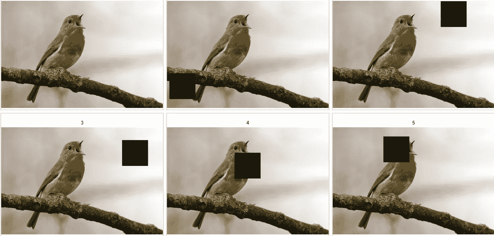

( [Unsplash](https://unsplash.com/photos/7LsuYqkvIUM)

## 剪切混合

在这种策略中，不同图像的补丁被随机剪切并粘贴在一起，以使数据规则化。地面实况标签也以加权方式组合，其权重与小块的面积成比例。这种技术相当于区域剔除，因此相当于数据正则化技术。这种技术的主要优点是图像中没有像抠图那样的空像素。通过强制模型从补丁而不是整个图像中学习，使用补丁增加了模型定位信息的能力。

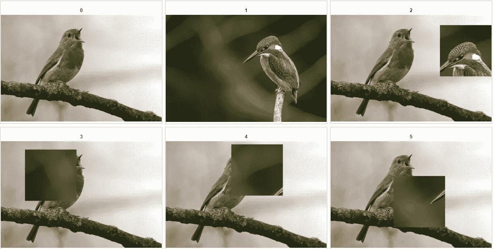

( [Unsplash](https://unsplash.com/photos/7LsuYqkvIUM) )

## 混合

在 MixUp 中，通过添加(混合)2 个或更多图像来产生新图像，从而创建新图像。地面标记也以相同的方式使用阈值作为权重进行组合。

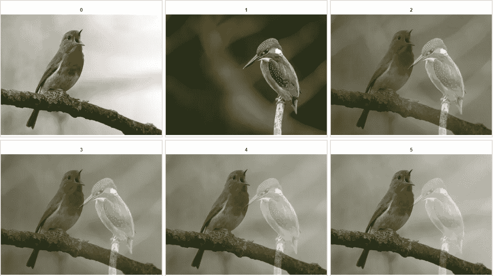

([不飞溅](https://unsplash.com/photos/7LsuYqkvIUM))

# 结论

在本文中，我们讨论了一些流行的图像增强技术。在 python 中实现这些技术时，除了 numpy、OpenCV 之外，没有其他库用于以详细的方式完成该过程，同时也理解该过程的本质。但是，建议使用流行的图像增强库，如 torchvision、albumentations 等。，同时编码深度神经网络以节省时间和避免 bug。我们本可以在本文中讨论更多的技术，但是本文的目标是理解图像增强的需求并正确地应用它。

感谢你阅读这篇文章直到最后。欢迎在评论区讨论这个问题。