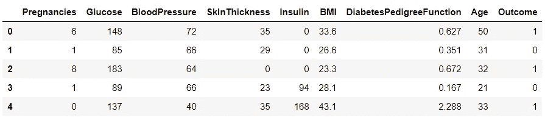
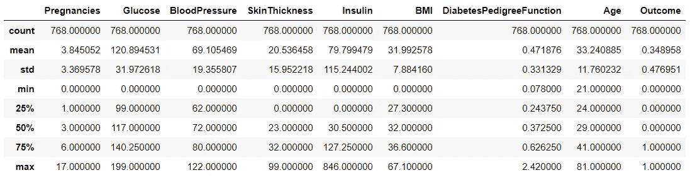
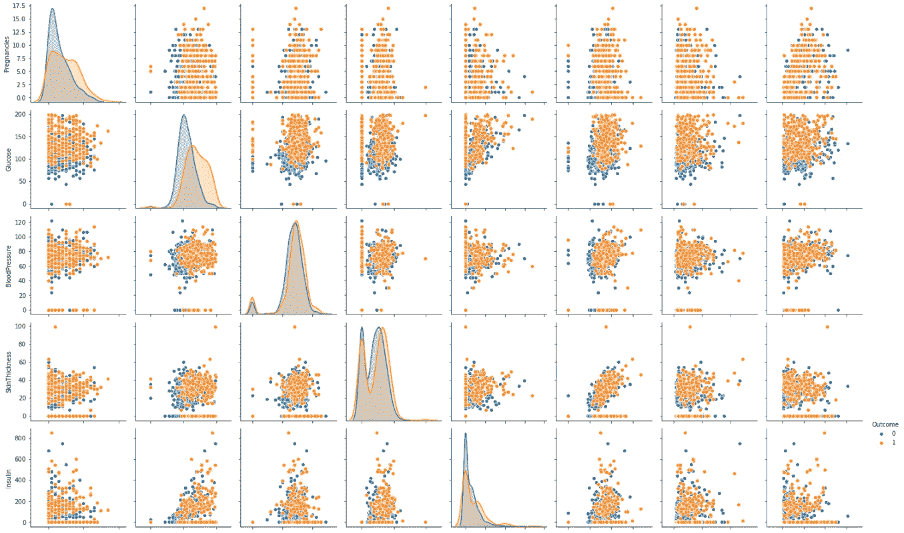
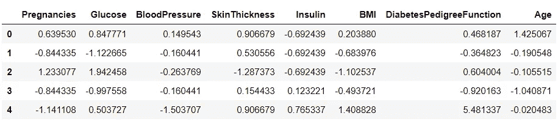
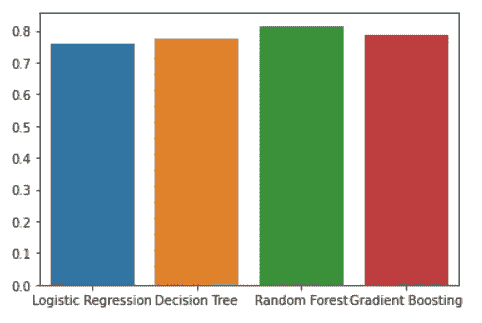

# Python 机器学习初学者指南

> 原文：<https://towardsdatascience.com/a-beginners-guide-to-machine-learning-in-python-750affc4b76d?source=collection_archive---------7----------------------->

## 任何数据科学项目的入门代码、说明和学习资源


米利安·耶西耶在 [Unsplash](https://unsplash.com/s/photos/data-science?utm_source=unsplash&utm_medium=referral&utm_content=creditCopyText) 上拍摄的照片

# 为什么要跟着机器学习教程一起编码？

有两种方法可以用来研究任何主题——自上而下和自下而上。

当你在学校学习像数学和科学这样的科目时，你会被教授自下而上的方法。

首先，你被教授了题目的基础，然后通过材料逐渐进步。

然而，当学习像数据科学和机器学习这样的学科时，自上而下的方法往往更容易掌握——尤其是如果你没有很强的数学背景。

## 使用自顶向下的方法，您可以首先通过实现机器学习模型来弄脏您的手。

这很容易做到，因为 Python 和 r 等语言中有很多可用的包。

**机器学习的民主化**让你可以创建端到端的机器学习模型，而无需了解它们如何工作以及算法背后的数学。

当然，你仍然需要了解这些算法是如何工作的，但这可以在以后(一旦你学会了如何在实践中建立这些模型)。

# 介绍

在这篇文章中，我将带你通过 Kaggle 上的 Pima Indian 糖尿病数据集完成一个端到端的机器学习项目。

我将为**数据预处理**、**分析**、**模型训练**和**评估**提供代码。你可以用它作为你将来从事的任何机器学习项目的起始代码。

我还将为我使用的每种技术和算法提供额外的学习资源，这样您就可以阅读它们并更好地理解它们的工作原理。

***注:***

***我已经做过一个关于同一数据集的数据分析教程，这个你可以在这里*** ***查阅*** [***。因此，在本文中，我不会过多地讨论数据分析和可视化的细节。相反，我将把更多的注意力放在构建机器学习算法上。***](/a-beginners-guide-to-data-analysis-in-python-188706df5447)

# 先决条件


亚历克斯·丘马克在 [Unsplash](https://unsplash.com/s/photos/python?utm_source=unsplash&utm_medium=referral&utm_content=creditCopyText) 上的照片

要继续学习本教程，您需要在计算机上安装 Python IDE。

我建议使用 Jupyter 笔记本，因为我就是用它来创建本教程的，而且 Jupyter 允许您在代码所在的同一文档中显示可视化效果。

你还需要预装以下软件包——[熊猫](https://pypi.org/project/pandas/)、 [Numpy](https://pypi.org/project/numpy/) 、 [Matplotlib](https://pypi.org/project/matplotlib/) 、 [Seaborn](https://pypi.org/project/seaborn/) 和 [Scikit-Learn](https://pypi.org/project/scikit-learn/) 。按照文档中的说明安装这些库。

# 步骤 1:读取数据

[这个](https://www.kaggle.com/uciml/pima-indians-diabetes-database)是我们将在整个教程中使用的数据集。下载并准备好环境后，运行以下代码行:

```
# importsimport numpy as np
import pandas as pd
import matplotlib.pyplot as plt
import seaborn as sns# Reading the data-framedf = pd.read_csv('pima.csv')
```

# 步骤 2:探索性数据分析

读取数据框后，运行以下代码行查看不同的变量:

```
df.head()
```

您将看到以下输出:



数据帧中的不同变量包括:

*   怀孕——怀孕次数
*   葡萄糖——口服葡萄糖耐量试验中 2 小时的血浆葡萄糖浓度
*   血压——舒张压
*   皮肤厚度——三头肌皮褶厚度
*   胰岛素— 2 小时血清胰岛素
*   身体质量指数——身体质量指数
*   糖尿病谱系功能——糖尿病谱系功能
*   年龄-年龄
*   结果——患者是否患有糖尿病

结果变量是我们的**目标**，所有其他变量都是预测变量。我们需要使用剩余的变量来预测机器学习模型的结果。

要查看一些描述性统计数据，请运行以下代码行:

```
df.describe()
```

我们可以看到一些简单的数据集统计数据:



作者图片

现在，我们可以运行几行代码来查看数据集中所有变量之间的关系:

```
# pairplot:
sns.pairplot(df,hue='Outcome')
```

渲染出以下情节:
****因为太大了*** 我没有包括整个图像



结对图是非常有用的可视化工具。它允许您一次查看数据集中所有变量之间的关系。

乍一看，您将能够注意到突出的变量之间的强关系。然后，您可以继续检查这些关系，并移除可能导致模型中出现多重共线性的高度相关的属性。

# 第三步:数据预处理

现在，我们可以检查数据框中缺失的值:

```
print(df.isnull().values.any())
```

上面的行应该返回 **False。**数据框中没有缺失值。

现在，我们将标准化我们的变量，使它们都在相同的范围内。你可以在这里阅读更多关于标准化为何重要的信息[。如果你喜欢看而不是读，我建议看一看](https://towardsai.net/p/data-science/how-when-and-why-should-you-normalize-standardize-rescale-your-data-3f083def38ff#:~:text=Similarly%2C%20the%20goal%20of%20normalization,dataset%20does%20not%20require%20normalization.&text=So%20we%20normalize%20the%20data,variables%20to%20the%20same%20range.)[克里斯·纳伊克关于特征缩放重要性的解释](https://www.youtube.com/watch?v=mnKm3YP56PY)。

我们将做一些叫做 Z 分数标准化的事情。这将采用我们所有的变量，并将其转换为服从均值为 0、标准差为 1 的正态分布。

运行以下代码行:

```
X = df.drop('Outcome',axis=1)
y = df['Outcome']# standardization
X = (X-X.mean())/X.std()
```

完成后，再次检查数据帧的头部:

```
X.head()
```

转换后的数据框将如下所示:



现在我们已经完成了数据预处理，我们可以开始构建机器学习模型了。

# 第四步:机器学习模型

首先，我们需要将数据帧分成训练集和测试集。我们将在一组数据上训练该模型，然后在它从未见过的数据上评估它的性能。

有许多方法来执行模型验证，其中最流行的是 K-fold 交叉验证。你可以在这里阅读不同的交叉验证方法。

然而，我将在本文中介绍最简单的验证方法——将数据集分成两部分，保留一组数据进行测试。

下面是实现这一点的一些代码:

```
from sklearn.model_selection import train_test_splitX_train,X_test,y_train,y_test = train_test_split(X,y,test_size = 0.25)
```

这样做之后，我们将获得单独的数据集来训练和测试我们的模型。我们现在可以开始创建模型了。

## 逻辑回归分类器

我们将建立的第一个模型是逻辑回归分类器。该模型将逻辑函数拟合到数据上，以识别每个数据点所属的类别。

如果你学过线性回归，你应该知道逻辑回归使用相同的线性函数(y=a+bX)来分离每个类的值。然而，它稍微修改了线性函数，使得值不会低于 0 或高于 1。

因此，逻辑回归分类器输出概率。默认情况下，模型预测是概率最高的类。

您可以通过根据自己的需要定制逻辑回归模型的阈值来更改这一点。默认情况下，该值为 0.5。在本教程中，我们将使用默认阈值 0.5。

如果你想了解更多关于逻辑回归的知识，我建议你看一下[这个](https://www.youtube.com/watch?v=L_xBe7MbPwk)视频。

您可以运行以下代码行来将逻辑回归模型拟合到定型数据中:

```
from sklearn.linear_model import LogisticRegressionlr = LogisticRegression()
lr.fit(X_train,y_train)
```

现在，我们可以根据测试数据做出预测:

```
lr_preds = lr.predict(X_test)
```

我们完事了。现在，我们可以在下一个模型上拟合数据。

## 决策树分类器

决策树分类器是一种基于树的模型。它将获取数据集中的所有变量，并对它们进行分割。

在每次分割时，它要么将数据点分配给一个类，要么在不同的变量上进行分割。此过程会一直持续，直到不再有要分割的要素，或者达到停止标准。

决策树分类器通过选择在每次分割时损失最小的特征来决定分割什么。基尼指数和熵是决策树分类器中常用的两种损失函数。

你可以观看[这段](https://www.youtube.com/watch?v=1IQOtJ4NI_0)视频，更好地了解决策树是如何工作的。

要使决策树分类器适合数据，请运行以下代码行:

```
from sklearn.tree import DecisionTreeClassifier
dt = DecisionTreeClassifier()dt.fit(X_train,y_train)
```

让我们使用这个模型对测试数据进行预测:

```
dt_preds = dt.predict(X_test)
```

搞定了。让我们继续下一个模型。

## 随机森林分类器

随机森林模型使用多个决策树来进行预测。在实践中，随机森林通常优于决策树和线性分类器。

它使用了一种叫做 **bagging 的技术，**代表引导聚合。训练数据集被随机采样多次，决策树被拟合到每个数据样本上。

在每个节点上，只考虑要素的子集进行划分，以确保模型中每个变量的公平表示。

在像这样的分类问题中，输出是所有决策树的多数类预测。

要了解更多关于随机森林算法的工作原理，你可以阅读这篇文章。如果你视觉学得更好，你可以看[这个](https://www.youtube.com/watch?v=nxFG5xdpDto)视频。

运行以下代码行，以使随机森林分类器适合定型集:

```
from sklearn.ensemble import RandomForestClassifier
rf = RandomForestClassifier()rf.fit(X_train,y_train)
```

现在，运行下面的代码对测试集进行预测:

```
rf_preds = rf.predict(X_test)
```

搞定了。让我们继续讨论我们将在本教程中构建的最终模型。

## XGBoost 分类器

XGBoost 分类器是基于树的模型的另一种扩展，它使用一种称为 boosting 的技术来提高决策树的性能。

梯度推进算法的工作方式非常直观。首先实现一个基础学习器来进行初始预测。计算初始模型的残差，并添加预测初始模型残差的第二决策树。

就像这样，增加一个决策树链，形成一个序列模型，使整体残差最小化。

要了解更多关于梯度推进，你可以观看[这个](https://www.youtube.com/watch?v=Nol1hVtLOSg)视频。

梯度推进是最流行的监督学习技术之一，它经常被数据科学家用于 Kaggle 竞赛。实际上，它们的表现往往比决策树好得多。

```
from xgboost import XGBClassifier
xgb = XGBClassifier()xgb.fit(X_train,y_train)
```

现在，运行这些代码行来对测试集进行预测:

```
xgb_preds = xgb.predict(X_test)
```

就是这样！我们已经完成了模型的训练并保存了它们的预测。现在让我们来看看模型性能。

# 第五步:评估

我们将看看用于评估模型性能的最简单的度量标准——准确性。

以下代码行将创建一个条形图，显示所有四个模型的准确性得分:

```
model = np.array(['Logistic Regression','Decision Tree','Random Forest','Gradient Boosting'])from sklearn.metrics import accuracy_scorescores = np.array([accuracy_score(lr_preds,y_test),accuracy_score(dt_preds,y_test),accuracy_score(rf_preds,y_test),accuracy_score(xgb_preds,y_test)])df = {'model': model, 'scores': scores}
sns.barplot(x='model',y='scores',data=df)
```

这些代码行将呈现一个如下所示的图表:



每个模型的精度如下:

*   逻辑回归— 0.73
*   决策树分类器— 0.77
*   随机森林分类器— 0.81
*   XGBoost 分类器— 0.79

看起来随机森林分类器已经胜过了其他模型，XGBoost 紧随其后。

请记住，当您运行相同的代码行时，您的结果可能与我的略有不同，因为每次您进行训练测试分割时，数据将被不同地分区。

此外，您还需要记住其他重要的分类指标，以确保您的模型性能良好，例如精度和召回率。

如果您正在处理疾病分类等问题，其中一类数据在您的数据集中表示不足，您可能会遇到模型仅预测多数类的问题。

高验证准确性并不是表现良好的模型的唯一指标。

如果你想了解更多关于其他分类指标的信息，你可以观看[这个](https://www.youtube.com/watch?v=aWAnNHXIKww)视频。要了解更多关于解决分类问题中不平衡数据集的问题，你可以跟随[这篇](https://www.youtube.com/watch?v=YMPMZmlH5Bo)教程。

本文到此为止！我希望你能从这篇教程中学到一些东西。

请务必看看我在整篇文章中链接的其他资源。

现在，您已经对机器学习建模的工作原理有了很高的理解，这些资源将帮助您对您实现的所有内容有一个很好的理解。

它们将有助于巩固您对不同数据预处理技术、不同算法如何工作以及可用于评估模型性能的不同指标的理解。