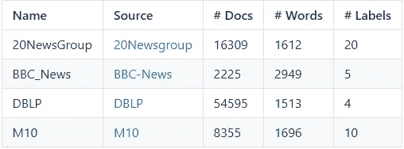
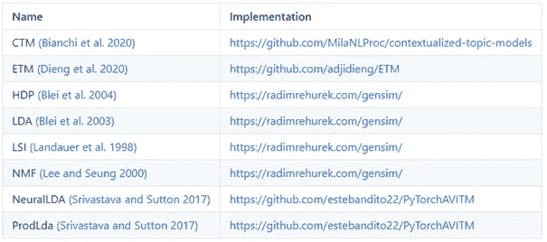

# OCTIS 入门指南第 1 卷:优化和比较主题模型很简单

> 原文：<https://towardsdatascience.com/a-beginners-guide-to-octis-optimizing-and-comparing-topic-models-is-simple-590554ec9ba6?source=collection_archive---------18----------------------->

## [实践教程](https://towardsdatascience.com/tagged/hands-on-tutorials)

## 拥有最高数量的集成的最先进的主题模型的 Python 包。


[环球之眼](https://unsplash.com/@universaleye?utm_source=medium&utm_medium=referral)在 [Unsplash](https://unsplash.com?utm_source=medium&utm_medium=referral) 上拍照

主题模型是一种有前途的生成统计方法，旨在提取文档集合中隐藏的主题。通常，主题模型有两个矩阵作为输出。

1.主题单词矩阵(*词汇* x *数字 _ 主题*)，表示单词 *i* 出现在主题 *k.* 中的概率

2.主题-文档-矩阵(*数量 _ 主题* x *数量 _ 文档*)。

然后，来自该矩阵的具有最高概率的前 n 个单词被用于表示主题。

最流行的主题建模方法是潜在的 Dirichlet 分配，许多文章都是关于它的工作和实现的。然而，只关注 LDA 是有限制的，并且对于给定的语料库可能是次优的。对于给定的语料库，其他主题模型可能更好。

最近发布了新的 Python 包，OCTIS(优化和比较主题模型很简单！).根据它的名字，OCTIS 允许在主题模型之间进行简单的比较，这不会让你感到惊讶。该软件包包含多个主题模型、数据集、评估指标和优化选项。

在这篇博客中，我演示了如何开始使用这个包。在以后的博客中，我将更详细地讨论主题模型优化和比较。

首先安装软件包:

```
pip install octis
```

我们需要一个数据集。

```
from octis.dataset.dataset import Dataset
```

OCTIS 有四个内置数据集:



让我们从最小的开始:

```
dataset = Dataset()dataset.fetch_dataset('BBC_news')
```

要选择其他数据集，请从表中选择一个名称(注意代码中“BBC_news”的拼写不同于表中的拼写。其他名称相同)。

现在，让我们看看数据集是什么样子的:

```
len(dataset._Dataset__corpus)
>>> 2225len(dataset._Dataset__vocabulary)
>>> 2949print(dataset._Dataset__corpus[0:5])
>>> [[‘broadband’, ‘ahead’, ‘join’, ‘internet’, ‘fast’, ‘accord’, ‘official’, ‘figure’, ‘number’, ‘business’, ‘connect’, ‘jump’, ‘report’, ‘broadband’, ‘connection’, ‘end’, ‘compare’, ‘nation’, ‘rank’, ‘world’, ‘telecom’, ‘body’, ‘election’, ‘campaign’, ‘ensure’, ‘affordable’, ‘high’, ‘speed’, ‘net’, ‘access’, ‘american’, ‘accord’, ‘report’, ‘broadband’, ‘increasingly’, ‘popular’, ‘research’, ‘shopping’, ‘download’, ‘music’, ‘watch’, ‘video’, ‘total’, ‘number’, ‘business’, ‘broadband’, ‘rise’, ‘end’, ‘compare’, ‘hook’, ‘broadband’, ‘subscriber’, ‘line’, ‘technology’, ‘ordinary’, ‘phone’, ‘line’, ‘support’, ‘high’, ‘data’, ‘speed’, ‘cable’, ‘lead’, ‘account’, ‘line’, ‘broadband’, ‘phone’, ‘line’, ‘connection’, ‘accord’, ‘figure’],[‘plan’, ‘share’, ‘sale’, ‘owner’, ‘technology’, ‘dominate’, ‘index’, ‘plan’, ‘sell’, ‘share’, ‘public’, ‘list’, ‘market’, ‘operate’, ‘accord’, ‘document’, ‘file’, ‘stock’, ‘market’, ‘plan’, ‘raise’, ‘sale’, ‘observer’, ‘step’, ‘close’, ‘full’, ‘public’, ‘icon’, ‘technology’, ‘boom’, ‘recently’, ‘pour’, ‘cold’, ‘water’, ‘suggestion’, ‘company’, ‘sell’, ‘share’, ‘private’, ‘technically’, ‘public’, ‘stock’, ‘start’, ‘trade’, ‘list’, ‘equity’, ‘trade’, ‘money’, ‘sale’, ‘investor’, ‘buy’, ‘share’, ‘private’, ‘filing’, ‘document’, ‘share’, ‘technology’, ‘firm’, ‘company’, ‘high’, ‘growth’, ‘potential’, ‘symbol’, ‘internet’, ‘telecom’, ‘boom’, ‘bubble’, ‘burst’, ‘recovery’, ‘fortune’, ‘tech’, ‘giant’, ‘dot’, ‘revive’, ‘fortune’],[‘mobile’, ‘rack’, ‘mobile’, ‘phone’, ‘celebrate’, ‘anniversary’, ‘weekend’, ‘mobile’, ‘phone’, ‘call’, ‘vodafone’, ‘network’, ‘veteran’, ‘day’, ‘mobile’, ‘phone’, ‘integral’, ‘part’, ‘modern’, ‘life’, ‘briton’, ‘handset’, ‘mobile’, ‘popular’, ‘handset’, ‘phone’, ‘rarely’, ‘call’, ‘portable’, ‘phone’, ‘commercial’, ‘mobile’, ‘service’, ‘launch’, ‘rest’, ‘world’, ‘set’, ‘network’, ‘call’, ‘walk’, ‘call’, ‘office’, ‘house’, ‘day’, ‘vodafone’, ‘firm’, ‘mobile’, ‘network’, ‘launch’, ‘service’, ‘spokesman’, ‘phone’, ‘launch’, ‘size’, ‘cost’, ‘battery’, ‘life’, ‘minute’, ‘hugely’, ‘popular’, ‘mid’, ‘status’, ‘symbol’, ‘young’, ‘business’, ‘fact’, ‘phone’, ‘radio’, ‘signal’, ‘communicate’, ‘easy’, ‘rack’, ‘customer’, ‘month’, ‘easy’, ‘forget’, ‘put’, ‘bid’, ‘document’, ‘forecast’, ‘total’, ‘market’, ‘forecast’, ‘vodafone’, ‘customer’, ‘vodafone’, ‘mobile’, ‘phone’, ‘operator’, ‘launch’, ‘launch’, ‘newcomer’, ‘operate’, ‘mobile’, ‘network’, ‘operator’, ‘technology’, ‘spectrum’, ‘phone’, ‘retire’, ‘call’, ‘global’, ‘system’, ‘mobile’, ‘widely’, ‘phone’, ‘technology’, ‘planet’, ‘call’, ‘digital’, ‘technology’, ‘introduce’, ‘thing’, ‘text’, ‘mobile’, ‘popular’],[‘launch’, ‘reconstruction’, ‘drive’, ‘appeal’, ‘peace’, ‘national’, ‘unity’, ‘important’, ‘find’, ‘solution’, ‘internal’, ‘conflict’, ‘damage’, ‘tsunami’, ‘cut’, ‘percentage’, ‘point’, ‘economic’, ‘growth’, ‘estimate’, ‘wave’, ‘leave’, ‘physical’, ‘damage’, ‘equal’, ‘economy’, ‘separately’, ‘lose’, ‘call’, ‘action’, ‘create’, ‘job’, ‘attend’, ‘ceremony’, ‘southern’, ‘town’, ‘join’, ‘government’, ‘opposition’, ‘politician’, ‘lay’, ‘foundation’, ‘stone’, ‘housing’, ‘project’, ‘intend’, ‘provide’, ‘home’, ‘tsunami’, ‘call’, ‘tragedy’, ‘start’, ‘beginning’, ‘rebuild’, ‘nation’, ‘country’, ‘natural’, ‘resource’, ‘fully’, ‘fight’, ‘add’, ‘due’, ‘arrive’, ‘revive’, ‘peace’, ‘talk’, ‘decade’, ‘long’, ‘conflict’, ‘government’, ‘force’, ‘tiger’, ‘separate’, ‘state’, ‘country’, ‘reconstruction’, ‘effort’, ‘hamper’, ‘tension’, ‘side’, ‘authority’, ‘initial’, ‘estimate’, ‘put’, ‘physical’, ‘damage’, ‘add’, ‘implication’, ‘economy’, ‘wide’, ‘broad’, ‘impact’, ‘substantial’, ‘detail’, ‘difficult’, ‘assess’, ‘early’, ‘stage’, ‘growth’, ‘inflation’, ‘balance’, ‘payment’, ‘foreign’, ‘exchange’, ‘reserve’, ‘expect’, ‘show’, ‘effect’, ‘lose’, ‘business’, ‘reconstruction’, ‘cost’, ‘industry’, ‘agricultural’, ‘production’, ‘affect’, ‘tourism’, ‘suffer’, ‘short’, ‘term’, ‘report’, ‘estimate’, ‘lose’, ‘job’, ‘industry’, ‘earning’, ‘tourism’, ‘expect’, ‘low’, ‘economic’, ‘growth’, ‘expect’, ‘previously’, ‘forecast’, ‘inflation’, ‘climb’, ‘compare’, ‘previous’, ‘estimate’, ‘major’, ‘export’, ‘suffer’, ‘expect’, ‘reconstruction’, ‘effort’, ‘require’, ‘high’, ‘import’, ‘damage’, ‘balance’, ‘payment’, ‘foreign’, ‘exchange’, ‘reserve’, ‘hard’, ‘press’, ‘international’, ‘reserve’, ‘pre’, ‘tsunami’, ‘level’, ‘total’, ‘month’, ‘worth’, ‘import’, ‘week’, ‘approve’, ‘request’, ‘freeze’, ‘loan’, ‘repayment’],[‘buy’, ‘giant’, ‘profit’, ‘soar’, ‘acquisition’, ‘big’, ‘firm’, ‘tax’, ‘profit’, ‘rise’, ‘expect’, ‘solid’, ‘growth’, ‘performance’, ‘sale’, ‘firm’, ‘world’, ‘big’, ‘volume’, ‘buy’, ‘acquisition’, ‘sale’, ‘volume’, ‘grow’, ‘month’, ‘sale’, ‘account’, ‘increase’, ‘sell’, ‘volume’, ‘big’, ‘term’, ‘sale’, ‘continue’, ‘demand’, ‘product’, ‘south’, ‘american’, ‘market’, ‘brazilian’, ‘arm’, ‘popular’, ‘expect’, ‘boost’, ‘turnover’, ‘business’, ‘analyst’, ‘strong’, ‘performance’, ‘boost’, ‘share’, ‘market’, ‘end’, ‘report’, ‘contrast’, ‘volume’, ‘sale’, ‘fall’, ‘central’, ‘european’, ‘sale’, ‘rise’, ‘net’, ‘profit’]]
```

那很好；每个文档都是预处理过的标记列表，所以这里不需要进行任何预处理。

OCTIS 有八个内置主题模型:



(如果您实现了其中一个模型，请确保引用正确的论文)

现在，让我们用这些数据训练一个 NeuralLDA 模型:

```
from octis.models.NeuralLDA import NeuralLDA
```

通过用上表中的名称替换“NeuralLDA”，可以类似地导入其他主题模型(注意，“ProdLda”需要是“ProdLDA”)。

初始化模型:

```
model = NeuralLDA(num_topics=20)
```

所有不同的主题模型都包含“num_topics”。其他参数因型号而异，可以在实现页面上找到。但是，检查源代码可以更快地找到参数:

```
import inspectprint(inspect.getsource(NeuralLDA))>>> class NeuralLDA(AVITM):def __init__(self, num_topics=10, activation=’softplus’, dropout=0.2, learn_priors=True, batch_size=64, lr=2e-3,momentum=0.99, solver=’adam’, num_epochs=100, reduce_on_plateau=False, prior_mean=0.0,prior_variance=None, num_layers=2, num_neurons=100, num_samples=10, use_partitions=True):…
```

构造函数中的参数可以手动设置。在这种情况下，它们是:

*   `num_topics`
*   `activation`
*   `dropout`
*   `learn_priors`
*   `batch_size`
*   `lr`
*   `momentum`
*   `solver`
*   `num_epochs`
*   `reduce_on_plateau`
*   `prior_mean`
*   `prior_variance`
*   `num_layers`
*   `num_neurons`
*   `num_samples`
*   `use_partition`

现在，我们将简单地使用默认设置，并将`num_topics` = 20:

```
model = NeuralLDA(num_topics=20)trained_model = model.train_model(dataset)#Now, you should see something like:Epoch: [1/100] Samples: [1557/155700] Train Loss: 987.1886277195729 Time: 0:00:00.352704Epoch: [1/100] Samples: [334/33400] Validation Loss: 982.9130479275823 Time: 0:00:00.020085Epoch: [2/100] Samples: [3114/155700] Train Loss: 990.8275228805395 Time: 0:00:00.362417Epoch: [2/100] Samples: [334/33400] Validation Loss: 982.0897677301647 Time: 0:00:00.010114Epoch: [3/100] Samples: [4671/155700] Train Loss: 981.4996826328677 Time: 0:00:00.362483Epoch: [3/100] Samples: [334/33400] Validation Loss: 965.4536162050898 Time: 0:00:00.010038
```

trained_model 是一个字典，具有以下键:

```
print(trained_model.keys())>>> dict_keys([‘topics’, ‘topic-document-matrix’, ‘topic-word-matrix’, ‘test-topic-document-matrix’])
```

这些键如下:

1.  *主题*:word 主题列表
2.  *topic-word-matrix* :每个主题的词汇的单词分布(维度:|num topics| x |vocabulary|)
3.  *主题-文档-矩阵*:训练集每个文档的主题分布(维度:|主题数| x |训练文档|)
4.  *test-document-topic-matrix*:测试集每个文档的主题分布(维度:|num topics| x |test documents|)

第一个关键字`topics`由来自主题单词矩阵的每个主题具有最高概率的 *n* 个单词的列表组成。

让我们看看这些是什么:

```
for topic in trained_model[‘topics’]:
    print(“ “.join(topic))>>> claim chief meet budget official talk cut raise future economicwin side match final chance team season half great goalcompany market sale month share expect rise fall growth reportcharge competition link victim ago injury anti tragedy decision missgovernment plan party add election public give claim week torygame show give big play add back week put findcompany find user firm technology mobile service phone accord informationcase evidence order trial concern court common law clear powerenjoy tragedy rest carry navigate motion admit date opener technologicalchoose tragedy due motion navigate involve manage suffer stiff technologicalfilm good top award star director movie chance performance careerrival reveal drug short range break challenge battle focus fourthtragedy position seller navigate squeeze motion rare flanker overwhelming technologicalinclude follow number hit man release hold place record bandtragedy navigate seller earn join escape squeeze opener adoption technological
```

通常，连贯性被用来评估主题的质量。让我们也检查一下这个模型的一致性:

```
from octis.evaluation_metrics.coherence_metrics import Coherence
```

在不同的一致性度量中，`c_v`与人工翻译的相关性最高。

```
cv = Coherence(texts=dataset.get_corpus(),topk=10, measure=’c_v’)
print(‘Coherence: ‘ + str(cv.score(trained_model)))
>>> Coherence: 0.4963712149432245
```

(与典型的主题建模符号相反，‘topk’表示主题中包含的单词数，而不是主题数。由于我们的主题模型每个主题有十个单词，‘topk’不能超过 10 个)。

此外，OCTIS 还可以选择计算所谓的“多样性得分”，即主题中独特词的百分比。这个分数是制作主题质量的另一个指标。如果没有很多独特的话，那么很多话题都是大同小异，意义不是很大。

```
from octis.evaluation_metrics.diversity_metrics import TopicDiversitydiversity = TopicDiversity(topk=10)
print('Diversity score: '+str(diversity.score(trained_model)))
>>> Diversity score: 0.8533333333333334
```

连贯性和多样性主要用于比较不同主题模型的主题。在下一篇博客中，我将展示如何优化主题模型。

如果你喜欢这项工作，你可能会对主题建模感兴趣。在这种情况下，您可能也会对以下内容感兴趣。

**我们创建了一个新的话题建模算法，叫做 FLSA-W** (官方页面是[这里](https://ieeexplore.ieee.org/abstract/document/9660139)，但是你可以看到论文[这里](https://pure.tue.nl/ws/portalfiles/portal/243684581/A_Comparative_Study_of_Fuzzy_Topic_Models_and_LDA_in_terms_of_Interpretability.pdf))。

在几个公开数据集上，FLSA-W 算法的性能优于其他一流算法(如 LDA、ProdLDA、NMF、CTM 等)。 [**该作品**](https://pure.tue.nl/ws/files/222725628/Pure_ExperimentalStudyOfFlsa_wForTopicModeling.pdf) **已提交，但尚未通过同行评审。**

**如果想用 FLSA-W，可以下载 Gensim 中的**[**FuzzyTM 包**](https://pypi.org/project/FuzzyTM/) **或者 flsamodel。**如需引用，[请用本文](https://ieeexplore.ieee.org/abstract/document/9882661?casa_token=UsYg7SvoSioAAAAA:3ltCVZexA9-lPveuGVeRDh5VQW6rw0pVRDxmYk39tXbx13u4OuB2sTEFZzIGJCkdRiZBg0eJ)。