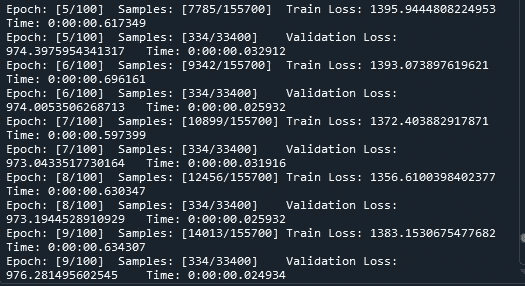
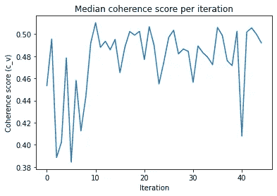

# OCTIS 入门指南第 2 卷:优化主题模型

> 原文：<https://towardsdatascience.com/a-beginners-guide-to-octis-vol-2-optimizing-topic-models-1214e58be1e5?source=collection_archive---------7----------------------->


乔尔·菲利普在 [Unsplash](https://unsplash.com?utm_source=medium&utm_medium=referral) 上的照片

在[之前的一篇帖子](/a-beginners-guide-to-octis-optimizing-and-comparing-topic-models-is-simple-590554ec9ba6)中，我介绍了 Python 包 OCTIS(优化和比较主题模型很简单)；我演示了如何开始和它的特性。这个包允许简单的主题模型优化和比较(顾名思义)。这篇文章主要关注名字的第一个字母:*O*optimization。

在这篇文章的结尾，你将会:

1.  对超参数优化有基本的了解。
2.  知道优化主题模型时要考虑什么。
3.  能够优化你自己的主题模型。

# 超参数优化

几乎所有的机器学习算法都有超参数。超参数表示学习过程的算法所使用的设置；基于这些设置，算法遵循学习程序来学习其参数。然而，确定每个超参数的最佳值并不简单，通常通过先进的试错法来完成，也称为*超参数优化*。使用这些超参数调整方法中的任何一种，算法都是基于一组超参数来训练的。该算法的结果通过性能指标或误差测量来评估。然后，(稍微)调整超参数，并基于新的设置训练和评估模型。最基本的方法是网格搜索，其中算法在一组预定义设置的所有组合上进行训练。网格搜索很容易编码，可以并行运行，不需要任何形式的调整。然而，在搜索空间中导航*是低效的，因为它不使用在早期尝试中获得的信息。由于搜索可能不包括所有可能的设置，因此无法保证找到最佳值。*

找到超参数的更有效的方法是通过基于模型的顺序优化(SMBO)。这里，性能指标/误差测量的替代模型可以适合先前的尝试并指示最佳点。

一种常见的 SMBO 方法是贝叶斯优化，它可以通过高斯过程回归来解释。使用高斯过程回归，附加信息(新的超参数设置信息)被添加到已经采样的点的先验中。贝叶斯优化仅对优化少数超参数有效。然而，随着搜索空间的增加，性能会下降。此外，贝叶斯优化不能并行化，因为新学习的信息被添加到先验中。高斯过程回归的更多细节可在[这里](/quick-start-to-gaussian-process-regression-36d838810319)找到，超参数优化方法的更详细回顾可在[这里](https://medium.com/criteo-engineering/hyper-parameter-optimization-algorithms-2fe447525903)找到。

# 利用 OCTIS 优化主题模型

OCTIS 使用贝叶斯优化进行超参数优化。在我之前的帖子中，我在 BBC 数据集上训练了一个 NeuralLDA 模型，所以我在这里也将这样做。

假设你已经安装了 OCTIS，我们直接用 Python 开始吧。同样，我们需要导入数据集和 NeuralLDA 模型:

```
from octis.dataset.dataset import Dataset
from octis.models.NeuralLDA import NeuralLDA
```

此外，我们安装优化空间、一致性(我们将其用作评估每个设置的性能指标)和优化器本身:

```
from skopt.space.space import Real, Categorical, Integer
from octis.evaluation_metrics.coherence_metrics import Coherence
from octis.optimization.optimizer import Optimizer
```

让我们获取数据集并初始化模型，我们差不多准备好了:

```
dataset = Dataset()
dataset.fetch_dataset('BBC_news')model = NeuralLDA(num_topics=20)
```

在前一篇文章中，我们发现 NeuralLDA 具有以下(超级)参数:

*   `num_topics`
*   `activation`
*   `dropout`
*   `learn_priors`
*   `batch_size`
*   `lr`
*   `momentum`
*   `solver`
*   `num_epochs`
*   `reduce_on_plateau`
*   `prior_mean`
*   `prior_variance`
*   `num_layers`
*   `num_neurons`
*   `num_samples`
*   `use_partition`

# **搜索空间**

理论上，所有这些变量都可以优化。但由于贝叶斯优化在高维搜索空间中表现不佳，我们将搜索空间维度限制为三个变量:

```
search_space = {"num_layers": Integer(1,3), 
                "num_neurons": Categorical({100, 200, 300}),
                "dropout": Real(0.0, 0.95)}
```

对于`Categorical`值，需要列出所有可能的值，而下限和上限只需要在`Real`和`Integer`空间中给出。注意，虽然`num_neurons`是整数，但我们在这里将其定义为分类值，因此只考虑这三个值，而不是 100 到 300 之间的任何整数值。

# **连贯性**

此外，我们基于连贯分数来评估不同的超参数设置，连贯分数指示了主题中不同单词相互支持的程度。计算一致性分数有多种方法。OCTIS 的默认一致性度量是`c_npmi`。然而，我推荐使用`c_v`，因为它与人类的理解更相关[1]:

```
coherence = Coherence(texts=dataset.get_corpus(), measure = ‘c_v’)
```

# **优化**

现在我们几乎准备好开始优化。首先，我们需要定义优化迭代的次数，这是时间和性能之间的权衡。通常，更多的迭代意味着更高的性能，但这是以更长的训练时间为代价的。此外，更多的超参数意味着更多的迭代轮次。经验法则是使用 15 倍的超参数作为迭代次数。我们有三个超参数，所以我们将使用 45 次迭代。

```
optimization_runs=45
```

此外，每次训练新设置时，神经网络都用随机权重初始化。为了获得每个设置的可靠结果，每个设置都应该运行几次。然后，我们将这些测量值的中间值作为每个设置的代表。再次，模型运行次数是时间和质量的权衡；总训练时间比只跑一次长`model_run`倍。我们将使用 5:

```
model_runs=5
```

现在我们准备开始优化和保存结果。让我们为优化计时，以了解培训需要多长时间。这可能便于将来参考。

```
optimizer=Optimizer()import timestart = time.time()
optimization_result = optimizer.optimize(
    model, dataset, coherence, search_space, number_of_call=optimization_runs, 
    model_runs=model_runs, save_models=True, 
    extra_metrics=None, # to keep track of other metrics
    save_path='results/test_neuralLDA//')
end = time.time()
duration = end - startoptimization_result.save_to_csv("results_neuralLDA.csv")print('Optimizing model took: ' + str(round(duration)) + ' seconds.')
```

当模型正在训练时，您应该会在控制台中看到类似下图的内容:



```
Epoch: [49/100] Samples: [76293/155700] Train Loss: 922.4048726517341 Time: 0:00:00.465756
Epoch: [49/100] Samples: [334/33400] Validation Loss: 920.509180857036 Time: 0:00:00.027928
Epoch: [50/100] Samples: [77850/155700] Train Loss: 922.2904436115125 Time: 0:00:00.490685
Epoch: [50/100] Samples: [334/33400] Validation Loss: 920.9605340101048 Time: 0:00:00.027925
Epoch: [51/100] Samples: [79407/155700] Train Loss: 927.4208815028902 Time: 0:00:00.435834
Epoch: [51/100] Samples: [334/33400] Validation Loss: 920.7156858158683 Time: 0:00:00.026928
Early stopping
Optimizing model took: 6922 seconds.
```

所以，用了不到两个小时。不算太坏。

# 分析

现在，我们准备分析结果。是一本信息量很大的词典。

```
import json
results = json.load(open(“results/test_neuralLDA/result.json”,’r’))results.keys()>>> dict_keys(['dataset_name', 'dataset_path', 'is_cached', 'kernel', 'acq_func', 'surrogate_model', 'optimization_type', 'model_runs', 'save_models', 'save_step', 'save_name', 'save_path', 'early_stop', 'early_step', 'plot_model', 'plot_best_seen', 'plot_name', 'log_scale_plot', 'search_space', 'model_name', 'model_attributes', 'use_partitioning', 'metric_name', 'extra_metric_names', 'metric_attributes', 'extra_metric_attributes', 'current_call', 'number_of_call', 'random_state', 'x0', 'y0', 'n_random_starts', 'initial_point_generator', 'topk', 'time_eval', 'dict_model_runs', 'f_val', 'x_iters'])
```

而不是像以前那样测量时间。通过使用`'time_eval'`，我们可以看到每个模型的时间(/总时间):

```
results[‘time_eval’]>>> [184.53835153579712,
 148.67225646972656,
 109.24449896812439,
 256.08221530914307,
 154.24360704421997,
 109.99915742874146,
 160.35804772377014,
 151.49168038368225,
 155.40837001800537,
 187.06181716918945,
 130.2092640399933,
 147.94106578826904,
 123.84417510032654,
 144.77754926681519,
 161.64789295196533,
 155.76212072372437,
 135.94082117080688,
 135.95739817619324,
 173.89717316627502,
 157.23684573173523,
 163.68361639976501,
 162.50231456756592,
 149.47536158561707,
 128.70402908325195,
 160.75109601020813,
 175.52507424354553,
 172.95005679130554,
 153.52869629859924,
 186.61110424995422,
 157.76874375343323,
 191.34919786453247,
 140.3497931957245,
 132.05838179588318,
 151.3189136981964,
 153.88639116287231,
 150.12475419044495,
 178.27711153030396,
 140.40700840950012,
 94.96378469467163,
 174.16378569602966,
 92.2694320678711,
 151.19830918312073,
 152.21132159233093,
 176.6853895187378,
 147.0237419605255]sum(results[‘time_eval’])>>> 6922.101717710495
```

`'f_val'`显示不同运行中每个训练设置的中值。

```
results[“f_val”]>>> [0.4534176015984939,
 0.4955475245370141,
 0.38868674378398477,
 0.4024525856722283,
 0.47846034921413033,
 0.3844368770533101,
 0.4581705543253348,
 0.4126574046864957,
 0.4434880465386791,
 0.49187868514620553,
 0.5102920794834441,
 0.48808652324541707,
 0.4935514490937605,
 0.4858721622773336,
 0.4952236036028558,
 0.465241037841993,
 0.4881279220028529,
 0.5023211922031112,
 0.4990924448499987,
 0.5024987857267208,
 0.4770480035332,
 0.5067195917253968,
 0.4898287484351199,
 0.4550063558556884,
 0.4748375121047843,
 0.497097248313755,
 0.5034682220702588,
 0.48220918244287975,
 0.486563299332411,
 0.4845033510847734,
 0.4564350945897047,
 0.4893138798649524,
 0.4832975678079854,
 0.4791275238679498,
 0.4723902248816144,
 0.5060161207074427,
 0.49878190002894496,
 0.4760453248044104,
 0.47155389774180045,
 0.5026397878110507,
 0.40795520033104554,
 0.5018909026526471,
 0.5056155984233146,
 0.4999288519956374,
 0.49207181719944526]
```

这不是很直观，所以让我们画出来:

```
import matplotlib.pyplot as pltplt.xlabel(‘Iteration’)
plt.ylabel(‘Coherence score (c_v)’)
plt.title(‘Median coherence score per iteration’)
plt.plot(results[“f_val”])
plt.show()
```



从这个图中，我们可以看到模型并没有从高迭代次数中受益。最大中值得分出现在第 11 次迭代中，并且具有 0.51 的中值一致性得分:

```
results[ ‘f_val’].index(max(results[ ‘f_val’]))
>>> 10results["f_val"][10]
>>> 0.5102920794834441
```

现在，为了找到在第 11 次迭代中使用的设置，我们使用`'x_iters’`。这是一个包含已优化参数的字典:

```
results[‘x_iters’].keys()>>> dict_keys(['dropout', 'num_layers', 'num_neurons'])
```

最佳超参数设置为:

```
print([results[‘x_iters’][parameter][10] for parameter in results[‘x_iters’].keys()])>>> [0.5672132691312042, 1, 200]
```

因此，在给定迭代次数和主题数量的情况下，我们的搜索空间中的最佳设置是:

*   `dropout` : 0.5672
*   `num_layers` : 1
*   `num_neurons` : 200

# 结论

就是这样！如果您已经完成了这篇文章的结尾，那么现在您已经准备好优化您自己的主题模型了。您对选择参数/搜索空间的数量有基本的了解，并知道如何用 Python 编程。

我和我的研究小组开发了新的主题建模算法，这些算法已经发表在 2021 年计算智能[系列研讨会上。初步结果表明，与 OCTIS 涵盖的主题模型相比，这些模型具有较高的可解释性。在以后的文章中，我将解释这些模型的工作原理，并将它们与 OCTIS 现有的主题模型进行比较。](https://attend.ieee.org/ssci-2021/)

祝你在 OCTIS 中优化你自己的主题模型好运，如果你有任何问题/意见，请不要犹豫联系我。

此外，[这里的](https://colab.research.google.com/github/MIND-Lab/OCTIS/blob/master/examples/OCTIS_Optimizing_CTM.ipynb#scrollTo=er0UeANzLSkF)是到 Google Colab 的链接，其中一个 CTM 模型是由 OCTIS 开发人员优化的。

如果你喜欢这项工作，你可能会对主题建模感兴趣。在这种情况下，您可能也会对以下内容感兴趣。

**我们创建了一个新的主题建模算法，叫做 FLSA-W** (官方页面是[这里是](https://ieeexplore.ieee.org/abstract/document/9660139)，但是你可以看到论文[这里是](https://pure.tue.nl/ws/portalfiles/portal/243684581/A_Comparative_Study_of_Fuzzy_Topic_Models_and_LDA_in_terms_of_Interpretability.pdf))。

**在几个开放数据集上，FLSA-W 的性能优于其他一流算法(如 LDA、ProdLDA、NMF、CTM 等)。** [**该作品**](https://pure.tue.nl/ws/files/222725628/Pure_ExperimentalStudyOfFlsa_wForTopicModeling.pdf) **已提交，但尚未通过同行评审。**

**如果想用 FLSA-W，可以下载** [**的 FuzzyTM 包**](https://pypi.org/project/FuzzyTM/) **或者 Gensim 中的 flsamodel。**如需引用，[请使用本文](https://ieeexplore.ieee.org/abstract/document/9882661?casa_token=UsYg7SvoSioAAAAA:3ltCVZexA9-lPveuGVeRDh5VQW6rw0pVRDxmYk39tXbx13u4OuB2sTEFZzIGJCkdRiZBg0eJ)。

# **参考文献**

[1]罗德，m .，两者，a .，&欣内堡，A. (2015 年 2 月)。探索话题连贯性测量的空间。第八届 ACM 网络搜索和数据挖掘国际会议论文集*(第 399-408 页)。*