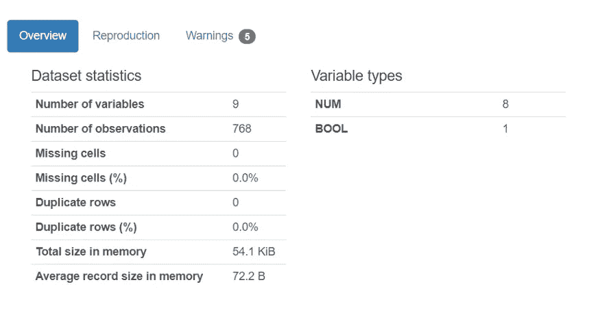

# 面向数据科学的 Python 初学者指南

> 原文：<https://towardsdatascience.com/a-beginners-guide-to-python-for-data-science-68f3f46654ce?source=collection_archive---------11----------------------->

## 作为数据科学家应该学习的 11 个 Python 包

丹尼尔·伊德里在 [Unsplash](https://unsplash.com/s/photos/coding?utm_source=unsplash&utm_medium=referral&utm_content=creditCopyText) 上的照片

数据科学家每天都要执行各种各样的任务，包括数据收集、预处理、分析、机器学习和可视化。

如果您是数据科学行业的初学者，您可能上过 Python 或 R 课程，并且了解数据科学生命周期的基础知识。

然而，当你试图自己在 Kaggle 上试验数据集时，你可能会发现很难，因为你不知道从哪里开始。

你不知道该用什么工具来完成你想要完成的任务。

在本文中，我将带您了解一些对数据科学最重要的 Python 库。几乎所有你想执行的任务都有一个库，我将在这里分解其中的一些。

这些是大多数数据科学家日常使用的库(我在我的数据科学工作中使用它们)，所以知道如何使用它们是很重要的。

我还会列出一些免费资源(视频、文章和教程)供您浏览，以便获得使用这些库的实践经验。

# 数据收集

解决任何数据科学问题的第一步是数据收集。有时，这些数据会以 SQL 数据库或 Excel 表格的形式出现。在其他时候，您需要自己提取数据——要么使用 API，要么使用 web 抓取。

下面，我将列举一些 Python 中最常见的数据集合库。根据我需要收集的数据类型，我经常使用这些库，它们使我的数据科学工作流程变得更加容易。

## MySQLConnector

如果您需要提取的数据是 SQL 数据库的形式，您需要在预处理和分析之前将数据库加载到 Python 中。

MySQLConnector 是一个库，允许您使用 Python 建立与 SQL 数据库的连接。

在这个库的帮助下，您可以轻松地加载数据库表，然后将表转换为 Pandas 数据框，以执行进一步的数据操作。

您还可以创建数据库，并在这个库的帮助下写入数据库。

MySQLConnector 入门:

*   [w3Schools 的 Python MySQL 教程](https://www.w3schools.com/python/python_mysql_getstarted.asp)
*   [用 Python 连接到 MySQL 数据库](https://pynative.com/python-mysql-database-connection/)

## 美丽的声音

公司在制定业务决策时通常依赖外部数据，他们可能希望比较竞争对手产品的价格，分析竞争对手的品牌评论等。

BeautifulSoup 是一个 Python 库，可以帮助你从任何网页上抓取数据。

[这里](https://www.natasshaselvaraj.com/web-scraping/)是一个帮助你入门 Python 中 BeautifulSoup 的教程。

## 社交媒体 API

Twitter、脸书和 Instagram 等社交媒体平台每天都会产生大量数据。

这些数据可用于许多数据科学项目，例如:

*A 公司刚刚发布了一款产品，并推出了特别折扣。他们的客户对产品和折扣的反应如何？人们是否比平时更多地谈论该品牌？促销活动是否提高了品牌知名度？与竞争对手品牌相比，整体产品情感有多好？*

对于一家公司来说，仅凭内部数据很难衡量整体品牌情绪(在大范围内)。

社交媒体分析在为客户流失预测和客户细分等任务收集数据方面发挥了巨大作用。

从社交平台收集数据并不困难，因为有很多公开可用的 API 可以帮助你快速完成这项工作。其中一些包括:

*   推特: [Tweepy](https://www.tweepy.org/) ， [Twint](https://github.com/twintproject/twint)
*   脸书:[Python-脸书-API](https://pypi.org/project/python-facebook-api/)
*   YouTube:[Python-YouTube](https://pypi.org/project/python-youtube/)

以下是一些帮助您入门的教程:

*   [用 Python 抓取 Twitter 数据](https://www.natasshaselvaraj.com/how-to-scrape-twitter/)
*   [用 Python 抓取 YouTube 评论](/how-to-scrape-youtube-comments-with-python-61ff197115d4)

[这里的](https://www.natasshaselvaraj.com/sentiment-analysis-twitter-youtube/)是我用 Twitter API 创建的一个情感分析项目的例子。

# 数据预处理

真实世界的数据是肮脏的。它并不总是以 Excel 表格或. csv 文件的格式出现。它可以是 SQL 数据库、文本文件、JSON 字典甚至 PDF 文件的格式。

作为一名数据科学家，你的大部分时间将用于创建数据框、清理数据框和合并数据框。

一些有助于数据准备的 Python 库包括:

## Numpy

Numpy 是一个包，允许您对大量数据快速执行操作。

在 Numpy 的帮助下，您可以将数据框转换为数组，操作矩阵，并轻松找到人口的基本统计数据(如中位数或标准差)。

帮助您开始使用 Numpy 的一些教程:

*   [Numpy—W3Schools 简介](https://www.w3schools.com/python/numpy/numpy_intro.asp)
*   [用 Python 从头学 Numpy】](https://realpython.com/numpy-tutorial/)

## 熊猫

Pandas 是用于数据科学的最流行和最广泛使用的 Python 包之一。

在 Pandas 的帮助下，您可以轻松读取不同的文件类型并创建数据框。然后，您可以创建函数来快速预处理这些数据-您可以清理数据框，移除缺失/无效的值，并执行数据缩放/标准化。

要学习熊猫，你可以参加以下教程:

*   [熊猫教程— w3Schools](https://www.w3schools.com/python/pandas/default.asp)
*   [熊猫教程—教程要点](https://www.tutorialspoint.com/python_pandas/index.htm)

## 正则表达式

使用 Pandas 数据框时，您是否遇到过无效值、奇怪的符号或空格？

虽然 RegEx 不是专门为数据科学家构建的库，但是我将它添加到这个列表中，因为它非常有用。

您可以使用 RegEx(或正则表达式)来标识数据中的一组字符。该库可用于查找指定特定条件的数据行。它还可以用于预处理数据和删除与特定格式不匹配的无效值。

开始对 Pandas 数据框使用正则表达式的一些教程:

*   [面向数据科学家的正则表达式— DataQuest](https://www.dataquest.io/blog/regular-expressions-data-scientists/)
*   [如何在熊猫中使用正则表达式](https://kanoki.org/2019/11/12/how-to-use-regex-in-pandas/)

# 数据分析

执行数据分析的最重要的库是 Pandas。上面我已经解释了使用 Pandas 进行数据预处理，所以现在我将介绍 Pandas 中用于数据分析的最佳模块之一:

## 熊猫-侧写

熊猫概况是一个非常有用的数据分析模块。在数据框上运行 pandas-profiling 后，它将为您提供如下所示的数据统计摘要:

作者图片

它还为您提供了每个变量的描述，它们之间的相互关系，它们的分布和基数。

要了解更多关于熊猫简介的信息，请阅读这篇文章。

## 海生的

任何数据科学项目的另一个关键部分是可视化。重要的是要形象化变量的分布，检查它们的偏斜度，并了解它们之间的关系。

Seaborn 是一个可以用于此目的的库。它的导入速度很快，你可以很容易地制作图表，只需要一两行代码。

这里有一些学习资源可以帮助您开始使用 Seaborn:

*   [Python Seaborn 教程—免费 Datacamp 教程](https://www.datacamp.com/community/tutorials/seaborn-python-tutorial)

这是我在 Seaborn 创建的数据可视化教程:

*   [Python 数据可视化初学者指南](/a-beginners-guide-to-data-visualization-with-python-49f1d257c781)

## Plotly

Plotly 是我添加到这个列表中的另一个可视化库。使用 Plotly，您可以制作漂亮的交互式可视化效果。

定制 Plotly 可视化需要更多的代码和努力。

如果我想快速检查变量之间的分布/关系，我一般会使用 Seaborn。如果我需要向他人展示可视化，我会使用 Plotly，Plotly 的图表是交互式的，看起来很好。

Plotly 还允许您构建交互式 choropleth 地图，这使您可以轻松地绘制位置数据。如果您需要按地区、国家或纬度/经度显示数据，Plotly 的 choropleth 地图是最好的方法。

Plotly 入门的一些学习资源:

*   [Python Plotly 教程— Geeksforgeeks](https://www.geeksforgeeks.org/python-plotly-tutorial/)
*   [剧情教程—教程要点](https://www.tutorialspoint.com/plotly/index.htm)

# 机器学习

Python 中最流行的机器学习库包括:

## sci kit-学习

Scikit-Learn 是最广泛使用的用于机器学习的 Python 库。它允许您只需几行代码就可以构建线性回归、逻辑回归和决策树等机器学习算法。

你可以在[这个](https://scikit-learn.org/stable/tutorial/basic/tutorial.html)教程的帮助下开始使用 Scikit-Learn。

[这里的](https://www.natasshaselvaraj.com/a-gentle-introduction-to-linear-regression/)是我创建的一个线性回归教程，它使用 Scikit-Learn 来实现模型。

## 统计模型

Statsmodel 是另一个可以用来构建机器学习算法的 Python 库。

我更喜欢使用 Statsmodel 而不是 Scikit-Learn 的原因是因为它在建立机器学习模型后提供了详细的摘要。

只需一行代码，我们就可以查看标准误差、每个变量的模型系数和 p 值等指标。

这让我们对模型的性能有了一目了然的了解。

要开始使用 Statsmodel，您可以阅读以下文章:

*   [用于线性回归的统计模型](https://datatofish.com/statsmodels-linear-regression/)
*   [使用 Statsmodel 的逻辑回归](https://www.geeksforgeeks.org/logistic-regression-using-statsmodels/)

# 结论

数据科学家的工作不会从构建机器学习模型开始，也不会从构建机器学习模型结束。

您应该能够在需要时从不同的来源提取数据，并在使用这些数据构建模型之前先清理/分析这些数据。在数据行业工作时，您应该知道如何执行端到端的数据科学工作流。

你需要知道如何收集和预处理数据，分析数据，并建立机器模型。

上面列出的 11 个包是用 Python 做这件事的一些最简单的方法。

一旦您熟悉了其中的一些包，您就可以开始使用它们来构建数据科学项目。这将有助于提高您的数据科学和编程技能。