# 机器学习中回归分析的初学者指南

> 原文：<https://towardsdatascience.com/a-beginners-guide-to-regression-analysis-in-machine-learning-8a828b491bbf?source=collection_archive---------0----------------------->

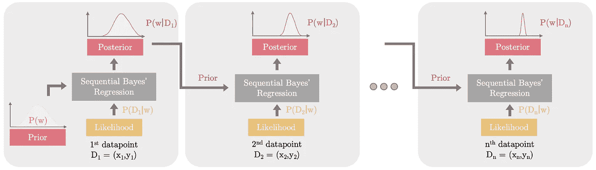

## 回归分析用例子，插图，动画和备忘单解释。

# 背景:

为了理解回归背后的动机，让我们考虑下面这个简单的例子。下面的散点图显示了从 2001 年到 2012 年美国大学毕业生的数量。

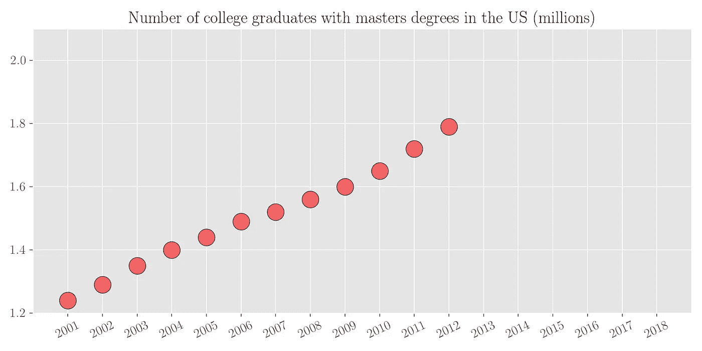

作者图片

现在根据现有的数据，如果有人问你 2018 年有多少硕士毕业的大学生呢？可以看出，拥有硕士学位的大学毕业生人数几乎是随年份线性增长的。因此，通过简单的视觉分析，我们可以粗略估计这个数字在 200 万到 210 万之间。让我们看看实际数字。下图描绘了从 2001 年到 2018 年的同一个变量。可以看出，我们预测的数字与实际值大致相当。

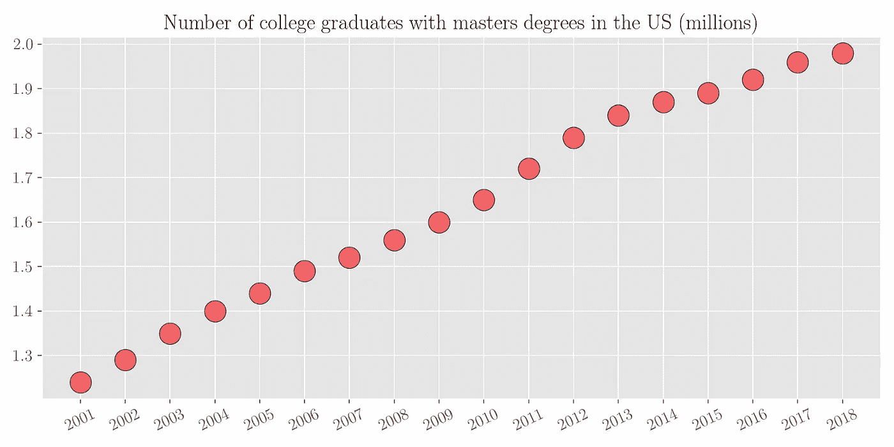

作者图片

因为这是一个更简单的问题(用一条线来拟合数据)，我们的大脑很容易做到这一点。将一个函数拟合到一组数据点的过程称为回归分析。

# 什么是回归分析？

回归分析是估计因变量和自变量之间关系的过程。简而言之，它意味着在某种误差函数下，将选定的函数族中的一个函数拟合到采样数据。回归分析是用于预测的机器学习领域中最基本的工具之一。使用回归，您可以在可用数据上拟合一个函数，并尝试预测未来或持续数据点的结果。这种函数拟合有两个目的。

1.  您可以估计数据范围内的缺失数据(插值)
2.  您可以估计数据范围之外的未来数据(外推法)

回归分析的一些实际例子包括预测给定房屋特征的房屋价格、预测 SAT/GRE 分数对大学录取的影响、基于输入参数预测销售、预测天气等。

让我们考虑一下之前大学毕业生的例子。

1.  **插值:**让我们假设我们可以访问一些稀疏的数据，我们知道每 4 年大学毕业生的数量，如下图所示。

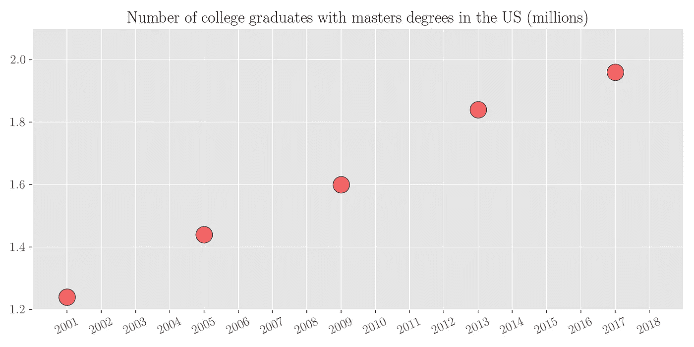

作者图片

我们想估计一下在这之间的所有缺失年份的大学毕业生人数。我们可以通过对有限的可用数据点拟合一条线来做到这一点。这个过程叫做插值。

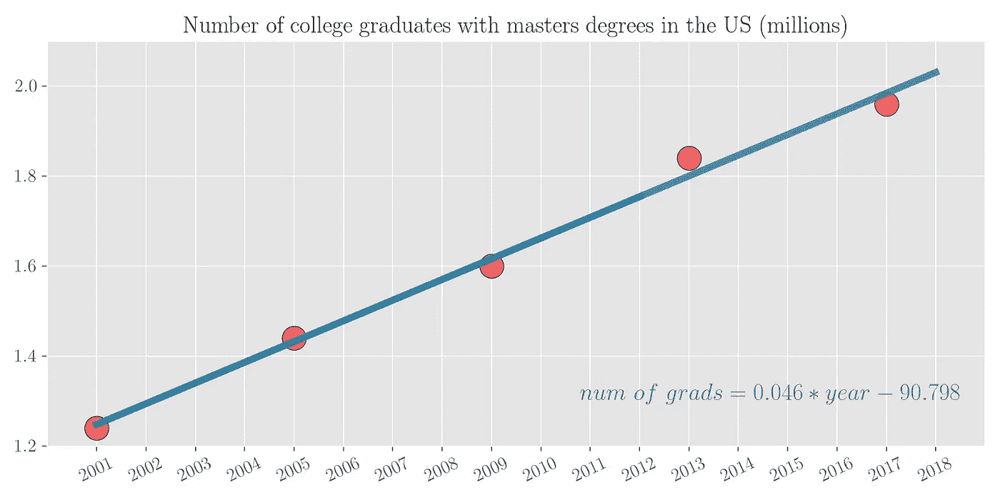

**图 4** :作者图片

**推断**:假设我们可以获得 2001 年到 2012 年的有限数据，我们想预测 2013 年到 2018 年的大学毕业生人数。

作者图片

可以看出，拥有硕士学位的大学毕业生人数几乎是随年份线性增长的。因此，对数据集拟合一条线是有意义的。用这 12 个点来拟合一条线，然后在未来的 6 个点上测试这条线的预测，可以看出预测非常接近。

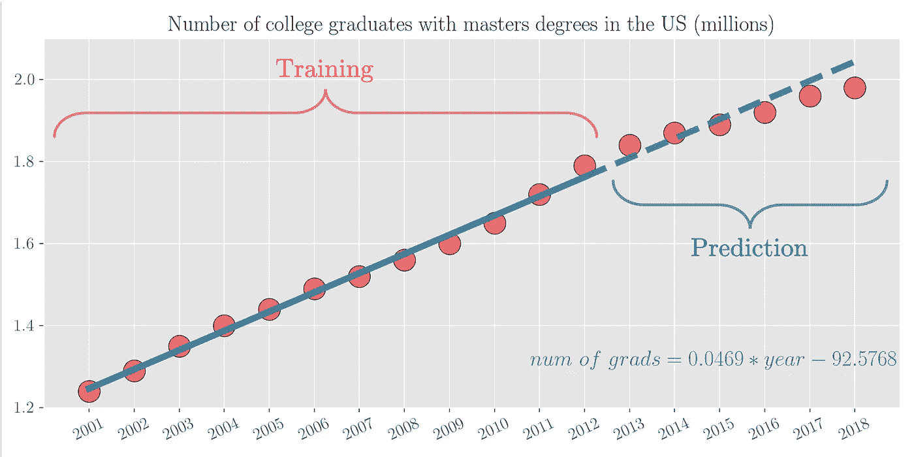

外推-预测未来看不见的价值-作者图片

## 从数学角度来说

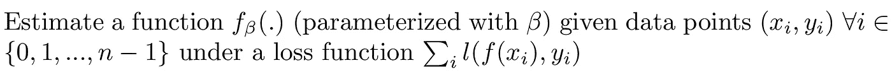

# 回归分析的类型

现在让我们来讨论一下进行回归的不同方法。基于函数族(f_beta)和使用的损失函数(l ),我们可以将回归分为以下几类。

## 1.线性回归

在线性回归中，目标是通过最小化每个数据点的均方误差的和来拟合超平面(2D 数据点的线)。

从数学上来说，线性回归解决了以下问题

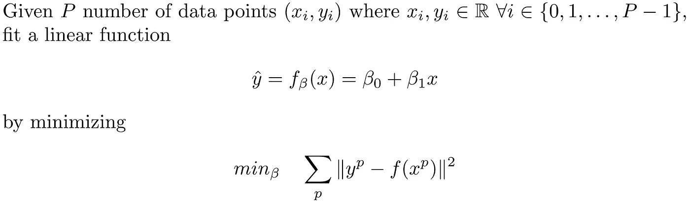

因此，我们需要找到 2 个用β表示的变量，它们将线性函数 f(参数化。).上图 4 中可以看到一个线性回归的例子，其中 P=5。该图还显示了β_ 0 =-90.798 和β_ 1 = 0.046 的拟合线性函数

## 2.多项式回归

线性回归假设因变量(y)和自变量(x)之间的关系是线性的。当数据点之间的关系不是线性时，它无法拟合数据点。多项式回归通过将 m 次多项式拟合到数据点来扩展线性回归的拟合能力。所考虑的函数越丰富，它的拟合能力就越好。从数学上讲，多项式回归解决了以下问题。

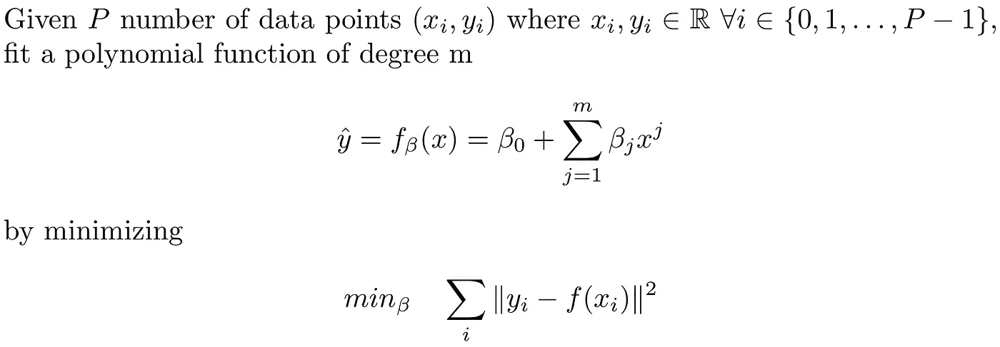

多项式回归的数学公式——作者图片

因此我们需要找到用β_ 0，…，β_ m 表示的(m+1)个变量。可以看出，线性回归是二次多项式回归的一个特例。

考虑下面一组绘制成散点图的数据点。如果我们使用线性回归，我们得到的拟合显然无法估计数据点。但是如果我们使用 6 次多项式回归，我们会得到更好的拟合，如下所示

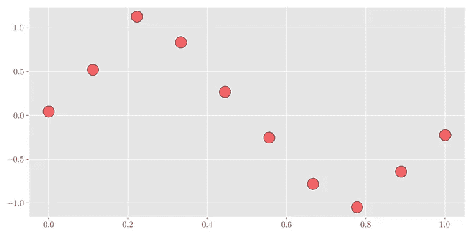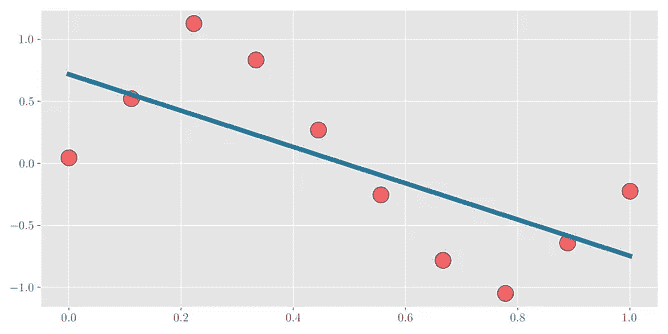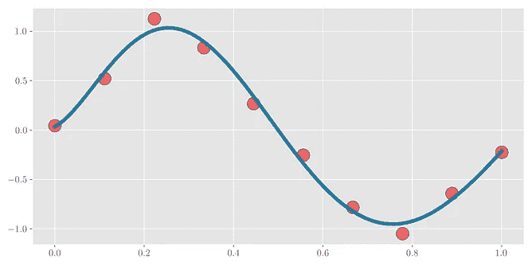

**【左】**数据散点图— **【中心】**对数据的线性回归— **【右】**6 次多项式回归

由于数据点在因变量和自变量之间没有线性关系，线性回归无法估计良好的拟合函数。另一方面，多项式回归能够捕捉非线性关系。

## 3.里脊回归

岭回归解决了回归分析中的过度拟合问题。为了理解这一点，考虑与上面相同的例子。当在具有 10 个训练点的数据上拟合 25 次多项式时，可以看出它完美地拟合了红色数据点(下图中心)。但是这样做，它会损害中间的其他点(最后两个数据点之间的尖峰)。这一点可以从下图中看出。岭回归试图解决这个问题。它试图通过折衷训练点的拟合来最小化泛化误差。

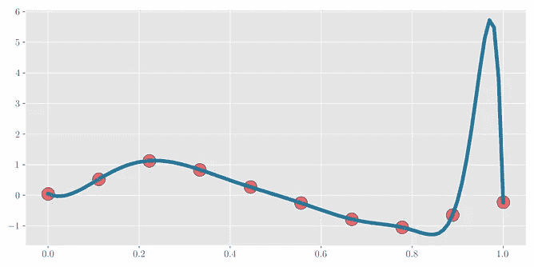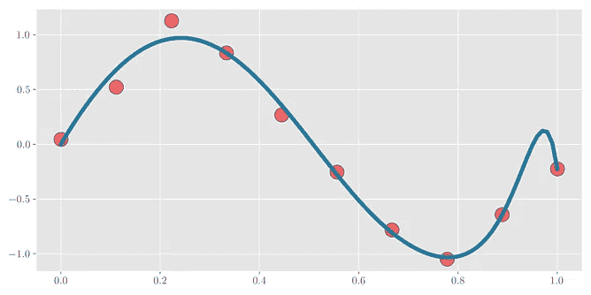

**【左】**数据散点图— **【中心】**25 次多项式回归— **【右】**25 次多项式岭回归

从数学上讲，岭回归通过修改损失函数解决了以下问题。

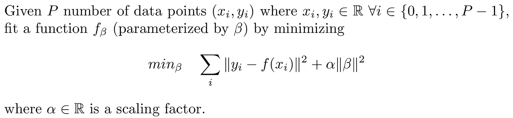

函数 f(x)可以是线性的，也可以是多项式的。在没有岭回归的情况下，当函数过度拟合数据点时，学习到的权重往往相当高。岭回归通过在损失函数中引入权重(β)的缩放 L2 范数来限制正在学习的权重的范数，从而避免过拟合。因此，训练的模型在完美拟合数据点(学习的权重的大范数)和限制权重的范数之间进行权衡。比例常数α> 0 用于控制这种折衷。较小的 alpha 值将导致较高的范数权重和过拟合训练数据点。另一方面，大的 alpha 值将导致函数与训练数据点的拟合较差，但权重的范数非常小。仔细选择α的值将产生最佳的折衷。

## 4.套索回归

套索回归类似于岭回归，因为两者都被用作正则项来防止训练数据点上的过度拟合。但是套索还有一个额外的好处。它加强了学习权重的稀疏性。

岭回归将学习到的权重的范数强制为小，产生一组总范数减小的权重。大多数权重(如果不是全部的话)将是非零的。另一方面，LASSO 试图通过使大部分权重真正接近于零来找到一组权重。这产生了稀疏权重矩阵，其实现可以比非稀疏权重矩阵更节能，同时在拟合数据点方面保持相似的精度。

下图试图在上面的同一个例子中形象化这个想法。使用岭回归和套索回归来拟合数据点，并且以升序绘制它们相应的拟合和权重。可以看出，套索回归中的大部分权重确实接近于零。

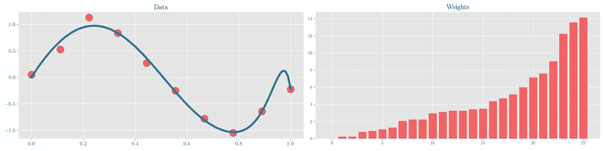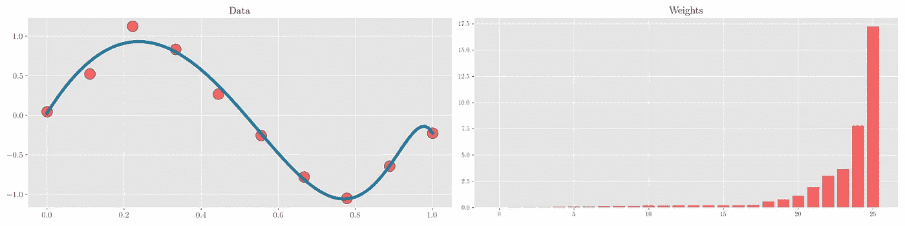

作者图片

从数学上讲，LASSO 回归通过修改损失函数解决了以下问题。

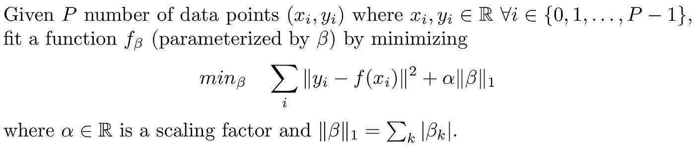

LASSO 和岭回归的区别在于 LASSO 使用权重的 L1 范数而不是 L2 范数。损失函数中的这种 L1 范数倾向于增加学习到的权重的稀疏性。关于它如何加强稀疏性的更多细节可以在下面文章的章节 ***L1 正则化*** 中找到。

 [## 机器学习中的正则化类型

### 机器学习正则化初学者指南。

towardsdatascience.com](/types-of-regularization-in-machine-learning-eb5ce5f9bf50) 

常数α> 0 用于控制学习权重中拟合和稀疏度之间的折衷。较大的α值会导致较差的拟合，但会导致学习到的权重集更稀疏。另一方面，较小的 alpha 值导致训练数据点的紧密拟合(可能会导致过度拟合)，但权重集不太稀疏。

## 5.弹性网络回归

ElasticNet 回归是脊和套索回归的组合。损失项包括权重的 L1 和 L2 范数以及它们各自的标度常数。它通常用于解决套索回归的局限性，例如非凸性。ElasticNet 增加了权重的二次惩罚，使其主要为凸形。

从数学上来说，ElasticNet 回归通过修改损失函数解决了以下问题。

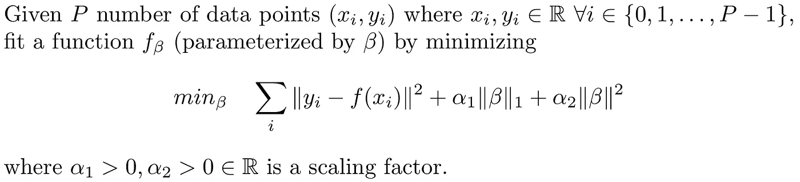

## 6.贝叶斯回归

对于上面讨论的回归(frequentists 方法)，目标是找到一组解释数据的确定性权重值(β)。在贝叶斯回归中，我们不是为每个权重找到一个值，而是试图在假设先验的情况下找到这些权重的分布。

因此，我们从权重的初始分布开始，并根据数据，利用贝叶斯定理将分布推向正确的方向，贝叶斯定理基于可能性和证据将先验分布与后验分布相关联。

当我们有无限个数据点时，权重的后验分布在普通最小二乘解的解处变成一个脉冲，即方差接近零。

找到权重的分布而不是一组确定性值有两个目的

1.  它自然可以防止过度拟合的问题，因此可以作为一个正则项
2.  它提供了信心和权重范围，这比只返回一个值更有逻辑意义。

让我们用数学方法来表述这个问题，并说明它的解决方法。

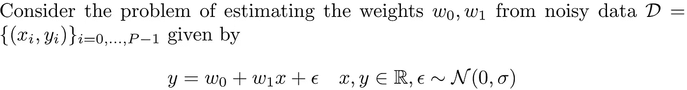

让我们对具有均值 **μ** 和协方差**σ**的权重进行高斯先验，即

基于可用的数据 D，我们更新这个分布。对于手头的问题，后验概率将是具有以下参数的高斯分布

详细的数学解释可以在[这里](https://cedar.buffalo.edu/~srihari/CSE574/Chap3/3.4-BayesianRegression.pdf)找到

让我们通过观察顺序贝叶斯线性回归，一次更新一个数据点的权重分布，来直观地理解它。如下图

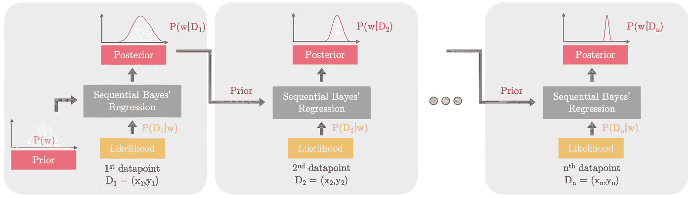

贝叶斯回归基于输入数据(x，y)-作者提供的图片，在正确的方向上推动后验分布

随着每个数据点的包含，权重的分布变得更接近实际的基本分布。

下面的动画绘制了原始数据、预测的四分位间距、权重的边际后验分布以及考虑单个新数据点时每个时间步长的权重联合分布。可以看出，随着我们包括更多的点，四分位范围变得更窄(绿色阴影区域)，边际分布分布在两个权重参数周围，方差接近零，联合分布在实际权重处收敛。

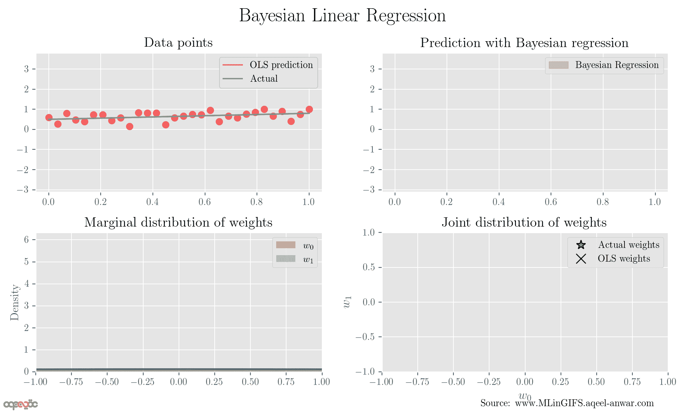

动画贝叶斯回归——来源:[www.MLinGIFS.aqeel-anwar.com](http://www.MLinGIFS.aqeel-anwar.com)

## 7.逻辑回归

在输出需要是给定输入的输出的条件概率的分类任务中，逻辑回归很方便。从数学角度来说，逻辑回归解决了以下问题

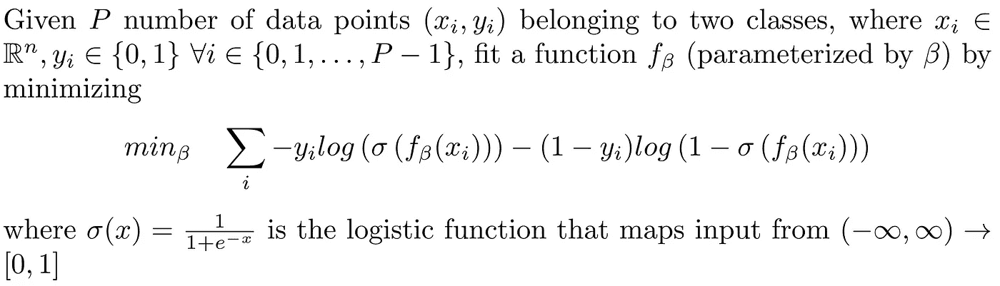

考虑下面的例子，其中数据点属于两个类别之一:{0(红色)，1(黄色)}，如下面的散点图所示。

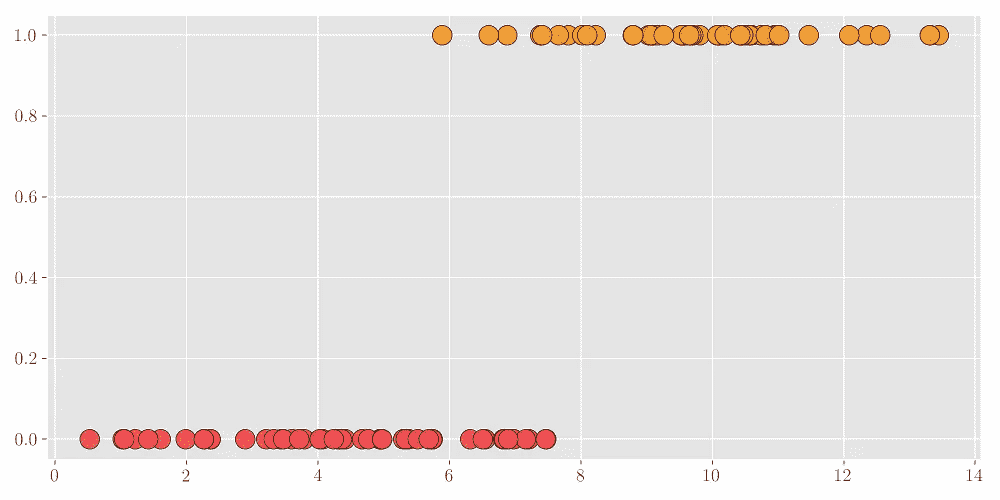

[左]数据点散点图—[右]对以蓝色绘制的数据点进行逻辑回归

逻辑回归在线性或多项式函数的输出端使用 sigmoid 函数，将(♾️-♾️)的输出映射到(0，1)。然后使用阈值(通常为 0.5)将测试数据分为两类。

> 这看起来像是逻辑回归不是回归而是一种分类算法。但事实并非如此。你可以在艾德里安的帖子里找到更多关于 T2 的信息。

# 摘要

在本文中，我们研究了回归分析中的各种方法，它们的动机是什么以及如何使用它们。下面的表格和备忘单总结了上面讨论的不同方法。

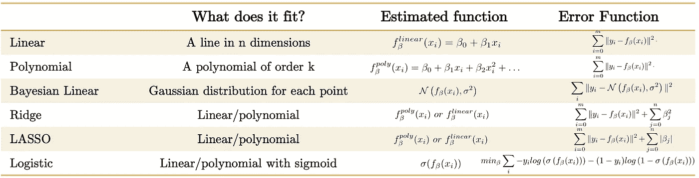

回归分析摘要-按作者分类的图片

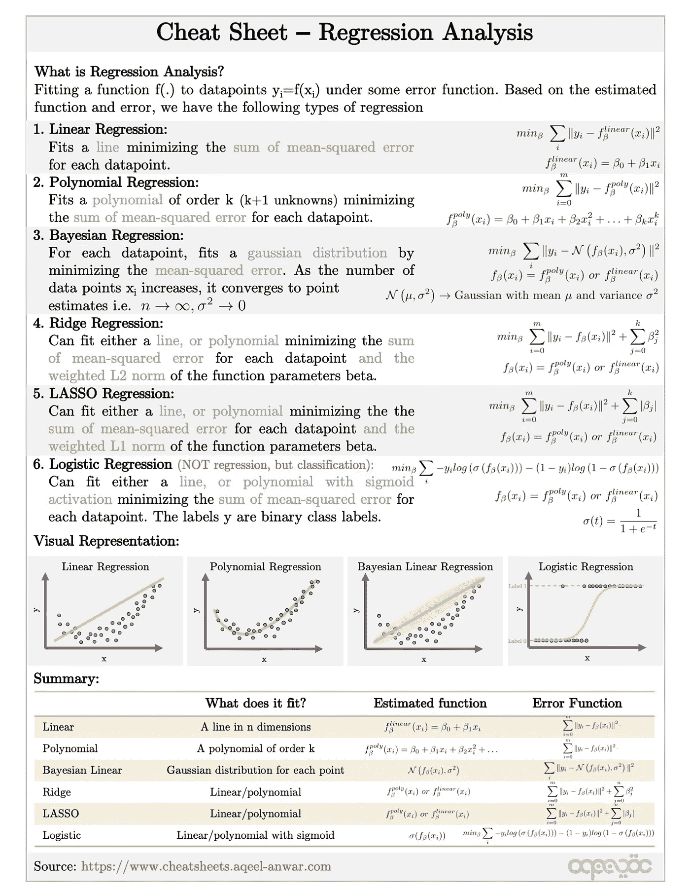

来源:http://www.cheatsheets.aqeel-anwar.com

# 奖金:

可以在下面的链接中找到这个主题和机器学习中许多其他重要主题的紧凑备忘单

 [## 机器学习面试主题的备忘单

### ML 面试的视觉备忘单(www.cheatsheets.aqeel-anwar.com)

medium.com](https://medium.com/swlh/cheat-sheets-for-machine-learning-interview-topics-51c2bc2bab4f) 

如果这篇文章对你有帮助，欢迎鼓掌、分享和回复。如果想了解更多关于机器学习和数据科学的知识，关注我[**Aqeel an war**](https://medium.com/u/a7cc4f201fb5?source=post_page-----8a828b491bbf--------------------------------)**，或者在**[***LinkedIn***](https://www.linkedin.com/in/aqeelanwarmalik/)***上联系我。***