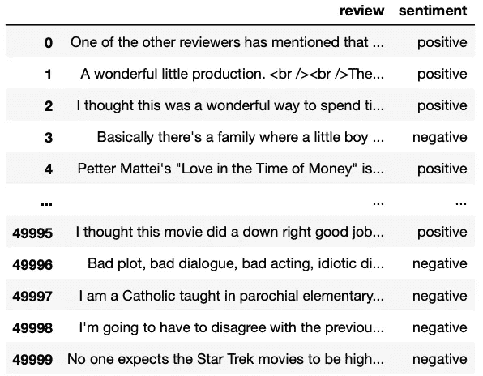
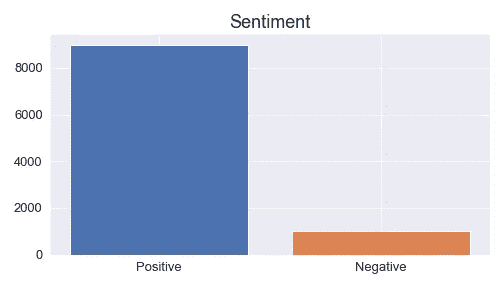
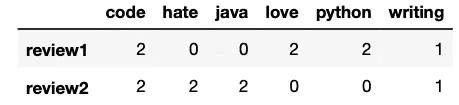
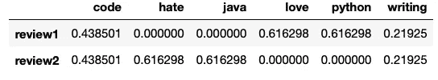

# Scikit-Learn 简单指南—用 Python 构建机器学习模型

> 原文：<https://towardsdatascience.com/a-beginners-guide-to-text-classification-with-scikit-learn-632357e16f3a?source=collection_archive---------0----------------------->

## Python 中的第一个 ML 模型。


[UliSchu](https://pixabay.com/users/ulischu-1993560/) 在 [Pixabay](https://pixabay.com/photos/organization-register-folder-files-1205171/) 拍摄的照片

如果你正在学习 Python，并且想开发一个机器学习模型，那么你要认真考虑的库是 scikit-learn。Scikit-learn(也称为 sklearn)是 Python 中使用的一个机器学习库，它提供了许多无监督和有监督的学习算法。

在这个简单的指南中，我们将创建一个机器学习模型，它将预测电影评论是正面还是负面的。这被称为二进制文本分类，将帮助我们探索 scikit-learn 库，同时从头构建一个基本的机器学习模型。这些是我们将在本指南中学习的主题。

```
**Table of Contents** 1\. [The Dataset and The Problem to Solve](#f4a3)
2\. [Preparing The Data](#8da5)
 - [Reading the dataset](#f171)
 - [Dealing with Imbalanced Classes](#c614)
 - [Splitting data into train and test set](#610e)
3\. [Text Representation (Bag of Words)](#3283)
 - [CountVectorizer](#867e)
 - [Term Frequency, Inverse Document Frequency (TF-IDF)](#e16b)
 - [Turning our text data into numerical vectors](#0085)
4\. [Model Selection](#660b)
 - [Supervised vs Unsupervised learning](#4584)
 - [Support Vector Machines (SVM)](#1629)
 - [Decision Tree](#1a0d)
 - [Naive Bayes](#68b4)
 - [Logistic Regression](#e482)
5\. [Model Evaluation](#0364)
 - [Mean Accuracy](#42ef)
 - [F1 Score](#05ec)
 - [Classification report](#4716)
 - [Confusion Matrix](#02ad)
6\. [Tuning the Model](#9f73)
 - [GridSearchCV](#bc36)
```

# 数据集和要解决的问题

在本指南中，我们将使用在 [Kaggle](https://www.kaggle.com/lakshmi25npathi/imdb-dataset-of-50k-movie-reviews) 上提供的 50k 条电影评论的 IMDB 数据集。数据集包含两列(评论和观点),这将帮助我们确定评论是积极的还是消极的。

**问题公式化**:我们的目标是在给定一个电影评论(输入)的情况下，找到哪个机器学习模型最适合预测情绪(输出)。

# 准备数据

## 读取数据集

下载数据集后，确保文件与 Python 脚本位于同一位置。然后，我们将使用 Pandas 库来读取该文件。

```
import pandas as pddf_review = pd.read_csv('IMDB Dataset.csv')
df_review
```

*注意:如果您没有本指南中使用的一些库，您可以在终端或命令提示符下轻松安装带有 pip 的库(例如* `pip install scikit-learn)`

数据集如下图所示。



作者图片

该数据集包含 50000 行；然而，**为了在接下来的步骤中更快地训练我们的模型，我们将采用 10000 行的较小样本。这个小样本将包含 9000 个正面和 1000 个负面评论，以使数据不平衡**(所以我可以在下一步教你欠采样和过采样技术)

我们将用下面的代码创建这个小样本。这个不平衡数据集的名称将是`df_review_imb`

```
df_positive = df_review[df_review['sentiment']=='positive'][:9000]
df_negative = df_review[df_review['sentiment']=='negative'][:1000]df_review_imb = pd.concat([df_positive, df_negative])
```

## 处理不平衡的班级

在大多数情况下，一个类有大量的数据，而其他类的观察数据要少得多。这就是所谓的不平衡数据，因为每个类的观测值数量不是均匀分布的。

让我们看看我们的`df_review_imb` 数据集是如何分布的。



作者图片

正如我们所见，在`df_review_imb`中正面评价多于负面评价，所以我们有不平衡的数据。

为了对数据进行重采样，我们使用了`imblearn`库。您可以对正面评价进行欠采样，也可以对负面评价进行过采样(您需要根据您正在处理的数据进行选择)。在这种情况下，我们将使用`RandomUnderSampler`

首先，我们创建一个新的`RandomUnderSampler (rus)`实例，我们添加`random_state=0` 只是为了控制算法的随机化。然后，我们通过用`rus.fit_resample(x, y)`拟合`rus`对不平衡数据集`df_review_imb` 进行重新采样，其中“x”包含必须采样的数据，而“y”对应于“x”中每个样本的标签。

在此之后，`x`和`y` 被平衡，我们将它存储在一个名为`df_review_bal.` 的新数据集中。我们可以用下面的代码比较不平衡和平衡的数据集。

```
IN [0]: print(df_review_imb.value_counts(‘sentiment’))
        print(df_review_bal.value_counts(‘sentiment’))OUT [0]:positive    9000
        negative    1000

        negative    1000
        positive    1000
```

如我们所见，现在我们的数据集是平均分布的。

注 1:如果使用`RandomUnderSampler`时出现以下错误

> IndexError:只有整数、切片(`:`)、省略号(`…`)、numpy.newaxis (`None `)和整数或布尔数组是有效的索引

您可以使用`RandomUnderSampler`的替代产品。尝试下面的代码:

如上所示，`df_review_bal`数据框架现在应该有 1000 条正面和负面评论。

*注 2:通常在将数据分成训练集和测试集之前，我们应该清理数据。在本例中，数据已经被清除；然而，现实世界中的数据是不干净的，所以每当你需要清理数据时，请查看下面的指南，了解 Python 中数据清理的最佳实践。*

</a-straightforward-guide-to-cleaning-and-preparing-data-in-python-8c82f209ae33>  

## 将数据分为训练集和测试集

在我们处理数据之前，我们需要将它分成训练集和测试集。`train`数据集将用于拟合模型，而`test`数据集将用于在训练数据集上提供最终模型拟合的无偏评估。

我们将使用 sklearn 的`train_test_split`来完成这项工作。在这种情况下，我们将测试数据设置为 33%。

```
from sklearn.model_selection import train_test_splittrain, test = train_test_split(df_review_bal, test_size=0.33, random_state=42)
```

现在，我们可以在训练和测试集内设置自变量和因变量。

```
train_x, train_y = train['review'], train['sentiment']
test_x, test_y = test['review'], test['sentiment']
```

让我们看看它们各自的含义:

*   **train_x:** 将用于训练模型的独立变量(review)。由于我们指定了`test_size = 0.33`，来自数据的 67%的观察值将用于拟合模型。
*   **train_y:** 该模型需要预测的因变量(情绪)或目标标签。
*   **test_x:** 剩余的`33%`个独立变量，将用于进行预测，以测试模型的准确性。
*   **test_y:** 类别标签，将用于测试实际类别和预测类别之间的准确性。

# 文本表示(单词包)

分类器和学习算法期望数字特征向量，而不是原始文本文档。这就是为什么我们需要把我们的电影评论文本变成数字向量。有许多文本表示技术，如一键编码、单词包和 wor2vec。

对于这个简单的例子，我们将使用单词包(BOW ),因为我们关心文本评论中单词的频率；然而，单词的顺序无关紧要。表示单词包的两种常见方式是计数矢量器和词频、逆文档频率(TF-IDF)。在我们选择它们之前，我会给你一个简单易懂的演示，告诉你它们是如何工作的。

## 计数矢量器

CountVectorizer 给出了单词在文档中出现的频率。让我们考虑下面的句子。

```
review = [“I love writing code in Python. I love Python code”,
          “I hate writing code in Java. I hate Java code”]
```

CountVectorizer 的表示如下所示，



作者图片

如你所见，矩阵中的数字代表每个单词在每次评论中被提及的次数。在这个例子中，像“爱”、“恨”和“代码”这样的词有相同的频率(2)。

## 术语频率，逆文档频率(TF-IDF)

TF-IDF 计算“权重”,它表示一个单词对文档集合(也称为语料库)中的一个文档有多重要。TF-IDF 值与单词在文档中出现的次数成比例地增加，并被语料库中包含该单词的文档的数量所抵消。

TF-IDF 的表示看起来像下面的图片，是我们之前使用的相同文本。



作者图片

与前面的例子不同，单词“code”与单词“love”或“hate”的权重不同。这是因为“代码”出现在两个评审中；因此，它的重量减少了。

## 将文本数据转化为数字向量

在我们的原始数据集中，我们希望识别正面评论和负面评论的唯一/代表性单词，因此我们将选择 TF-IDF。为了使用 TF-IDF 将文本数据转换成数字向量，我们编写了以下代码。

```
from sklearn.feature_extraction.text import TfidfVectorizertfidf = TfidfVectorizer(stop_words='english')
train_x_vector = tfidf.fit_transform(train_x)
train_x_vectorOut[0]: <1340x20625 sparse matrix of type '<class 'numpy.float64'>'
	with 118834 stored elements in Compressed Sparse Row format>
```

在上面的代码中，我们创建了一个新的`TfidfVectorizer(tfidf)`实例，我们删除了英文停用词，然后拟合(查找模型的内部参数)并转换(将参数应用于数据)train_x(文本评论)

我们刚刚创建的`train_x_vector`是一个稀疏矩阵，有 1340 条评论和 20625 个单词(评论中使用的整个词汇)。您可以用下面的代码显示这个矩阵，就像我在上面的例子中使用的图片一样

```
pd.DataFrame.sparse.from_spmatrix(train_x_vector,
                                  index=train_x.index,
                                  columns=tfidf.get_feature_names())
```

但是，请记住，您会发现大量的“0 ”,因为它是一个具有 1340x20625 个元素的稀疏矩阵，其中只有 118834 个元素不同于“0”

最后，让我们也转换一下`test_x_vector`，这样我们可以稍后测试模型的准确性(我们不需要再次拟合`tfidf` ，因为我们已经用训练数据拟合过了。)

```
test_x_vector = tfidf.transform(test_x)
```

*注意:我们可以更好地准备文本数据，以便通过使用标记化和移除我们认为不相关的多余单词(除了 CountVectorizer 和 Tfidf 默认具有的停用词表之外)来开发更好的模型。有关使用 Python 进行标记化的更多信息，请查看下面的文章。*

</5-simple-ways-to-tokenize-text-in-python-92c6804edfc4>  

# 型号选择

现在我们有了数字数据，我们可以用不同的机器学习模型进行实验，并评估它们的准确性。

## 监督与非监督学习

机器学习算法分为有监督学习和无监督学习。在第一种模式中，使用标记数据训练模型，而在第二种模式中，从未标记的输入数据中推断模式。

在我们的例子中，我们的输入(评论)和输出(情绪)被清楚地识别，所以我们可以说我们已经标记了输入和输出数据；因此，我们正在处理监督学习。两种常见的监督学习算法是回归和分类。

*   **回归**:它们用于预测**连续值**，如价格、工资、年龄等
*   **分类**:用于预测**离散值**，如男性/女性、垃圾/非垃圾、正/负等。

也就是说，现在很明显我们应该使用分类算法。我们将对以下四个分类模型进行基准测试。

*注意:我将把每个模型背后的理论留给你去研究。我将把重点放在代码上，以及我们如何根据分数选择最佳模型。*

## 支持向量机(SVM)

为了适应 SVM 模型，我们需要引入输入(作为数字向量的文本评论)和输出(情感)

```
from sklearn.svm import SVCsvc = SVC(kernel=’linear’)
svc.fit(train_x_vector, train_y)
```

拟合`svc` 后，我们可以用`.predict()` 方法预测评论是正面还是负面。

```
print(svc.predict(tfidf.transform(['A good movie'])))
print(svc.predict(tfidf.transform(['An excellent movie'])))
print(svc.predict(tfidf.transform(['I did not like this movie at all'])))
```

如果您运行上面的代码，您将获得第一个和第二个评论是正面的，而第三个是负面的。

## 决策图表

为了适应决策树模型，我们需要引入输入(作为数字向量的文本评论)和输出(情感)

```
from sklearn.tree import DecisionTreeClassifierdec_tree = DecisionTreeClassifier()
dec_tree.fit(train_x_vector, train_y)
```

## 朴素贝叶斯

为了适应朴素贝叶斯模型，我们需要引入输入(作为数字向量的文本评论)和输出(情感)

```
from sklearn.naive_bayes import GaussianNBgnb = GaussianNB()
gnb.fit(train_x_vector.toarray(), train_y)
```

## 逻辑回归

为了拟合逻辑回归模型，我们需要引入输入(作为数字向量的文本评论)和输出(情感)

```
from sklearn.linear_model import LogisticRegressionlog_reg = LogisticRegression()
log_reg.fit(train_x_vector, train_y)
```

# 模型评估

在本节中，我们将看到用于评估模型的传统指标。

## 平均准确度

要获得每个模型的平均准确度，只需使用如下所示的测试样本和真实标签的`.score`方法。

```
# svc.score('Test samples', 'True labels')svc.score(test_x_vector, test_y)
dec_tree.score(test_x_vector, test_y)
gnb.score(test_x_vector.toarray(), test_y)
log_reg.score(test_x_vector, test_y)
```

在打印出每一个之后，我们得到平均精度。

**SVM: 0.84**
决策树:0.64
朴素贝叶斯:0.63
逻辑回归:0.83

SVM 和逻辑回归比其他两个分类器表现更好，SVM 略有优势(84%的准确率)。**为了展示其他指标的工作原理，我们将只关注 SVM。**

## F1 分数

F1 分数是精确度和召回率的加权平均值。当真阳性和真阴性更重要时使用准确度，而当假阴性和假阳性至关重要时使用 F1 分数。此外，F1 还考虑了数据的分布方式，因此当您有不平衡类的数据时，F1 非常有用。

F1 分数通过以下公式计算。(如果你不知道精度和召回意味着什么，查看一下这个关于 [stackoverflow](https://stackoverflow.com/questions/14117997/what-does-recall-mean-in-machine-learning) 的精彩解释)

```
F1 Score = 2*(Recall * Precision) / (Recall + Precision)F1 score reaches its best value at 1 and worst score at 0.
```

为了获得 F1 分数，我们需要真实标签和预测标签`f1_score(y_true, y_pred)`

```
from sklearn.metrics import f1_scoref1_score(test_y, svc.predict(test_x_vector),
         labels=['positive', 'negative'],
         average=None)
```

阳性标签的得分为 0.84，而阴性标签的得分为 0.83。

## 分类报告

我们还可以构建一个文本报告，显示主要的分类指标，包括之前计算的指标。为了获得分类报告，我们需要真实标签和预测标签`classification_report(y_true, y_pred)`

```
from sklearn.metrics import classification_reportprint(classification_report(test_y, 
                            svc.predict(test_x_vector),
                            labels=['positive', 'negative']))
```

打印后，我们获得以下报告。

```
 precision    recall  f1-score   support

    positive       0.83      0.87      0.85       335
    negative       0.85      0.82      0.83       325

    accuracy                           0.84       660
   macro avg       0.84      0.84      0.84       660
weighted avg       0.84      0.84      0.84       660
```

正如我们所见，精确度和 f1 分数与之前计算的相同。

## 混淆矩阵

混淆矩阵)是允许算法性能可视化的表格。该表通常有两行和两列，报告假阳性、假阴性、真阳性和真阴性的数量(如果您不理解这些术语，请查看此[链接](https://stackoverflow.com/questions/14117997/what-does-recall-mean-in-machine-learning)中的图表)

为了获得混淆矩阵，我们需要真实标签和预测标签。

```
from sklearn.metrics import confusion_matrixconf_mat = confusion_matrix(test_y, 
                            svc.predict(test_x_vector), 
                            labels=['positive', 'negative'])
```

运行下面的代码后，我们将获得下面的数组作为输出。

```
array([[290,  45],
       [ 60, 265]])
```

要理解这意味着什么，请查看下面的图片。


如您所见，数组的每个元素代表混淆矩阵中的四个方块之一(例如，我们的模型检测到 290 个真阳性)

# 调整模型

最后，是时候最大化我们模型的性能了。

## GridSearchCV

这种技术包括对特定参数的彻底搜索，以便获得超参数的最佳值。为此，我们编写以下代码。

```
from sklearn.model_selection import GridSearchCV#set the parameters
parameters = {‘C’: [1,4,8,16,32] ,’kernel’:[‘linear’, ‘rbf’]}
svc = SVC()
svc_grid = GridSearchCV(svc,parameters, cv=5)

svc_grid.fit(train_x_vector, train_y)
```

正如你所看到的代码，它与我们为适应 SVM 模型而编写的代码没有太大的不同；然而，现在我们指定一些参数来获得最佳模型。

在拟合模型之后，我们用下面的代码获得了最好的分数、参数和估计量。

```
IN [0]: print(svc_grid.best_params_)
        print(svc_grid.best_estimator_)OUT [0]: {'C': 1, 'kernel': 'linear'}
         SVC(C=1, kernel='linear')
```

*就是这样！现在您已经准备好使用 sklearn 创建自己的机器学习模型了！本指南所写的所有代码都可以在我的* [*Github*](https://github.com/ifrankandrade/data-science-projects.git) *上找到。*

下面你可以找到一些我用 Python 做过的项目。

<https://medium.datadriveninvestor.com/can-we-beat-the-bookies-predicting-football-games-with-a-simple-model-43fe020fb384>  <https://medium.com/swlh/web-scraping-basics-scraping-a-betting-site-in-10-minutes-8e0529509848>  </the-best-movies-to-learn-english-according-to-data-science-2dccb4b3ee23>  

[**与 3k 以上的人一起加入我的电子邮件列表，获取我在所有教程中使用的 Python for Data Science 备忘单(免费 PDF)**](https://frankandrade.ck.page/bd063ff2d3)