# Django 面向数据科学家——Django 和 Django for 简介

> 原文：<https://towardsdatascience.com/a-beginners-guide-to-using-djangos-impressive-data-management-abilities-9e94efe3bd6e?source=collection_archive---------3----------------------->

## 使用 Django ORM 完成数据管理任务。甚至不需要启动任何 web 服务器。

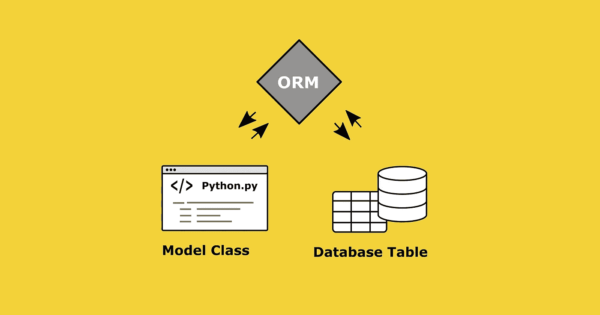

作者图片

Django 作为高级 Web 框架的广泛特性集可能会吓跑那些从未真正接触过 Web 开发的数据分析师和数据科学家。不幸的是，这可能会让他们无法体验 Django 令人印象深刻且易于使用的数据管理能力。

虽然大多数 Django 教程在几个小时的视频片段中涵盖了所有的功能，但我想集中强调一下 Django 强大的数据库交互特性，而不会让读者对几乎无限的特性集感到过载。本文应该尽可能简单地解释它，这样您就可以使用 Django 来完成您的数据管理任务，而不必了解 Django 的每一个细节。但是为什么要使用 Django 呢？

## 使用 Django 进行数据管理的 4 个简单原因:

1.  使用您熟悉的语言:Django ORM 允许您在不使用任何 SQL 命令的情况下与数据库进行交互
2.  一切尽在一处:在与数据库交互时，只需使用 Python 提供的惊人的数据处理、数据管理和数据可视化功能和模块
3.  Django 附带了一个强大的内置数据库管理 GUI——Django Admin
4.  如果你想将数据库中的数据可视化，并在应用程序中分享，Django 可以满足你的一切需求

# 目录

*   [简短介绍—什么是 Django 和 Django ORM？](#57b8)
*   [与您的数据库交互的先决条件—安装 Django，启动一个项目并将其连接到您的数据库](#10a9)
*   [在独立的 python 脚本中使用 Django ORM](#3d0d)
*   [简短介绍:作为 Web 框架的 Django](#d73a)
*   [Django Admin——用于数据管理的内置网络界面](#d720)
*   [总结](#cbdc)

# 简短介绍—什么是 Django 和 Django ORM？

Django 是一个 Python Web 框架，它帮助开发人员尽可能快地将应用程序从概念变为现实。像 Django 这样的高级框架为 web 开发提供了一套全面的特性，如 HTTP 应用服务器、数据库之类的存储机制、模板引擎、请求调度程序和认证模块。

正如我之前提到的，我试图将重点放在 Django 中允许您与关系数据库交互的部分，即**对象关系映射器(ORM)** 。ORM 为您提供了创建和操作数据库中的数据和表格的所有功能，而无需使用任何 SQL 命令。⁴

我试图用下图解释的是，每个 Django 应用程序都包括一个名为`mocels.py`的模块，它定义了您想要创建的数据库表的结构。为了将 Python 对象转换成数据库表，ORM 应运而生。ORM 负责与数据库的通信，包括将您定义的模型翻译成正确的数据库结构，以及执行任何数据库操作。

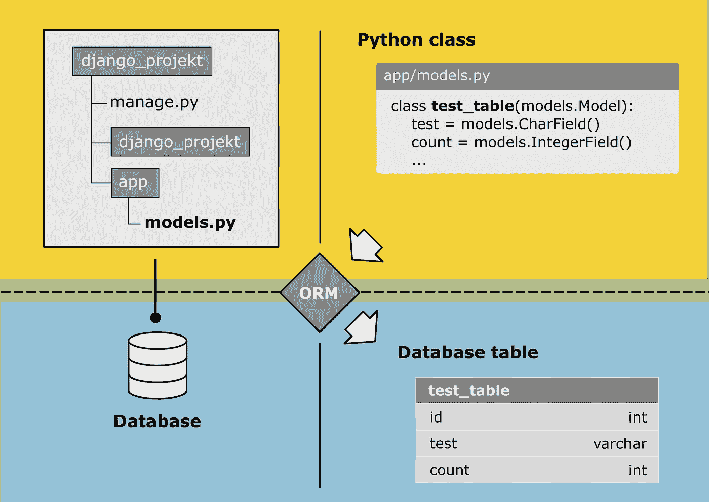

Django ORM:从 Python 类到数据库表——作者图片

# 与数据库交互的先决条件——安装 Django，启动一个项目并将其连接到数据库

如果您不熟悉 Django，可以用 pip 和下面的命令安装它:

```
python -m pip install Django
```

当您使用`Django-admin`开始一个新项目时，已经为您自动生成了许多文件和代码，为您提供了基本结构、示例模板和默认配置。在命令行中，导航到您想要用作项目文件夹位置的文件夹，并运行以下命令，以启动项目`data_management`:

```
django-admin startproject data_management
```

`Django-admin startproject`创建一组文件，主要决定 Django 项目的基本配置。因为我们将在下面主要使用 Django 的 ORM，我们现在可以忽略这些设置。

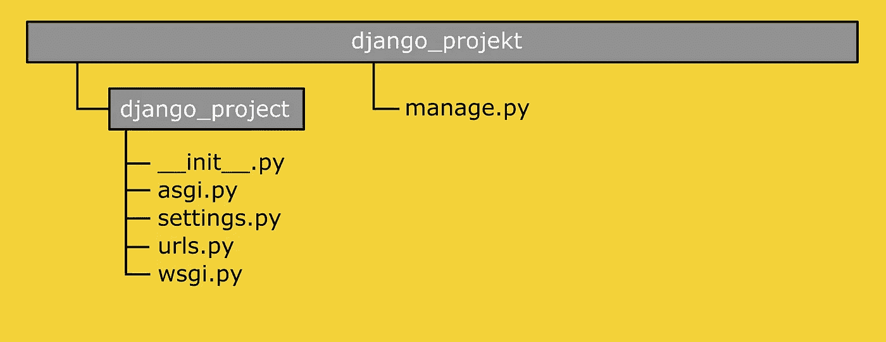

作者图片

您刚刚创建的项目文件夹代表了您要移入的环境。为了让您的项目能够真正做一些事情，您仍然需要实际的 web 应用程序。这是在`manage.py`的帮助下实现的，它让你有可能与你的项目互动。要创建您的第一个应用程序，只需确保您位于项目文件夹中，并执行以下命令:

```
python manage.py startapp data_processig
```

最后两步将创建以下项目结构。

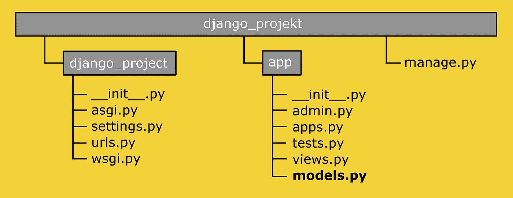

Django 项目文件夹结构—作者图片

要告诉您的项目使用哪些应用程序，您仍然需要在`settings.py`中注册您的应用程序。将创建的应用程序`data_processing_app`添加到列表`INSTALLED_APPS`中:

```
#settings.pyINSTALLED_APPS = [
    'django.contrib.admin’,
    'django.contrib.auth’,
    'django.contrib.contenttypes’,
    'django.contrib.sessions’,
    'django.contrib.messages’,
    'django.contrib.staticfiles’,
    'data_processing_app'
]
```

## 将 Django 连接到 MySQL

在我们深入了解 Django ORM 的更多细节之前，我们首先需要一个到我们选择的数据库的链接，在我的例子中是 MySQL。首先，我们需要确保安装了所需的 MySQL DB API 驱动程序。Django 推荐的选择是 [mysqlclient](https://pypi.org/project/mysqlclient/) 。⁵

```
pip install mysqlclient
```

在下面的代码中，您将 Django 链接到一个现有的数据库，因此您必须首先创建一个新的数据库/模式。我创建的模式的名称是`personal_dashboard`。

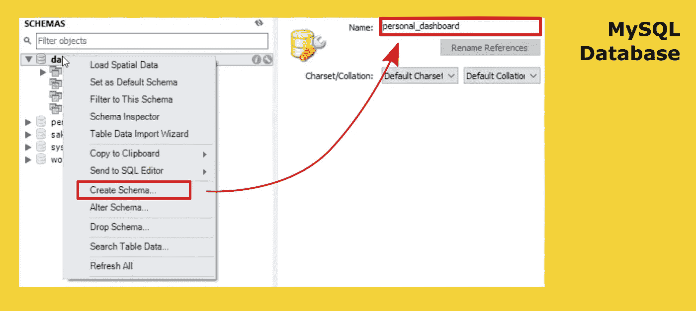

作者图片

要将 Django 连接到您的 MySQL 和正确的数据库，您必须在`settings.py`中定义连接参数:

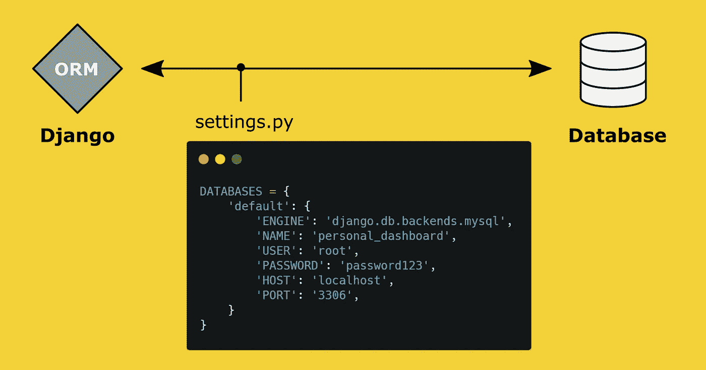

Django 设置:定义您想要使用的数据库—图片由作者提供

就是这样，姜戈应该连接到你的数据库！测试它的一个简单方法就是使用`python manage.py runserver`。这个命令将在本地机器上运行一个轻量级的开发 Web 服务器。在这个过程中，Django 会检查设置，并告诉您是否无法建立到数据库的连接。

## 创建第一个模型

去`models.py`创建一个新模型。该模型稍后将表示数据库中的表。为了让它更有趣一点，让我用一个例子来展示它。

我用一个叫做 [Toggl Track](https://toggl.com/) 的工具来跟踪我的工作时间。为了将这些记录用于我自己的可视化和计算，Toggl 提供了一个 API，允许我查询这些数据。API 返回的数据大致具有以下结构:

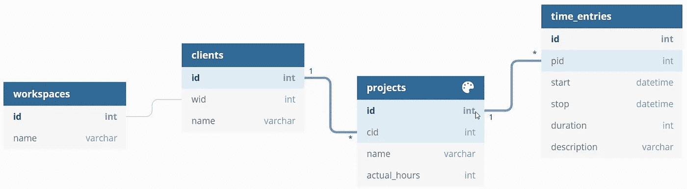

作者图片

在下文中，我将尝试在我自己的数据库中重现该结构。表 workspaces 只包含 workspace-id `wid`和工作空间的名称。要通过 Django 映射表，请转到`models.py`并创建一个新类。

首先创建一个保存工作空间信息的模型。稍后，您将在数据库表中找到 Python 类/模型的名称。创建的表格的全名由`<appname>_<modelname>`组成，对于这里显示的情况，表格采用以下名称:`data_processing_app_toggl_workspaces`

要向表中添加字段/列，请添加具有适当字段类型的字段。您可以在 [Django 文档](https://docs.djangoproject.com/en/3.1/ref/models/fields/)中找到所有字段类型的摘要。在这种情况下，我们只需要一个保存`workspaces`ID 的整数字段和一个保存工作空间名称的字符字段。要对数据库进行更改，您需要运行以下两个命令。

*   `python manage.py makemigrations`，它基于您对模型所做的更改来创建新的迁移
*   `python manage.py migrate`，应用迁移

在您成功执行这两个命令之后，表`data_processing_app_toggl_workspaces` 应该会出现在您的数据库中。

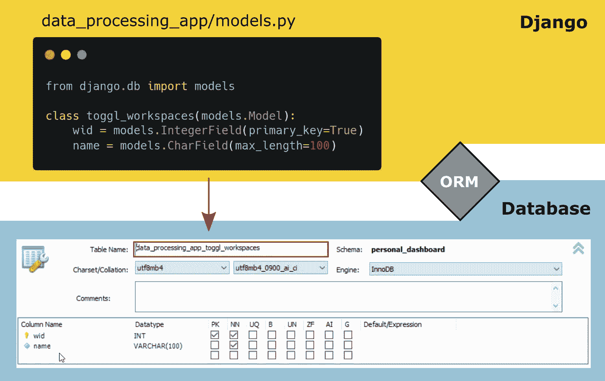

作者图片

接下来，我需要一个模型，稍后我将用`clients`模型填充它。每个客户端都被分配到一个工作区。由于每个工作空间通常有多个客户端，这是一个多对一的关系，它是在 Django 中使用`ForeignKey`字段建立的。

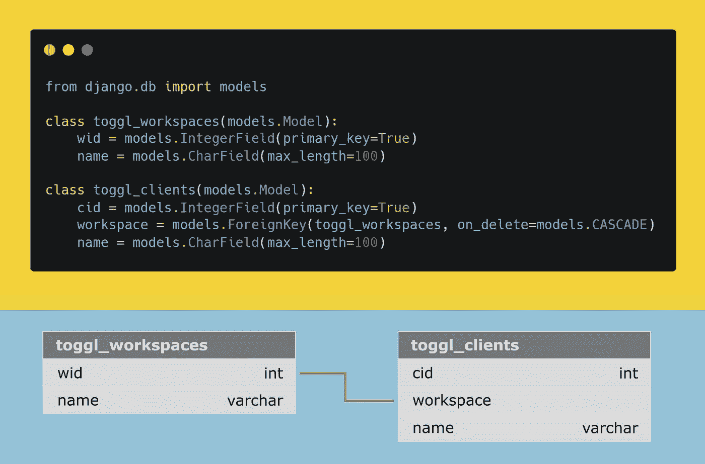

作者图片

类似地，执行其他表的创建和链接。下面的代码展示了所有必需的表到 Django 模型的映射。

# 用一个独立的脚本填充数据库

如果您想在没有 web 服务器的情况下使用 Django 功能，您必须将`settings.py`设置为环境变量并使其可访问。这可以通过在脚本的开头添加以下行来实现:

```
import os
import django

os.environ.setdefault('DJANGO_SETTINGS_MODULE', 'data_management.settings')
django.setup()
```

现在为刚刚生成的表`data_processing_app_toggl_workspaces`创建一个新条目，首先为您的`toggl_workspaces`类创建一个新对象:

```
new_workspace = models.toggl_workspaces(wid="12512465",
                                  name="test_workspace")
```

用`.save()`将新条目保存到数据库中。

```
new_workspaces.save()
```

以下脚本将样本数据框的内容存储在相应的表中。

为了能够在网站上显示、评估和可视化您的数据，下一段将向您展示 HTML 页面和数据库之间的通信是如何发生的。

# 简短介绍:作为 Web 框架的 Django

如前所述，在这里我不想太深入地把 Django 作为一个 web 框架。尽管如此，我认为对 Django 模块及其功能有一个共同的理解是有用的。下图描述了项目结构的各个组件是如何相互关联的。显示的请求-响应循环只显示了流程的简化形式，不包含使用的中间件，但它将刚刚创建的文件放入了一个粗略的上下文中。

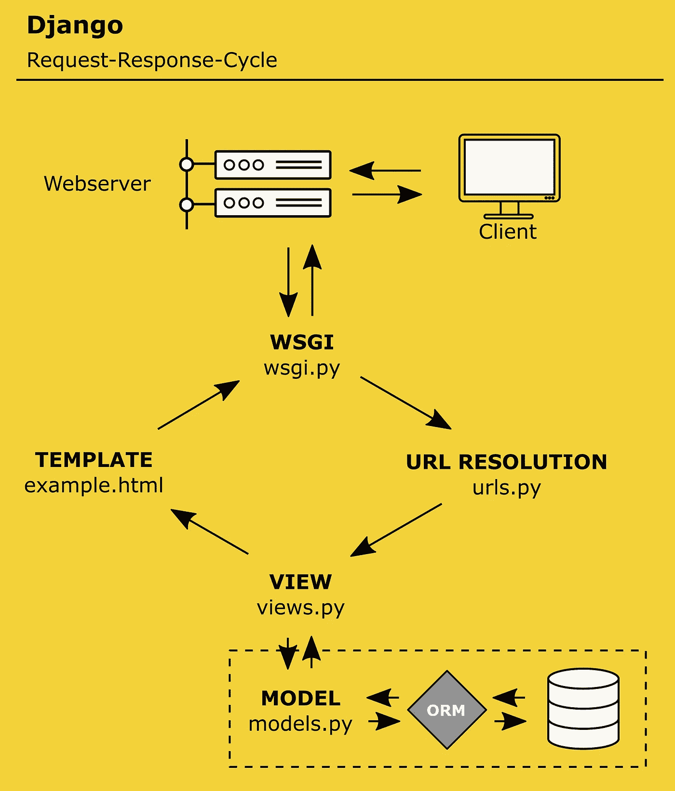

Django 请求-响应循环—作者图片

传入的请求主要由中间件处理，为了简单起见，图中省略了中间件。Django 已经包含了一些内置的中间件，比如 AuthenticationMiddleware、CsrfViewMiddleware 或 SessionMiddleware。每个人都负责一项特定的任务。⁶

您可以在`settings.py`中找到二手中间件列表:

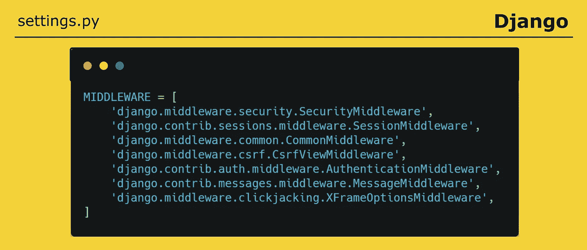

作者图片

在 WSGI (Web 服务器网关接口)和第一个 Middlewares⁷(如安全和认证中间件)之后，请求将到达 url 路由器，它使用 in `urls.py` 定义的变量`urlpatterns`并寻找与请求中的 URL 匹配的 urlpattern。⁸

如前所述，您可以使用命令`python manage.py runserver`在本地机器上启动一个 web 服务器。除非另有说明，否则本地 web 服务器运行在端口 8000 和地址 127.0.0.1 上。因此，如果您在浏览器中调用地址[http://127 . 0 . 0 . 1:8000/example](http://127.0.0.1:8000/example)，Django 会在 urlpatterns 列表中搜索条目‘example。本例中的 URL 路由器指向您第一个创建的应用程序`data_processing_app`中`views.py`中的函数`example`。

函数`render`用于组合给定的上下文字典和 HTML 模板，并返回一个`HttpResonse`。⁹在这个例子中，我将变量`test_string`传递给我的模板。或者，我有可能从我的数据库传递数据到我的 HTML 模板。我将在下面解释这是如何工作的。

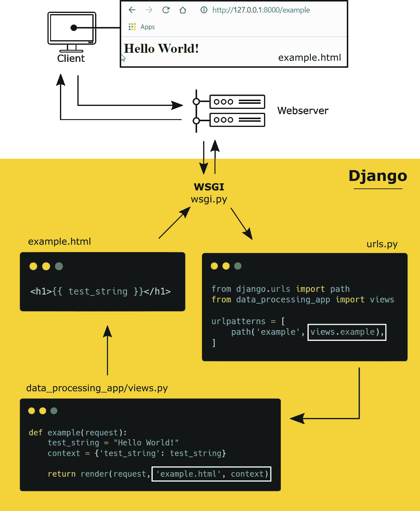

Django 请求-响应循环—作者图片

现在，从数据库中访问数据并在 HTML 模板中使用它变得非常简单。

## 从数据库中检索数据

为了能够在下面从数据库中检索数据，我们通过模型类上的管理器构造了一个 queryset。⁰管理器描述了允许你执行数据库查询操作的界面。每种型号至少有一个名为`objects`的经理。

要返回数据库中的所有对象，使用`all()`方法。因此，如果您将`all()`方法应用于模型`time_entries`的`objects`管理器，您将获得一个包含数据库中所有条目的 QuerySet。

```
import data_processing_app.models as modelsQuerySet = models.time_entries.objects.all()
```

要构建和测试您的查询，您可以使用`manage.py shell`。使用命令`python manage.py shell`启动一个新的 shell 后，您需要导入您的模型(`import data_processing_app.models as models`)。现在，您可以创建一个新的查询集。

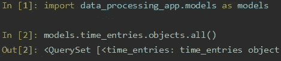

作者图片

为了能够在 HTML 页面上显示这个查询，您必须将它包含在您的请求的上下文中。为此，在视图的相应函数中包含字典`context`中的 QuerySet 就足够了。在您的 HTML 中，您可以使用`{{ <variable_name> }}`简单地输出传递的值。

下图显示了我们使用的示例。

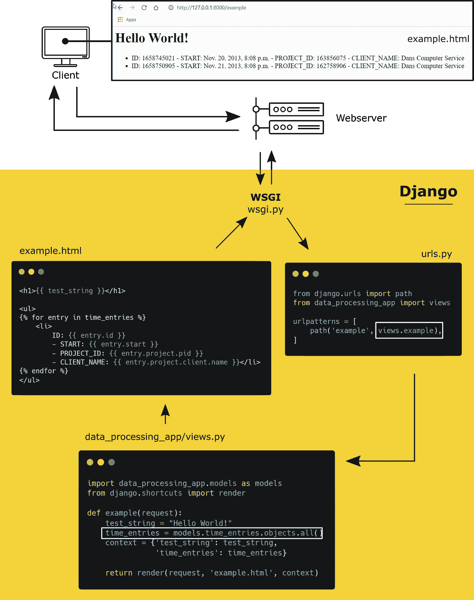

Django 请求-响应循环—作者图片

Django 附带了许多操作和创建 QuerySets 的方法。您将在 [Django 文档](https://docs.djangoproject.com/en/3.1/topics/db/queries/)中找到全面的文档。提前这么多，几乎没有什么是不可能的。查询可以根据需要进行扩展和细化。

这里只是一个例子，我用它来过滤客户端`Dans Computer Service`在`time_entries`中的条目，然后按日历周对客户端的所有条目的持续时间求和。通过这种方式，我可以计算出我每周为某个客户工作的时间。

第一步是通过表`toggl_clients`中的字段`name`过滤表`time_entries`。由于表是通过外键`project`和`client`连接的，您可以通过:

```
queryset = models.time_entries.objects.filter(project__client__name="Dans Computer Service")
```

现在，计算每周的总小时数:要生成每个对象的摘要，可以使用`annotate()`子句。我在下面使用`.annotate()`来计算每个日历周的`duration`的总和。

```
queryset_sum_week =   QuerySet.annotate(week=ExtractWeek('start')).values('week') .annotate(week_total=Sum('duration') / 3600).order_by('week')
```

这会产生以下 QuerySet，其中包含日历周的条目以及该周所有条目的持续时间总和。

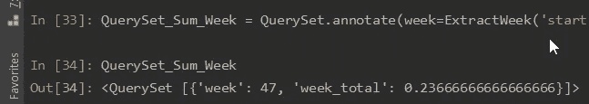

作者图片

为了不超出本文的范围，我不想详细讨论这个问题，但是您会发现 Django 文档中的所有方法都能够按照您的意愿构建您的查询。

下一段将向您展示 Django 最重要的数据管理工具，一个用于维护数据的集成用户界面。

# django Admin——用于数据管理的内置 Web 界面

Django Admin 是一个强大的内置特性。它提供了一个包含所有模型元数据的接口，并使您能够轻松管理数据库条目。“组”和“用户”表由自动创建。在`Users`中，你可以直接创建新用户，并赋予他们适当的访问权限。对 Django Admin 的访问被授予所谓的超级用户和职员用户。


Django 请求-响应循环—作者图片

如果您是第一次启动这个站点，并且还没有创建用户，您可以使用命令`python manage.py createsuperuser`创建一个超级用户，然后登录 Django admin。

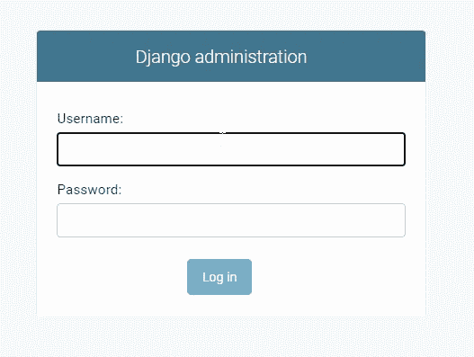

作者图片

如果您已经在`admin.py`中注册了您的模型，您可以在管理区域中管理您的表的所有条目，并且还可以创建新的条目。Django Admin 是经过深思熟虑的，不需要任何开发工作就可以使用。

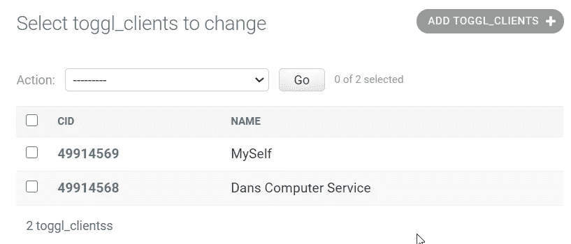

作者图片

# 摘要

我试着解释了在数据库中创建表、填充表、生成查询和通过 Django Admin 维护数据所需的所有 Django 功能。

出于性能原因，当然有理由不使用 Python 和 Django 进行大量数据的操作。但是，Django 提供了所有的功能，以一种简单、可理解和 pythonic 化的方式与数据库进行交互。特别是最后一点，为您打开了一个全新的数据分析、数据科学和数据可视化的世界。Python 为您提供了一个巨大的数据分析和可视化工具宝库，让您有机会发现数据中的一两个细节。

我希望这篇文章能给你一个快速简单的 Django 介绍，并展示 Django 不仅是一个强大的 web 开发工具。

感谢阅读！

# 参考

[1]遇见姜戈，【https://www.djangoproject.com/ 

[2]Python 的 Web 框架，【https://wiki.python.org/moin/WebFrameworks 

[3]姜戈·奥姆，[https://www.fullstackpython.com/django-orm.html](https://www.fullstackpython.com/django-orm.html)

[4]凯蒂·麦克劳克林，《Django ORM 介绍》，[https://opensource.com/article/17/11/django-orm](https://opensource.com/article/17/11/django-orm)

[5]数据库，[https://docs . django project . com/en/3.1/ref/Databases/# MySQL-notes](https://docs.djangoproject.com/en/3.1/ref/databases/#mysql-notes)

[6]中间件，[https://docs . django project . com/en/3.1/topics/http/Middleware/](https://docs.djangoproject.com/en/3.1/topics/http/middleware/)

[7]网址调度员，[https://docs.djangoproject.com/en/3.1/topics/http/urls/](https://docs.djangoproject.com/en/3.1/topics/http/urls/)

[8] Django 请求-响应周期——易于遵循的指南，[https://data-flair . training/blogs/Django-请求-响应周期/](https://data-flair.training/blogs/django-request-response-cycle/)

[9] Django 快捷函数，[https://docs . Django project . com/en/3.1/topics/http/shortcut s/](https://docs.djangoproject.com/en/3.1/topics/http/shortcuts/)

[10]提出疑问，[https://docs.djangoproject.com/en/3.1/topics/db/queries/](https://docs.djangoproject.com/en/3.1/topics/db/queries/)

[11]经理姓名，[https://docs . django project . com/en/3.1/topics/db/managers/# django . db . models . Manager](https://docs.djangoproject.com/en/3.1/topics/db/managers/#django.db.models.Manager)